# 9. Enterprise LLM Architecture

## Purpose

Choosing an LLM deployment model is an **architecture decision**, not merely a procurement decision.

The technical advisor's question is not:

> “Which LLM vendor should we buy?”

It is:

> **“Which model-serving architecture gives the organization the required capability while satisfying security, data, reliability, performance, cost, governance, and strategic constraints?”**

This distinction matters because the same foundation model capability can be delivered through materially different architectures: a third-party API, an enterprise-managed model platform, a self-hosted open-weight model, an on-premise deployment, a hybrid architecture, or a multi-model architecture.

The correct choice depends on the workload and constraints—not on the prestige, familiarity, or marketing position of a particular model provider.

---

## 9.1 The First Architectural Distinction: Model vs Model Service

An LLM is a model. An enterprise LLM capability is a **service architecture around that model**.

A production inference path may include:

- application and API gateway;
- identity and authorization;
- prompt/context construction;
- retrieval and data controls;
- model endpoint;
- rate limiting;
- logging and observability;
- safety and policy controls;
- evaluation;
- fallback or model routing; and
- cost controls.

Conceptually:

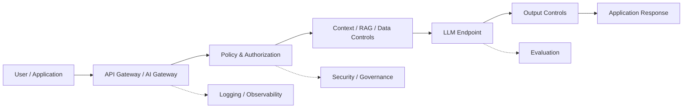

Therefore, “we use Model X” is an incomplete architecture statement.

The advisor should ask **how Model X is accessed, where data flows, which controls surround it, and what happens when it is unavailable or unsuitable**.

---

## 9.2 The Main Deployment Patterns

There is no universally superior deployment model. The principal options are:

| Pattern | Model execution | Main architectural characteristic | Typical reason to consider |
|---|---|---|---|
| Third-party API | Vendor infrastructure | Organization consumes a managed model service | Fastest path to capability |
| Enterprise-managed model platform | Managed service with enterprise controls | Vendor/cloud boundary plus stronger organizational controls | Enterprise governance and integration |
| Self-hosted open-weight model | Organization/cloud infrastructure | Organization controls model serving environment | Greater deployment/control flexibility |
| On-premise | Organization-owned data center | Strongest physical/network locality | Specific regulatory, isolation, or infrastructure constraints |
| Hybrid | Multiple environments | Workload/data/model placement varies by requirement | Balance control, capability, and operational constraints |
| Multi-model | Multiple model providers/models | Routing by workload | Resilience, capability specialization, cost or portability |

These categories can overlap. For example, a hybrid architecture may use an enterprise-managed model for general reasoning and a self-hosted model for a restricted workload.

The architectural question is therefore not simply **where is the model?** but **where are data, computation, controls, and decision authority located?**

---

## 9.3 Option 1 — Third-Party LLM API

In the simplest pattern, the organization sends an approved request to a vendor-hosted model service and receives an inference response.

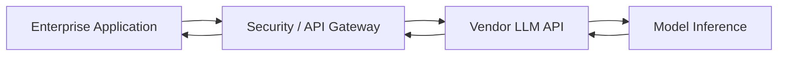

### Strengths

- rapid implementation;
- access to highly capable models without operating model infrastructure;
- elastic capacity can reduce the need for internal GPU operations;
- model upgrades can be obtained without rebuilding the serving stack; and
- potentially lower operational complexity for teams that do not need model-serving expertise.

### Risks and questions

The advisor should investigate:

- What data leaves the organization's controlled environment?
- Is data retained, and for how long?
- Can submitted data be used for provider model improvement, and under what contractual or product terms?
- Where is data processed and stored?
- What identity and network controls are available?
- What service-level commitments exist?
- How are incidents handled?
- What happens if the provider changes the model, API, terms, or availability?
- How difficult would migration be?
- Can prompts, outputs, evaluations, and audit records be retained under organizational control?

These questions must be answered from the **actual service contract and current technical documentation**, not from assumptions about “cloud AI.”

---

## 9.4 Option 2 — Enterprise-Managed Model Platform

A managed enterprise model platform sits between raw third-party API consumption and full self-hosting.

The organization may retain stronger control over network boundaries, identity, data handling, governance, logging, and integration while the provider operates the underlying model infrastructure.

A conceptual pattern is:

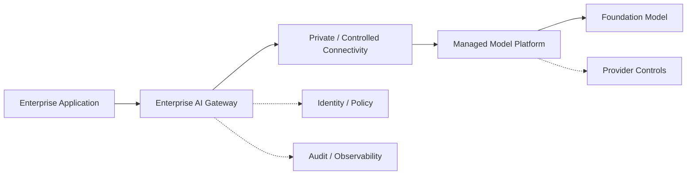

This pattern can be attractive when the organization wants enterprise controls without assuming the operational burden of running large models itself.

However, “enterprise” should not be treated as a synonym for “secure.” The advisor must verify the actual controls, contractual commitments, regional processing options, retention behavior, identity integration, and isolation model.

---

## 9.5 Option 3 — Self-Hosted Open-Weight Model

A self-hosted model is operated by the organization or its infrastructure provider rather than invoked as a fully managed inference API.

“Open-weight” describes the availability of model weights under their applicable license. It does **not** automatically mean open-source in every technical or legal sense, and it does not automatically mean free of operational constraints.

Conceptually:

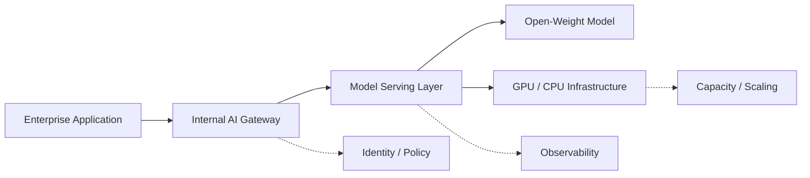

### Potential advantages

- greater control over the inference environment;
- ability to keep inference traffic inside a selected infrastructure boundary;
- greater control over model versioning and deployment timing;
- potential portability across infrastructure providers; and
- potentially useful economics for stable, high-volume workloads when utilization is sufficient.

### Costs and risks

Self-hosting transfers responsibility to the organization for areas such as:

- GPU capacity;
- model serving;
- autoscaling;
- patching;
- reliability;
- capacity planning;
- security hardening;
- observability;
- model upgrades;
- incident response;
- performance tuning; and
- licensing compliance.

This is a critical advisor distinction:

> **More infrastructure control does not automatically produce better economics or better security. It produces more responsibility and potentially more control.**

The additional control must justify the additional operational burden.

---

## 9.6 Option 4 — On-Premise Deployment

On-premise deployment places model serving within organizational data-center infrastructure.

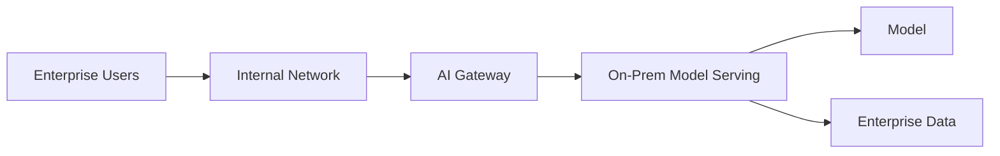

This can provide strong control over network locality and infrastructure boundaries. But the same physical locality does not guarantee security.

The organization still has to secure:

- physical infrastructure;
- operating systems;
- container and orchestration layers;
- model-serving software;
- networks;
- identities;
- secrets;
- data stores;
- monitoring; and
- operational processes.

On-premise therefore should be treated as a **constraint-driven architecture option**, not as a default security architecture.

---

## 9.7 Option 5 — Hybrid Architecture

Hybrid architecture is often the most interesting option for enterprise AI because different workloads can have different requirements.

For example:

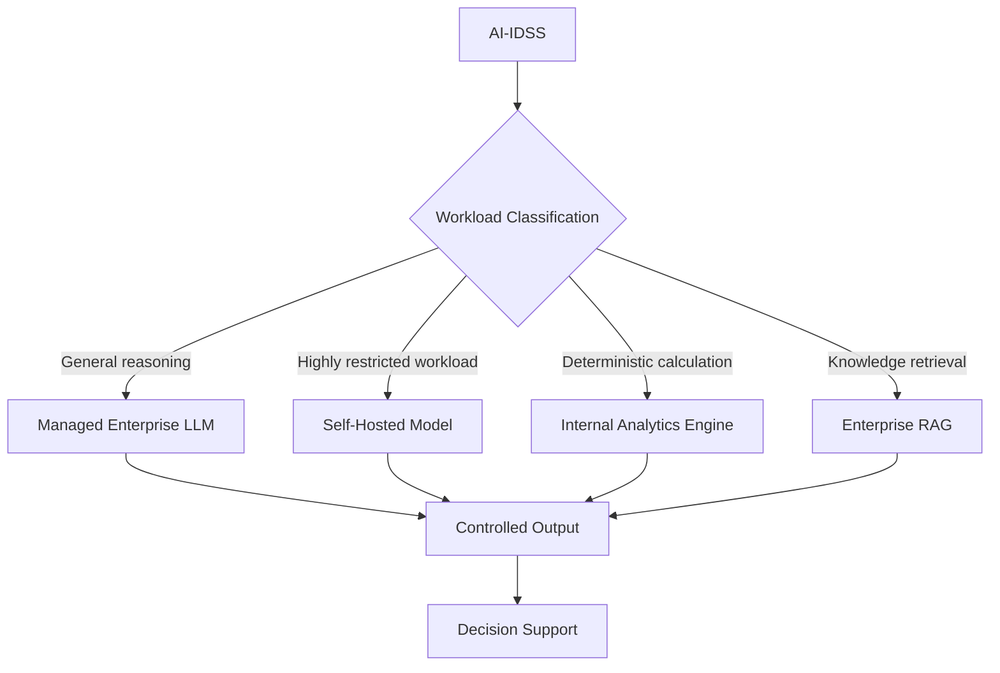

The classification decision itself should be deterministic where possible. A model should not be allowed to choose a less-controlled execution path merely because it believes that path would be convenient.

Hybrid architecture can therefore combine:

- managed capability where it is economically and technically attractive;
- internal processing where control is important;
- deterministic analytics where numerical correctness matters; and
- enterprise retrieval where organizational knowledge is required.

The price is architectural complexity. Hybrid should not become an excuse to accumulate unnecessary platforms.

---

## 9.8 Option 6 — Multi-Model Architecture

A multi-model architecture uses more than one model and routes workloads according to explicit criteria.

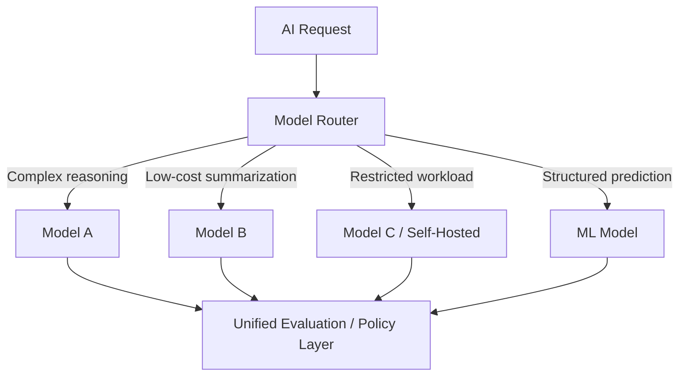

Potential benefits include:

- workload specialization;
- resilience against a single provider outage;
- cost optimization;
- easier experimentation; and
- reduced dependence on one model family.

But multi-model architectures also introduce:

- routing complexity;
- multiple evaluation baselines;
- different model behaviors;
- different context and API semantics;
- potentially different data-handling terms; and
- more operational overhead.

A multi-model architecture is justified only when the benefits exceed that complexity.

---

## 9.9 The “Data Cannot Leave” Fallacy

One of the most important architecture challenges is the statement:

> “Our data cannot leave the company, therefore we must build our own LLM.”

The conclusion does not logically follow from the premise.

The real question is:

> **What exactly is prohibited from leaving, under which control framework, and what architecture can satisfy that constraint?**

Possible controls may include:

- data classification;
- data minimization;
- preprocessing;
- masking or tokenization;
- controlled retrieval;
- encryption in transit and at rest;
- private connectivity;
- access-controlled endpoints;
- contractual restrictions;
- retention controls;
- provider isolation mechanisms; and
- keeping the most sensitive processing inside the organization's controlled environment.

Therefore:

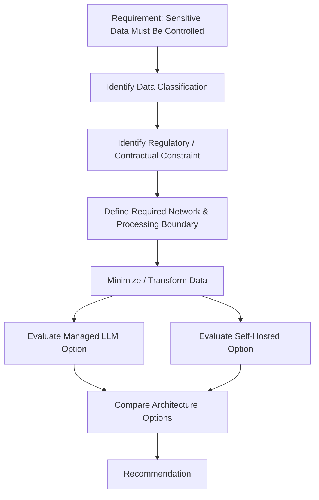

The correct conclusion may still be self-hosting. But it must be demonstrated by the constraints—not assumed from the phrase “data cannot leave.”

This is precisely the type of technical challenge expected from the advisor.

---

## 9.10 Security Boundary: Ask Where the Data Flows

A useful security review begins with a data-flow question.

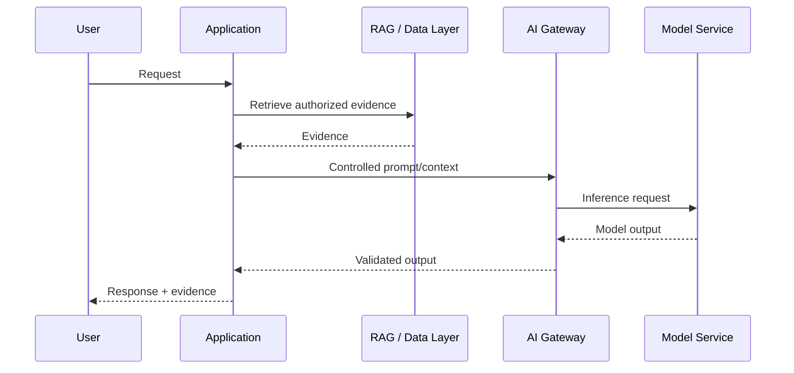

For every arrow, the advisor should be able to answer:

1. What data crosses this boundary?
2. Who can see it?
3. Is it encrypted?
4. Where is it processed?
5. How long is it retained?
6. What identity is used?
7. Can the action be audited?
8. What happens if the destination is unavailable or compromised?

This is more informative than asking whether a platform is simply “private” or “public.”

---

## 9.11 Architecture Decision Dimensions

The options should be compared against explicit dimensions.

| Dimension | Question for the advisor |
|---|---|
| Data sensitivity | What classification of data reaches the model? |
| Data residency | Where may data be processed or stored? |
| Confidentiality | What controls prevent unauthorized disclosure? |
| Retention | What happens to prompts, outputs, and logs? |
| Model capability | Does the model meet the actual task requirements? |
| Accuracy | What evidence supports performance for this workload? |
| Latency | What response time is required and achievable? |
| Throughput | How many requests and tokens must the system handle? |
| Availability | What happens during provider or infrastructure failure? |
| Scalability | How does capacity grow with demand? |
| Operational burden | Who operates the model-serving environment? |
| Security | What controls exist across the complete path? |
| Governance | Can organizational policies be enforced? |
| Observability | Can behavior, cost, and failures be measured? |
| Interoperability | How easily does it integrate with enterprise systems? |
| Portability | Can the architecture move to another model/provider? |
| Vendor dependency | What strategic dependency is created? |
| TCO | What is the complete lifecycle cost? |
| Reversibility | How difficult is it to change the decision later? |

No single dimension should dominate automatically. A highly capable model can still be the wrong architecture if it violates a hard constraint.

---

## 9.12 Hard Constraints vs Preferences

The advisor should explicitly separate **constraints** from **preferences**.

Examples of potential hard constraints:

- prohibited data residency location;
- mandatory regulatory control;
- required network isolation;
- minimum availability;
- mandatory auditability;
- contractual restrictions; or
- maximum acceptable latency for a critical workflow.

Examples of preferences:

- preferred cloud provider;
- preferred programming language;
- familiarity with a particular vendor;
- desire to minimize organizational change; or
- preference for a particular model family.

A preference should not masquerade as a technical requirement.

A useful decision rule is:

> **Eliminate options that violate hard constraints; compare the remaining options using weighted trade-offs.**

---

## 9.13 A Practical Decision Matrix

For a material LLM architecture decision, a weighted matrix can make assumptions explicit.

| Criterion | Weight | Managed LLM | Self-Hosted | Hybrid |
|---|---:|---:|---:|---:|
| Security/control | 20% |  |  |  |
| Model capability | 20% |  |  |  |
| Reliability | 15% |  |  |  |
| TCO | 15% |  |  |  |
| Operational simplicity | 10% |  |  |  |
| Portability | 10% |  |  |  |
| Latency/performance | 10% |  |  |  |
| **Total** | **100%** |  |  |  |

The numbers are illustrative, not universal.

The advisor should never present a weighted score as objective truth. The score is a decision aid whose result depends on:

- criteria;
- weights;
- evidence;
- assumptions; and
- scoring methodology.

A useful recommendation records those inputs so another advisor can reproduce the reasoning.

---

## 9.14 Total Cost of Ownership

LLM architecture cost is broader than inference price.

A simplified lifecycle model is:

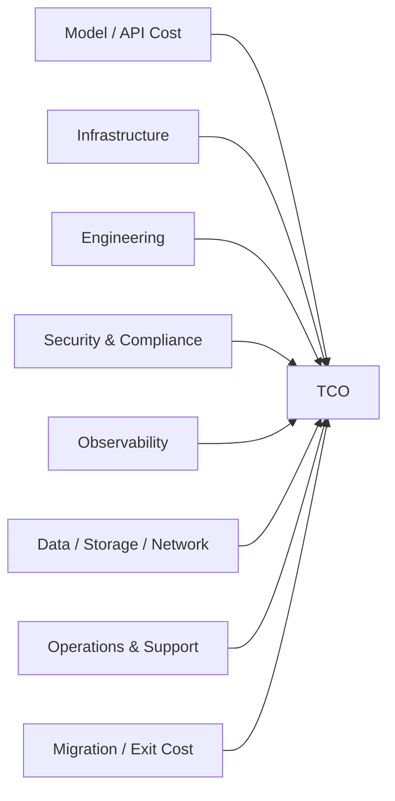

For self-hosting, include at least:

- hardware or cloud GPU cost;
- utilization losses;
- model-serving software;
- platform engineering;
- monitoring;
- security;
- patching;
- capacity management;
- redundancy;
- disaster recovery; and
- operational support.

For managed services, include:

- model/API consumption;
- gateway and networking;
- data processing;
- observability;
- security controls;
- application engineering;
- evaluation;
- integration; and
- potential migration or switching cost.

The cheapest unit price is not necessarily the cheapest architecture.

---

## 9.15 Vendor Lock-In and Exit Strategy

Vendor dependency is not automatically bad. A provider may offer capabilities that would be uneconomic to reproduce internally.

The advisor's responsibility is to distinguish **useful dependency** from **uncontrolled dependency**.

Questions include:

- Can another model be substituted?
- Are prompts and orchestration logic portable?
- Is retrieval independent from the model provider?
- Are application interfaces provider-neutral?
- Can evaluation datasets be reused?
- Can audit records be retained independently?
- Are proprietary features deeply embedded in workflows?
- What contractual or technical barriers exist to migration?
- What is the estimated time and cost to exit?

A useful architecture principle is:

> **Keep the model replaceable where replacement is economically and technically valuable; do not create abstraction layers merely for theoretical portability.**

Portability has a cost. The architecture should pay that cost only where the expected value justifies it.

---

## 9.16 AI-IDSS Application

For the investment-oriented AI-IDSS, a strong starting architecture may look like:

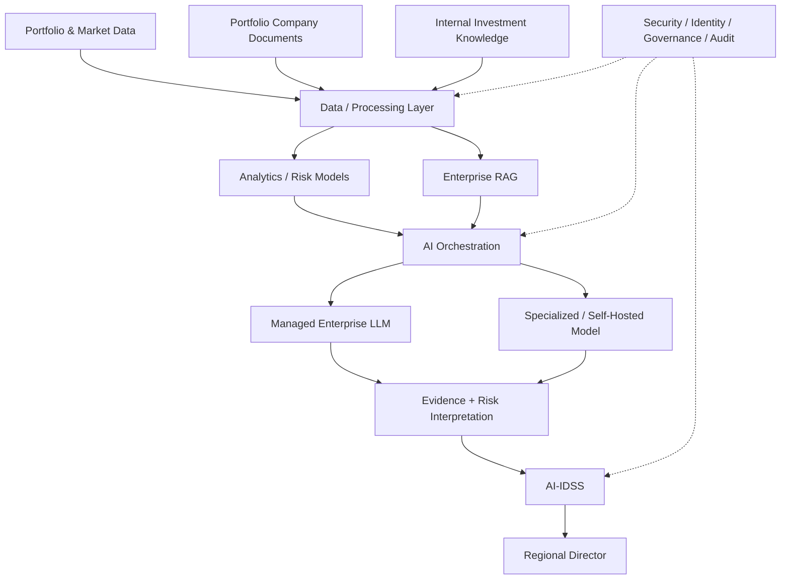

This is an **illustrative reference architecture**, not a final design.

The central architectural idea is that the AI-IDSS does not require one model to do everything.

For example:

- financial calculations can remain deterministic;
- predictive risk signals can come from validated statistical/ML models;
- enterprise knowledge can be retrieved through controlled RAG;
- an LLM can synthesize evidence and explain findings; and
- the RD remains the decision authority.

A managed enterprise LLM may be sufficient for the synthesis workload even when sensitive source data remains under stronger organizational controls. Whether that is acceptable must be established from the actual data-flow, contractual, security, and governance requirements.

---

## 9.17 Technical Challenge Questions

When reviewing a proposal to “build our own LLM,” ask:

1. What problem does owning the model solve?
2. Is the requirement actually about model ownership, or about data control?
3. Which data must remain inside the organization's boundary?
4. Can data be minimized, transformed, masked, or selectively retrieved?
5. What model capability is required?
6. Has a managed enterprise option been evaluated against the same requirements?
7. What is the expected workload volume and utilization?
8. Who will operate GPUs and model serving?
9. What is the three-year TCO?
10. What is the expected model-refresh burden?
11. What happens if the self-hosted model underperforms?
12. What happens if the managed provider changes terms or availability?
13. How will model quality be evaluated?
14. How will data leakage be detected?
15. What is the exit strategy?

The goal is not to defeat the proposal. The goal is to expose the assumptions behind it.

---

## 9.18 Decision Pattern for the Advisor

A repeatable review sequence is:

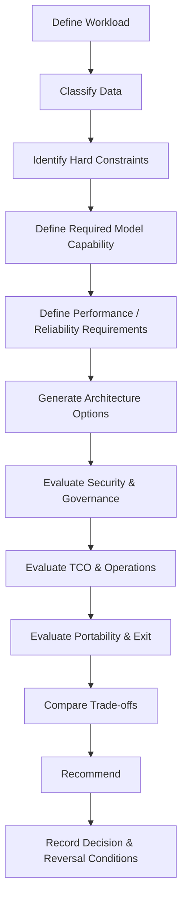

This sequence prevents the review from collapsing prematurely into a vendor comparison.

---

## 9.19 What the Advisor Should Recommend

The advisor should not have a permanent ideological position such as:

- “always use cloud”; or
- “always self-host”; or
- “never depend on vendors”; or
- “the most capable model is always best.”

Instead, the advisor should make **conditional recommendations**.

For example:

> **Recommendation:** Use a managed enterprise LLM for general reasoning and synthesis, while keeping authoritative source data and access-controlled retrieval within the organization's controlled data architecture.
>
> **Rationale:** This can satisfy the identified data-control requirements without assuming the operational and capital burden of building and maintaining a proprietary foundation model.
>
> **Condition:** The recommendation is contingent on verified controls for data processing, retention, access, contractual use, residency, security, availability, and auditability.
>
> **Alternative:** If those controls cannot satisfy the organization's hard constraints, evaluate self-hosted or on-premise inference for the affected workload rather than automatically moving the entire AI estate.

This is stronger than either “buy” or “build.” It identifies **which architecture is appropriate for which constraint**.

---

## 9.20 Evidence Standard for Current Vendor Claims

Capabilities such as data retention, training use, regional processing, private networking, service availability, pricing, model limits, and API behavior can change.

Therefore, such claims should be treated as **time-sensitive technical facts**.

For an architecture review, the evidence hierarchy should generally be:

1. current contractual terms;
2. current provider security/privacy documentation;
3. current official API and product documentation;
4. applicable standards and regulatory requirements;
5. independent technical testing;
6. credible third-party evidence.

Do not write a permanent architectural principle from a temporary vendor feature.

The book should therefore separate:

> **Architecture principle:** what should remain valid across vendors and technology cycles.

from:

> **Current capability:** what a specific provider or platform supports at the time of assessment.

This distinction is essential for a successor-oriented technical manual.

---

## Field Rule

> **Do not choose an LLM deployment model because it is fashionable, familiar, or politically convenient. Choose the architecture that best satisfies the workload's hard constraints and required capabilities at an acceptable total cost and operational risk.**

And remember:

> **“Our data cannot leave” is a constraint to analyze—not an automatic architectural justification for building our own foundation model.**

The advisor's job is to expose the constraint, map the data flow, compare viable architectures, quantify the trade-offs, and make the reasoning explicit.
