# 9. Enterprise LLM Architecture

## Purpose

Choosing an LLM deployment model is an **architecture decision**, not merely a procurement decision.

The technical advisor's question is not:

> “Which LLM vendor should we buy?”

It is:

> **Which model-serving architecture provides the required capability while satisfying the workload's security, data, reliability, performance, cost, governance, portability, and strategic constraints?**

This distinction matters because the same model capability can be consumed through materially different architectures: a third-party API, an enterprise-managed model platform, a self-hosted open-weight model, an on-premise deployment, a hybrid architecture, or a multi-model architecture.

The correct choice depends on the workload and constraints—not on vendor prestige, familiarity, ideology, or marketing.

---

## 9.1 Model, Model Service, and Enterprise Boundary

An LLM is a computational model. An enterprise LLM capability is a **service architecture around that model**.

A production inference path may include:

- application and API gateway;
- human, service, and agent identity;
- authorization and policy enforcement;
- prompt/context construction;
- retrieval and data controls;
- model endpoint;
- rate limiting and quotas;
- safety and validation controls;
- logging and observability;
- evaluation;
- fallback or model routing; and
- cost controls.

Conceptually:

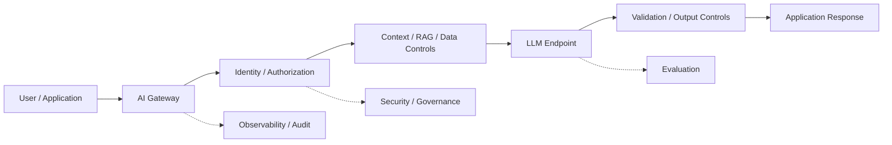

Therefore, “we use Model X” is an incomplete architecture statement.

The advisor should ask:

1. Where is the model capability obtained?
2. Where does sensitive data travel?
3. Where are authorization decisions enforced?
4. Who operates the inference environment?
5. Who controls model versions and behavior changes?
6. Who owns the evidence, logs, evaluations, and audit trail?
7. What happens when the provider, model, network, or data dependency fails?
8. How can the organization change or exit the arrangement later?

### A critical distinction: ownership is not one thing

Enterprise discussions often use “ownership” ambiguously. Separate at least four dimensions:

| Dimension | Question |
|---|---|
| Model ownership | Who owns or controls the model artifact/weights? |
| Deployment control | Who controls where and how inference runs? |
| Data control | Who controls the source data, access, retention, and processing boundary? |
| Enterprise architecture control | Who controls the surrounding application, policies, integration, evaluation, and decision boundary? |

An organization can have strong enterprise architecture and data control while consuming a provider's model capability. Conversely, an organization can run an open-weight model internally while still depending heavily on external hardware, software, data, licenses, and specialized infrastructure.

This distinction is central to the build-versus-buy discussion.

---

## 9.2 The Main Deployment Patterns

There is no universally superior deployment model.

| Pattern | Model execution | Primary characteristic | Typical reason to consider |
|---|---|---|---|
| Third-party API | Provider infrastructure | Consume managed inference | Fast capability access |
| Enterprise-managed platform | Provider/cloud-managed | Stronger enterprise integration and controls | Governance and integration |
| Self-hosted open-weight | Organization/cloud infrastructure | Control model serving environment | Deployment flexibility |
| On-premise | Organization data center | Local infrastructure boundary | Specific isolation or infrastructure constraint |
| Hybrid | Multiple environments | Different placement by workload | Balance control and capability |
| Multi-model | Multiple models/providers | Route by workload | Specialization, resilience, cost, optionality |

These categories can overlap. A hybrid architecture may use a managed model for general synthesis, a self-hosted model for a restricted workload, and deterministic analytics for numerical computation.

The architectural question is therefore not merely:

> **Where is the model?**

It is:

> **Where are data, computation, controls, identity, operational responsibility, and decision authority located?**

---

## 9.3 Option 1 — Third-Party LLM API

In the simplest pattern, the organization sends an approved request to a provider-hosted model service and receives an inference response.

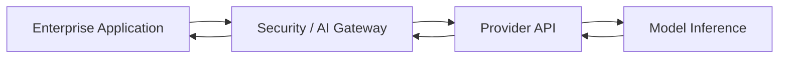

### Potential advantages

- rapid implementation;
- access to capable models without operating model infrastructure;
- elastic provider capacity;
- reduced internal model-serving burden; and
- potentially faster access to new model capabilities.

### Questions that must be answered

The advisor should establish, from current provider documentation and applicable contracts:

- What data leaves the organization's controlled environment?
- Where is it processed?
- Is it retained, and for how long?
- What uses of submitted data are permitted?
- What controls exist for sensitive information?
- What identity and network controls are available?
- What availability commitments exist?
- How are model or API changes communicated?
- Can the organization preserve prompts, outputs, evaluations, and audit records independently?
- What is the technical and economic cost of migration?

These are **current service properties**, not permanent architecture facts. They must be revalidated when the provider, contract, endpoint, model, or workload changes.

---

## 9.4 Option 2 — Enterprise-Managed Model Platform

A managed enterprise model platform sits between raw API consumption and full self-hosting.

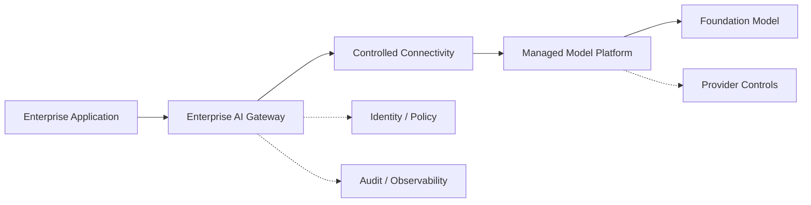

This pattern can be attractive when the organization wants stronger enterprise integration and controls without assuming the complete operational burden of model serving.

However:

> **“Enterprise-managed” is not a security property by itself.**

The advisor must verify the actual controls, including data processing, retention, regional processing, encryption, identity integration, network isolation, logging, administrative access, incident handling, and contractual commitments.

A provider feature is not evidence of a control unless the feature actually applies to the selected product, endpoint, configuration, region, contract, and workload.

---

## 9.5 Option 3 — Self-Hosted Open-Weight Model

A self-hosted model is operated by the organization or its infrastructure provider rather than consumed solely as a fully managed inference service.

“Open-weight” means that model weights are made available under their applicable license. It does **not** automatically mean that every component of the system is open source, unrestricted, or operationally simple.

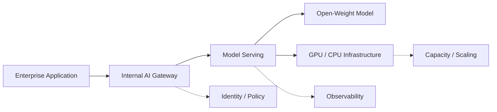

### Potential advantages

- greater control over the inference environment;
- ability to keep inference traffic within a selected infrastructure boundary;
- control over deployment timing and model version;
- potential infrastructure portability; and
- potentially attractive economics for sufficiently stable, high-volume workloads.

### Responsibilities transferred to the organization

Self-hosting can require responsibility for:

- compute capacity;
- model serving;
- autoscaling;
- patching;
- reliability;
- capacity planning;
- security hardening;
- observability;
- model upgrades;
- incident response;
- performance tuning;
- licensing compliance; and
- lifecycle management.

Therefore:

> **Self-hosting changes the responsibility boundary; it does not make dependency disappear.**

More infrastructure control can produce more control over deployment, but it also creates more operational responsibility. Whether that trade-off is justified is a workload-specific question.

---

## 9.6 Option 4 — On-Premise Deployment

On-premise deployment places model serving within organizational data-center infrastructure.

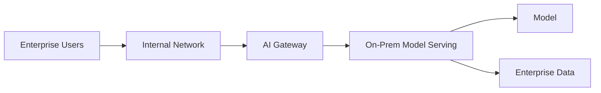

Physical locality can be valuable where particular requirements demand it. It is not, however, equivalent to security.

The organization still has to secure:

- physical infrastructure;
- operating systems;
- containers and orchestration;
- model-serving software;
- networks;
- identities;
- secrets;
- data stores;
- monitoring; and
- operational processes.

On-premise should therefore be treated as a **constraint-driven deployment choice**, not as a default security architecture.

---

## 9.7 Option 5 — Hybrid Architecture

Hybrid architecture allows different workloads to use different execution environments.

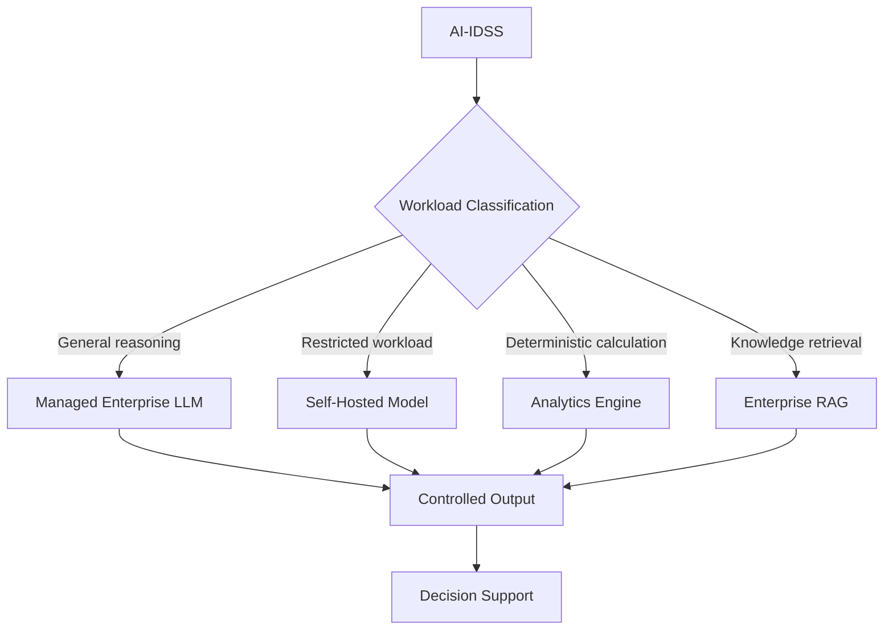

Potentially, the architecture can place:

- general reasoning with a managed model;
- highly sensitive transformations inside a controlled environment;
- numerical calculations in deterministic/statistical systems; and
- enterprise knowledge retrieval in an access-controlled data layer.

The classification decision itself should be enforced by deterministic policy where practical. A model should not be allowed to select a less-controlled execution path merely because it predicts that path will be useful.

The main cost of hybrid architecture is complexity. Additional platforms, interfaces, evaluations, operational procedures, and failure modes must have a clear justification.

---

## 9.8 Option 6 — Multi-Model Architecture

A multi-model architecture routes workloads across more than one model or model family.

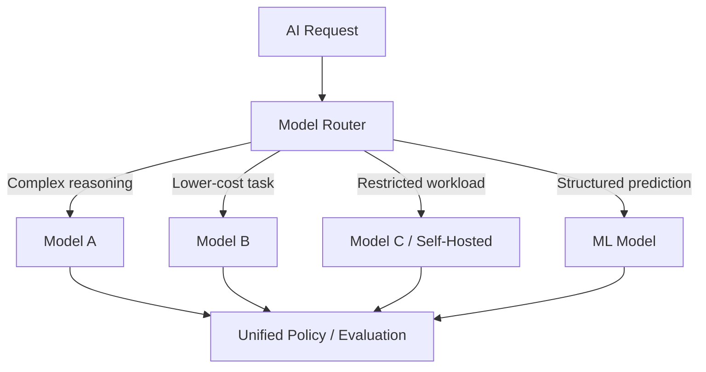

Potential benefits include:

- workload specialization;
- provider or model resilience;
- cost optimization;
- experimentation; and
- reduced dependence on one model family.

But multi-model architectures introduce additional complexity:

- routing logic;
- multiple evaluation baselines;
- different model behavior;
- different context limits and APIs;
- different provider terms;
- different failure characteristics; and
- additional operational burden.

A multi-model design is justified only when the resulting optionality, resilience, capability, or economics are worth that complexity.

---

## 9.9 The “Data Cannot Leave” Fallacy

A common proposal is:

> “Our data cannot leave the company, therefore we must build our own LLM.”

The conclusion does not logically follow from the premise.

The actual question is:

> **What exactly is prohibited from leaving, under which legal, regulatory, contractual, security, and technical controls, and what architecture satisfies those constraints?**

Possible architectural controls can include, depending on the actual requirement:

- data classification;
- data minimization;
- preprocessing;
- masking or tokenization;
- selective retrieval;
- encryption;
- private connectivity;
- access-controlled endpoints;
- retention restrictions;
- contractual restrictions;
- provider isolation mechanisms; and
- keeping the most sensitive processing inside the organization's controlled environment.

Therefore:

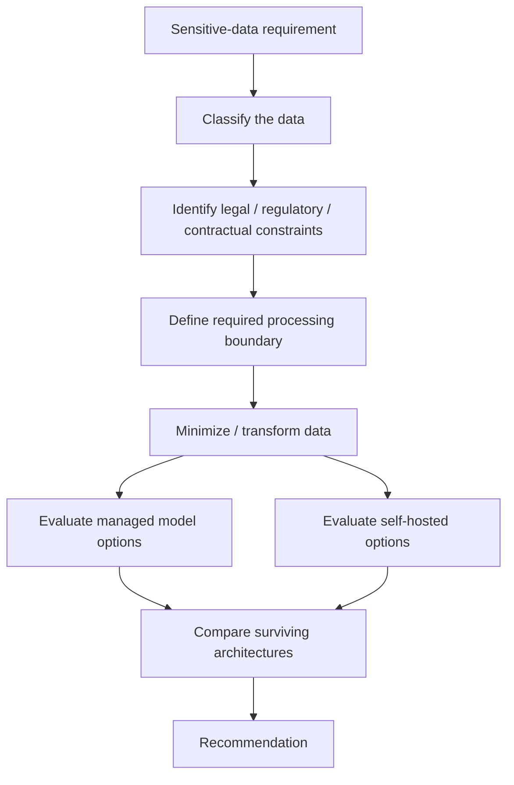

The correct conclusion may still be self-hosting. But the conclusion should be demonstrated by the constraint set and evidence—not inferred from a slogan.

### The stronger advisor question

Instead of asking:

> “Can we send data to this provider?”

ask:

> **“What data must remain under which control, what processing is actually required, which boundary must be enforced, and which architecture satisfies that boundary at acceptable risk and cost?”**

That question often reveals that the organization needs to own a **data and control boundary**, not a foundation model.

---

## 9.10 Security Boundary: Follow the Data Flow

A useful review starts with a data-flow model.

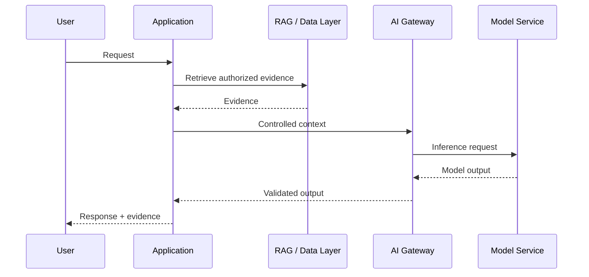

For every material boundary, ask:

1. What data crosses it?
2. Which identity is acting?
3. What authorization decision applies?
4. Is the data encrypted?
5. Where is it processed?
6. How long is it retained?
7. Who can administer the service?
8. Can the action be audited?
9. What happens if the destination is unavailable or compromised?
10. Can the architecture prevent unauthorized data from entering model context?

This is more informative than classifying a platform simply as “private” or “public.”

---

## 9.11 Architecture Decision Dimensions

Evaluate candidate architectures against explicit dimensions.

| Dimension | Advisor question |
|---|---|
| Data sensitivity | What classification reaches the model? |
| Data residency | Where may processing occur? |
| Confidentiality | What prevents unauthorized disclosure? |
| Retention | What happens to prompts, outputs, and logs? |
| Model capability | Is capability sufficient for the actual task? |
| Task performance | Does the selected model perform adequately on representative workloads? |
| System performance | Does the complete architecture meet latency, throughput, and reliability objectives? |
| Decision value | Does the system improve the intended decision or workflow? |
| Availability | What happens during provider or infrastructure failure? |
| Scalability | How does capacity grow with demand? |
| Operational burden | Who operates the model-serving environment? |
| Security | Are controls enforced across the complete path? |
| Governance | Can organizational policy be enforced? |
| Observability | Can behavior, quality, failures, and cost be measured? |
| Interoperability | Can the system integrate with enterprise systems? |
| Portability | Can model or provider replacement be performed? |
| Vendor dependency | What dependency is created? |
| TCO | What is the complete lifecycle cost? |
| Reversibility | How difficult is the decision to change later? |

### Evaluation hierarchy

This chapter uses the same hierarchy established in later model/evaluation chapters:

```text
Model capability
      ↓
Task performance
      ↓
System performance
      ↓
Business / decision value
```

A model benchmark is evidence about capability. It is not by itself evidence that the enterprise system will deliver the required business result.

---

## 9.12 Hard Constraints vs Preferences

The advisor should explicitly separate **hard constraints** from **preferences**.

Potential hard constraints include:

- prohibited processing location;
- mandatory regulatory controls;
- required network isolation;
- minimum availability;
- mandatory auditability;
- contractual restrictions;
- maximum acceptable latency; or
- a required data-access boundary.

Preferences might include:

- preferred cloud provider;
- preferred programming language;
- familiarity with a vendor;
- desire to minimize organizational change; or
- preference for a particular model family.

A preference should not masquerade as a technical requirement.

A disciplined decision rule is:

> **First eliminate options that violate hard constraints. Then compare the surviving options using evidence-based trade-offs.**

Weighted scoring is useful for ranking surviving options; it must not be used to compensate for violation of a genuine hard constraint.

---

## 9.13 Practical Decision Matrix

For a material LLM architecture decision, a weighted matrix can make assumptions explicit.

| Criterion | Weight | Managed | Self-Hosted | Hybrid |
|---|---:|---:|---:|---:|
| Security / control | 20% |  |  |  |
| Required capability | 20% |  |  |  |
| Reliability | 15% |  |  |  |
| TCO | 15% |  |  |  |
| Operational simplicity | 10% |  |  |  |
| Portability / optionality | 10% |  |  |  |
| Latency / performance | 10% |  |  |  |
| **Total** | **100%** |  |  |  |

The weights are illustrative, not universal.

The score is not objective truth. It depends on:

- criteria;
- weights;
- evidence;
- assumptions; and
- scoring methodology.

A defensible architecture decision records those inputs and identifies what evidence would cause the recommendation to change.

---

## 9.14 Economics: From Model Price to Cost per Useful Result

LLM architecture cost is broader than inference price.

Use the same economic hierarchy used elsewhere in this manual:

```text
Model / API price
      ↓
Cost per task
      ↓
Complete system cost
      ↓
Cost per useful result
      ↓
Business / decision value
```

A simplified lifecycle model is:

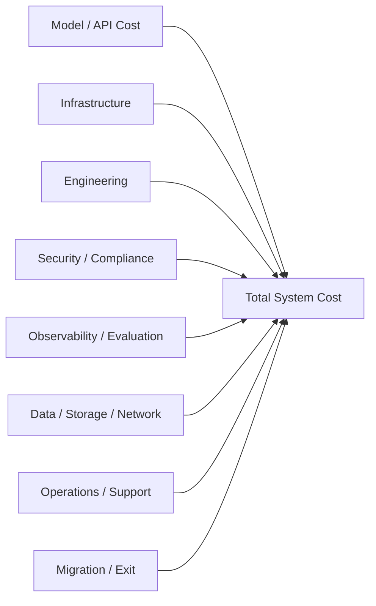

For self-hosting, consider at least:

- hardware or cloud GPU cost;
- utilization;
- model-serving software;
- platform engineering;
- monitoring;
- security;
- patching;
- capacity management;
- redundancy;
- disaster recovery; and
- operational support.

For managed services, consider:

- model/API consumption;
- gateway and networking;
- data processing;
- observability;
- security controls;
- application engineering;
- evaluation;
- integration; and
- migration or switching cost.

Do not conclude that self-hosting is cheaper merely because an API price is high, or that managed inference is cheaper merely because infrastructure is not visible on the organization's balance sheet.

The correct comparison is the complete system under the actual workload.

---

## 9.15 Vendor Dependency, Portability, and Exit

Vendor dependency is not automatically bad. A provider may offer capabilities that would be uneconomic to reproduce internally.

The advisor's responsibility is to distinguish **useful dependency** from **uncontrolled dependency**.

Ask:

- Can another model be substituted?
- Are prompts and orchestration logic portable?
- Is retrieval independent from the model provider?
- Are application interfaces provider-neutral where that neutrality has value?
- Can evaluation datasets be reused?
- Can audit records be retained independently?
- Are proprietary features deeply embedded in workflows?
- What contractual barriers exist to migration?
- What technical barriers exist to migration?
- What is the estimated time and cost to exit?

A useful principle is:

> **Preserve replaceability where it has material strategic or economic value; do not build abstraction layers merely for theoretical portability.**

Portability has a cost. The architecture should pay that cost where expected value justifies it.

### Dependency graph, not dependency slogan

A provider dependency should be mapped across at least:

```text
Model capability
   ├── Endpoint / API
   ├── Model-specific behavior
   ├── Context / tool semantics
   ├── Safety / policy features
   ├── Observability
   ├── Data-processing terms
   └── Commercial terms
```

Self-hosting changes this graph rather than eliminating it. Dependencies may shift toward:

- hardware;
- accelerator supply;
- serving software;
- model licenses;
- open-source maintainers;
- specialized engineering skills;
- data sources; and
- infrastructure providers.

Therefore:

> **Independence is not the absence of dependencies. It is the ability to understand, govern, and change material dependencies.**

---

## 9.16 Model Change and Behavioral Portability

Model replacement is not only an API migration problem.

A replacement model can change:

- output structure;
- reasoning behavior;
- tool-use behavior;
- refusal behavior;
- context handling;
- latency;
- cost;
- retrieval interaction; and
- downstream application behavior.

Therefore, portability should be tested at the **system level**, not inferred from API compatibility.

A replacement path should include:

1. representative evaluation set;
2. regression tests;
3. security and authorization tests;
4. RAG/retrieval tests where relevant;
5. tool/agent tests where relevant;
6. latency and cost measurement;
7. acceptance criteria; and
8. rollback or coexistence capability.

This aligns model replacement with the evaluation discipline in Chapters 30–31.

---

## 9.17 AI-IDSS Application

For an investment-oriented AI-IDSS, a reasonable starting architecture may be:

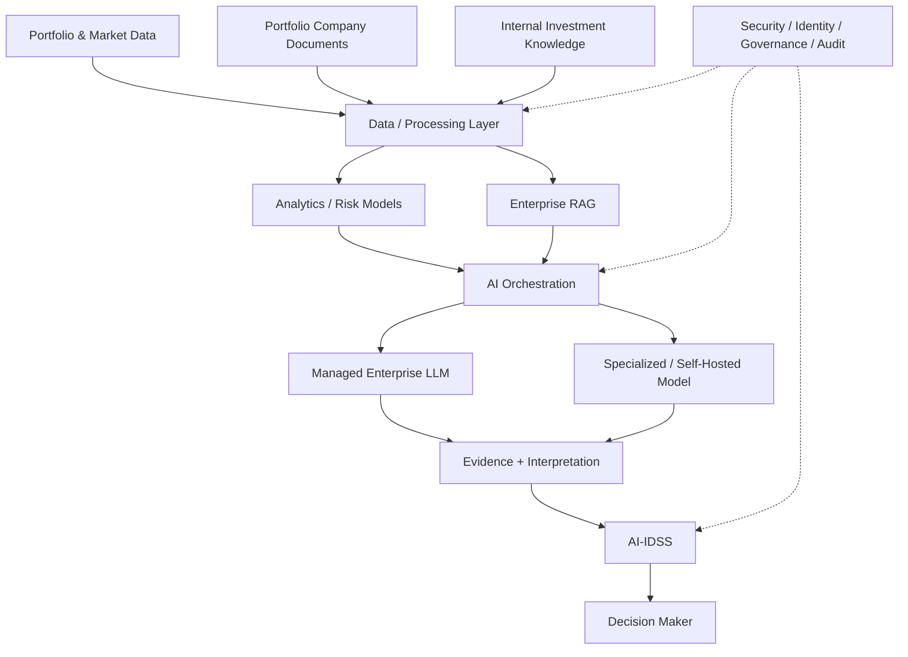

This is an **illustrative reference architecture**, not a final design.

The central principle is that the AI-IDSS does not require one model to do everything.

For example:

- financial calculations can remain deterministic;
- predictive risk signals can come from validated statistical or ML models;
- enterprise knowledge can be retrieved through controlled RAG;
- an LLM can synthesize evidence and explain findings; and
- the authorized human remains the decision authority.

A managed enterprise LLM may therefore be sufficient for synthesis even when authoritative source data and retrieval remain under stronger organizational controls. Whether that is acceptable must be established from the actual data-flow, contractual, security, governance, and evaluation requirements.

---

## 9.18 Technical Challenge Questions

When reviewing a proposal to “build our own LLM,” ask:

### Strategic ownership

1. What problem does owning the model solve?
2. Is the requirement really about model ownership, or about data/control ownership?
3. Where is the strategic moat expected to reside?
4. Which architectural layer must remain under organizational control?

### Data and security

5. Which data must remain within a defined boundary?
6. Is that requirement regulatory, contractual, security-driven, or merely assumed?
7. Can data be minimized, transformed, masked, or selectively retrieved?
8. Where is authorization enforced?

### Capability and evaluation

9. What capability is required?
10. What representative workload demonstrates it?
11. What evidence compares managed and self-hosted options under that workload?
12. What happens if the selected model underperforms?

### Economics and operations

13. What is the complete system cost at expected utilization?
14. Who operates GPUs and model serving?
15. What is the model-refresh and revalidation burden?
16. What happens when demand is lower or higher than forecast?

### Dependency and exit

17. Which dependencies are created by the proposed architecture?
18. Which dependencies disappear, and which merely move?
19. How would another model be introduced?
20. What is the time, cost, and risk of exit?

The goal is not to defeat the proposal. It is to expose the assumptions behind it.

---

## 9.19 Decision Pattern for the Advisor

A repeatable review sequence is:

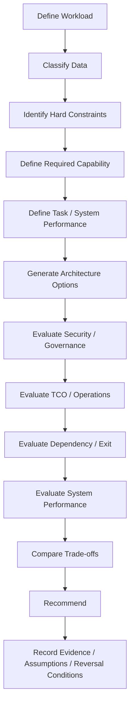

This prevents the review from collapsing prematurely into a vendor comparison.

### What would change the recommendation?

A defensible recommendation should explicitly state reversal conditions, for example:

- a hard data-processing constraint cannot be satisfied by the managed option;
- representative evaluation shows a material task-performance gap;
- system-level reliability or latency requirements cannot be met;
- managed-service economics become materially worse at expected scale;
- provider contractual terms create unacceptable dependency;
- required audit or authorization controls are unavailable; or
- a self-hosted option demonstrates sufficient capability with materially better total economics and operational feasibility.

This turns an architecture recommendation into a falsifiable decision rather than an ideology.

---

## 9.20 Conditional Recommendation Pattern

The advisor should not have a permanent ideological position such as:

- “always use cloud”;
- “always self-host”;
- “never depend on vendors”; or
- “the most capable model is always best.”

Instead, make **conditional recommendations**.

For example:

> **Recommendation:** Use a managed enterprise LLM for general reasoning and synthesis while keeping authoritative source data, authorization, retrieval, and decision controls within the organization's controlled architecture.
>
> **Rationale:** This can satisfy identified data-control requirements without automatically assuming the operational and capital burden of building and maintaining a foundation model.
>
> **Conditions:** The recommendation is contingent on verified controls for data processing, retention, access, residency, contractual use, security, availability, auditability, and representative task performance.
>
> **Alternative:** If those controls cannot satisfy a hard constraint, evaluate self-hosted or on-premise inference for the affected workload rather than automatically moving the entire AI estate.

The recommendation is therefore not “buy” or “build.” It is:

> **Control the architectural boundary that matters; consume external capability where it is efficient and acceptable; own model capability where the model itself creates sufficient strategic value to justify the responsibility.**

---

## 9.21 Evidence Standard for Current Vendor Claims

Capabilities such as data retention, training use, regional processing, private networking, service availability, pricing, model limits, endpoint behavior, and administrative controls can change.

Treat these as **time-sensitive technical facts**.

For an architecture review, the evidence hierarchy should generally be:

1. current contractual terms;
2. current provider security/privacy documentation;
3. current official API and product documentation;
4. applicable standards and regulatory requirements;
5. independent technical testing;
6. credible third-party evidence.

Do not turn a temporary vendor feature into a permanent architectural principle.

The book should distinguish:

> **Architecture principle:** a concept intended to remain useful across vendors and technology cycles.

from:

> **Current capability:** a property that must be revalidated for a particular provider, product, model, endpoint, region, contract, and date.

### Current standards status

NIST describes the AI RMF 1.0 as a voluntary framework for managing AI risks and states that AI RMF 1.0 is being revised in 2026. The current material should therefore be cited as **NIST AI RMF 1.0 and current revision status**, not as an immutable final standard. [NIST AI Risk Management Framework](https://www.nist.gov/itl/ai-risk-management-framework)

NIST also launched an **AI Agent Standards Initiative** in 2026 focused on interoperability, security, identity, and related standards work. This is evidence that agent identity and authorization are active standardization/research areas; it should not be presented as a completed universal agent standard. [NIST AI Agent Standards Initiative](https://www.nist.gov/news-events/news/2026/02/announcing-ai-agent-standards-initiative-interoperable-and-secure)

---

## Field Rules

> **Do not choose an LLM deployment model because it is fashionable, familiar, or politically convenient. Choose the architecture that best satisfies the workload's hard constraints and required capabilities at an acceptable total cost and operational risk.**

> **“Our data cannot leave” is a constraint to analyze—not an automatic architectural justification for building our own foundation model.**

> **Model ownership, deployment control, data control, and enterprise architecture control are different decisions. Do not collapse them into one word: “ownership.”**

> **Self-hosting changes the dependency graph; it does not eliminate dependency.**

> **Benchmark capability is evidence. Task performance is stronger evidence. System performance is stronger still. Business or decision value is the outcome that matters.**

> **Make architecture recommendations conditional, evidence-based, and reversible where practical. State what would change your mind.**
