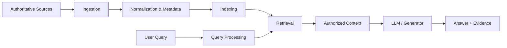
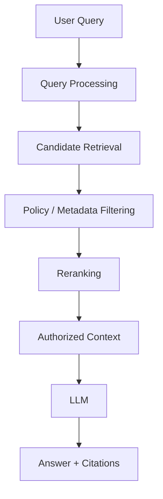
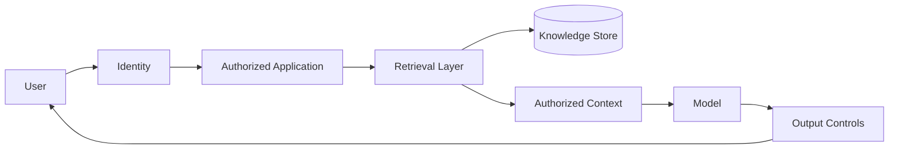
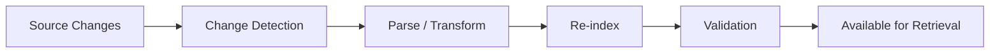

# 10. RAG Architecture

> **If the model is given access to the right documents, does that automatically make its answer trustworthy?**
>
> No. Retrieval is only the beginning of the evidence chain.

## Purpose

Retrieval-Augmented Generation (RAG) is one of the most important architectural patterns for enterprise AI systems that must work with information outside a model's parametric knowledge.

This chapter explains RAG as an **end-to-end information architecture**, not as a synonym for a vector database or a prompting technique.

The central question is:

> **How can an AI system retrieve the right evidence, for the right user, at the right time, and use it without losing its provenance or authorization context?**

For the advisor, the important issues are therefore not only retrieval quality. They include source authority, ingestion, freshness, metadata, access control, retrieval quality, context construction, generation, citations, evaluation, failure handling, and operational cost.

---

## 10.1 What RAG Is

**Fact:** NIST defines RAG as a type of generative-AI system in which a model is paired with a separate information-retrieval system or knowledge base. The retrieval system identifies relevant information from the knowledge base and provides it to the model as context for generating a response. NIST also notes that this allows the knowledge available to the system to be modified without retraining the underlying model. citeturn0search0

The original RAG research introduced a formulation combining parametric model memory with non-parametric memory accessed through retrieval. The research demonstrated the value of retrieval for knowledge-intensive tasks, while also highlighting limitations of relying on model parameters alone for precise knowledge access and provenance. citeturn0academia25

For enterprise architecture, the useful abstraction is simpler:



This is a logical architecture, not a requirement to use a particular vendor, vector database, or embedding technology.

> **Field Rule:** RAG is an architecture pattern. A vector database is only one possible component within that architecture.

---

## 10.2 Why RAG Exists

A foundation model contains information in its learned parameters, but an enterprise application often needs information that is:

- proprietary;
- current or frequently changing;
- specific to an organization;
- permission-sensitive;
- too operationally specific to expect the model to know reliably; or
- required with explicit source attribution.

RAG provides a mechanism for supplying relevant external information to the model at inference time.

This creates an important architectural separation:

| Concern | Primary mechanism |
|---|---|
| General language/reasoning capability | Model |
| Organization-specific knowledge | Retrieval / knowledge sources |
| Current information | Source systems + ingestion/retrieval |
| Access rights | Identity + authorization controls |
| Evidence provenance | Metadata + source references |
| Business rules | Explicit application/policy logic |
| Final human decision | Human authority |

This separation is useful because it prevents the common architectural mistake of trying to solve every knowledge problem by changing the model.

### The counterintuitive point

> **A better model does not automatically produce a better enterprise knowledge system.**

If the model receives incomplete, stale, unauthorized, or incorrect context, a more capable model may still produce an unacceptable answer.

---

## 10.3 The RAG Pipeline

A production RAG architecture should be considered as two connected pipelines:

**Knowledge pipeline:**

> Source → Ingest → Parse → Normalize → Enrich → Index → Govern

**Question pipeline:**

> Query → Interpret → Retrieve → Authorize → Rank → Construct context → Generate → Cite → Evaluate

Keeping these pipelines conceptually separate is useful for diagnosis.

If the answer is wrong, the advisor should ask:

> **Did the system retrieve the wrong evidence, or did the model reason incorrectly over the right evidence?**

Those are different failure classes and require different remedies.

---

## 10.4 Source Authority Comes Before Retrieval Quality

A technically sophisticated retrieval system cannot compensate for an unreliable source of truth.

For an enterprise AI system, sources should therefore be classified by authority.

Example:

| Information | Possible authoritative source |
|---|---|
| Current financial balance | Approved financial system |
| Investment approval | Authorized investment record |
| Contract terms | Contract repository / legal record |
| Portfolio operating metric | Designated portfolio data source |
| Market information | Approved market-data provider |
| Internal policy | Controlled policy repository |
| Informal commentary | Email / notes / other secondary sources |

The exact hierarchy is organization-specific.

The architectural principle is not:

> “Put all documents into the vector database.”

It is:

> **Know which source is authoritative before asking the model to reconcile sources.**

### A useful question

> **If two documents disagree, which one is allowed to win—and how does the system know?**

If the architecture has no answer, the problem is not merely retrieval quality. It is information governance.

---

## 10.5 Ingestion and Parsing

The knowledge pipeline begins before embeddings are created.

Typical stages include:

1. source discovery;
2. extraction;
3. parsing;
4. document classification;
5. normalization;
6. metadata extraction;
7. access-control association;
8. chunking or segmentation;
9. indexing; and
10. quality validation.

The input may be structured or unstructured:

- HTML;
- Markdown;
- PDF;
- spreadsheets;
- database records;
- API responses;
- emails;
- presentations; or
- other enterprise documents.

Parsing quality matters because retrieval cannot recover information that was never represented correctly in the index.

> **Garbage in, retrieved garbage out.**

The advisor should therefore challenge architectures that jump directly from “documents” to “embeddings” without explaining extraction, structure, metadata, and validation.

---

## 10.6 Chunking Is an Information-Architecture Decision

Documents are often divided into smaller units before indexing.

This is commonly called **chunking**.

Chunking is not merely a technical preprocessing detail. It determines the granularity at which the retrieval system can identify evidence.

A chunk that is too small may lose necessary context.

A chunk that is too large may contain substantial irrelevant material and reduce retrieval precision or consume excessive model context.

There is therefore no universally correct chunk size.

The appropriate strategy depends on:

- document structure;
- query patterns;
- information density;
- retrieval method;
- model context capacity;
- citation requirements; and
- evaluation results.

### Better question

Do not ask:

> “What chunk size should we use?”

Ask:

> **“What is the smallest unit of evidence that can answer the kinds of questions this system must answer without losing necessary context?”**

That is an architecture question rather than a parameter-setting exercise.

---

## 10.7 Metadata Is Part of Retrieval

A knowledge item should carry useful metadata where the use case requires it.

Examples include:

- source identifier;
- document type;
- publication date;
- effective date;
- business entity;
- jurisdiction;
- confidentiality classification;
- access-control scope;
- version;
- author or owner; and
- source authority.

Metadata can support filtering, ranking, authorization, freshness decisions, and citation.

This leads to an important distinction:

> **Semantic similarity answers “what looks relevant?” Metadata can help answer “what is permitted, current, authoritative, or applicable?”**

A production architecture may need both.

---

## 10.8 Retrieval Is More Than Vector Similarity

A simple RAG implementation may retrieve documents using semantic similarity between a query embedding and document embeddings.

But enterprise retrieval can involve multiple signals:

- keyword matching;
- semantic similarity;
- metadata filters;
- access-control filters;
- temporal filters;
- entity matching;
- source authority;
- reranking; and
- query decomposition or rewriting.

NIST's TREC Retrieval-Augmented Generation work treats retrieval and generation as separable evaluation problems and includes retrieval, augmented generation, and end-to-end RAG tasks. This reinforces the architectural distinction between finding evidence and generating an answer from evidence. citeturn0search5turn0search26

A useful conceptual model is:



The exact sequence can vary by implementation.

---

## 10.9 Authorization Must Be Part of Retrieval

This is one of the most important enterprise RAG principles.

Suppose the knowledge base contains:

- information available to all employees;
- investment-team information;
- restricted transaction information; and
- confidential portfolio-company information.

A retrieval system must not simply ask:

> “Which document is most similar to the query?”

It must also ask:

> **“Which of the relevant documents is this user authorized to retrieve?”**

OWASP's 2025 guidance on vector and embedding weaknesses explicitly discusses unauthorized access and data leakage risks in RAG systems, including cross-context or multi-tenant scenarios, and recommends permission-aware controls. citeturn0search1

This creates a critical architecture principle:

> **Retrieval relevance is not authorization.**

A highly relevant document can still be an unauthorized document.

Therefore, access control should not be treated as an afterthought after vector search.

---

## 10.10 The Security Boundary

The RAG architecture should explicitly identify trust boundaries.



Questions for the advisor:

- Who can ingest documents?
- Who can modify indexed content?
- Who can retrieve each class of information?
- Are permissions inherited from the source system?
- What happens when permissions change?
- Are deleted or revoked documents removed from retrieval?
- Can retrieved context cross tenant or business-unit boundaries?
- What is logged?
- Can sensitive content appear in prompts, outputs, traces, or monitoring systems?

These questions are architecture questions, not merely application-security questions.

---

## 10.11 Freshness and Change Propagation

RAG is often attractive because the underlying knowledge can be updated without retraining the foundation model.

But “can be updated” does not mean “is automatically current.”

The architecture needs a change-propagation mechanism.



The advisor should ask:

- How quickly must changes become retrievable?
- How is a changed source detected?
- How are deleted records handled?
- How are versions represented?
- What happens if indexing fails halfway through?
- Can the system distinguish effective date from ingestion date?

For a financial or investment workflow, this distinction can be material.

> **Fresh data is not merely recently ingested data. It is data whose effective state is known and appropriately represented.**

---

## 10.12 Context Construction

Retrieval produces candidate evidence. The system must then decide what enters the model context.

This step may include:

- deduplication;
- ordering;
- source prioritization;
- compression or summarization;
- conflict handling;
- token-budget management; and
- citation mapping.

The objective is not to provide the model with “as much context as possible.”

The objective is to provide **sufficient, authorized, relevant, and interpretable evidence**.

### Thought experiment

> Give the model every document in the repository.
>
> Have you improved the architecture—or simply moved the retrieval problem into the context window?

---

## 10.13 Generation and Grounding

Once evidence is retrieved and placed into context, the model generates a response.

The architecture should define how the answer relates to the retrieved evidence.

Possible controls include:

- source citations;
- evidence snippets;
- document identifiers;
- confidence or uncertainty statements;
- refusal when evidence is insufficient;
- contradiction detection; and
- answer validation.

RAG does not guarantee factual correctness.

The TREC RAG program explicitly treats retrieval, augmented generation, and end-to-end RAG as distinct evaluation problems. This is consistent with a basic architecture lesson: a system can retrieve relevant material yet still produce a poor answer, or generate a fluent answer from inadequate retrieval. citeturn0search5turn0search26

> **Retrieval creates an evidence opportunity. It does not create truth.**

---

## 10.14 Citations and Provenance

For decision-support systems, the answer should ideally be traceable to its supporting evidence.

A useful response structure is:

```text
Conclusion

Key evidence
- Source A: supporting fact
- Source B: supporting fact

Reasoning
- How the evidence supports the conclusion

Limitations
- Missing or contradictory evidence
```

This is particularly important when the output may influence consequential decisions.

The advisor should distinguish:

**Source provenance** — where the information originated.

**Retrieval provenance** — what information was actually retrieved for this query.

**Reasoning provenance** — how the system used the retrieved information to form its conclusion.

These are related but not identical.

---

## 10.15 Failure Modes

A RAG system can fail in several distinct ways.

| Failure | Example | Architectural response |
|---|---|---|
| Source failure | Source contains incorrect data | Source governance |
| Parsing failure | Table extracted incorrectly | Parsing validation |
| Indexing failure | Document not indexed | Pipeline monitoring |
| Retrieval failure | Relevant evidence not retrieved | Retrieval evaluation |
| Authorization failure | User retrieves restricted data | Permission-aware retrieval |
| Freshness failure | Old record outranks current record | Effective-date metadata |
| Context failure | Important evidence omitted | Context construction controls |
| Generation failure | Model misinterprets evidence | Evaluation / validation |
| Citation failure | Answer cites irrelevant source | Citation evaluation |
| Operational failure | Retrieval service unavailable | Reliability / fallback |

This table illustrates why “we have RAG” is not a meaningful production-readiness statement.

---

## 10.16 RAG Evaluation

Evaluation should be performed at multiple layers.

### Retrieval evaluation

Questions include:

- Did the system retrieve relevant evidence?
- Did it retrieve sufficient evidence?
- Did it respect filters and permissions?
- Did ranking place the best evidence high enough?

### Generation evaluation

Questions include:

- Is the answer supported by retrieved evidence?
- Does it introduce unsupported claims?
- Does it correctly interpret conflicting evidence?
- Are citations accurate?

### End-to-end evaluation

Questions include:

- Does the system answer the actual business questions correctly?
- Does it fail safely when evidence is unavailable?
- Does it preserve authorization boundaries?
- Is latency acceptable?
- Is the cost acceptable?

NIST's TREC RAG work explicitly separates retrieval, augmented generation, and end-to-end evaluation, providing a useful conceptual basis for this layered approach. citeturn0search5turn0search26

> **Do not evaluate a RAG system only by asking whether the final answer “sounds good.”**

---

## 10.17 RAG vs Fine-Tuning

RAG and fine-tuning solve different problems.

| Question | RAG | Fine-tuning |
|---|---|---|
| Add external/current knowledge | Strong fit | Usually not the primary mechanism |
| Preserve source provenance | Strong fit | Not inherently provided |
| Update knowledge frequently | Operationally suitable | Requires model update/retraining workflow |
| Change model behaviour/style | Limited | Stronger fit |
| Teach domain-specific response patterns | Possible through prompting/context | Often stronger fit |
| Enforce authorization at retrieval | Can be designed explicitly | Not inherently provided |

This is a conceptual comparison, not a universal performance claim.

The important advisor question is:

> **Are we trying to change what the model knows, how the model behaves, or what information the model is allowed to see?**

Those are different architectural problems.

---

## 10.18 RAG Does Not Eliminate the Need for Good Data Architecture

A RAG system may expose weaknesses in enterprise information management rather than solve them.

If documents have:

- inconsistent identifiers;
- unclear ownership;
- duplicate versions;
- conflicting values;
- missing dates;
- unclear authority; or
- broken access metadata,

retrieval may make those problems visible but cannot automatically resolve them correctly.

This is why RAG belongs in the broader enterprise data architecture rather than being treated as an isolated AI component.

> **RAG is often a knowledge-access layer sitting on top of a data-governance problem.**

---

## 10.19 Investment Decision-Support Example

Consider a hypothetical AI-IDSS question:

> “Why has Portfolio Company A's risk increased during the last quarter?”

A weak architecture might:

1. embed all documents;
2. retrieve similar text;
3. send it to an LLM; and
4. produce a narrative.

A stronger architecture asks:

1. What is the authoritative definition of “risk”?
2. Which financial and operating sources are authoritative?
3. Which period is being compared?
4. Which user is asking the question?
5. What information is the user authorized to see?
6. Are current and historical records distinguishable?
7. Which evidence supports each driver?
8. Are contradictory records surfaced?
9. Which conclusions are directly supported versus inferred?
10. Can the answer be reconstructed later?

The output might therefore be structured as:

```text
Risk assessment

Observed evidence
1. Margin deterioration — source X
2. Debt-service pressure — source Y
3. Demand weakening — source Z

Inference
The combination of these indicators is consistent with increased
financial deterioration risk.

Uncertainty
Current-month operating data is incomplete.

Recommended action
Initiate an independent portfolio review.
```

Notice the distinction between **evidence**, **inference**, and **recommendation**.

That distinction is as important as the retrieval technology itself.

---

## 10.20 Architecture Decision Checklist

Before approving a RAG architecture, ask:

### Sources
- What are the authoritative sources?
- Who owns each source?
- How are conflicting sources handled?

### Ingestion
- How is content extracted?
- How is parsing validated?
- How are changes and deletions propagated?

### Knowledge representation
- What metadata is retained?
- How is version and effective date represented?
- How are access permissions represented?

### Retrieval
- Which retrieval mechanisms are used?
- Why are they appropriate for the query types?
- Is reranking required?
- How is retrieval quality measured?

### Security
- Is authorization enforced before context reaches the model?
- Can information cross user, portfolio, or tenant boundaries?
- What is logged?

### Generation
- How is evidence passed to the model?
- How are unsupported answers handled?
- How are citations produced and validated?

### Operations
- What is the freshness SLA?
- What happens when retrieval fails?
- What are latency and cost requirements?
- How is the index monitored?

### Evaluation
- What is the evaluation dataset?
- How are retrieval and generation evaluated separately?
- What failure rate is acceptable?
- What happens when the system does not know?

---

## 10.21 The Advisor's Core Questions

When someone says:

> “We already have RAG.”

do not stop there.

Ask:

> **RAG over what?**

> **Retrieved for whom?**

> **Retrieved from which authoritative source?**

> **Retrieved using which signals?**

> **Retrieved at what freshness?**

> **Passed to which model?**

> **Used to produce which claim?**

> **Supported by which evidence?**

> **And what happens when the evidence is missing?**

These questions turn “we have RAG” from a technology label into an architecture that can actually be evaluated.

---

## Field Rule

> **RAG does not make an AI system knowledgeable. It creates a controlled path through which relevant evidence may reach the model. The architecture must still establish authority, authorization, freshness, retrieval quality, provenance, evaluation, and failure handling.**

### Evidence anchors

- NIST CSRC, **RAG glossary definition** — authoritative definition of retrieval-augmented generation. citeturn0search0
- Lewis et al., **Retrieval-Augmented Generation for Knowledge-Intensive NLP Tasks** (2020) — foundational research on combining parametric and non-parametric memory. citeturn0academia25
- NIST TREC, **Retrieval-Augmented Generation tracks** — current research/evaluation framing that separates retrieval, augmented generation, and end-to-end RAG. citeturn0search5turn0search26
- OWASP, **LLM08:2025 Vector and Embedding Weaknesses** — evidence for access-control and data-leakage risks in RAG/vector systems. citeturn0search1
- NIST, **AI RMF: Generative AI Profile** — broader risk-management context for generative-AI systems. citeturn0search3
