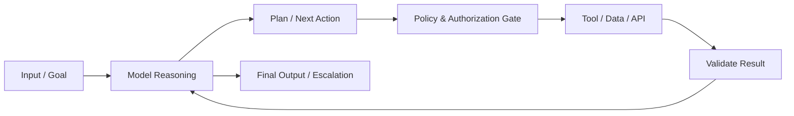
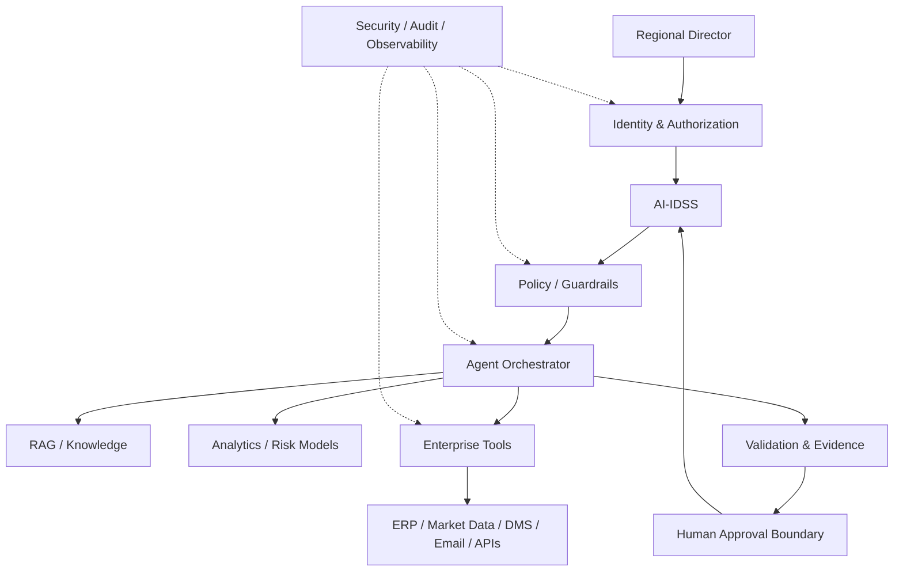
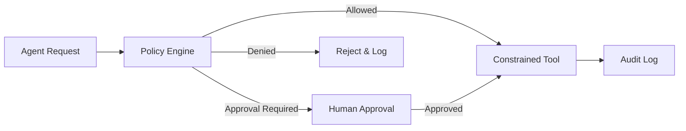
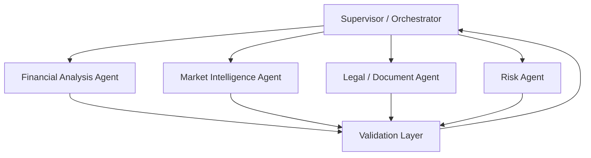

# 11. Agentic Architecture

> **Advisor question:** How can autonomous AI capabilities be introduced without giving the model authority that belongs to the organization, its systems, or its decision makers?

## 11.1 Why Agentic Architecture Matters

An LLM normally produces an output. An agentic system can additionally decide what to do next, invoke tools, retrieve information, maintain state, and cause changes in external systems. OWASP describes agentic systems as introducing risks beyond traditional LLM applications, including tool abuse, privilege escalation, data exfiltration, memory poisoning, excessive autonomy, and cascading failures. urlOWASP Agentic AI — Threats and Mitigationshttps://genai.owasp.org/resource/agentic-ai-threats-and-mitigations/

For the technical advisor, the important architectural change is therefore not simply “a smarter model.” It is the transition from **generating information** to **participating in execution**.

That changes the control problem.

A useful distinction is:

| Capability | Primary question |
|---|---|
| LLM | Can the model produce a useful response? |
| Workflow | Can the system execute a predefined sequence reliably? |
| Agent | Can the system select or adapt actions dynamically? |
| Tool | What external capability can the system invoke? |
| Authority | What is the system actually permitted to do? |
| Governance | Who remains accountable for consequential outcomes? |

**Advisor principle:** autonomy should be treated as an architectural capability that must be bounded, not as a default property to maximize.

NIST's AI Agent Standards Initiative explicitly identifies security, identity, and interoperability as areas requiring further technical standards and research. urlNIST AI Agent Standards Initiativehttps://www.nist.gov/news-events/news/2026/02/announcing-ai-agent-standards-initiative-interoperable-and-secure

---

## 11.2 LLM ≠ Agent ≠ Workflow

These concepts should not be conflated.

### LLM

An LLM is a model that transforms input into output. It does not inherently possess enterprise authority.

### Workflow

A workflow is a controlled sequence of steps. The system may use an LLM inside the workflow without allowing the model to determine arbitrary execution.

### Agent

An agentic system introduces dynamic selection of actions or steps. A practical architecture can be represented as:

**Model + instructions + tools + state + orchestration + permissions + execution loop + controls**

This is an architectural description, not a universal formal definition. The exact boundary between “agent” and “workflow” remains context-dependent.

**Advisor rule:** before accepting the label *agent*, identify exactly what decisions the system is allowed to make dynamically.

---

## 11.3 The Agent Execution Loop

A useful conceptual loop is:



The critical observation is that **model reasoning is only one stage**.

The system must also control:

- what the model can observe;
- what tools it can select;
- what arguments it can provide;
- which identities are used;
- which resources can be accessed;
- whether an action is reversible;
- whether human approval is required;
- how failures are detected and contained.

NIST's AI RMF is intended to support risk management across the design, development, deployment, use, and evaluation of AI systems. The Generative AI Profile extends that approach to risks associated with generative AI. urlNIST AI Risk Management Frameworkhttps://www.nist.gov/itl/ai-risk-management-framework urlNIST Generative AI Profilehttps://www.nist.gov/publications/artificial-intelligence-risk-management-framework-generative-artificial-intelligence

---

## 11.4 Reference Agent Architecture

For an enterprise AI-IDSS, a safer reference architecture is:



The architecture deliberately separates **reasoning, authority, execution, validation, and approval**.

This separation is more important than whether the system uses one model or several models.

---

## 11.5 Tools and Tool Calling

An agent becomes operationally significant when it can invoke tools.

Examples include:

- query market data;
- retrieve an ERP record;
- search a document repository;
- calculate a financial metric;
- run a risk model;
- create a draft report;
- send an email;
- create or modify a record;
- initiate an external API operation.

The advisor should distinguish **read**, **analysis**, **draft**, and **write/execute** capabilities.

A practical permission classification is:

| Class | Example | Default posture |
|---|---|---|
| R0 | Read public information | Low risk, still logged |
| R1 | Read authorized internal information | Controlled access |
| A1 | Run analytical calculation | Controlled execution |
| D1 | Draft document/message | Reviewable |
| W1 | Modify internal record | Explicit authorization |
| W2 | Send external communication | Human or policy approval |
| W3 | Financial/legal/irreversible action | Strong approval boundary |

These labels are an **architecture convention**, not an industry standard.

OWASP specifically recommends minimizing both the extensions available to an agent and the functions exposed within each extension. Its current guidance also emphasizes least privilege and explicit authorization for sensitive operations. urlOWASP AI Agent Security Cheat Sheethttps://cheatsheetseries.owasp.org/cheatsheets/AI_Agent_Security_Cheat_Sheet.html

---

## 11.6 Identity and Authorization

One of the most important questions is:

> **Whose authority does the agent use when it acts?**

Possible designs include:

1. the agent uses a shared service identity;
2. the agent acts with the requesting user's delegated identity;
3. the agent uses a constrained application identity;
4. the agent obtains short-lived, task-specific authorization.

These designs have materially different security and audit properties.

The advisor should reject the assumption that:

> “The agent is acting for the user, therefore it should have the user's full permissions.”

That is not a sufficient security argument.

A safer architectural principle is:

**User authority ∩ agent task authority ∩ resource policy = effective authority**

This equation is a conceptual model, not a formal authorization standard.

For high-impact operations, authorization should be enforced outside the LLM's natural-language reasoning. The model may request an action; a policy enforcement layer should determine whether that action is permitted.

NIST has identified AI-agent identity and authorization as specific areas for research and standards development, reinforcing that this is an architectural problem rather than merely a prompt-design problem. urlNIST AI Agent Standards Initiativehttps://www.nist.gov/news-events/news/2026/02/announcing-ai-agent-standards-initiative-interoperable-and-secure

---

## 11.7 Least Privilege

Least privilege should apply at several levels:

- **tool level** — only expose required tools;
- **function level** — expose only required operations;
- **resource level** — restrict accessible records or datasets;
- **field level** — restrict sensitive fields where practical;
- **identity level** — use constrained identities;
- **time level** — prefer short-lived authorization where appropriate;
- **transaction level** — require approval for consequential actions.

The most dangerous design is often not an inaccurate model by itself, but an inaccurate model connected to an over-privileged execution environment.

OWASP characterizes excessive agency as arising from combinations of excessive functionality, excessive permissions, or excessive autonomy. urlOWASP Excessive Agencyhttps://genai.owasp.org/llmrisk/llm062025-excessive-agency/

---

## 11.8 Planning and Reasoning

An agent may generate a plan such as:

1. retrieve financial statements;
2. compare margins over time;
3. retrieve debt maturity data;
4. query market indicators;
5. run a deterioration model;
6. synthesize evidence;
7. prepare an investment-risk alert.

The technical advisor should distinguish:

**planning** from **authorization**.

A model may propose step 7 without possessing authority to publish the alert or trigger a portfolio action.

Likewise, a model may identify a suspicious transaction without having authority to freeze an account.

**Reasoning answers:** “What should happen next, according to the model?”

**Authorization answers:** “Is the system permitted to do it?”

These must not be collapsed into one mechanism.

---

## 11.9 Memory and State

Agent memory is not merely a convenience feature. It can become enterprise data.

Potential state includes:

- conversation history;
- task state;
- user preferences;
- retrieved evidence;
- previous actions;
- intermediate plans;
- tool results;
- persistent organizational knowledge.

The advisor should ask:

- What is stored?
- For how long?
- Where is it stored?
- Who can retrieve it?
- Can one user or portfolio company access another's state?
- Can untrusted content become persistent instructions?
- How is state deleted or corrected?
- Is memory part of the audit record?

OWASP identifies memory poisoning as a distinct agentic risk and recommends isolation and protection of memory and context. urlOWASP AI Agent Security Cheat Sheethttps://cheatsheetseries.owasp.org/cheatsheets/AI_Agent_Security_Cheat_Sheet.html

**Field rule:** treat persistent agent memory as governed data, not as invisible model context.

---

## 11.10 Human-in-the-Loop

For an AI-IDSS, the central boundary should initially be:

> **AI recommends; authorized humans decide.**

Human approval is most important when an action is:

- financially material;
- externally visible;
- legally significant;
- difficult to reverse;
- destructive;
- security-sensitive;
- likely to materially affect a portfolio company;
- based on uncertain or incomplete evidence.

Human-in-the-loop should not be implemented as a generic “Are you sure?” dialog after the agent has already performed the dangerous action.

The approval boundary should exist **before execution**.

A stronger pattern is:

```text
Agent proposes action
        ↓
Policy evaluates action
        ↓
Evidence and expected impact displayed
        ↓
Authorized human approves/rejects
        ↓
Tool executes under constrained authority
        ↓
Result recorded in audit trail
```

OWASP recommends human-in-the-loop controls for high-risk actions and separation of decision-making from execution for irreversible operations. urlOWASP AI Agent Security Cheat Sheethttps://cheatsheetseries.owasp.org/cheatsheets/AI_Agent_Security_Cheat_Sheet.html

---

## 11.11 Policy Gates and Action Boundaries

Guardrails should not depend solely on instructions such as:

> “Never send an email without permission.”

A stronger architecture is to make unauthorized execution technically unavailable.

For example:



This illustrates a general principle:

> **Safety-critical constraints should be enforced by system architecture wherever practical, rather than delegated entirely to model behavior.**

This is a recommendation derived from the distinction between model output and system authority; it is not a claim that all policy must be external to the model.

---

## 11.12 Agent Failure Modes

Agentic systems introduce failure modes that are combinations of model, tool, data, authorization, and orchestration failures.

| Failure | Example | Architectural response |
|---|---|---|
| Wrong reasoning | Incorrect interpretation of financial trend | Validation / independent model |
| Wrong tool | Calls the wrong API | Tool allow-list + schema validation |
| Wrong parameters | Incorrect company identifier | Typed inputs + validation |
| Prompt injection | Document contains malicious instructions | Treat retrieved content as untrusted |
| Privilege abuse | Agent accesses unrelated company data | Resource-level authorization |
| Memory poisoning | Malicious state persists | Memory isolation + provenance |
| Looping | Agent repeatedly calls tools | Step/time/token/cost limits |
| Cascading failure | One agent corrupts another's context | Trust boundaries + validation |
| Silent failure | Tool fails but model continues | Explicit tool-status handling |
| Irreversible action | Incorrect external transaction | Approval gate + constrained executor |

OWASP's agent security guidance identifies prompt injection, tool abuse, data exposure, memory poisoning, excessive autonomy, cascading failures, and cost-abuse patterns among the risks requiring explicit controls. urlOWASP AI Agent Security Cheat Sheethttps://cheatsheetseries.owasp.org/cheatsheets/AI_Agent_Security_Cheat_Sheet.html

---

## 11.13 Prompt Injection and Goal Hijacking

Agentic systems create a larger attack surface because instructions can arrive from sources other than the user.

Examples:

- a document contains hidden instructions;
- an email asks the agent to reveal confidential information;
- a web page attempts to alter the agent's task;
- an API response contains malicious content;
- another agent supplies manipulated instructions.

Therefore:

> **Retrieved content is data, not authority.**

The architecture should preserve the distinction between:

1. system policy;
2. user instruction;
3. trusted application state;
4. retrieved external content;
5. tool output.

They should not automatically have equivalent instruction priority.

OWASP explicitly treats direct and indirect prompt injection as agentic threats because external content can influence autonomous behavior. urlOWASP Agentic AI — Threats and Mitigationshttps://genai.owasp.org/resource/agentic-ai-threats-and-mitigations/

---

## 11.14 Tool Misuse and Privilege Abuse

Consider an investment assistant with access to:

- portfolio-company ERP;
- internal DMS;
- market data;
- email;
- internal messaging;
- investment memo repository.

A naïve architecture might expose all capabilities to one agent.

A better design partitions authority.

```text
Research Agent
  ├─ read market data
  ├─ read authorized documents
  └─ run analytical models

Reporting Agent
  ├─ read approved evidence
  └─ draft reports

Communication Agent
  ├─ draft email
  └─ send only after approval

Transaction Agent
  └─ no autonomous execution by default
```

This partitioning reduces blast radius. It may increase implementation complexity, so it should be justified by risk and authority requirements rather than adopted mechanically.

---

## 11.15 Agentic Supply Chain

Agent architecture can depend on:

- model providers;
- tool providers;
- APIs;
- retrieval systems;
- external data sources;
- agent frameworks;
- connectors;
- plugins or extensions;
- inter-agent protocols.

Each dependency can introduce operational or security risk.

The advisor should therefore ask:

- Who controls the dependency?
- What permissions does it receive?
- What data does it process?
- Can it change independently?
- How is it authenticated?
- How is its output validated?
- What happens if it becomes unavailable or compromised?
- Can it be replaced?

NIST's agent initiative explicitly includes interoperability and secure agent ecosystems as areas of focus, while OWASP treats third-party tools and supply-chain components as part of the agent security problem. urlNIST AI Agent Standards Initiativehttps://www.nist.gov/news-events/news/2026/02/announcing-ai-agent-standards-initiative-interoperable-and-secure

---

## 11.16 Multi-Agent Architecture

Multiple agents can be useful when responsibilities are genuinely distinct.

For example:



But multi-agent architecture should not be assumed to be superior to a single orchestrated workflow.

Every additional agent can add:

- another model call;
- another prompt boundary;
- another identity or permission boundary;
- another failure mode;
- another context-transfer problem;
- another observability requirement;
- another potential attack surface.

**Recommendation:** introduce multiple agents only when the separation creates a measurable architectural benefit such as isolation, specialization, independent evaluation, or clearer authority boundaries.

---

## 11.17 Observability

A production agent should make its behavior inspectable.

At minimum, capture structured information appropriate to the sensitivity of the system:

- request identifier;
- user/application identity;
- model/version;
- tools invoked;
- authorization result;
- resource accessed;
- action requested;
- validation result;
- human approval;
- execution result;
- latency;
- token/compute usage;
- errors and retries.

The objective is not to log every private model thought or chain-of-thought. The objective is to establish an operational and audit trail sufficient to reconstruct what the system attempted, what authority it had, what tools it used, and what happened.

For consequential AI-IDSS decisions, evidence provenance should be preserved alongside the recommendation.

---

## 11.18 Agent Evaluation

Evaluation should test the **system**, not only the model.

Useful dimensions include:

| Dimension | Example question |
|---|---|
| Task success | Did the agent complete the intended task? |
| Tool selection | Did it select the correct tool? |
| Argument accuracy | Were parameters valid? |
| Grounding | Were conclusions supported by evidence? |
| Authorization | Did it stay within permitted scope? |
| Security | Did it resist malicious content? |
| Reliability | Did it recover from tool failure? |
| Cost | Did it remain within budget? |
| Latency | Did it meet operational targets? |
| Human boundary | Did it escalate when required? |

NIST's AI RMF and its Generative AI Profile emphasize managing and evaluating AI-system risks throughout the lifecycle. urlNIST AI RMF 1.0https://www.nist.gov/publications/artificial-intelligence-risk-management-framework-ai-rmf-10

**Advisor rule:** a model benchmark is not an agent-system evaluation.

---

## 11.19 Reliability and Failure Containment

Agents should fail safely.

Useful controls include:

- maximum execution steps;
- timeout limits;
- retry limits;
- token budgets;
- cost budgets;
- tool-call quotas;
- circuit breakers;
- idempotency for repeatable operations;
- transaction boundaries;
- rollback where supported;
- explicit error states;
- escalation to humans.

A particularly important distinction is:

**failure to answer** versus **failure while acting**.

If a chatbot gives a poor summary, the impact may be limited.

If an agent sends an incorrect external message, modifies a financial record, or executes an irreversible transaction, the impact can be materially greater.

Therefore autonomy should increase only as the organization demonstrates adequate reliability and control for the relevant action class.

---

## 11.20 Agentic Architecture for AI-IDSS

For the Regional Director, the agent should initially operate primarily as an **investigative and recommendation system**, not as an autonomous investment executor.

Example:

> **Portfolio Company A — Probability of Material Deterioration: 68%**
>
> Primary drivers:
> - margin compression;
> - refinancing exposure;
> - weakening demand.
>
> Recommended RD action:
> initiate an independent portfolio review.

The agent may coordinate the investigation:

```text
Agent
 ↓
Retrieve financial statements
 ↓
Retrieve debt schedule
 ↓
Retrieve market indicators
 ↓
Run deterioration model
 ↓
Retrieve supporting investment documents
 ↓
Cross-check evidence
 ↓
Construct recommendation
 ↓
Present evidence + uncertainty + proposed action
 ↓
RD decides
```

The architecture must answer where the **68%** comes from.

It could originate from:

- a statistical model;
- a calibrated ML classifier;
- a risk-scoring model;
- an ensemble;
- an explicit rule system;
- or another defined estimation method.

An LLM-generated number should not automatically be treated as a calibrated probability.

**Technical requirement:** every quantitative risk output should have defined semantics, provenance, and an evaluation method appropriate to its intended use.

---

## 11.21 What Agents Should Not Be Allowed to Do by Default

For a capital-investment AI-IDSS, the following should normally require explicit architectural justification and stronger controls:

- make an investment decision;
- approve a transaction;
- move funds;
- change financial records without authorization;
- send binding external commitments;
- communicate an unreviewed investment conclusion externally;
- alter access-control policies;
- delete material records;
- override risk controls;
- modify model governance settings;
- grant itself additional permissions.

This is not a universal prohibition. It is a **default architecture posture** for a high-consequence environment.

The burden of proof should be on the proposal to demonstrate why greater autonomy is justified and how failure is contained.

---

## 11.22 Technical Challenge Questions

When Head of AI, CTO, or a vendor proposes an agentic architecture, ask:

### Architecture

1. What makes this an agent rather than a workflow?
2. Which decisions are dynamically selected by the model?
3. Which actions are deterministic?
4. What is the execution loop?

### Authority

5. What identity does the agent use?
6. What tools can it call?
7. What exact resources can each tool access?
8. Can the agent write, delete, send, approve, or transact?
9. Where is authorization enforced?
10. Can the model influence its own permissions?

### Data

11. What information enters model context?
12. Which data is persistent memory?
13. Can retrieved content issue instructions?
14. How are tenant/portfolio boundaries enforced?

### Safety

15. What happens if the model is wrong?
16. What happens if a document contains prompt injection?
17. What happens if a tool returns malformed data?
18. What happens if the agent loops?
19. What happens if a dependency is compromised?
20. What is the blast radius of one compromised agent?

### Governance

21. Which actions require human approval?
22. Is approval enforced before execution?
23. What is logged?
24. Can an auditor reconstruct the action path?
25. What evidence supports the agent's recommendation?

### Economics

26. What is the expected cost per task?
27. What controls unbounded tool calls?
28. What happens when model/API costs increase?
29. Can the architecture route tasks to different models?
30. Can the organization replace the model or tool provider?

---

## 11.23 Architecture Decision Checklist

Before approving an agentic architecture, the advisor should be able to answer **yes** to the following where applicable:

- [ ] The business objective is explicit.
- [ ] Agent autonomy is justified rather than assumed.
- [ ] Workflow alternatives were considered.
- [ ] Tool permissions follow least privilege.
- [ ] Identity and authorization are explicit.
- [ ] High-impact actions have approval boundaries.
- [ ] Retrieved content is treated as untrusted data where appropriate.
- [ ] Memory is governed as data.
- [ ] Tool inputs and outputs are validated.
- [ ] Execution limits exist.
- [ ] Failure and rollback behavior is understood.
- [ ] Observability is sufficient for the risk level.
- [ ] Evaluation tests the complete agent system.
- [ ] Evidence provenance is preserved for consequential recommendations.
- [ ] Vendor/dependency failure has a defined response.
- [ ] Exit or replacement options have been considered.

---

## 11.24 Field Rule

> **Do not ask only whether the agent is intelligent enough to perform the task. Ask whether the architecture is safe enough to let the agent perform the task.**

The fundamental architecture boundary is:

```text
Reasoning ≠ Authority

Model proposes
      ↓
Policy authorizes
      ↓
Constrained tool executes
      ↓
System validates
      ↓
Human approves consequential action
      ↓
Audit records outcome
```

For the AI Technology & Architecture Advisor, this is the central principle of agentic architecture:

> **Increase autonomy only when the organization can demonstrate adequate authority boundaries, evidence, evaluation, observability, reliability, and failure containment for the consequences involved.**

---

## Evidence Note

This chapter intentionally distinguishes established technical guidance from architectural judgment.

**Technical evidence:** NIST AI RMF and Generative AI Profile provide established risk-management frameworks; NIST's 2026 AI Agent Standards Initiative identifies agent security, identity, and interoperability as active standards/research areas. urlNIST AI RMFhttps://www.nist.gov/itl/ai-risk-management-framework urlNIST AI Agent Standards Initiativehttps://www.nist.gov/news-events/news/2026/02/announcing-ai-agent-standards-initiative-interoperable-and-secure

**Security evidence:** OWASP's agent guidance documents risks including prompt injection, tool abuse, privilege escalation, memory poisoning, excessive autonomy, high-impact action abuse, cascading failures, and supply-chain risks, and recommends least privilege, validation, human oversight, and execution limits. urlOWASP AI Agent Security Cheat Sheethttps://cheatsheetseries.owasp.org/cheatsheets/AI_Agent_Security_Cheat_Sheet.html urlOWASP Excessive Agencyhttps://genai.owasp.org/llmrisk/llm062025-excessive-agency/

**Inference / recommendation:** the separation of model reasoning, authorization, constrained execution, validation, and human approval is the advisor's architectural recommendation for high-consequence enterprise AI. It should be evaluated against the organization's actual risk tolerance, regulatory obligations, and operational requirements rather than treated as a universal law.

**Uncertainty:** agent identity, authorization, interoperability, and security practices are still evolving. NIST's 2026 initiative explicitly signals ongoing standards work; therefore vendor-specific claims and implementation patterns should be revalidated when a real architecture decision is made.
