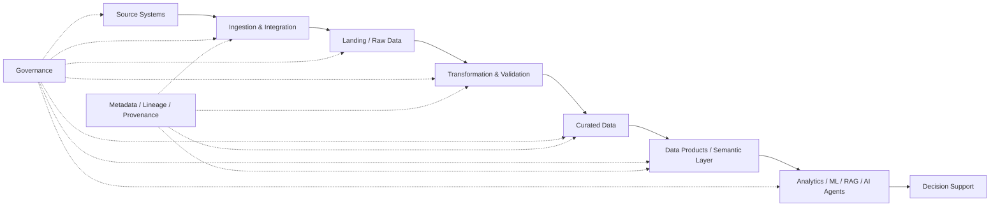
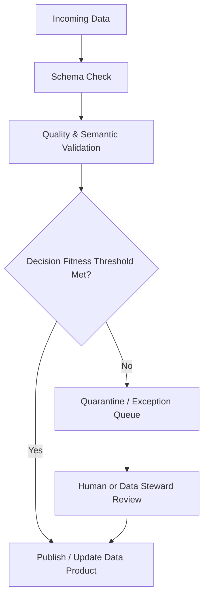
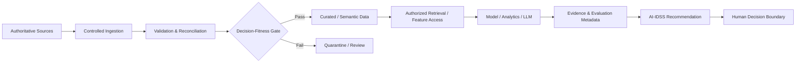

# 12. Enterprise Data Architecture

> **Advisor question:** Can the organization produce the data needed for a decision, with sufficient quality, provenance, timeliness, authorization, semantic consistency, and repeatability?

Enterprise AI is downstream of enterprise data architecture. An LLM cannot compensate for an unavailable source, an ambiguous business definition, stale data, broken lineage, or an authorization model that permits the wrong data to enter a decision workflow.

This chapter therefore treats data architecture as a system of capabilities and controls, not merely a choice of database technology.

## 12.1 What Enterprise Data Architecture Is

**Fact / Technical evidence.** NIST's Big Data Reference Architecture is a vendor-neutral, technology- and infrastructure-agnostic conceptual model. It describes architectural roles, functional components, activities, and management and security/privacy fabrics rather than prescribing a particular product. See [NIST SP 1500-6r2](https://www.nist.gov/publications/nist-big-data-interoperability-framework-volume-6-reference-architecture).

For this manual, enterprise data architecture means the design of:

- data sources and systems of record;
- ingestion and integration mechanisms;
- storage and processing layers;
- semantic models and data products;
- metadata, lineage, and provenance;
- data-quality controls;
- ownership and stewardship;
- authorization and isolation;
- retention and disposition;
- interfaces through which analytical, AI, and operational consumers use data.

The architectural question is not:

> “Which data platform should we buy?”

It is:

> “What data capabilities and controls must exist for the intended decisions and workloads, and what architecture provides them with acceptable risk and cost?”

## 12.2 Data Is an Architectural System

A useful mental model is:



Governance and metadata are cross-cutting capabilities, not documentation added after implementation.

**Inference:** For an important output, a mature architecture should make it possible to answer at least:

1. Where did the underlying data originate?
2. Which version or snapshot was used?
3. What transformations occurred?
4. Which business definitions were applied?
5. Which authorization decision permitted access?
6. When was the data last refreshed?
7. Which quality checks passed or failed?
8. Which model, analytical method, or rule consumed it?

If the architecture cannot answer these questions, the organization may still have an AI demonstration, but it does not yet have a strong decision-support data foundation.

## 12.3 Source Systems and Systems of Record

A **system of record (SoR)** is an organizational designation: for a defined business fact or transaction, the organization identifies a particular source as authoritative.

Examples may include:

| Information | Possible authoritative source |
|---|---|
| General-ledger transactions | ERP / accounting system |
| Portfolio-company ownership | Investment / portfolio system |
| Security prices | Contracted market-data source |
| Executed legal agreement | Document management / contract system |
| Employee identity | Identity / HR system |
| Approved investment memo | Controlled document repository |

These are examples, not universal assignments. The organization must explicitly define authority for each critical business fact.

**Architectural principle:** do not create an AI database and quietly allow it to become authoritative for facts that belong to an operational source.

An AI platform may create **derived data**—embeddings, extracted entities, classifications, summaries, scores, features, or recommendations—but those outputs require an explicit authority and lifecycle definition. Storage does not make a derived artifact authoritative.

### 12.3.1 Authoritative vs derived data

| Data type | Authority question |
|---|---|
| Source transaction | Which system owns the transaction? |
| Replicated copy | Is it synchronized and traceable to the source? |
| Cleaned dataset | What transformations were applied? |
| Feature | Which definition and version produced it? |
| Embedding | Which source content and embedding model produced it? |
| LLM summary | Is it a derived interpretation rather than a source fact? |
| AI recommendation | Who is accountable for accepting or rejecting it? |

This distinction is central to AI-IDSS. A generated summary must not become an apparently authoritative fact merely because it is stored in a database.

## 12.4 Operational Data vs Analytical Data

Operational systems optimize for executing business transactions. Analytical systems optimize for examining data across transactions, time periods, entities, and dimensions.

They may therefore have different:

- schemas;
- indexing strategies;
- consistency and transaction requirements;
- latency targets;
- retention policies;
- access patterns;
- workloads.

**Recommendation:** do not assume that an operational ERP database should become the direct query engine for every AI workload. Likewise, do not copy every operational field into a central analytical platform without a defined purpose, owner, retention rationale, and access model.

The right architecture depends on the workload.

## 12.5 Data Ingestion Patterns

Common patterns include:

| Pattern | Typical use | Main trade-off |
|---|---|---|
| Full batch | Periodic snapshots | Simple but potentially stale and expensive |
| Incremental batch | Changed records since last load | More efficient; requires reliable change detection |
| CDC | Transactional change propagation | Detailed changes; operational complexity |
| Event streaming | Event-driven workloads | Low latency; greater operational requirements |
| API pull | External systems | Controlled integration; rate limits and availability matter |
| File exchange | Statements, reports, documents | Simple boundary; parsing and freshness challenges |

There is no universal requirement that enterprise AI use streaming data.

**Advisor rule:** latency should be derived from the decision requirement, not from technology fashion.

If an investment-risk review is performed weekly, sub-second streaming may have little decision value. If an exposure threshold can change materially within minutes, a different freshness target may be justified.

## 12.6 Batch vs Streaming

Express the choice as a requirement:

> **Required freshness = maximum acceptable age of information for the decision.**

For each critical dataset, document:

- source update frequency;
- ingestion frequency;
- expected latency;
- tolerated staleness;
- failure behavior;
- recovery mechanism;
- duplicate handling;
- ordering requirements;
- reconciliation mechanism.

**Inference:** “real-time” is not an architecture requirement until someone can explain what decision becomes materially worse if the data is delayed.

## 12.7 Storage Architecture

Storage should be selected from workload requirements, not fashionable terminology.

Potential architectural roles include:

- operational relational databases;
- object storage / data lakes;
- analytical warehouses;
- lakehouses;
- search indexes;
- vector-capable retrieval systems;
- document stores;
- time-series stores;
- caches.

A single organization can legitimately use several. The architectural responsibility is to define why each exists and how data moves between them.

## 12.8 Data Lake, Warehouse, and Lakehouse

These terms describe architectural patterns, not universal quality levels. NIST and ISO reference-architecture work focuses on architectural concepts rather than prescribing one storage topology; see [NIST SP 1500-6r2](https://www.nist.gov/publications/nist-big-data-interoperability-framework-volume-6-reference-architecture) and [ISO/IEC 20547-3:2020](https://www.iso.org/standard/71277.html).

A data lake is commonly used for scalable storage of heterogeneous data. A data warehouse is commonly optimized for structured analytical workloads. A lakehouse is an implementation pattern intended to combine capabilities associated with lake and warehouse approaches. Exact capabilities vary by platform.

A useful decision frame is:

| Requirement | Possible architectural fit |
|---|---|
| Structured BI and SQL reporting | Warehouse |
| Large heterogeneous raw datasets | Lake / lake-oriented storage |
| Data engineering + analytics + ML across mixed formats | Lakehouse may fit |
| Transaction processing | Operational database |
| Semantic/full-text retrieval | Search system |
| Similarity retrieval for embeddings | Vector-capable retrieval system |

This table is a starting hypothesis, not a product-selection rule.

**Architecture warning:** do not infer that a lake, warehouse, or lakehouse is inherently more secure, more governed, or better for AI. Those properties depend on architecture, implementation, configuration, controls, and operating practices.

## 12.9 Transformation and Validation

Raw data is not automatically decision-ready data.

A transformation pipeline may need to perform:

- schema normalization;
- type conversion;
- deduplication;
- unit normalization;
- currency conversion;
- entity resolution;
- business-rule validation;
- missing-value handling;
- enrichment;
- temporal alignment;
- reference-data mapping.

Every material transformation should have a documented semantic purpose.

### Example: currency normalization

Suppose one portfolio company reports EBITDA in USD and another in EUR. Converting EUR to USD is not merely a technical transformation. The architecture must define:

- which FX source is authoritative;
- which date/time applies;
- whether spot, average, or period-end FX is required;
- whether the original value remains available;
- how the conversion is reproduced later.

A technically successful pipeline can therefore still produce a business-invalid result if the semantic rule is wrong.

### Semantic correctness

A data pipeline can be syntactically correct while being semantically wrong.

Examples include:

- mixing gross and net revenue;
- mixing fiscal and calendar periods;
- treating nominal and real values as equivalent;
- applying the wrong currency date;
- joining two entities with similar names but different identities;
- interpreting a covenant ratio with the wrong denominator.

**Advisor lens:** the question is not only “Did the pipeline run?” It is also “Did the resulting data mean what the decision process thinks it means?”

## 12.10 Data Products and Semantic Models

A **data product** is a deliberately managed dataset or data interface intended for reuse by identified consumers.

For the advisor, the important property is not the label “data product” but the contract around it:

- purpose;
- owner;
- schema;
- definitions;
- quality expectations;
- freshness;
- access policy;
- lineage;
- versioning;
- consumers;
- support and escalation path.

A data product is therefore **not automatically** a guarantee of quality, governance, or correctness. Those properties must be evidenced by controls and operation.

A semantic model provides consistent meanings for concepts such as:

- revenue;
- EBITDA;
- net debt;
- leverage;
- free cash flow;
- customer churn;
- liquidity;
- covenant headroom.

**Inference:** semantic consistency may matter more to AI-IDSS than simply increasing the volume of available data. If two systems use different definitions of “revenue,” combining them without resolving the conflict can produce a sophisticated but incorrect analysis.

## 12.11 Master and Reference Data

Master data identifies relatively stable business entities such as companies, legal entities, funds, securities, currencies, business units, and counterparties.

Reference data provides controlled values used to interpret other information, such as currency codes, country codes, industry classifications, accounting categories, and risk ratings.

The architecture should define how entities are identified across systems.

For AI-IDSS, the same company may appear under:

- legal name;
- trading name;
- ERP identifier;
- investment identifier;
- market-data identifier;
- document-system identifier.

Entity resolution should be deterministic where authoritative identifiers exist and should expose ambiguity rather than silently guessing.

## 12.12 Data Quality

**Fact / Technical evidence.** [ISO 8000-1:2022](https://www.iso.org/standard/81745.html) establishes principles and an overview for the ISO 8000 data-quality series. [ISO 8000-140:2016](https://www.iso.org/standard/62395.html) explicitly notes that requirements for completeness depend on the data, its use, industry, and the needs of the parties involved; it does not prescribe one universal completeness threshold.

Useful dimensions include:

- accuracy;
- completeness;
- consistency;
- timeliness;
- validity;
- uniqueness;
- integrity;
- fitness for purpose.

### Critical distinction

> **A dataset can be technically valid and still be unsuitable for a particular decision.**

A financial statement can be complete yet too old for a liquidity-monitoring decision. A dataset can be accurate at source but semantically incompatible with the metric required by an AI-IDSS workflow.

### The evaluation hierarchy

Data quality should be connected to the same hierarchy used elsewhere in this manual:

```text
Data quality
     ↓
Task performance
     ↓
System performance
     ↓
Business / decision value
```

High data-quality scores do not prove that a task will be performed correctly. Likewise, a model can perform well on a benchmark while the system produces poor decisions because the input data is stale, incomplete, unauthorized, or semantically wrong.

For every critical AI-IDSS dataset, define:

| Control | Example question |
|---|---|
| Freshness | How old may the data be for this decision? |
| Completeness | Which fields are mandatory for this task? |
| Validity | Which values are permitted? |
| Reconciliation | What independent source can verify totals? |
| Semantic consistency | Do definitions and units match the decision requirement? |
| Anomaly detection | What unexpected changes trigger review? |
| Quality threshold | When must downstream processing stop? |

The threshold is a **fitness-for-purpose requirement**, not a universal property of the dataset.

## 12.13 Data Quality Gates

Quality should not only be measured; it should influence system behavior.



**Recommendation:** for consequential AI workflows, critical quality failures should be capable of blocking downstream use rather than merely producing a warning buried in a log.

The exact thresholds are domain-specific and should be treated as explicit assumptions or business requirements until validated.

## 12.14 Data Ownership and Stewardship

Data architecture is partly organizational architecture.

**Fact / Technical evidence.** ISO 8000-150 addresses roles and responsibilities associated with data-quality management. The advisor should require explicit accountability for critical data rather than assuming that platform ownership equals business ownership.

At minimum, critical data should have clearly assigned responsibility for:

- business definition;
- source-system ownership;
- quality rules;
- access approval;
- incident handling;
- retention;
- lineage;
- change management.

A central data team cannot automatically become the owner of every business definition simply because it operates the data platform.

**Advisor challenge:**

> “Who is accountable when this number is wrong?”

If nobody can answer, the architecture has an accountability gap.

## 12.15 Metadata

Metadata makes data interpretable and governable.

Useful metadata includes:

- owner;
- description;
- schema;
- business definition;
- source;
- update frequency;
- sensitivity classification;
- retention period;
- quality status;
- lineage;
- version;
- access policy.

For AI systems, metadata should also describe material derived artifacts:

- embedding model/version;
- extraction model/version;
- document parser/version;
- feature definition/version;
- model input contract;
- evaluation dataset/version where relevant.

**Architecture warning:** metadata can describe an authorization policy, but metadata by itself is not authorization. Runtime access must be enforced by the relevant identity and policy mechanisms.

## 12.16 Data Lineage and Provenance

**Fact / Technical evidence.** NIST defines provenance as the chronology of origin, development, ownership, location, and changes associated with a system or system component and associated data; see the [NIST provenance glossary](https://csrc.nist.gov/glossary/term/provenance).

**Critical precision:** lineage and provenance are evidence about origin and transformation, not proof that the data is true or accurate. A perfectly documented chain can still originate from an incorrect source or contain an incorrect transformation.

For an AI-IDSS recommendation, a useful evidence chain is approximately:

```text
Source document / transaction
        ↓
Ingestion record
        ↓
Validated dataset
        ↓
Transformation / feature computation
        ↓
Analytical or retrieval input
        ↓
Model / rule / LLM processing
        ↓
Evidence / conclusion
        ↓
Recommendation presented to RD
```

This supports debugging, reconciliation, evaluation, incident investigation, and executive challenge.

Not every intermediate artifact must be retained forever. Retention should be determined by auditability, reproducibility, privacy, applicable requirements, security, operational value, and cost.

## 12.17 Data Contracts

A data contract makes expectations between producer and consumer explicit.

A useful contract can specify:

- schema;
- field semantics;
- allowed values;
- freshness/SLA;
- quality thresholds;
- ownership;
- versioning rules;
- compatibility expectations;
- security classification;
- incident behavior.

A contract should distinguish **transport correctness** from **semantic correctness**. Receiving a valid JSON object does not prove that the business meaning is correct.

**Recommendation:** use explicit data contracts for critical cross-system interfaces rather than relying solely on informal knowledge between teams.

## 12.18 Access Control and Data Isolation

Authorization must be enforced before data becomes available to downstream AI components.

NIST defines authorization as the decision to permit or deny a subject's access to a system resource. The relevant access decision belongs at the system/security boundary; it should not depend on an LLM correctly following an instruction such as “do not disclose data from another portfolio company.”

For multi-entity environments, the architecture should explicitly model:

- subject identity;
- resource identity;
- tenant/entity boundary;
- permitted actions;
- purpose or context where relevant;
- policy decision point and enforcement point;
- audit evidence.

**Advisor rule:** if a security requirement can be stated as “the model should know not to show this data,” the requirement is probably expressed at the wrong layer.

Isolation may be implemented through separate stores, logical partitions, row/column controls, application-level policy enforcement, separate credentials, or combinations of these. The correct mechanism is workload- and threat-model-dependent.

## 12.19 Freshness, Staleness, and Evaluation

Freshness is not merely an ingestion metric. It is part of whether the system is fit for its decision purpose.

For each critical dataset, define:

- expected update interval;
- maximum tolerated age;
- measurement point for age;
- behavior when the source is late;
- behavior when the pipeline is delayed;
- whether stale data may be displayed;
- whether stale data may trigger an alert or recommendation.

**Critical connection to Chapter 31:** freshness assumptions should appear in evaluation datasets and production monitoring. If a model is evaluated only on current data but operates on materially stale data in production, the evaluation evidence does not establish production fitness.

A useful control is to make freshness visible in the decision-support output itself:

```text
Alert: Material deterioration risk
Data freshness: 19 hours
Required maximum age: 24 hours
Freshness status: within threshold
```

If freshness is outside the permitted boundary, the system may need to downgrade confidence, mark the output stale, require review, or withhold the recommendation. The correct response is a decision requirement, not a universal rule.

## 12.20 Failure Semantics and Reconciliation

Data architecture must define what happens when delivery is imperfect.

Important cases include:

- duplicate records;
- missing records;
- out-of-order events;
- partial batch completion;
- source corrections;
- late-arriving data;
- schema changes;
- failed transformations;
- inconsistent replicas.

For each critical flow, define whether the consumer should:

- retry;
- ignore a duplicate;
- quarantine the record;
- replay from an authoritative source;
- reconcile against totals;
- roll back or supersede a derived artifact;
- stop downstream decision processing.

**Architecture warning:** successful transport is not equivalent to successful integration. A message can arrive exactly once and still contain the wrong business meaning; a message can arrive twice and still be safely processed if idempotency is designed correctly.

## 12.21 Data Architecture for AI-IDSS

The AI-IDSS data path should preserve authority, semantics, authorization, quality, and evidence:



The architecture should make the following chain defensible:

> **Authoritative source → controlled ingestion → validated and semantically correct representation → authorized access → analytical/model processing → evaluated output → evidence-backed recommendation → human decision.**

This is the data-side equivalent of the broader architecture spine used throughout this manual.

## 12.22 Advisor Lens: Questions That Expose Weak Data Architecture

When reviewing a proposal, ask:

1. What is the authoritative source for each critical fact?
2. What happens when the source and the AI data store disagree?
3. What business definitions are applied to each material metric?
4. Which transformations change meaning rather than merely format?
5. What is the maximum tolerated data age for this decision?
6. What happens when the data is stale?
7. What happens when a record is duplicated or arrives out of order?
8. Which quality failures block downstream processing?
9. Which quality thresholds are evidence-based, and which are assumptions?
10. Can the architecture prove which data version was used for an important output?
11. Can authorization be enforced independently of the LLM?
12. Can data from one entity or portfolio be isolated from another?
13. Who owns the business definition of the metric?
14. Who is accountable when the number is wrong?
15. Does the evaluation set represent the actual freshness, semantics, and data-quality conditions of production?
16. What happens when the source system is unavailable?
17. Can a derived artifact be traced back to its source and transformation history?
18. What evidence would make us change the data architecture?

## 12.23 Architecture Warning: More Data Is Not the Same as Better Decision Support

A common enterprise AI assumption is:

> “If we connect more enterprise data, the AI will become more useful.”

That proposition is not generally established. Additional data can improve a system when it is relevant, authorized, sufficiently fresh, semantically compatible, and usable by the task. It can also increase noise, cost, latency, privacy exposure, attack surface, and opportunities for conflicting definitions.

The advisor should therefore challenge data expansion with four questions:

- **Relevance:** does the additional data improve the task?
- **Authority:** is the source appropriate for the fact being asserted?
- **Fitness:** does its quality and freshness satisfy the decision requirement?
- **Control:** can the organization authorize, trace, evaluate, and remove it safely?

The objective is not maximum data access. It is sufficient, controlled, decision-relevant evidence.

## 12.24 Field Rule

> **Do not ask whether the organization has enough data. Ask whether it has the right evidence, from the right authority, with the right semantics, at the right freshness, under the right authorization, with enough quality and provenance to support the intended decision.**

And:

> **Data quality is not a property that exists independently of use. It is evidence about fitness for a defined purpose.**

## 12.25 Evidence Anchors

- [NIST SP 1500-6r2 — Big Data Reference Architecture](https://www.nist.gov/publications/nist-big-data-interoperability-framework-volume-6-reference-architecture)
- [NIST provenance glossary](https://csrc.nist.gov/glossary/term/provenance)
- [ISO 8000-1:2022 — Data quality: Overview](https://www.iso.org/standard/81745.html)
- [ISO 8000-140:2016 — Data quality: Completeness](https://www.iso.org/standard/62395.html)
- [ISO/IEC 20547-3:2020 — Big data reference architecture](https://www.iso.org/standard/71277.html)

**Evidence note:** Standards and reference architectures establish concepts and requirements within their stated scope. They do not by themselves prove that a particular data platform, topology, quality threshold, or vendor product is optimal for a particular AI-IDSS workload.
