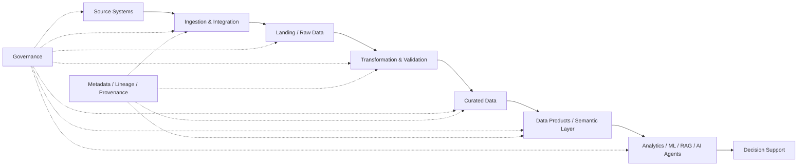
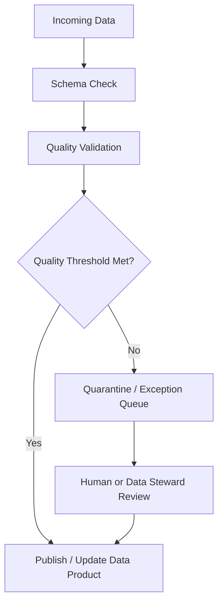
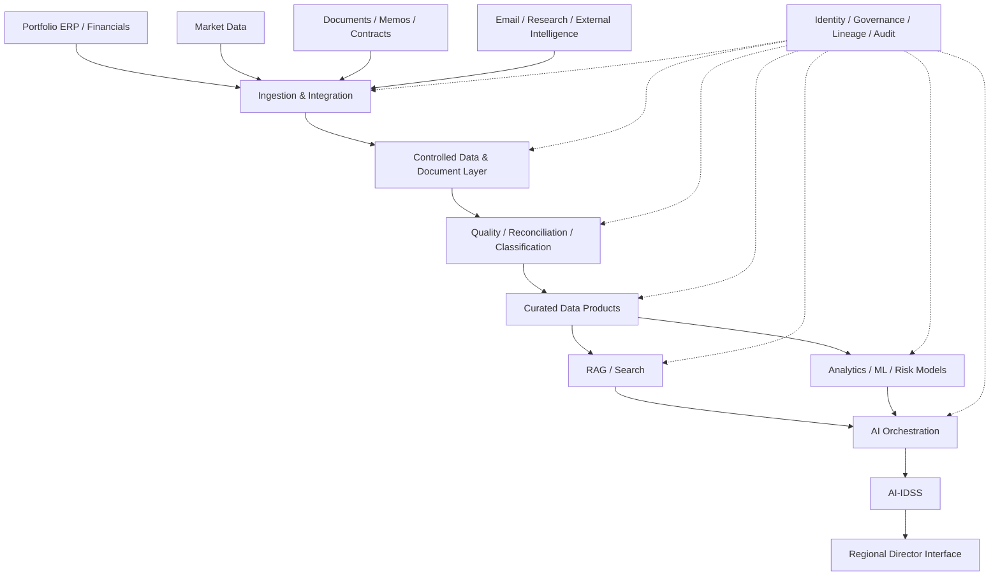

# 12. Enterprise Data Architecture

> **Advisor question:** Can the organization produce the data needed for a decision, with sufficient quality, provenance, timeliness, authorization, and repeatability?

Enterprise AI is downstream of enterprise data architecture. An LLM cannot compensate for an unavailable source, an ambiguous business definition, stale data, broken lineage, or an authorization model that permits the wrong data to enter a decision workflow.

This chapter therefore treats data architecture as a system of capabilities and controls, not merely a choice of database technology.

## 12.1 What Enterprise Data Architecture Is

**Fact / Technical evidence.** NIST's Big Data Reference Architecture is a vendor-neutral, technology- and infrastructure-agnostic conceptual model. It identifies architectural roles, functional components, activities, and cross-cutting management and security/privacy fabrics rather than prescribing a particular product. See [NIST SP 1500-6r2](https://www.nist.gov/publications/nist-big-data-interoperability-framework-volume-6-reference-architecture).

For this manual, enterprise data architecture means the design of:

- data sources and systems of record;
- ingestion and integration mechanisms;
- storage and processing layers;
- semantic models and data products;
- metadata, lineage, and provenance;
- quality controls;
- ownership and stewardship;
- authorization and isolation;
- retention and disposition;
- interfaces through which analytical, AI, and operational consumers use data.

The architectural question is not:

> “Which data platform should we buy?”

It is:

> “What data capabilities and controls must exist for the intended decisions and workloads, and what architecture provides them with acceptable risk and cost?”

## 12.2 Data Is an Architectural System

A useful mental model is:



The arrows represent data movement and dependency. Governance and metadata are cross-cutting architectural capabilities, not merely documentation added after implementation.

**Inference:** A mature AI architecture should make it possible to answer, for an important output, at least these questions:

1. Where did the underlying data originate?
2. Which version of the data was used?
3. What transformations occurred?
4. Which business definitions were applied?
5. Who was authorized to access it?
6. When was it last refreshed?
7. What quality checks passed or failed?
8. Which model, analytical method, or rule consumed it?

If the architecture cannot answer these questions, the organization may still have an AI demo, but it does not yet have a strong decision-support data foundation.

## 12.3 Source Systems and Systems of Record

A **system of record (SoR)** should be understood as an organizational designation: for a defined business fact or transaction, the organization identifies a particular source as authoritative.

Examples may include:

| Information | Possible authoritative source |
|---|---|
| General-ledger transactions | ERP / accounting system |
| Portfolio-company ownership | Investment / portfolio system |
| Security prices | Contracted market-data source |
| Executed legal agreement | Document management / contract system |
| Employee identity | Identity / HR system |
| Approved investment memo | Controlled document repository |

These are examples, not universal assignments. The organization must explicitly define which source is authoritative for each critical business fact.

**Architectural principle:** do not create an AI database and quietly allow it to become the authoritative source for facts that belong to an operational system.

An AI platform may create **derived data**—embeddings, extracted entities, classifications, summaries, scores, features, or recommendations—but those outputs should have explicitly defined authority and lifecycle. A derived artifact may be designated authoritative for a particular purpose only through an explicit governance decision.

### 12.3.1 Authoritative vs derived data

| Data type | Authority question |
|---|---|
| Source transaction | Which operational system owns the transaction? |
| Replicated copy | Is it synchronized and traceable to the source? |
| Cleaned dataset | What transformations were applied? |
| Feature | Which definition and version produced it? |
| Embedding | Which source content and embedding model produced it? |
| LLM summary | Is it a derived interpretation rather than a source fact? |
| AI recommendation | Who is accountable for accepting or rejecting it? |

This distinction becomes critical in AI-IDSS. The system should not turn a generated summary into an apparently authoritative fact merely because it is stored in a database.

## 12.4 Operational Data vs Analytical Data

Operational systems optimize for executing business transactions. Analytical systems optimize for examining data across transactions, time periods, entities, and dimensions.

They may therefore have different:

- schemas;
- indexing strategies;
- consistency and transaction requirements;
- latency targets;
- retention policies;
- access patterns;
- workloads.

**Recommendation:** do not assume that an operational ERP database should become the direct query engine for every AI workload. Likewise, do not copy every operational field into a central analytical platform without a defined purpose, ownership, and retention rationale.

The right architecture depends on the workload.

## 12.5 Data Ingestion Patterns

Data ingestion moves information from producers to a consuming data environment.

Common patterns include:

| Pattern | Typical use | Main trade-off |
|---|---|---|
| Full batch | Periodic snapshots | Simple but potentially stale and expensive |
| Incremental batch | Changed records since last load | More efficient; requires reliable change detection |
| CDC | Transactional change propagation | Near-real-time detail; operational complexity |
| Event streaming | Event-driven workloads | Low latency; greater operational requirements |
| API pull | External systems | Controlled integration; rate limits and availability matter |
| File exchange | Statements, reports, documents | Simple boundary; parsing and freshness challenges |

There is no universal requirement that enterprise AI use streaming data.

**Advisor rule:** latency should be derived from the decision requirement, not from technology fashion.

If an investment-risk review is performed once per week, a sub-second streaming architecture may have little decision value. If an exposure threshold can change materially within minutes, the architecture may require a different freshness target.

## 12.6 Batch vs Streaming

The choice should be expressed as a requirement:

> **Required freshness = maximum acceptable age of information for the decision.**

Then compare that requirement against the cost and complexity of candidate ingestion patterns.

For each critical dataset, document:

- source update frequency;
- ingestion frequency;
- expected latency;
- tolerated staleness;
- failure behavior;
- recovery mechanism;
- duplicate handling;
- ordering requirements;
- reconciliation mechanism.

**Inference:** “real-time” is not an architecture requirement until someone can explain what decision becomes materially worse if the data is delayed.

## 12.7 Storage Architecture

Storage should be selected from workload requirements, not from fashionable terminology.

Potential architectural roles include:

- operational relational databases;
- object storage / data lakes;
- analytical warehouses;
- lakehouses;
- search indexes;
- vector stores;
- document stores;
- time-series stores;
- caches.

A single organization can legitimately use several of these. The architectural responsibility is to define why each exists and how data moves between them.

## 12.8 Data Lake, Warehouse, and Lakehouse

These terms describe architectural patterns, not universal quality levels. NIST and ISO reference-architecture work likewise focuses on architectural concepts and views rather than prescribing one storage product or topology; see [NIST SP 1500-6r2](https://www.nist.gov/publications/nist-big-data-interoperability-framework-volume-6-reference-architecture) and [ISO/IEC 20547-3:2020](https://www.iso.org/standard/71277.html).

A data lake is commonly used for scalable storage of heterogeneous data. A data warehouse is optimized for structured analytical workloads. A lakehouse is an implementation pattern intended to combine capabilities associated with lake and warehouse approaches. Exact capabilities and boundaries vary by platform.

A useful decision frame is:

| Requirement | Likely architectural fit |
|---|---|
| Highly structured BI and SQL reporting | Warehouse |
| Large heterogeneous raw datasets | Lake / lake-oriented storage |
| Data engineering + analytics + ML across mixed formats | Lakehouse may fit |
| Transaction processing | Operational database |
| Semantic/full-text retrieval | Search system |
| Similarity retrieval for embeddings | Vector-capable retrieval system |

**Important:** the table is a starting hypothesis, not a product-selection rule.

Do not infer that a lake, warehouse, or lakehouse is inherently more secure, more governed, or better for AI. Those properties depend on architecture, implementation, configuration, controls, and operating practices.

## 12.9 Transformation and Validation

Raw data is not automatically decision-ready data.

A transformation pipeline may need to perform:

- schema normalization;
- type conversion;
- deduplication;
- unit normalization;
- currency conversion;
- entity resolution;
- business-rule validation;
- missing-value handling;
- enrichment;
- temporal alignment;
- reference-data mapping.

Every material transformation should have a documented semantic purpose.

### Example

Suppose one portfolio company reports EBITDA in USD and another in EUR. Converting EUR to USD is not merely a technical transformation. The architecture must define:

- which FX source is authoritative;
- which date/time applies;
- whether spot, average, or period-end FX is required;
- whether the original value remains available;
- how the conversion is reproduced later.

A technically successful pipeline can therefore still produce a business-invalid result if the semantic rule is wrong.

## 12.10 Data Products and Semantic Models

A **data product** is a deliberately managed dataset or data interface intended for reuse by identified consumers.

For the advisor, the important property is not the label “data product” but the contract around it:

- purpose;
- owner;
- schema;
- definitions;
- quality expectations;
- freshness;
- access policy;
- lineage;
- versioning;
- consumers;
- support/escalation path.

A semantic model provides consistent meanings for concepts such as:

- revenue;
- EBITDA;
- net debt;
- leverage;
- free cash flow;
- customer churn;
- liquidity;
- covenant headroom.

**Inference:** semantic consistency may matter more to AI-IDSS than simply increasing the volume of available data. If two systems use different definitions of “revenue,” combining them without resolving the semantic conflict can create a highly sophisticated but incorrect analysis.

## 12.11 Master and Reference Data

Master data identifies relatively stable business entities such as:

- companies;
- legal entities;
- funds;
- securities;
- currencies;
- business units;
- counterparties.

Reference data provides controlled values used to interpret other information, such as:

- currency codes;
- country codes;
- industry classifications;
- accounting categories;
- risk ratings.

The architecture should define how entities are identified across systems.

For AI-IDSS, this is particularly important because the same portfolio company may appear under:

- legal name;
- trading name;
- ERP identifier;
- investment identifier;
- market-data identifier;
- document-system identifier.

Entity resolution should be deterministic where authoritative identifiers exist and should expose ambiguity rather than silently guessing.

## 12.12 Data Quality

**Fact / Technical evidence.** [ISO 8000-1:2022](https://www.iso.org/standard/81745.html) establishes principles and an overview for data quality. Related ISO 8000 parts address measurement/concepts, data rules and profiling, completeness, and provenance-related requirements.

For this manual, data quality should be evaluated against the intended use rather than treated as one universal number. ISO 8000-140, for example, makes clear that completeness requirements depend on the data, context, and use.

Useful dimensions include:

- accuracy;
- completeness;
- consistency;
- timeliness;
- validity;
- uniqueness;
- integrity;
- fitness for purpose.

### Critical distinction

> **A dataset can be technically valid and still be unsuitable for a particular decision.**

For example, a financial statement may be complete but too old for a liquidity-monitoring decision.

For every critical AI-IDSS dataset, define:

| Control | Example question |
|---|---|
| Freshness | How old may the data be? |
| Completeness | Which fields are mandatory? |
| Validity | Which values are permitted? |
| Reconciliation | What independent source can verify totals? |
| Anomaly detection | What unexpected changes trigger review? |
| Quality threshold | When must downstream processing stop? |

## 12.13 Data Quality Gates

Quality should not only be measured; it should influence system behavior.

Example:



**Recommendation:** for consequential AI workflows, critical quality failures should be capable of blocking downstream use rather than merely producing a warning buried in a log.

The exact thresholds are domain-specific and should be treated as explicit assumptions or business requirements until validated.

## 12.14 Data Ownership and Stewardship

Data architecture is partly organizational architecture.

**Fact / Technical evidence.** ISO 8000-150 addresses roles and responsibilities associated with data-quality management. The advisor should therefore require explicit accountability for critical data rather than assuming that platform ownership equals business ownership.

At minimum, critical data should have clearly assigned responsibility for:

- business definition;
- source-system ownership;
- quality rules;
- access approval;
- incident handling;
- retention;
- lineage;
- change management.

A central data team cannot automatically become the owner of every business definition simply because it operates the data platform.

**Advisor challenge:**

> “Who is accountable when this number is wrong?”

If nobody can answer, the architecture has an accountability gap.

## 12.15 Metadata

Metadata makes data interpretable and governable.

Useful metadata includes:

- owner;
- description;
- schema;
- business definition;
- source;
- update frequency;
- sensitivity classification;
- retention period;
- quality status;
- lineage;
- version;
- access policy.

For AI systems, metadata should also describe derived artifacts where material:

- embedding model/version;
- extraction model/version;
- document parser/version;
- feature definition/version;
- model input contract.

## 12.16 Data Lineage and Provenance

**Lineage** describes how data moves and transforms through systems. **Provenance** records information about origin and history associated with data or other artifacts. NIST defines provenance in terms of the chronology of origin, development, ownership, location, and changes associated with systems or data; see the [NIST provenance glossary](https://csrc.nist.gov/glossary/term/provenance).

**Critical precision:** provenance is not proof that the data is accurate. A perfectly documented chain can still originate from an incorrect source or contain an incorrect transformation.

For an AI-IDSS recommendation, the desired chain is approximately:

```text
Source document / transaction
        ↓
Ingestion record
        ↓
Validated dataset
        ↓
Transformation / feature computation
        ↓
Analytical or retrieval input
        ↓
Model / rule / LLM processing
        ↓
Evidence / conclusion
        ↓
Recommendation presented to RD
```

This is not merely an audit feature. It supports debugging, reconciliation, model evaluation, incident investigation, and executive challenge.

Not every intermediate artifact must be retained forever. Retention should be determined by auditability, reproducibility, privacy, regulatory requirements, security, operational value, and cost.

## 12.17 Data Contracts

A data contract makes expectations between producer and consumer explicit.

A useful contract can specify:

- schema;
- field semantics;
- allowed values;
- freshness/SLA;
- quality thresholds;
- ownership;
- versioning rules;
- compatibility expectations;
- security classification;
- incident behavior.

**Recommendation:** use data contracts for critical cross-system interfaces rather than relying solely on informal knowledge between teams.

## 12.18 Access Control and Data Isolation

Authorization must be enforced before data becomes available to downstream AI components.

NIST defines authorization as the decision to permit or deny a subject's access to a system resource. NIST's Big Data Reference Architecture also places authentication, authorization, and audit within the security/privacy architecture rather than treating them as prompt-level behavior. See the [NIST authorization glossary](https://csrc.nist.gov/glossary/term/authorization) and [NIST SP 1500-6r2](https://www.nist.gov/publications/nist-big-data-interoperability-framework-volume-6-reference-architecture).

For a portfolio environment, the architecture should answer:

> Can the AI retrieve Company A's confidential information while processing Company B's request?

This requires more than a prompt instruction such as “do not reveal confidential information.” Controls should exist in the data-access path.

Potential controls include:

- identity-aware access;
- role-based or attribute-based authorization;
- tenant/company boundaries;
- row/column/document-level policies where appropriate;
- separate credentials or service identities;
- policy-enforced retrieval;
- audit logs.

**Field rule:** authorization is a data-plane control, not merely an LLM instruction.

## 12.19 Data Architecture for RAG

RAG introduces an additional requirement: retrieved context must preserve the relationship between content and authorization.

A safe conceptual flow is:


The architecture should avoid the pattern:

```text
All documents → unrestricted vector index → LLM
```

because retrieval itself can become a confidentiality boundary failure.

The vector representation should not be treated as magically detached from the access rights of the underlying source. A vector database is a retrieval mechanism; authorization must be enforced by the retrieval architecture and underlying data controls.

## 12.20 Data Architecture for Analytics and ML

Analytical and ML workloads may require additional artifacts:

- curated analytical tables;
- feature definitions;
- training datasets;
- validation datasets;
- labels;
- feature lineage;
- model-input snapshots;
- evaluation datasets.

The critical architectural principle is reproducibility.

If a risk model produced a 68% probability on 1 September, the organization should be able to determine what data, feature definitions, model version, and calculation produced that result. Whether the value is statistically well calibrated is a separate model-evaluation question; the data architecture must at least make the result reproducible and traceable.

Otherwise, the number is difficult to defend retrospectively.

## 12.21 Data Architecture for Agents

Agents introduce another data requirement: **state**.

State can include:

- conversation context;
- task state;
- intermediate results;
- memory;
- approvals;
- tool outputs;
- execution history.

State should have explicit:

- ownership;
- retention;
- access control;
- integrity protection;
- deletion rules;
- provenance.

A persistent agent memory should therefore be treated as enterprise data—not as an invisible implementation detail.

## 12.22 AI-IDSS Reference Data Architecture

The reference architecture for this manual is:



This architecture separates:

1. **source authority**;
2. **data engineering**;
3. **analytical computation**;
4. **knowledge retrieval**;
5. **LLM orchestration**;
6. **decision support**.

That separation makes technical challenge possible. If the Head of AI claims that an AI-generated risk score is reliable, the advisor can independently inspect the data and analytical path rather than accepting the LLM output as a black box.

## 12.23 Common Architectural Mistakes

### Mistake 1 — “Put everything in the data lake.”

A lake is not automatically a semantic model, quality system, governance system, or decision-support system.

### Mistake 2 — “The ERP database is our AI database.”

Operational and analytical workloads can have different requirements.

### Mistake 3 — “More data means better AI.”

More data is not automatically better decision support. Additional data can introduce noise, duplication, conflicting definitions, processing cost, privacy exposure, and attack surface. Treat this as an architectural inference rather than a universal empirical law.

### Mistake 4 — “The vector database is the knowledge base.”

The vector index is a retrieval mechanism. Source authority and governance remain elsewhere.

### Mistake 5 — “Data quality is the data team's problem.”

Business definitions and ownership cannot be outsourced simply because the data platform is centralized.

### Mistake 6 — “Real-time is always better.”

Freshness should follow decision requirements.

### Mistake 7 — “Copy first, govern later.”

Uncontrolled replication creates security, retention, lineage, and reconciliation problems.

### Mistake 8 — “LLM summaries are facts.”

A generated interpretation must remain distinguishable from source evidence.

## 12.24 Technical Challenge Questions

When reviewing an enterprise data architecture, ask:

1. What are the authoritative systems of record?
2. Which data is derived?
3. Who owns each critical business definition?
4. What is the required freshness for each decision?
5. Why is batch insufficient—or why is streaming unnecessary?
6. What happens when ingestion fails?
7. How are duplicates detected?
8. How is reconciliation performed?
9. What quality thresholds block downstream processing?
10. Where is data quarantined when quality fails?
11. Which datasets are sensitive?
12. Where is authorization enforced?
13. Can portfolio-company data cross security boundaries?
14. How is entity identity resolved across systems?
15. Which semantic definitions are centrally controlled?
16. Can a result be traced to source data?
17. Can the exact input dataset be reconstructed later?
18. What is the retention policy?
19. Which copies of the data exist?
20. Why does each copy exist?
21. Who can modify the curated dataset?
22. What happens when a schema changes?
23. What is the compatibility policy for downstream consumers?
24. What metadata is mandatory?
25. Does the RAG index preserve source authorization?
26. Can an agent retrieve data the user is not entitled to see?
27. What data enters model context?
28. What data is sent to external model providers?
29. Which outputs are considered authoritative?
30. What would make us reject this data architecture?

## 12.25 Architecture Review Checklist

Before approving a material enterprise data architecture, verify:

- [ ] Systems of record identified
- [ ] Business owners identified
- [ ] Data classifications defined
- [ ] Ingestion pattern justified
- [ ] Freshness requirements documented
- [ ] Storage pattern justified
- [ ] Transformation rules documented
- [ ] Quality controls defined
- [ ] Quality failure behavior defined
- [ ] Master/reference data strategy defined
- [ ] Metadata strategy defined
- [ ] Lineage available for critical data
- [ ] Provenance available for critical analytical outputs
- [ ] Data contracts defined where needed
- [ ] Access-control boundaries defined
- [ ] Portfolio/tenant isolation tested
- [ ] Retention and deletion defined
- [ ] RAG authorization preserved
- [ ] ML/analytics inputs reproducible
- [ ] Agent state governed
- [ ] Operational failure and recovery defined
- [ ] Costs and duplication understood
- [ ] Exit/migration considerations documented

## 12.26 Evidence Discipline

The following distinctions must remain explicit.

| Statement | Classification |
|---|---|
| NIST publishes a vendor-neutral Big Data Reference Architecture | **Fact / Technical evidence** |
| ISO 8000-1 establishes principles and an overview for data quality | **Fact / Technical evidence** |
| ISO 8000-150 addresses roles and responsibilities for data-quality management | **Fact / Technical evidence** |
| A lakehouse combines capabilities associated with lake and warehouse patterns | **Industry/technical evidence; implementation-dependent** |
| Critical AI outputs should have reproducible data lineage | **Recommendation / architectural inference** |
| Provenance demonstrates accuracy | **Incorrect — provenance establishes origin/history, not truth** |
| Every organization should use a lakehouse | **Unsupported universal claim — reject** |
| Streaming is required for enterprise AI | **Unsupported universal claim — reject** |
| A vector database is inherently required for RAG | **Unsupported universal claim — reject** |
| More data automatically improves AI decision quality | **Unsupported universal claim — reject** |

The advisor should continuously separate what a standard says from what the advisor recommends.

## 12.27 What Would Change Our Mind?

A recommendation should remain falsifiable.

For example, if we recommend batch ingestion for an investment-risk workflow, the recommendation should change if evidence shows that:

- material risk events occur inside the current batch interval;
- decision latency causes measurable losses;
- authoritative source systems can reliably provide lower-latency data;
- the incremental value exceeds the additional operational complexity and cost.

Likewise, if we recommend a centralized data platform, the recommendation should be reconsidered if organizational boundaries, regulatory requirements, latency requirements, or ownership constraints make decentralization materially safer or more effective.

## 12.28 Field Rule

> **Do not ask whether the organization has data. Ask whether it has authoritative, usable, authorized, sufficiently fresh, sufficiently reliable, traceable data for the decision at hand.**

And for AI-IDSS:

> **The quality of the decision-support architecture is bounded by the quality and governance of the information path feeding it.**

### Primary evidence

- NIST, *Big Data Interoperability Framework: Volume 6, Reference Architecture*. [NIST SP 1500-6r2](https://www.nist.gov/publications/nist-big-data-interoperability-framework-volume-6-reference-architecture)
- NIST, *Big Data Interoperability Framework: Volume 6, Reference Architecture* PDF. [NIST SP 1500-6r2](https://nvlpubs.nist.gov/nistpubs/SpecialPublications/NIST.SP.1500-6r2.pdf)
- NIST, *Big Data Interoperability Framework: Volume 4, Security and Privacy Version 3*. [NIST SP 1500-4r2](https://csrc.nist.gov/pubs/sp/1500/4/r2/final)
- NIST, *Provenance*. [NIST CSRC Glossary](https://csrc.nist.gov/glossary/term/provenance)
- NIST, *Authorization*. [NIST CSRC Glossary](https://csrc.nist.gov/glossary/term/authorization)
- ISO, *ISO/IEC 20547-3:2020 — Big data reference architecture — Part 3: Reference architecture*. [ISO](https://www.iso.org/standard/71277.html)
- ISO, *ISO 8000-1:2022 — Data quality — Part 1: Overview*. [ISO](https://www.iso.org/standard/81745.html)
- ISO, *ISO 8000-8:2015 — Data quality — Part 8: Information and data quality concepts*. [ISO](https://www.iso.org/standard/60805.html)
- ISO, *ISO/TS 8000-82:2022 — Data quality — Part 82: Data rules and data profiling*. [ISO](https://www.iso.org/standard/78707.html)
- ISO, *ISO 8000-120:2016 — Data quality — Part 120: Master data: Exchange of characteristic data: Provenance*. [ISO](https://www.iso.org/standard/62393.html)
- ISO, *ISO 8000-140:2016 — Data quality — Part 140: Master data: Exchange of characteristic data: Completeness*. [ISO](https://www.iso.org/standard/62395.html)

**Evidence note:** Standards and reference architectures establish concepts, requirements, and architectural guidance; they do not by themselves prove that one implementation pattern is optimal for every organization. Vendor-specific platform claims should be verified against current primary documentation during an architecture decision.
