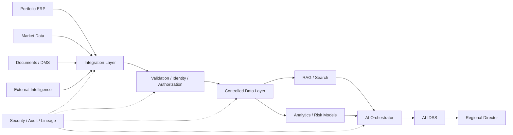

# 13. Data Integration Architecture

> **Advisor question:** Can information move between systems without losing meaning, authority, security, integrity, or the operational guarantees required by the decision?

Enterprise AI rarely fails because two systems cannot technically exchange bytes. More often, the difficult problem is preserving **identity, semantics, authorization, freshness, integrity, error behavior, and provenance** while information crosses system boundaries.

This chapter therefore treats integration as an architectural control, not merely as plumbing.

## 13.1 What Data Integration Is

Data integration connects systems so that data, events, or capabilities can be exchanged and consumed for an intended purpose.

For the advisor, an integration should be evaluated as a contract between systems:

- what is exchanged;
- who owns the meaning;
- who is authorized to send and receive it;
- how identity is mapped;
- how freshness is defined;
- how correctness is validated;
- how failure is handled;
- how changes are managed;
- how provenance and audit information are preserved.

**Technical evidence.** NIST's Big Data Reference Architecture treats data integration and information exchange as architectural functions rather than prescribing one integration technology. [NIST SP 1500-6r2](https://www.nist.gov/publications/nist-big-data-interoperability-framework-volume-6-reference-architecture)

## 13.2 Integration Is Not the Same as Data Architecture

Data architecture answers questions such as:

> What data exists, where is it authoritative, how is it governed, and how is it used?

Integration architecture answers:

> How does information or capability cross a system boundary while preserving the required properties?

They are closely related but not identical.

A sound data architecture can still have poor integration if:

- identifiers are inconsistent;
- schemas drift without coordination;
- transformations change meaning;
- authorization is lost during replication;
- failures create silent gaps;
- duplicate messages create duplicate transactions;
- consumers cannot determine freshness or source.

## 13.3 Integration Patterns

Common patterns include:

| Pattern | Typical use | Main trade-off |
|---|---|---|
| File exchange | Statements, reports, controlled document feeds | Simple boundary; parsing and freshness challenges |
| Batch ETL/ELT | Periodic analytical loading | Predictable; potentially stale |
| API integration | Request/response access to capabilities or data | Flexible; coupling and API lifecycle must be managed |
| CDC | Propagating database changes | Detailed change flow; source-system and operational complexity |
| Message queue | Decoupled asynchronous processing | Resilience; requires delivery semantics and operations |
| Event streaming | Event-driven workloads | Low latency and decoupling; higher operational complexity |
| Shared data platform | Multiple consumers using governed datasets | Reduces repeated extraction; creates governance and platform dependencies |

No pattern is universally superior.

**Recommendation:** select the least complex pattern that satisfies the actual freshness, reliability, scale, coupling, and security requirements.

## 13.4 Point-to-Point Integration

Point-to-point integration connects one producer directly to one consumer.

It can be reasonable when:

- there are few systems;
- the dependency is stable;
- ownership is clear;
- the interface is simple;
- the lifecycle is manageable.

It becomes problematic when every new consumer creates another independent connection.

```text
System A ───── System B
System A ───── System C
System A ───── System D
System B ───── System C
System B ───── System D
System C ───── System D
```

The concern is not that point-to-point is inherently wrong. It is that connection count, duplicated transformations, inconsistent security, and change coordination can grow rapidly.

**Advisor question:** What is the expected number of producers, consumers, and independently evolving interfaces over the life of the architecture?

## 13.5 Hub-and-Spoke and Integration Platforms

A hub can centralize routing, transformation, policy, monitoring, or protocol mediation.

Potential advantages:

- centralized policy enforcement;
- shared monitoring;
- reusable transformations;
- common authentication mechanisms;
- reduced duplicated integration logic.

Potential disadvantages:

- central bottleneck;
- platform dependency;
- concentration of failure;
- excessive centralization;
- difficult migration if the hub becomes proprietary or deeply embedded.

**Inference:** A hub is useful when shared control and reuse justify the additional central dependency. It should not be adopted merely because “enterprise integration” sounds like it requires a central bus.

## 13.6 API-Based Integration

An API exposes a controlled interface to data or capability.

The advisor should distinguish:

- **data API** — exposes information;
- **command API** — requests an action;
- **query API** — requests information according to defined parameters;
- **event interface** — communicates that something happened.

A command API deserves more scrutiny than a read-only query because it may cause a consequential state change.

NIST's current SP 800-228 update addresses API risks and controls across both pre-runtime and runtime stages and explicitly frames API security as a lifecycle concern. [NIST SP 800-228](https://csrc.nist.gov/pubs/sp/800/228/upd1/final)

## 13.7 File and Batch Integration

File exchange remains useful where producers naturally publish periodic artifacts such as:

- financial statements;
- regulatory reports;
- portfolio reports;
- research documents;
- controlled data extracts.

A file boundary should still define:

- producer;
- consumer;
- format;
- schema;
- encoding;
- expected delivery time;
- version;
- checksum or integrity mechanism where appropriate;
- completeness expectation;
- duplicate handling;
- rejection behavior;
- retention.

A file is not automatically “uncontrolled” integration. A governed file exchange can be a valid enterprise boundary.

## 13.8 Change Data Capture

CDC propagates changes from a source system rather than repeatedly extracting the complete dataset.

Potential advantages:

- lower transfer volume for suitable workloads;
- more timely downstream updates;
- ability to reconstruct changes when the source mechanism provides sufficient information.

Questions for the advisor:

- What exactly constitutes a change?
- Are deletes represented?
- Is ordering guaranteed?
- Can events be replayed?
- How are schema changes handled?
- What happens after a consumer outage?
- Can the consumer reconcile against the source?

**Important:** CDC is a transport/change-propagation mechanism, not a substitute for data governance or semantic validation.

## 13.9 Messaging and Event-Driven Integration

Messaging separates producers and consumers in time and can reduce direct runtime coupling.

The architecture must explicitly define delivery semantics and failure behavior.

Important concepts include:

- at-most-once delivery;
- at-least-once delivery;
- duplicate handling;
- ordering;
- replay;
- retention;
- dead-letter handling;
- consumer recovery.

Do not assume that “event-driven” means “exactly once.” Delivery guarantees depend on the specific architecture and implementation.

## 13.10 ETL vs ELT

ETL means transformation occurs before loading into the target environment. ELT loads data first and performs transformation within the target environment.

Neither is universally superior.

The decision should consider:

- source-system load;
- target compute;
- transformation complexity;
- data sensitivity;
- reproducibility;
- latency;
- storage cost;
- governance;
- operational skill.

The important architectural question is not which acronym is fashionable, but **where transformation is safest, most reproducible, and economically justified**.

## 13.11 Semantic Mapping

Moving a field is not equivalent to preserving its meaning.

Example:

```text
ERP:      "EBITDA"
System B: "Adjusted EBITDA"
System C: "EBITDA LTM"
System D: "Normalized EBITDA"
```

A naïve mapping such as:

```text
ERP.EBITDA → Analytics.EBITDA
```

may create false equivalence.

The integration architecture should document:

- source definition;
- target definition;
- transformation rule;
- units;
- currency;
- time basis;
- inclusion/exclusion rules;
- authoritative source;
- version.

**Field rule:** **schema compatibility does not prove semantic compatibility.**

ISO 8000-110:2021 explicitly addresses syntax, semantic encoding, and conformance to data specifications for exchange of relevant master data between systems. [ISO 8000-110](https://www.iso.org/standard/78501.html)

## 13.12 Canonical Data Models

A canonical model attempts to define shared representations for information exchanged across multiple systems.

Potential benefit:

```text
System A ─┐
System B ─┼──> Canonical Model ──> Consumers
System C ─┘
```

But canonical models can become large, abstract, and difficult to evolve.

**Recommendation:** use a canonical model where shared semantics and reuse justify it. Do not create a giant enterprise-wide canonical model merely to eliminate all local schemas.

## 13.13 Data Contracts

A data contract makes producer and consumer expectations explicit.

For integration, a useful contract can include:

- schema;
- semantic definitions;
- required fields;
- allowed values;
- identity rules;
- freshness;
- quality thresholds;
- security classification;
- ownership;
- versioning;
- compatibility rules;
- failure behavior;
- deprecation policy.

ISO 8000-110 demonstrates how exchange requirements can include formal syntax, semantic encoding, and conformance to a data specification. [ISO 8000-110](https://www.iso.org/standard/78501.html)

**Advisor principle:** an integration interface without an explicit contract is often an undocumented dependency.

## 13.14 Identity Mapping

Integration frequently crosses systems with different identifiers.

Example:

```text
Investment System:    PC-00421
ERP:                  700184
Market Data:          BBG000ABC123
Legal Entity:         LE-98-004
Document Repository:  OBJ-774291
```

The integration layer should not silently guess that these identifiers refer to the same entity.

Where authoritative mappings exist, maintain them explicitly.

Where ambiguity exists:

> **Expose the ambiguity rather than silently resolving it.**

This is especially important for AI-IDSS because an incorrect entity mapping can cause otherwise correct analytics to be applied to the wrong portfolio company.

## 13.15 Synchronization and Consistency

When the same business fact exists in multiple systems, define the synchronization model.

Questions include:

- Which system is authoritative?
- Which systems hold copies?
- How quickly must copies converge?
- What happens when updates conflict?
- Can updates be lost?
- Can a consumer temporarily operate on stale data?
- How is reconciliation performed?

The architecture should distinguish:

**source-of-truth consistency** from **consumer synchronization**.

A replicated copy being temporarily stale does not necessarily mean the architecture is wrong; it may be an explicit trade-off.

## 13.16 Idempotency and Duplicate Handling

Retries can create duplicate messages or requests.

For operations that can change state, the advisor should ask:

> If this same request arrives twice, what happens?

Possible mechanisms include:

- idempotency keys;
- unique business keys;
- deduplication stores;
- transaction identifiers;
- sequence numbers;
- reconciliation.

Idempotency is especially important when an AI agent can invoke write-capable tools.

A model may generate the same action twice because of retries, timeout ambiguity, or orchestration errors. The downstream system must not rely on the model “remembering” that it already acted.

## 13.17 Error Handling and Retry

Every integration needs explicit failure semantics.

Typical failures include:

- timeout;
- authentication failure;
- authorization denial;
- malformed payload;
- schema mismatch;
- unavailable dependency;
- rate limit;
- partial processing;
- duplicate delivery;
- downstream rejection.

A retry policy should distinguish transient failures from permanent failures.

```text
Request
  ↓
Transient failure? ── Yes ──> bounded retry / backoff
  │
  No
  ↓
Permanent failure ──> reject / quarantine / human review
```

**Advisor rule:** retries without idempotency and bounded backoff can convert an integration failure into a larger incident.

## 13.18 Dead-Letter and Exception Handling

Failed messages should not disappear.

An exception mechanism should provide enough information to answer:

- what failed;
- when;
- which producer;
- which consumer;
- which message or transaction;
- which schema/version;
- whether any partial action occurred;
- whether retry is safe;
- who owns resolution.

A dead-letter queue is one possible implementation. The architectural requirement is **controlled failure visibility and recovery**, not a particular product.

## 13.19 Integration Security

Security controls should follow the data and the action across the integration boundary.

Consider:

- encryption in transit;
- encryption at rest where applicable;
- authentication;
- authorization;
- secret management;
- certificate/key rotation;
- network segmentation;
- input validation;
- output validation;
- rate limiting;
- audit logging;
- sensitive-field minimization.

NIST SP 800-228 recommends a risk-based approach to API protection across API lifecycle stages rather than relying on one control such as an API gateway. [NIST SP 800-228](https://csrc.nist.gov/pubs/sp/800/228/upd1/final)

## 13.20 Integration Identity and Authorization

Authentication answers:

> Who or what is making this request?

Authorization answers:

> Is that identity allowed to perform this operation on this resource?

They must not be conflated.

For AI-IDSS, authorization should survive the integration path.

```text
RD User
   ↓
AI-IDSS
   ↓
Orchestrator
   ↓
Integration Layer
   ↓
Portfolio ERP
```

The integration layer should not accidentally broaden the user's authority merely because it uses a powerful service identity.

A shared integration identity may be appropriate in some architectures, but then the downstream authorization model and audit trail must still establish the permitted scope and accountable actor.

## 13.21 Audit, Lineage, and Provenance

For important integrations, record enough information to reconstruct what happened.

A useful event record may include:

- source;
- destination;
- timestamp;
- interface/version;
- message or transaction identifier;
- requesting identity;
- authorization result;
- schema/version;
- transformation version;
- processing status;
- error information;
- correlation identifier.

ISO 8000-120 addresses representation and exchange of provenance information for relevant master data. [ISO 8000-120](https://www.iso.org/standard/62393.html)

**Important distinction:** integration auditability is not the same as retaining every payload forever. Retention should be determined by legal, regulatory, security, privacy, operational, and reproducibility requirements.

## 13.22 Integration for AI-IDSS

A practical AI-IDSS integration architecture is:



The integration layer should not become a dumping ground for undocumented transformations. Each material transformation should have a defined semantic purpose and ownership.

### Example: investment-risk alert

Suppose the AI-IDSS reports:

> **Portfolio Company A — Probability of material deterioration: 68%.**

The advisor should be able to trace:

```text
ERP financials
   ↓
Revenue / margin / debt extraction
   ↓
Identity + authorization validation
   ↓
Quality / reconciliation checks
   ↓
Risk-model inputs
   ↓
Risk model
   ↓
Evidence
   ↓
AI synthesis
   ↓
68% alert
```

Integration therefore becomes part of the credibility chain behind the recommendation.

## 13.23 Common Integration Anti-Patterns

### 1. “Just connect the databases”

Ignores semantics, authorization, ownership, and failure behavior.

### 2. “Copy everything into the AI platform”

Creates unnecessary duplication, governance burden, and potentially broader exposure.

### 3. “The API schema is the contract”

A schema may describe structure without adequately defining business semantics, authorization, freshness, or failure behavior.

### 4. “Exactly once” as a default assumption

Delivery guarantees depend on the actual architecture. Consumers should be designed to tolerate the delivery semantics they receive.

### 5. “Retry until it works”

Can amplify outages and duplicate state-changing operations.

### 6. “The service account has access, so the agent can access it”

Confuses technical connectivity with authorized business access.

### 7. “Real-time everywhere”

Adds complexity without necessarily improving the decision.

### 8. “Central integration platform owns all semantics”

Business meaning usually requires accountable domain ownership; integration infrastructure does not automatically own it.

### 9. “Transformation is harmless”

Currency conversion, date alignment, entity matching, aggregation, and filtering can materially change analytical meaning.

## 13.24 Technical Challenge Questions

When reviewing an integration proposal, ask:

1. What exactly crosses the boundary?
2. Who owns the source fact?
3. Who owns the target definition?
4. Are the source and target semantics actually equivalent?
5. Which identifiers are authoritative?
6. How is identity mapping maintained?
7. What is the freshness requirement?
8. What happens when the producer is unavailable?
9. What happens when the consumer is unavailable?
10. Can messages be duplicated?
11. Can they arrive out of order?
12. Can they be replayed?
13. How are deletes represented?
14. What happens after schema change?
15. How are incompatible versions handled?
16. What transformation occurs?
17. Can every material transformation be reproduced?
18. Where is authorization enforced?
19. Does a service identity broaden access?
20. What data is logged?
21. Does the log itself contain sensitive information?
22. What is retained and for how long?
23. How are failed messages recovered?
24. How are partial failures reconciled?
25. What is the blast radius if this integration fails?
26. What is the exit path if the integration platform is replaced?
27. Which guarantees are contractual versus merely assumed?
28. What evidence supports the chosen integration pattern?
29. What would make us reject the design?

## 13.25 Architecture Review Checklist

| Dimension | Minimum question |
|---|---|
| Purpose | What decision or capability requires this integration? |
| Authority | Which system owns the underlying fact? |
| Semantics | Are source and target definitions equivalent? |
| Identity | How are entities mapped? |
| Freshness | How stale may the data be? |
| Quality | What validation is required? |
| Security | Who may access or invoke it? |
| Reliability | What happens during failure? |
| Delivery | What are the actual delivery semantics? |
| Idempotency | What happens on duplicate requests/events? |
| Versioning | How are interface changes managed? |
| Lineage | Can the transformation path be reconstructed? |
| Audit | Can important actions be attributed? |
| Recovery | Can failed processing be replayed or reconciled? |
| Cost | What is the ongoing operational cost? |
| Reversibility | Can the integration be replaced? |

## 13.26 Evidence Discipline

The following distinctions are important:

| Statement | Classification |
|---|---|
| NIST defines an architecture/reference approach for big-data interoperability | **Fact / technical evidence** |
| ISO 8000-110 addresses syntax, semantic encoding, and conformance for relevant master-data exchange | **Fact / technical evidence** |
| NIST SP 800-228 addresses API security across lifecycle stages | **Fact / technical evidence** |
| Point-to-point integration becomes difficult as dependencies multiply | **Inference / architecture observation** |
| A canonical model is better than direct mappings | **Unsupported as a universal claim** |
| Streaming is required for enterprise AI | **Unsupported as a universal claim** |
| Exactly-once delivery is always necessary | **Unsupported as a universal claim** |
| A service account is safer than delegated identity | **Unsupported as a universal claim** |
| Data integration should preserve authorization and provenance | **Architecture recommendation** |

## 13.27 What Would Change Our Mind?

The advisor should be willing to change the integration recommendation when evidence changes.

Examples:

- A batch design should be reconsidered if measured decision latency shows that stale data causes material errors.
- Point-to-point integration should be reconsidered if dependency growth creates unacceptable change or operational cost.
- A canonical model should be reconsidered if its governance cost exceeds the interoperability value it provides.
- A service identity should be reconsidered if it creates unacceptable authorization or audit limitations.
- Streaming should be introduced if measured business impact demonstrates that batch freshness is inadequate.
- A proprietary integration platform should be reconsidered if exit cost or vendor dependency becomes materially higher than its operational benefits.

## 13.28 Field Rule

> **Do not ask whether systems are connected. Ask whether the integration preserves the meaning, authority, authorization, integrity, freshness, and traceability required by the decision.**

That is the integration question an independent technology advisor should bring to the architecture review.