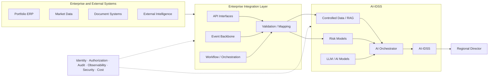

# 23. Enterprise Integration Architecture

> **Advisor question:** How should the enterprise connect applications, data, services, events, and external parties so that integration remains secure, reliable, evolvable, observable, and aligned with ownership boundaries?

Chapter 13 focuses on **data integration**: how information crosses a boundary while preserving meaning, identity, quality, integrity, freshness, and failure semantics. This chapter moves one level upward.

**Enterprise integration architecture** concerns the enterprise-wide organization of those connections: system boundaries, ownership, capability exposure, communication style, coupling, security enforcement, lifecycle, observability, and platform dependency.

The distinction matters because a technically correct interface can still be part of a poor enterprise architecture.

---

## 23.1 Enterprise Integration Is an Architecture Concern

Integration is not simply a collection of APIs, queues, ETL jobs, and connectors. It defines how independently owned systems cooperate.

The advisor should understand:

- system boundaries;
- ownership boundaries;
- trust boundaries;
- data authority;
- service authority;
- interaction patterns;
- synchronous and asynchronous communication;
- transaction boundaries;
- failure domains;
- security enforcement points;
- observability;
- lifecycle and versioning;
- external dependencies;
- platform dependencies.

A useful abstraction is:

```text
Business Capability
        ↓
System / Service Boundary
        ↓
Integration Contract
        ↓
Transport / Messaging
        ↓
Consumer
```

The transport is only one layer of the architecture.

---

## 23.2 Chapter 13 vs Chapter 23

| Chapter 13 — Data Integration | Chapter 23 — Enterprise Integration Architecture |
|---|---|
| How information crosses a boundary | How the enterprise organizes integration boundaries |
| Semantic mapping | Ownership and topology |
| CDC, ETL, messaging | API, event, workflow, platform strategy |
| Data contracts | Service/interface boundaries |
| Duplicate handling | Dependency and coupling management |
| Data provenance | Enterprise observability and governance |
| Data movement | System-to-system collaboration |

Chapter 13 asks:

> **Can this information move correctly?**

Chapter 23 asks:

> **Should these systems interact this way, through this boundary, with this authority, and with this lifecycle?**

This is an editorial architecture distinction; the two concerns overlap in real systems.

---

## 23.3 Start With System and Ownership Boundaries

Before selecting technology, identify each participating system.

For each system, document:

- business capability;
- technical owner;
- business/data owner;
- authoritative data or capability;
- consumers;
- trust level;
- security classification;
- availability requirement;
- lifecycle;
- external dependencies.

```text
                ┌───────────────┐
                │ Investment    │
                │ System        │
                └───────┬───────┘
                        │
             ┌──────────┼──────────┐
             ↓          ↓          ↓
          Portfolio    Market    Document
             ERP       Data       Platform
             │          │          │
             └──────────┼──────────┘
                        ↓
                  AI / Analytics
```

Every important interface should have an owner who can answer:

- Who defines the contract?
- Who approves changes?
- Who operates it?
- Who owns incidents?
- Who determines deprecation?

**Field rule:**

> **Do not approve an important integration whose technical owner and business/data owner are both ambiguous.**

---

## 23.4 APIs as Capability Boundaries

An API can expose a business capability rather than expose internal database structures.

Prefer, where appropriate:

```text
Consumer → Portfolio Service → Business Rules → Data
```

over:

```text
Consumer → Shared Database Tables
```

The second pattern creates stronger coupling to implementation details. That does not make direct data access universally wrong; the advisor should understand the dependency being created.

NIST SP 800-228 treats API security as a lifecycle concern covering development and runtime, with risk-based controls and multiple implementation options. The current publication is the March 13, 2026 update. [NIST SP 800-228](https://csrc.nist.gov/pubs/sp/800/228/upd1/final)

An API gateway may provide routing, traffic control, authentication integration, authorization enforcement, rate limiting, and observability, but it is not automatically the complete API security architecture.

**Advisor question:**

> Which responsibilities are enforced at the gateway, and which remain inside the application or downstream service?

---

## 23.5 Service-to-Service Integration and Zero Trust

In distributed systems:

```text
Service A → Service B
```

The architecture should make explicit:

- service identity;
- authentication;
- authorization;
- timeout;
- retry policy;
- request limits;
- contract/version;
- observability;
- dependency criticality.

NIST SP 800-207 defines Zero Trust around protecting resources rather than granting implicit trust based on network location, and treats authentication and authorization as distinct functions. [NIST SP 800-207](https://csrc.nist.gov/pubs/sp/800/207/final)

NIST SP 800-207A applies these principles to cloud-native applications and discusses application/service identities and policy enforcement mechanisms. [NIST SP 800-207A](https://csrc.nist.gov/pubs/sp/800/207/a/final)

**Architecture implication:** network reachability should not by itself determine whether one service is authorized to use another.

This is an architecture application of Zero Trust principles, not a requirement for a particular product such as a service mesh.

---

## 23.6 Synchronous vs Asynchronous Integration

The first question is often not REST versus messaging. It is:

> **Does the caller need the result before continuing?**

### Synchronous

```text
A → request → B
A ← response ← B
```

Useful when immediate response is required and runtime coupling is acceptable.

### Asynchronous

```text
A → message → Broker → B
```

Useful when work can continue independently or temporary dependency outages should be absorbed.

Neither is inherently superior.

Choose based on:

- business timing;
- latency;
- consistency;
- failure tolerance;
- coupling;
- operational capability.

---

## 23.7 Event-Driven Integration

An event communicates that something happened.

```text
Portfolio Financials Updated
              ↓
        Event Backbone
        ┌─────┼─────┐
        ↓     ↓     ↓
      Risk   Data   AI-IDSS
      Model  Lake
```

An event architecture requires explicit decisions about:

- event ownership;
- schema;
- delivery semantics;
- ordering;
- replay;
- retention;
- consumer independence;
- idempotency;
- observability.

Do not equate event-driven architecture with guaranteed consistency or exactly-once processing.

### Event backbone vs integration hub

| Pattern | Typical strength | Main concern |
|---|---|---|
| Direct API | Simple capability access | Runtime coupling |
| Integration hub | Central routing/policy/reuse | Central dependency |
| Event backbone | Temporal decoupling/fan-out | Operational and semantic complexity |
| Workflow/orchestrator | Explicit process control | Orchestration complexity |

A mature enterprise may use several patterns simultaneously.

**Advisor principle:** architecture should be compositional rather than ideological.

---

## 23.8 Workflow Orchestration and Transaction Boundaries

Some business processes span multiple systems:

```text
Investment Review
      ↓
Retrieve Financials
      ↓
Validate Data
      ↓
Run Risk Model
      ↓
Retrieve Evidence
      ↓
Generate Assessment
      ↓
Human Review
      ↓
Record Decision
```

An orchestrator can make sequencing, compensation, status, and failure handling explicit.

The advisor should distinguish:

- **orchestration** — one component coordinates the process;
- **choreography** — participants react to events without one central coordinator.

The important question is not which pattern is fashionable, but which gives adequate visibility and control at acceptable complexity.

Distributed workflows also require explicit transaction boundaries.

Ask:

> **What must succeed together?**

If operations cannot be atomic, define:

- consistency requirements;
- partial-failure behavior;
- retry behavior;
- compensation;
- reconciliation;
- user-visible state.

Do not imply distributed atomicity merely because each API call succeeds individually.

---

## 23.9 Coupling

Integration creates several forms of coupling:

| Coupling | Example |
|---|---|
| Structural | Shared schema |
| Semantic | Shared business definitions |
| Temporal | Consumer must be available now |
| Operational | Shared platform dependency |
| Security | Shared identity/authorization model |
| Version | Consumer depends on interface version |
| Organizational | Producer and consumer require coordinated ownership |

The objective is not zero coupling.

> **The objective is controlled coupling with explicit ownership and acceptable change cost.**

The advisor should identify which coupling is intentional and which is accidental.

---

## 23.10 Canonical Models and Domain Models

A universal enterprise model can create useful shared semantics when many systems genuinely need the same representation.

It can also become a central bottleneck for change.

An alternative is to preserve domain-specific models and translate at explicit boundaries:

```text
Portfolio Domain Model
          ↓
      Mapping
          ↓
Risk Domain Model
          ↓
      Mapping
          ↓
AI-IDSS Model
```

**Recommendation:** use shared models where their interoperability value justifies the governance and change cost. Do not create a universal model merely to eliminate all local schemas.

This is an architecture recommendation, not a universal standard.

---

## 23.11 Integration Platforms, iPaaS and ESB

Integration platforms can centralize:

- routing;
- transformation;
- connectors;
- monitoring;
- protocol mediation;
- workflow;
- security integration.

An ESB, iPaaS, or cloud-native integration platform may satisfy some of these responsibilities.

The advisor should ask:

1. What problem requires a platform?
2. Which integrations actually need it?
3. What becomes standardized?
4. What becomes platform-specific?
5. What happens if the platform fails?
6. How difficult is migration away from it?
7. What is the long-term operating cost?

Do not select an integration platform merely because it has the largest connector catalog.

---

## 23.12 API Lifecycle and Contract Evolution

An enterprise API has a lifecycle:

```text
Design
  ↓
Review
  ↓
Implement
  ↓
Test
  ↓
Publish
  ↓
Operate
  ↓
Version
  ↓
Deprecate
  ↓
Retire
```

OpenAPI provides a machine-readable specification for HTTP APIs and currently publishes versions including 3.2.0. [OpenAPI Specification](https://spec.openapis.org/oas/)

However, an API description is not necessarily the complete enterprise contract.

A broader contract may also define:

- business semantics;
- authorization expectations;
- rate limits;
- error semantics;
- idempotency;
- freshness;
- compatibility policy;
- deprecation timeline;
- ownership.

---

## 23.13 External and Partner Integration

External dependencies can include market-data providers, portfolio-company systems, banks, research providers, regulatory systems, SaaS platforms, and strategic partners.

Evaluate:

- contractual dependency;
- availability commitment;
- rate limits;
- authentication;
- data rights;
- data residency;
- versioning;
- change notification;
- incident communication;
- exit/replacement options.

External API availability is an architectural dependency, not merely a vendor-management issue.

---

## 23.14 Observability, Reliability and Failure Containment

When integration fails, the organization should be able to answer:

> **Where did the request or event stop, and what happened to the business process?**

Useful observability includes:

- correlation IDs;
- distributed tracing;
- structured logs;
- metrics;
- dependency health;
- queue depth;
- latency;
- error rate;
- retry count;
- dead-letter count;
- authorization failures.

Logs must still respect data-protection requirements; debugging needs do not justify copying sensitive business information into every log.

For AI-IDSS, dependency failure can propagate:

```text
Provider outage
     ↓
API unavailable
     ↓
Queue backlog
     ↓
Consumer lag
     ↓
Stale AI-IDSS data
```

The architecture should define whether the system:

- blocks;
- serves a clearly labelled stale result;
- falls back;
- enters degraded mode;
- requires human review;
- abstains.

> **Do not hide integration failure behind apparently normal AI output.**

---

## 23.15 Integration Security

For each integration, evaluate:

- identity;
- authentication;
- authorization;
- encryption;
- secret handling;
- input validation;
- output validation;
- rate limiting;
- abuse protection;
- audit;
- monitoring;
- failure containment.

NIST SP 800-228 explicitly treats API protection as a lifecycle problem and discusses basic and advanced controls across pre-runtime and runtime stages. [NIST SP 800-228](https://csrc.nist.gov/pubs/sp/800/228/upd1/final)

Security should follow the data and the action across the integration boundary.

A powerful shared service identity should not silently broaden the authority of every caller.

---

## 23.16 Integration Architecture for AI-IDSS

A reference architecture is:



The integration layer should provide controlled interfaces into AI-IDSS rather than become an uncontrolled replica of every enterprise system.

### AI-agent integration

The risk changes depending on whether AI:

```text
Read
  ↓
Analyze
  ↓
Recommend
  ↓
Request Action
  ↓
Execute Action
```

For agent integrations, define:

- agent identity;
- delegated authority;
- allowed tools/resources;
- operation scope;
- transaction limits;
- approval requirements;
- idempotency;
- audit;
- rollback or compensation where applicable.

The model should not be the final authority determining whether an enterprise action is permitted.

---

## 23.17 Enterprise Integration Decision Framework

When evaluating an integration proposal:

1. **Identify the capability** — what must cross the boundary?
2. **Identify ownership** — who owns the source, interface, capability, and consumer?
3. **Identify authority** — who may perform the operation?
4. **Define interaction semantics** — query, command, event, batch, or workflow?
5. **Define timing** — must it be synchronous?
6. **Define consistency** — immediate, eventual, or explicitly stale?
7. **Define failure behavior** — what happens after partial failure?
8. **Define lifecycle** — how will the interface evolve and retire?
9. **Compare patterns** — direct API, event, workflow, platform, shared data, or hybrid?
10. **Evaluate reversibility** — how difficult is replacement?

### Practical decision matrix

| Dimension | Direct API | Event | Workflow | Integration Platform |
|---|---:|---:|---:|---:|
| Immediate response | High | Low | Medium | Medium |
| Temporal decoupling | Low | High | Medium | Medium |
| Process visibility | Medium | Low–Medium | High | High |
| Centralized policy | Medium | Medium | High | High |
| Platform dependency | Low | Medium | Medium | High |
| Large-scale fan-out | Low–Medium | High | Medium | High |

These are **architectural heuristics**, not universal performance measurements. Replace them with evidence from the actual environment before using them for a consequential decision.

---

## 23.18 Common Anti-Patterns

### 1. Everything goes through one central bus

Centralization can become a bottleneck and strategic dependency.

### 2. Every system exposes its database

Creates implementation coupling and weakens ownership boundaries.

### 3. API gateway = complete security

Security responsibilities continue into applications, services, data, identities, and downstream systems.

### 4. Event-driven because it is modern

Events add operational and semantic complexity; use them when the decoupling benefit is real.

### 5. Universal enterprise data model

Can become a central bottleneck and force unrelated domains into inappropriate abstractions.

### 6. One integration platform for everything

Can standardize useful capabilities while also creating concentration and migration risk.

### 7. Shared service identity with unlimited authority

Convenient technically, dangerous architecturally.

### 8. Hidden synchronous dependency

A service may appear independent while actually blocking on a remote system.

### 9. No explicit ownership

Incidents and contract changes become organizational disputes.

### 10. No exit path

A successful integration can become strategically expensive if the provider or platform cannot be replaced.

---

## 23.19 Technical Challenge Questions

1. What business capability is crossing the boundary?
2. Who owns the source and interface?
3. Which system is authoritative?
4. Is this a query, command, event, batch exchange, or workflow?
5. Why must it be synchronous?
6. What happens when the dependency is unavailable?
7. What is the transaction boundary?
8. What happens after partial failure?
9. How are retries made safe?
10. How are identities mapped?
11. Where is authorization enforced?
12. Does a service identity broaden authority?
13. What data or capability is exposed unnecessarily?
14. How is the interface versioned?
15. Who approves breaking changes?
16. What observability exists end-to-end?
17. What happens when the integration platform fails?
18. How difficult is migration away from the platform?
19. What is the external-provider exit strategy?
20. Can an AI agent invoke this integration?
21. If yes, what operations are allowed?
22. What prevents model manipulation from becoming unauthorized action?
23. Can the integration preserve AI-IDSS evidence and provenance?

---

## 23.20 Architecture Review Checklist

- [ ] System boundaries are explicit.
- [ ] Technical and business ownership are defined.
- [ ] Source-of-authority is documented.
- [ ] Interaction type is explicit.
- [ ] Synchronous/asynchronous choice is justified.
- [ ] Security boundaries are explicit.
- [ ] Identity and authorization are defined.
- [ ] Data/capability exposure is minimized.
- [ ] Contracts are versioned.
- [ ] Failure and retry semantics are defined.
- [ ] Transaction boundaries are explicit.
- [ ] Observability is sufficient.
- [ ] External dependencies are identified.
- [ ] Platform dependency is understood.
- [ ] Migration/exit options are assessed.
- [ ] AI-agent authority is bounded where applicable.
- [ ] AI-IDSS evidence/provenance requirements are preserved.
- [ ] Cost and operational ownership are understood.

---

## 23.21 Evidence Discipline

### Fact

NIST SP 800-228 addresses API risks and controls across API lifecycle stages. [NIST SP 800-228](https://csrc.nist.gov/pubs/sp/800/228/upd1/final)

### Technical specification

OpenAPI provides a specification for describing HTTP APIs. [OpenAPI Specification](https://spec.openapis.org/oas/)

### Architecture recommendation

> Use the least complex integration pattern that satisfies the required business, security, reliability, and lifecycle constraints.

### Inference

> A highly centralized integration platform can become a strategic dependency when critical processes become difficult to migrate away from it.

### Assumption

> **Assumption:** the portfolio ERP can expose reliable APIs without materially affecting its production workload.

This must be validated before architecture approval.

### Industry evidence

A documented enterprise implementation can demonstrate feasibility, but does not prove that the same pattern is optimal elsewhere.

---

## 23.22 What Would Change Our Mind?

Revisit the recommendation if evidence shows that:

- a direct integration has lower risk and total cost;
- event infrastructure creates more complexity than value;
- a central platform materially improves control without unacceptable lock-in;
- service boundaries create unacceptable latency or operational overhead;
- security can be enforced more effectively at another boundary;
- external-provider guarantees materially change dependency risk;
- reliability testing invalidates the assumed failure model;
- AI-agent authority requirements change the consequence profile.

The recommendation is conditional on architecture evidence, not loyalty to a pattern.

---

## 23.23 Field Rule

> **Design integration around capabilities, ownership, authority, failure, and lifecycle—not around the integration product.**

A strong enterprise integration architecture creates **controlled, observable, evolvable boundaries** between systems while preserving ownership, security, reliability, semantic integrity, and a credible path to change.

For AI-IDSS, the final test is:

> **Can the integration architecture deliver the evidence and capabilities required by the decision system while preserving authority, provenance, security, reliability, and a credible path to change?**
