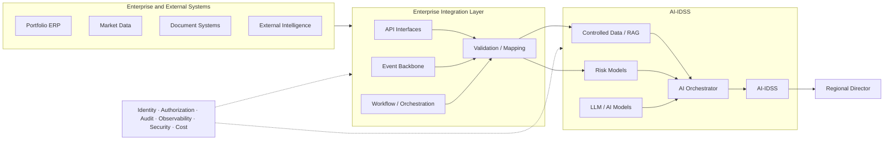

# 23. Enterprise Integration Architecture

> **Advisor question:** How should the enterprise connect applications, data, services, events, and external parties so that integration remains secure, reliable, evolvable, observable, and aligned with ownership boundaries?

Chapter 13 treated **data integration**: how information crosses system boundaries while preserving meaning, identity, quality, and operational guarantees. This chapter moves one level upward.

**Enterprise integration architecture** concerns the topology and governance of those connections across the enterprise: which systems communicate directly, which capabilities are exposed as services, where policy is enforced, where asynchronous communication is used, who owns each boundary, and how the architecture evolves.

The distinction matters because a technically correct interface can still be part of a poor enterprise architecture.

---

## 23.1 Integration Is an Enterprise Architecture Concern

Integration is not simply a collection of APIs, queues, ETL jobs, and connectors.

It defines how independently owned systems cooperate.

At enterprise scale, the advisor should understand:

- system boundaries;
- ownership boundaries;
- trust boundaries;
- data authority;
- service authority;
- integration patterns;
- synchronous and asynchronous communication;
- transaction boundaries;
- failure domains;
- security enforcement points;
- observability;
- lifecycle and versioning;
- external dependencies;
- platform dependencies.

A useful abstraction is:

```text
Business Capability
        ↓
System / Service Boundary
        ↓
Integration Contract
        ↓
Transport / Messaging
        ↓
Consumer
```

The transport is only one layer of the architecture.

---

## 23.2 Chapter 13 vs Chapter 23

The distinction should remain explicit.

| Chapter 13 — Data Integration | Chapter 23 — Enterprise Integration Architecture |
|---|---|
| How data crosses a boundary | How the enterprise organizes integration boundaries |
| Semantic mapping | Ownership and topology |
| CDC, ETL, messaging | API, event, workflow, integration-platform strategy |
| Data contracts | Service/interface boundaries |
| Duplicate handling | Dependency and coupling management |
| Data provenance | Enterprise observability and governance |
| Data movement | System-to-system collaboration |

Chapter 13 asks:

> **Can this information move correctly?**

Chapter 23 asks:

> **Should these systems interact this way, through this boundary, with this authority, and with this lifecycle?**

---

## 23.3 Start With System Boundaries

Before selecting an integration technology, identify the systems involved.

For each system, document:

- business capability;
- owner;
- system of record responsibilities;
- authoritative data;
- exposed capabilities;
- consumers;
- trust level;
- security classification;
- availability requirements;
- lifecycle;
- external dependencies.

A useful enterprise map is:

```text
                ┌───────────────┐
                │ Investment    │
                │ System        │
                └───────┬───────┘
                        │
             ┌──────────┼──────────┐
             ↓          ↓          ↓
          Portfolio    Market    Document
             ERP       Data       Platform
             │          │          │
             └──────────┼──────────┘
                        ↓
                  AI / Analytics
```

The purpose is not to draw every connection. It is to make important boundaries visible.

---

## 23.4 Ownership Before Connectivity

Every important interface should have an owner.

Ownership should answer:

- Who defines the contract?
- Who approves changes?
- Who operates the interface?
- Who owns incidents?
- Who determines deprecation?
- Who owns the underlying data or capability?

An integration without clear ownership becomes an organizational dependency disguised as a technical dependency.

**Field rule:**

> **Do not approve an important integration whose technical owner and business/data owner are both ambiguous.**

---

## 23.5 API as a Capability Boundary

An API can expose a business capability rather than merely expose database fields.

Prefer, where appropriate:

```text
Consumer → Portfolio Service → Business Rules → Data
```

over:

```text
Consumer → Shared Database Tables
```

The second pattern creates stronger coupling to internal implementation.

This does not mean database access is always wrong. It means the advisor should understand what dependency is being created.

NIST SP 800-228 treats API protection as a lifecycle concern spanning development and runtime, with risk-based controls rather than reliance on a single security mechanism. The current NIST update was published in March 2026. [NIST SP 800-228](https://csrc.nist.gov/pubs/sp/800/228/upd1/final)

---

## 23.6 API Gateway

An API gateway can provide a controlled entry point for APIs and may support functions such as:

- routing;
- authentication integration;
- authorization enforcement;
- rate limiting;
- traffic control;
- observability;
- policy enforcement;
- protocol mediation.

But an API gateway is not automatically the complete API security architecture.

NIST's API guidance describes controls across API lifecycle stages and discusses multiple implementation options. cite not permanent

**Advisor question:**

> Which security and operational responsibilities are actually enforced at the gateway, and which remain inside the application or downstream service?

---

## 23.7 Service-to-Service Integration

In distributed systems, services may communicate directly.

```text
Service A → Service B
```

The architecture should make explicit:

- service identity;
- authentication;
- authorization;
- timeout;
- retry policy;
- circuit breaking;
- request limits;
- contract/version;
- observability;
- dependency criticality.

NIST Zero Trust Architecture emphasizes resource protection rather than implicit trust based on network location, with authentication and authorization as distinct functions. [NIST SP 800-207](https://csrc.nist.gov/pubs/sp/800/207/final)

For cloud-native environments, NIST SP 800-207A further describes application and service identities and policy enforcement mechanisms such as API gateways and service infrastructure. [NIST SP 800-207A](https://csrc.nist.gov/pubs/sp/800/207/a/final)

---

## 23.8 Synchronous vs Asynchronous Integration

The first architectural question is often not REST vs messaging.

It is:

> **Does the caller need the result before continuing?**

### Synchronous

```text
A → request → B
A ← response ← B
```

Useful when:

- an immediate result is required;
- the dependency can meet the latency requirement;
- coupling is acceptable.

### Asynchronous

```text
A → message → Broker → B
```

Useful when:

- work can continue independently;
- temporary outages should be absorbed;
- producers and consumers should be decoupled in time.

Neither is inherently superior.

**Recommendation:** choose communication timing based on business and operational requirements, not technology fashion.

---

## 23.9 Event-Driven Integration

An event communicates that something happened.

Example:

```text
Portfolio Financials Updated
              ↓
        Event Backbone
        ┌─────┼─────┐
        ↓     ↓     ↓
      Risk   Data   AI-IDSS
      Model  Lake
```

Events can reduce direct runtime coupling, but they introduce their own architectural requirements:

- event ownership;
- event schema;
- delivery semantics;
- ordering expectations;
- replay;
- retention;
- consumer independence;
- idempotency;
- observability.

Do not equate event-driven architecture with guaranteed consistency or exactly-once processing.

---

## 23.10 Event Backbone vs Integration Hub

These patterns solve different problems.

| Pattern | Strength | Risk |
|---|---|---|
| Central integration hub | Central routing, transformation, policy | Central dependency and platform coupling |
| Event backbone | Decoupled producers/consumers | Operational and semantic complexity |
| Direct APIs | Simple capability access | Runtime coupling |
| Workflow/orchestrator | Explicit multi-step process | Orchestration complexity and central control |

A mature enterprise may use all four.

**Advisor principle:** architecture should be compositional rather than ideological.

---

## 23.11 Workflow Orchestration

Some business processes span multiple systems.

Example:

```text
Investment Review
      ↓
Retrieve Financials
      ↓
Validate Data
      ↓
Run Risk Model
      ↓
Retrieve Supporting Evidence
      ↓
Generate Assessment
      ↓
Human Review
      ↓
Record Decision
```

A workflow engine or application orchestrator may coordinate such a process.

The advisor should distinguish:

- **orchestration** — one component coordinates the workflow;
- **choreography** — participating systems react to events without one central coordinator.

Neither is universally better.

Use explicit orchestration when process visibility, sequencing, compensation, and control are important. Use event-driven choreography where decentralized reaction and loose temporal coupling provide real value.

---

## 23.12 Transaction Boundaries

Distributed integration creates an important question:

> What must succeed together?

Consider:

```text
ERP Update
    ↓
Risk Model Update
    ↓
AI-IDSS Refresh
```

These operations may not belong to one atomic transaction.

The architecture must therefore define:

- consistency requirements;
- partial-failure behavior;
- retry behavior;
- compensation;
- reconciliation;
- user-visible state.

Do not pretend that a distributed workflow has atomicity simply because each individual API call succeeds.

---

## 23.13 Coupling

Integration creates coupling in several dimensions:

| Coupling | Example |
|---|---|
| Structural | Shared schema |
| Semantic | Shared business definitions |
| Temporal | Consumer must be available now |
| Operational | Shared platform dependency |
| Security | Shared identity/authorization model |
| Version | Consumer depends on specific interface version |
| Organizational | Producer and consumer require coordinated ownership |

The advisor should identify which coupling is intentional and which is accidental.

**Field rule:**

> The objective is not zero coupling. It is **controlled coupling with explicit ownership and acceptable change cost**.

---

## 23.14 Canonical Models vs Domain Models

Enterprise integration sometimes proposes one universal data model.

That can be useful when many systems genuinely share stable semantics.

But a universal model can also become a central bottleneck for change.

An alternative is to preserve domain-specific models and translate between them at explicit boundaries.

```text
Portfolio Domain Model
          ↓
      Mapping
          ↓
Risk Domain Model
          ↓
      Mapping
          ↓
AI-IDSS Model
```

**Recommendation:** use the smallest shared semantic model that creates meaningful interoperability without forcing unrelated domains into one abstraction.

This is an architecture recommendation, not a universal standard.

---

## 23.15 Integration Platform / iPaaS / ESB

Integration platforms can centralize capabilities such as:

- routing;
- transformation;
- connectors;
- monitoring;
- protocol mediation;
- workflow;
- security integration.

An enterprise service bus (ESB), integration platform as a service (iPaaS), or cloud-native integration platform may all satisfy portions of this role.

The technology name is less important than the architectural responsibility.

The advisor should ask:

1. What problem requires a platform?
2. Which integrations actually need it?
3. What capabilities become standardized?
4. What becomes platform-specific?
5. What happens if the platform is unavailable?
6. Can integrations be migrated without rewriting the enterprise?
7. What is the long-term operating cost?

Avoid selecting an integration platform merely because it offers the largest connector catalog.

---

## 23.16 Security Architecture for Integration

Integration expands the attack surface because systems become reachable through additional boundaries.

For each integration, evaluate:

- identity;
- authentication;
- authorization;
- encryption;
- secret handling;
- input validation;
- output validation;
- rate limiting;
- abuse protection;
- logging;
- monitoring;
- failure containment.

Zero Trust provides an important architectural basis: network location should not create implicit trust, and access decisions should be tied to identities, resources, and policies. [NIST SP 800-207](https://csrc.nist.gov/pubs/sp/800/207/final)

For cloud-native service environments, identity-based controls may be enforced through application/service infrastructure rather than relying only on network segmentation. [NIST SP 800-207A](https://csrc.nist.gov/pubs/sp/800/207/a/final)

---

## 23.17 API Lifecycle and Contract Evolution

An enterprise API is not finished when its first version is deployed.

The lifecycle should address:

```text
Design
  ↓
Review
  ↓
Implement
  ↓
Test
  ↓
Publish
  ↓
Operate
  ↓
Version
  ↓
Deprecate
  ↓
Retire
```

OpenAPI provides a standardized machine-readable description format for HTTP APIs and currently publishes multiple specification versions, including 3.2.0. [OpenAPI Specification](https://spec.openapis.org/oas/)

However, an API description is not the whole contract.

The enterprise contract may also need:

- semantic definitions;
- authorization expectations;
- rate limits;
- error semantics;
- idempotency;
- freshness;
- compatibility policy;
- deprecation timeline;
- ownership.

---

## 23.18 External and Partner Integration

External integrations introduce additional uncertainty.

Examples:

- Bloomberg / market-data providers;
- portfolio-company systems;
- banks;
- research providers;
- regulatory systems;
- SaaS platforms;
- strategic partners.

The advisor should evaluate:

- contractual dependency;
- availability SLA;
- rate limits;
- authentication method;
- data rights;
- data residency;
- versioning;
- change notification;
- incident communication;
- exit/replacement options.

External API availability is an architectural dependency, not merely a vendor-management issue.

---

## 23.19 Integration Observability

When an integration fails, the organization should be able to answer:

> Where did the request or event stop?

Useful observability concepts include:

- correlation IDs;
- distributed tracing;
- structured logs;
- metrics;
- dependency health;
- queue depth;
- latency;
- error rate;
- retry count;
- dead-letter count;
- authorization failures.

Observability should also respect data protection requirements.

Logs should not become an uncontrolled copy of sensitive business information merely because developers need debugging context.

---

## 23.20 Reliability and Failure Containment

An enterprise integration architecture should assume dependencies will fail.

Possible failures:

```text
Provider outage
     ↓
API unavailable
     ↓
Queue backlog
     ↓
Consumer lag
     ↓
Stale AI-IDSS data
```

The architecture should define whether the AI-IDSS:

- blocks;
- serves a stale-but-labelled result;
- falls back to another source;
- switches to a degraded mode;
- requires human review;
- abstains.

The correct behavior depends on decision criticality.

**Field rule:**

> Do not hide integration failure behind apparently normal AI output.

---

## 23.21 Integration Architecture for AI-IDSS

A reference architecture is:



The integration layer should provide controlled interfaces into AI-IDSS rather than becoming an uncontrolled replica of every enterprise system.

---

## 23.22 AI and Agent Integration

AI agents introduce an additional architectural question:

> Is the AI consuming information, requesting a capability, or changing enterprise state?

These are different risk levels.

```text
Read
  ↓
Analyze
  ↓
Recommend
  ↓
Request Action
  ↓
Execute Action
```

As the architecture moves downward, authority and consequence generally increase.

For agent integrations, define:

- agent identity;
- delegated authority;
- allowed tools;
- allowed resources;
- operation scope;
- transaction limits;
- approval requirements;
- idempotency;
- audit;
- rollback or compensation.

The model should not be the final authority that determines whether an action is permitted.

---

## 23.23 Integration Decision Framework

When evaluating an enterprise integration proposal, use this sequence:

### Step 1 — Identify the capability

What business capability or information must cross the boundary?

### Step 2 — Identify ownership

Who owns the source, capability, interface, and consumer?

### Step 3 — Identify authority

Who is allowed to perform the operation?

### Step 4 — Define interaction semantics

Is this:

- query;
- command;
- event;
- batch exchange;
- workflow?

### Step 5 — Define timing

Is synchronous response required, or is asynchronous processing acceptable?

### Step 6 — Define consistency

What must be immediately consistent, eventually consistent, or explicitly stale?

### Step 7 — Define failure behavior

What happens when the dependency fails halfway through the process?

### Step 8 — Define lifecycle

How will the interface evolve and eventually be retired?

### Step 9 — Compare architecture options

Evaluate direct API, event, workflow, integration platform, shared data access, or hybrid approaches.

### Step 10 — Evaluate reversibility

How difficult is it to replace the integration technology or external provider?

---

## 23.24 Decision Matrix

A practical decision matrix can be:

| Dimension | Direct API | Event | Workflow | Integration Platform |
|---|---:|---:|---:|---:|
| Immediate response | High | Low | Medium | Medium |
| Temporal decoupling | Low | High | Medium | Medium |
| Process visibility | Medium | Low–Medium | High | High |
| Operational simplicity | High for small scope | Medium | Medium | Variable |
| Centralized policy | Medium | Medium | High | High |
| Platform dependency | Low | Medium | Medium | High |
| Large-scale fan-out | Low–Medium | High | Medium | High |

These ratings are **architectural heuristics**, not universal performance measurements.

The advisor should replace them with evidence from the actual environment before using them for a consequential decision.

---

## 23.25 Common Enterprise Integration Anti-Patterns

### 1. Everything goes through one central bus

Centralization can become a bottleneck and a single strategic dependency.

### 2. Every system exposes its database

Creates implementation coupling and weakens ownership boundaries.

### 3. API gateway = complete security

Security responsibilities continue into applications, services, data, identities, and downstream systems.

### 4. Event-driven because it is modern

Events add operational and semantic complexity; use them when the decoupling benefit is real.

### 5. Universal enterprise data model

Can become a central bottleneck and force unrelated domains into inappropriate abstractions.

### 6. One integration platform for everything

A platform can standardize useful capabilities while also creating concentration and migration risk.

### 7. Shared service identity with unlimited authority

Convenient technically, dangerous architecturally.

### 8. Hidden synchronous dependency

A service may appear independent while actually blocking on a remote system.

### 9. No explicit ownership

Incidents and contract changes become organizational disputes.

### 10. No exit path

A technically successful integration can become strategically expensive if the provider or platform cannot be replaced.

---

## 23.26 Technical Challenge Questions

When reviewing an enterprise integration proposal, ask:

1. What business capability is crossing the boundary?
2. Who owns the source and who owns the interface?
3. Which system is authoritative?
4. Is this a query, command, event, batch exchange, or workflow?
5. Why must it be synchronous?
6. What happens when the dependency is unavailable?
7. What is the transaction boundary?
8. What happens after partial failure?
9. How are retries made safe?
10. How are identities mapped?
11. Where is authorization enforced?
12. Does a service identity broaden authority?
13. What data is exposed unnecessarily?
14. How is the interface versioned?
15. Who approves breaking changes?
16. How are consumers discovered?
17. What observability exists end-to-end?
18. What happens when the integration platform fails?
19. How difficult is migration away from the chosen platform?
20. What is the external-provider exit strategy?
21. Can an AI agent invoke this integration?
22. If yes, what operations are allowed?
23. What prevents model manipulation from becoming unauthorized action?
24. Can the integration architecture preserve AI-IDSS evidence and provenance?

---

## 23.27 Architecture Review Checklist

Before approval, verify:

- [ ] System boundaries are explicit.
- [ ] Technical and business ownership are defined.
- [ ] Source-of-authority is documented.
- [ ] Interaction type is explicit.
- [ ] Synchronous/asynchronous choice is justified.
- [ ] Security boundaries are explicit.
- [ ] Identity and authorization are defined.
- [ ] Data and capability exposure is minimized.
- [ ] Contracts are versioned.
- [ ] Failure and retry semantics are defined.
- [ ] Transaction boundaries are explicit.
- [ ] Observability is sufficient.
- [ ] External dependencies are identified.
- [ ] Platform dependency is understood.
- [ ] Migration/exit options are assessed.
- [ ] AI-agent authority is bounded where applicable.
- [ ] AI-IDSS evidence/provenance requirements are preserved.
- [ ] Cost and operational ownership are understood.

---

## 23.28 Evidence Discipline

The advisor should classify claims carefully.

### Fact

Example: NIST SP 800-228 addresses API risks and controls across API lifecycle stages. [NIST SP 800-228](https://csrc.nist.gov/pubs/sp/800/228/upd1/final)

### Technical Standard / Specification

Example: OpenAPI defines a machine-readable specification for HTTP APIs. [OpenAPI Specification](https://spec.openapis.org/oas/)

### Architecture Recommendation

Example:

> Use the least complex integration pattern that satisfies the required business, security, reliability, and lifecycle constraints.

### Inference

Example:

> A highly centralized integration platform can become a strategic dependency when many critical processes become difficult to migrate away from it.

### Assumption

Example:

> **Assumption:** the portfolio ERP can expose reliable APIs without materially affecting its production workload.

This must be validated before architecture approval.

### Industry Evidence

A documented enterprise implementation may demonstrate feasibility, but it does not prove that the same pattern is optimal for another organization.

---

## 23.29 What Would Change Our Mind?

The advisor should remain willing to change the integration recommendation if evidence shows that:

- workload characteristics are materially different from assumptions;
- synchronous coupling is operationally acceptable;
- event infrastructure creates more complexity than value;
- a centralized platform has a demonstrably lower total cost and acceptable exit risk;
- a direct integration has sufficiently low and stable complexity;
- security controls can be enforced more effectively through another boundary;
- the external provider has materially stronger contractual and technical guarantees than assumed;
- reliability testing demonstrates that the proposed failure model is inadequate;
- AI-agent authority requirements change the consequence profile.

The recommendation is therefore conditional on the architecture evidence, not on loyalty to a pattern.

---

## 23.30 Field Rule

> **Design integration around capabilities, ownership, authority, failure, and lifecycle—not around the integration product.**

A strong enterprise integration architecture does not maximize the number of APIs, events, connectors, or platforms.

It creates **controlled boundaries** through which systems can cooperate without losing ownership, security, reliability, semantic integrity, or the ability to evolve.

For AI-IDSS, the final test is:

> **Can the integration architecture deliver the evidence and capabilities required by the decision system while preserving authority, provenance, security, reliability, and a credible path to change?**
