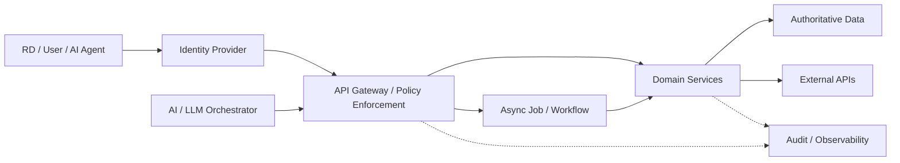

# 24. API Architecture

> **Advisor question:** How should APIs expose capabilities and data so that access remains secure, explicit, evolvable, observable, and appropriate for AI-IDSS and enterprise integration?

Chapter 23 addressed the **enterprise integration architecture**: the topology, boundaries, ownership, and interaction patterns across systems. This chapter goes one level deeper into the API as an architectural contract.

An API is not merely an HTTP endpoint. It is a boundary through which a system exposes capabilities or representations to another party. The advisor therefore evaluates not only whether an API works, but what authority, coupling, security exposure, lifecycle obligation, and operational dependency the API creates.

---

## 24.1 API Is a Contract, Not Just an Endpoint

A useful abstraction is:

```text
Consumer
   ↓
API Contract
   ↓
Policy / Authorization
   ↓
Application Capability
   ↓
Data / Other Services
```

The contract should make important behavior explicit:

- available operations;
- input and output structures;
- semantics;
- authentication expectations;
- authorization requirements;
- error behavior;
- idempotency behavior where relevant;
- rate or usage constraints;
- versioning and compatibility;
- ownership;
- lifecycle.

An endpoint that is technically callable but semantically ambiguous is not a strong enterprise interface.

---

## 24.2 API Design Starts With the Capability

Do not begin with:

> “Which framework should we use?”

Begin with:

> “What capability is this boundary supposed to expose?”

For example:

```text
Portfolio Service
 ├── Retrieve financial position
 ├── Retrieve operating metrics
 ├── Submit approved adjustment
 └── Retrieve risk indicators
```

This is generally more useful architecturally than exposing database tables directly.

**Recommendation:** expose the smallest coherent capability boundary that allows consumers to achieve the required outcome without coupling them unnecessarily to internal implementation.

This is an architecture recommendation, not a universal prohibition against direct data access.

---

## 24.3 Resource APIs vs Action APIs

Many APIs expose resources:

```text
GET /portfolios/{id}
GET /portfolios/{id}/companies
```

Others expose explicit actions:

```text
POST /portfolio-reviews/{id}:approve
POST /risk-assessments/{id}:recalculate
```

The important question is semantic clarity.

For consequential operations, an explicit action can make the intended state transition easier to understand and authorize.

The advisor should examine:

- what state changes;
- who may cause the change;
- whether the operation is repeatable;
- whether approval is required;
- how the result is recorded;
- how failures are represented.

Avoid treating REST-style naming as a substitute for domain semantics.

---

## 24.4 HTTP Semantics Matter

HTTP provides standardized methods and status-code semantics.

The API should use those semantics consistently rather than inventing a private vocabulary where standard semantics already fit.

Examples include:

- `GET` for retrieval;
- `POST` for operations where creation or processing semantics apply;
- `PUT` for replacement semantics where appropriate;
- `PATCH` for partial modification where appropriate;
- `DELETE` for deletion semantics where appropriate.

The advisor should still evaluate the actual behavior rather than trusting the method name.

An endpoint called `GET` that triggers a state change is architecturally misleading and can create operational and security problems.

---

## 24.5 API Contract Description

OpenAPI provides a machine-readable description format for HTTP APIs and supports documentation, tooling, validation, and related lifecycle activities. The current published specification is OpenAPI 3.2.1 (10 September 2026). OpenAPI patch releases address errors and clarifications rather than introducing a new feature set. [OpenAPI Specification](https://spec.openapis.org/oas/)

A useful contract can describe:

- paths;
- operations;
- parameters;
- request bodies;
- responses;
- schemas;
- authentication/security requirements;
- reusable components.

But OpenAPI does not automatically define every business rule.

The enterprise contract may also need explicit documentation for:

- authorization meaning;
- data classification;
- semantic definitions;
- freshness;
- consistency;
- side effects;
- idempotency;
- rate limits;
- compatibility;
- deprecation;
- audit expectations.

**Field rule:**

> A machine-readable API description improves precision, but it does not replace architectural and business semantics.

---

## 24.6 Authentication Is Not Authorization

The API must answer two different questions:

```text
Who is calling?
       ↓
Authentication
       ↓
What is this caller allowed to do?
       ↓
Authorization
```

A valid token does not imply permission to access every portfolio company or perform every operation.

For AI-IDSS this distinction is critical.

Example:

```text
AI Service Identity
       ↓
Request: GET portfolio-company/ABC
       ↓
Policy evaluation
       ↓
Allowed / Denied
```

The authorization decision should be enforced by the API/application boundary or another explicit policy enforcement mechanism, not delegated to an LLM's interpretation of instructions.

NIST's Zero Trust Architecture treats authentication and authorization as distinct functions and does not make network location an implicit basis for trust. [NIST SP 800-207](https://csrc.nist.gov/pubs/sp/800/207/final)

---

## 24.7 Object-Level Authorization

An API can be correctly authenticated and still expose another user's or portfolio's object.

Example:

```text
GET /companies/123
```

The security question is not merely:

> “Is the caller authenticated?”

It is:

> “Is this caller authorized to access company 123?”

OWASP identifies Broken Object Level Authorization as API1:2023 and recommends considering object-level authorization checks wherever user-controlled object identifiers access data. OWASP also identifies broken function-level and object-property-level authorization as major API risks. 

For an investment organization, the equivalent boundary may be:

```text
User / AI Agent
      ↓
Portfolio scope
      ↓
Company scope
      ↓
Resource scope
      ↓
Operation scope
```

The authorization model must match the actual organizational boundary.

---

## 24.8 Object-Property Authorization

Authorization may also depend on which fields are exposed.

For example, two users may both access a portfolio company but have different rights to see:

- valuation assumptions;
- financing terms;
- employee information;
- legal documents;
- sensitive transaction details.

Therefore:

```text
Authorized for object
        ≠
Authorized for every property
```

The API should avoid returning sensitive properties merely because the caller has access to the parent object.

This is particularly important for AI systems because an apparently harmless API response can become model context, embeddings, logs, or generated output downstream.

---

## 24.9 Input Validation and Schema Enforcement

API boundaries should validate inputs before they reach sensitive downstream systems.

Validation can include:

- schema;
- type;
- range;
- format;
- allowed values;
- size limits;
- business invariants;
- authorization context.

Schema validation is necessary but not sufficient.

A syntactically valid request can still be semantically invalid or unauthorized.

```text
Valid JSON
   ↓
Valid Schema
   ↓
Valid Domain Meaning
   ↓
Authorized Operation
```

The advisor should ask which layer rejects invalid input.

---

## 24.10 Output Validation and Data Minimization

APIs should also control what leaves the boundary.

Avoid returning an entire internal object when the consumer requires only a small subset.

```text
Internal object
       ↓
Policy / projection
       ↓
Required representation
       ↓
Consumer
```

This reduces unnecessary coupling and can reduce exposure of sensitive data.

However, data minimization is purpose-dependent. The objective is not simply “return as little as possible”; it is to return what the authorized consumer needs for the defined purpose.

---

## 24.11 Error Semantics

Errors are part of the API contract.

A consumer should be able to distinguish, where relevant, among:

- invalid input;
- authentication failure;
- authorization failure;
- resource not found;
- conflict;
- rate limiting;
- dependency failure;
- temporary service failure;
- unexpected server failure.

RFC 9457 defines the HTTP `application/problem+json` representation for machine-readable problem details and is an IETF Standards Track document. 

The advisor should avoid prescribing RFC 9457 as mandatory for every API. The architectural requirement is clearer machine-readable error semantics; RFC 9457 is a standardized option.

**Field rule:**

> Do not make consumers infer error meaning from arbitrary strings or undocumented status conventions.

---

## 24.12 Idempotency and Retries

Retries can duplicate operations.

Consider:

```text
AI Agent
   ↓
POST /approve
   ↓
Network timeout
   ↓
Agent retries
   ↓
POST /approve again
```

If the operation changes state, the architecture must define whether repeated requests are safe.

Possible controls include:

- idempotency keys;
- request identifiers;
- state-transition checks;
- deduplication;
- transactional constraints.

This is especially important for agentic systems.

**Recommendation:** any API that can change consequential enterprise state should have an explicit duplicate/retry policy.

---

## 24.13 Long-Running Operations

Some operations should not hold an HTTP request open until completion.

Example:

```text
POST /risk-assessments
          ↓
     202 Accepted
          ↓
   Job / Assessment ID
          ↓
GET /risk-assessments/{id}
```

The appropriate design depends on workload and business semantics.

For long-running AI workloads, asynchronous execution can make status, retries, cancellation, and partial failure more explicit.

The advisor should ask:

- What does acceptance mean?
- Where is progress stored?
- Can the operation be retried?
- Can it be cancelled?
- What happens if the model provider fails?
- When is the result considered authoritative?

---

## 24.14 Pagination, Filtering, Sorting, and Limits

Collection APIs need explicit behavior for:

- pagination;
- maximum page size;
- filtering;
- sorting;
- stable ordering;
- continuation tokens where appropriate.

These are not merely developer conveniences.

They affect:

- latency;
- memory consumption;
- database load;
- cost;
- consistency;
- authorization;
- reproducibility.

An API that permits unrestricted retrieval of a large enterprise dataset may become both a performance and security problem.

---

## 24.15 Rate Limiting and Resource Protection

An API can be logically correct but operationally unsafe if one consumer can exhaust shared resources.

Controls may include:

- request quotas;
- rate limits;
- concurrency limits;
- payload-size limits;
- timeout limits;
- workload-specific budgets.

NIST SP 800-228 includes API risk and protection controls across development and runtime and recommends a risk-based approach rather than reliance on a single control. The current updated publication includes additional API risk and lifecycle-control appendices. [NIST SP 800-228](https://csrc.nist.gov/pubs/sp/800/228/upd1/final)

For AI APIs, resource protection may also need model-specific controls such as token budgets or inference concurrency limits.

---

## 24.16 API Versioning and Compatibility

APIs evolve.

Possible approaches include:

- URI versioning;
- header/media-type versioning;
- backward-compatible evolution without explicit major versions;
- parallel versions during migration.

No single approach is universally correct.

The advisor should instead evaluate:

1. What constitutes a breaking change?
2. How are consumers identified?
3. How long are old versions supported?
4. How is deprecation communicated?
5. Can consumers migrate independently?
6. What happens when a consumer cannot migrate?

Versioning is therefore a governance and dependency-management problem, not merely a URL-format choice.

---

## 24.17 API Inventory and Lifecycle

An enterprise should know which APIs exist.

Inventory should capture, where relevant:

- owner;
- purpose;
- environment;
- endpoint/domain;
- version;
- consumers;
- data classification;
- authentication method;
- authorization model;
- dependencies;
- lifecycle status;
- deprecation date.

OWASP's API Security Top 10 includes Improper Inventory Management as API9:2023, emphasizing the risk created by undocumented hosts, endpoints, versions, and exposed legacy interfaces. 

**Field rule:**

> An API that nobody knows exists cannot be governed reliably.

---

## 24.18 API Gateway Is Not the Architecture

A gateway may provide useful centralized controls:

```text
Consumer
   ↓
API Gateway
   ↓
Service
   ↓
Data
```

But some controls belong elsewhere.

| Concern | Possible enforcement point |
|---|---|
| Authentication | Gateway / identity provider / service |
| Authorization | Gateway + application/resource policy |
| Business rules | Application/domain service |
| Data filtering | Service/data policy |
| Input validation | Gateway + application |
| Rate limiting | Gateway/platform |
| Audit | Gateway + service |
| Transaction integrity | Application/data layer |

NIST's API guidance explicitly discusses multiple implementation options and a risk-based approach. 

**Advisor challenge:**

> If the gateway is bypassed, which security properties still hold?

---

## 24.19 API-to-API and Third-Party APIs

Third-party APIs should not automatically be treated as trusted data sources.

Evaluate:

- identity and authentication;
- authorization;
- transport security;
- data rights;
- data provenance;
- freshness;
- availability;
- rate limits;
- schema/version changes;
- failure semantics;
- vendor exit options.

OWASP explicitly identifies unsafe consumption of APIs as an API security risk because downstream applications may trust third-party responses more than equivalent untrusted input. 

For market-data and intelligence sources, the advisor should additionally distinguish:

> **technical availability** from **analytical authority**.

An API returning data successfully does not prove that the data is correct, current, licensed for the intended use, or suitable for a particular investment conclusion.

---

## 24.20 API Security Threat Model

The advisor should review at least:

```text
Identity
   ↓
Authentication
   ↓
Authorization
   ↓
Input
   ↓
Business Logic
   ↓
Data Access
   ↓
Output
   ↓
Logging / Monitoring
```

Threats include:

- broken object authorization;
- broken function authorization;
- broken authentication;
- excessive resource consumption;
- SSRF;
- security misconfiguration;
- undocumented/legacy endpoints;
- unsafe third-party API consumption;
- sensitive data exposure;
- abuse of sensitive business flows.

OWASP's 2023 API Top 10 provides an industry security taxonomy for these classes of risk. It is useful evidence and awareness material, not a formal standard. 

---

## 24.21 API Architecture for AI-IDSS

A practical pattern is:



For AI-IDSS, APIs should expose **controlled capabilities**, not unrestricted access to enterprise systems.

Examples:

```text
Good:
AI → GET authorized financial indicators
AI → GET approved evidence package
AI → REQUEST risk assessment

Higher risk:
AI → arbitrary SQL
AI → arbitrary HTTP request
AI → unrestricted ERP mutation
AI → unrestricted email/action API
```

The last group requires substantially stronger controls because the API becomes a bridge from probabilistic reasoning into enterprise authority.

---

## 24.22 Read APIs vs State-Changing APIs for Agents

A useful risk distinction is:

| API type | Typical risk |
|---|---|
| Read-only | Information disclosure, excessive retrieval |
| Analytical | Incorrect input/output, provenance issues |
| Workflow request | Incorrect or duplicated process initiation |
| State-changing | Unauthorized or incorrect enterprise change |
| External communication | Reputational, contractual, or operational impact |
| Financial transaction | Potential direct financial impact |

This is an architectural classification, not a universal risk score.

For consequential actions, the architecture should consider:

- explicit authorization;
- narrow tool scope;
- parameter validation;
- idempotency;
- approval gates where required;
- audit trail;
- rollback or compensation where feasible;
- clear failure semantics.

---

## 24.23 API Observability

A production API should allow operators to answer:

> What happened to this request?

Useful telemetry includes:

- request ID / correlation ID;
- latency;
- status code;
- dependency latency;
- error class;
- rate-limit events;
- authorization decisions;
- resource consumption;
- version;
- consumer identity.

Do not automatically log complete request and response bodies.

For AI-IDSS, those payloads may contain sensitive financial information, prompts, documents, or model outputs.

Observability must therefore be designed together with data protection and retention requirements.

---

## 24.24 Reliability and Failure Semantics

API reliability is not simply uptime.

The advisor should ask:

- What happens when a dependency times out?
- What is retried?
- By whom?
- How many times?
- What is safe to retry?
- What happens after partial success?
- Can the consumer distinguish stale data from current data?
- Does a fallback preserve meaning?

For AI-IDSS:

```text
Market Data API unavailable
          ↓
Risk calculation affected
          ↓
AI-IDSS
          ↓
Should it abstain, degrade, or continue?
```

A fallback that silently changes the evidentiary basis of an investment alert is not necessarily a safe fallback.

---

## 24.25 Common API Anti-Patterns

### Anti-pattern 1 — Database-as-API

Every consumer queries shared tables directly.

**Risk:** strong structural coupling and unclear ownership.

### Anti-pattern 2 — Gateway-as-Security-Magic

All security is assumed to disappear because a gateway exists.

**Risk:** downstream services may remain directly exploitable.

### Anti-pattern 3 — Token Means Everything Is Allowed

Authentication is treated as authorization.

**Risk:** cross-portfolio or cross-resource access.

### Anti-pattern 4 — Version Forever

Old APIs are never retired.

**Risk:** inventory, patching, testing, and security complexity accumulate.

### Anti-pattern 5 — Retry Everything

Clients retry every failure automatically.

**Risk:** duplicate state changes and amplified outages.

### Anti-pattern 6 — Return the Whole Object

APIs expose all fields “for flexibility.”

**Risk:** unnecessary data exposure and stronger coupling.

### Anti-pattern 7 — AI Gets Generic HTTP Access

An agent can call arbitrary URLs.

**Risk:** SSRF, data exfiltration, unauthorized actions, and uncontrolled external dependencies.

### Anti-pattern 8 — API Contract Equals OpenAPI File

The schema is complete, so the API is considered architecturally complete.

**Risk:** semantics, authorization, lifecycle, and operational behavior remain undefined.

---

## 24.26 Technical Challenge Questions

When reviewing an API proposal, ask:

### Boundary

1. What capability does this API expose?
2. Who owns it?
3. What system remains authoritative?
4. Why is this boundary located here?

### Security

5. Who is calling?
6. How is authentication performed?
7. Where is authorization enforced?
8. Is authorization checked at object and property level where required?
9. What happens if the gateway is bypassed?

### Contract

10. What is the API's semantic contract?
11. What constitutes a breaking change?
12. How are errors represented?
13. Is idempotency defined for state-changing operations?

### Operations

14. What are the latency and availability objectives?
15. What are the rate and concurrency limits?
16. What happens when dependencies fail?
17. How are retries controlled?

### AI / Agent

18. Is the API read-only or state-changing?
19. Can an AI agent call it?
20. What prevents an agent from exceeding its intended authority?
21. What approval is required for consequential operations?
22. Can the action be reproduced and audited?

### Lifecycle

23. Who knows this API exists?
24. How are consumers inventoried?
25. How is deprecation handled?
26. What is the exit or replacement path?

---

## 24.27 Architecture Review Checklist

Before approval, verify:

- [ ] Capability boundary is explicit.
- [ ] System/data authority is identified.
- [ ] Owner is identified.
- [ ] Authentication is defined.
- [ ] Authorization is explicit and enforced.
- [ ] Object/property access is considered.
- [ ] Input validation is defined.
- [ ] Output exposure is controlled.
- [ ] Error semantics are documented.
- [ ] Idempotency/retry behavior is defined where relevant.
- [ ] Rate/concurrency limits are defined.
- [ ] Versioning policy exists.
- [ ] API inventory/lifecycle ownership exists.
- [ ] Dependency failure behavior is defined.
- [ ] Observability is adequate without uncontrolled sensitive-data logging.
- [ ] Third-party API trust assumptions are explicit.
- [ ] Agent access is explicitly classified and constrained.
- [ ] Consequential actions have appropriate approval and audit controls.
- [ ] The design does not depend on an LLM to enforce authorization.

---

## 24.28 Evidence Discipline

### Fact

OpenAPI defines a machine-readable specification format for HTTP APIs. RFC 9457 defines a standardized problem-details format for HTTP APIs. NIST SP 800-228 provides API protection guidance across lifecycle stages. OWASP publishes an API security risk taxonomy. citeturn0search2turn0search7turn0search1

### Architecture recommendation

The following are recommendations rather than universal standards:

- expose capabilities rather than implementation details where appropriate;
- enforce authorization at explicit policy boundaries;
- classify agent APIs by authority and consequence;
- define retry/idempotency behavior for state-changing operations;
- maintain API inventory and ownership;
- avoid unrestricted generic HTTP access for agents.

### Industry evidence

OWASP's API Top 10 is community-driven security awareness material. It should inform threat review but should not be presented as proof that every listed risk has equal probability or impact in every enterprise. citeturn0search3

### Uncertainty

API architecture depends on workload, domain semantics, organizational boundaries, security requirements, latency, availability, regulatory obligations, and existing systems. No single API style, gateway pattern, versioning strategy, or protocol is universally optimal.

---

## 24.29 What Would Change Our Mind?

A recommendation to use a particular API boundary should change if evidence shows that:

- the boundary creates unacceptable latency;
- the API cannot enforce the required authorization model;
- consumers require semantics the interface cannot represent safely;
- operational dependency becomes unacceptable;
- security testing exposes a material unresolved weakness;
- versioning creates excessive migration cost;
- the interface cannot support required auditability;
- an alternative architecture provides materially better security, reliability, interoperability, or economics under the actual workload.

The advisor should not defend an API design merely because it follows a familiar style.

---

## 24.30 Field Rule

> **An enterprise API is successful when it exposes the right capability, to the right identity, with the right authority, semantics, lifecycle, and operational guarantees — without unnecessarily exposing the implementation behind the boundary.**

For AI-IDSS, add one further test:

> **If an AI agent calls this API incorrectly, what is the maximum damage the architecture permits?**

That question often reveals more than a framework comparison.
