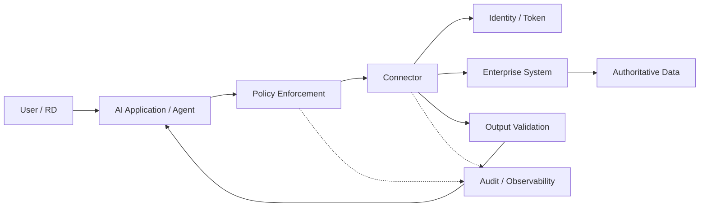
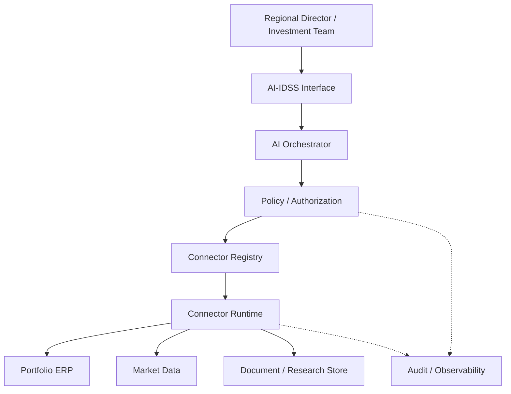

# 25. AI Connectors

> **Advisor question:** How should an AI system be allowed to reach enterprise data and capabilities without turning connectivity into uncontrolled authority?

::: tip FOUNDATION
An **AI connector** is an architectural component that connects an AI application, agent, or orchestration layer to an external data source or capability while translating identity, authorization, data shape, policy, errors, and operational behavior across the boundary.

A connector is therefore more than a URL wrapper. It is a controlled integration boundary.
:::

## 25.1 Connector Is an Architecture Concept, Not a Universal Standard

The term *connector* is used differently across platforms. It may refer to an API adapter, SaaS integration, database adapter, document connector, search connector, tool server, or another integration component.

For this book, the term is architectural rather than product-specific:

> A connector is the component that makes an external capability consumable by the AI system under explicit technical controls.

Do not assume that a product called a connector implements all required security, authorization, audit, or lifecycle controls.

## 25.2 Why AI Needs a Connector Boundary

A conventional application often calls a known API through application code. An agentic AI system may dynamically select among several capabilities based on model output.

That changes the architecture question from:

> Can the application connect to system X?

to:

> Under whose authority can the AI invoke system X, with which inputs, for which operations, against which resources, and with what consequences?

This is consistent with Zero Trust principles that emphasize resource protection and identity-based access rather than implicit trust based on network location. NIST also describes application and service identities as part of granular cloud-native access control. [NIST SP 800-207; NIST SP 800-207A]

## 25.3 Connector vs API vs Tool

| Concept | Primary role | Typical owner | Main question |
|---|---|---|---|
| API | Exposes a system capability through a contract | System/service owner | What capability does the system expose? |
| Connector | Adapts an external capability for controlled AI consumption | AI/integration architecture | How does AI consume it safely and correctly? |
| Tool | Capability exposed to an agent/orchestrator | AI application | What operation may the agent invoke? |
| API gateway | Enforces and manages API traffic/policy | Platform/security | How is API access governed at runtime? |
| Connector registry/catalog | Describes available integrations | AI/platform team | Which connectors exist, for what purpose, and under what controls? |

These components can be implemented together or separately. The architecture should not depend on the naming used by a vendor.

## 25.4 Connector Types

Common architectural categories include:

1. **API connectors** — consume REST, GraphQL, RPC, or other service interfaces.
2. **Database connectors** — access governed query interfaces or databases.
3. **Document/file connectors** — retrieve controlled documents and metadata.
4. **SaaS/application connectors** — connect to enterprise applications.
5. **Search/research connectors** — query approved information services.
6. **Event/webhook connectors** — receive or publish asynchronous events.
7. **Tool-protocol connectors** — expose capabilities through an agent/tool protocol such as MCP.

No connector type is inherently secure or insecure. The security property comes from its identity, authorization, data path, exposed capability, validation, and operational controls.

## 25.5 Capability Exposure, Not Raw Connectivity

A connector should expose the **minimum useful capability**, rather than simply passing through an underlying system.

For example, an investment-analysis agent may need:

```text
get_portfolio_company_financial_summary(company_id, period)
get_debt_maturity_profile(company_id)
search_approved_research(company_id, topic)
```

It may not need:

```text
execute_arbitrary_sql(...)
call_any_http_url(...)
administer_erp(...)
```

::: warning ARCHITECTURE WARNING
Giving an agent unrestricted database or HTTP access because “the model will only use it responsibly” moves a policy decision into a probabilistic component. The surrounding system should constrain what the agent can actually invoke.
:::

OWASP identifies excessive functionality, excessive permissions, and excessive autonomy as common causes of excessive agency in LLM-based applications. [OWASP LLM06:2025]

## 25.6 Identity Must Cross the Connector Boundary

The connector must make the acting identity and authority explicit.

At minimum, the architecture should be able to answer:

- Who initiated the request?
- Which AI application or agent is acting?
- Which connector is acting?
- Which downstream identity is used?
- Is user authority propagated, delegated, or replaced by service authority?
- Which resource is being accessed?
- Which operation is being performed?

A service credential that can read every portfolio company is not equivalent to a user-scoped authorization model merely because the request originated from an authenticated user.

## 25.7 Delegation and Credential Strategy

Possible patterns include:

| Pattern | Advantage | Main risk |
|---|---|---|
| User-delegated access | Closely reflects user authority | Token lifecycle and delegation complexity |
| Service identity | Operationally simple | May create broad privilege |
| Short-lived delegated token | Limits credential exposure | More complex identity infrastructure |
| Per-tenant/per-company identity | Strong isolation potential | Operational overhead |
| Gateway-mediated access | Central policy point | Gateway can become critical dependency |

The correct choice depends on the required authority model. There is no universal “best” connector credential pattern.

## 25.8 Authorization Must Be Enforced Outside the Model

The model can propose a tool call. It should not be the final authority deciding whether the call is permitted.

A useful architecture is:



The connector may participate in policy enforcement, but authorization should be enforced by deterministic system components appropriate to the resource and operation.

## 25.9 Data Minimization at the Connector Boundary

The connector should avoid returning more data than the AI task requires.

Example:

```text
Task: assess refinancing risk

Needed:
- debt maturity dates
- outstanding principal
- interest terms
- covenant status
- relevant cash-flow indicators

Not automatically needed:
- employee records
- unrelated customer PII
- complete ERP database
- unrelated legal documents
```

Data minimization is purpose- and context-dependent. It does not mean “always return the smallest possible payload.” The relevant question is whether the data is necessary for the authorized task and handled for an appropriate purpose.

## 25.10 Semantic Mapping Is Part of the Connector

A connector can be technically successful while producing semantically wrong data.

For financial data, the connector may need to preserve or translate:

- currency
- unit scale
- fiscal period
- accounting basis
- entity identity
- consolidation status
- effective date
- source timestamp
- restatement status
- definition of the metric

`revenue = 100` is not meaningful enough without knowing what “revenue,” “100,” entity, currency, and period mean.

::: tip ADVISOR LENS
When a vendor demonstrates a connector, do not stop at “the data arrived.” Ask: **Did the meaning survive the boundary?**
:::

## 25.11 Input Validation

Connector inputs should be validated before they reach the downstream system.

Controls may include:

- schema validation
- type validation
- enum constraints
- range limits
- resource allowlists
- identifier validation
- URL/domain restrictions
- query complexity limits
- file-size limits
- command/operation allowlists

Natural-language intent should be translated into a constrained machine-readable operation before execution.

## 25.12 Output Validation

Connector output is not automatically trustworthy merely because it came from an internal system or a successful API call.

Validate where appropriate:

- schema
- expected resource identity
- freshness
- completeness
- units
- status codes
- pagination completeness
- source metadata
- authorization scope

The AI layer should not silently treat malformed or incomplete connector output as authoritative evidence.

## 25.13 Tool Discovery and Descriptions

Agent systems often need machine-readable descriptions of available capabilities.

A tool description should make clear:

- what the capability does;
- what inputs are required;
- what outputs are returned;
- what side effects may occur;
- what resources it can access;
- what permissions it requires;
- what errors may occur;
- whether the operation is read-only or state-changing.

Descriptions are useful for model selection and orchestration, but descriptions are not authorization controls.

## 25.14 MCP and Tool Protocols

The Model Context Protocol (MCP) is an example of an open protocol for connecting AI applications to external capabilities. The current July 28, 2026 specification includes a stateless protocol core, tool discovery/calls, authorization hardening, and an extensions framework. [MCP specification release, July 28, 2026]

MCP should therefore be treated as a **protocol option**, not as synonymous with “connector” or “security.” An MCP server can still expose excessive authority or connect to an insecure downstream system.

For architecture review, ask:

> What authority does the protocol transport, and where is that authority actually enforced?

## 25.15 Connector Security Boundary

A connector sits between two trust domains in many enterprise architectures.

Typical boundaries include:

```text
AI / Agent Boundary
        ↓
Connector Runtime
        ↓
Identity / Policy Boundary
        ↓
Enterprise System Boundary
        ↓
Authoritative Data
```

Security review should cover the complete path, not just the connector package.

## 25.16 Secrets and Credential Handling

Connector credentials should not be embedded in prompts, tool descriptions, source code, or model-visible context.

The architecture should define:

- secret storage
- credential issuance
- credential rotation
- expiry
- revocation
- scope
- environment separation
- access logging
- failure behavior

A model should not need to see a downstream credential to use a connector.

## 25.17 Rate Limits and Resource Protection

Connectors can turn model-generated loops into real infrastructure load.

Controls may include:

- per-user limits
- per-agent limits
- per-connector limits
- downstream quotas
- concurrency limits
- timeout budgets
- request-size limits
- pagination limits
- circuit breakers
- bounded retries

This is particularly important when an agent can repeatedly invoke tools based on its own previous outputs.

## 25.18 Retry, Idempotency, and Side Effects

A retry is not harmless if the operation changes state.

For example:

```text
create_payment()
```

should not accidentally create two payments because a timeout caused the connector to retry.

For consequential operations, the architecture should define:

- idempotency semantics
- retryable vs non-retryable errors
- timeout behavior
- duplicate detection
- transaction boundaries
- compensation or recovery
- human approval where appropriate

Read-only and state-changing connectors should therefore be reviewed differently.

## 25.19 Read vs State-Changing Connectors

| Connector capability | Typical risk | Initial AI-IDSS posture |
|---|---|---|
| Read market data | Incorrect/stale information | Allow with validation |
| Read portfolio data | Confidentiality / scope | Strict authorization |
| Search documents | Leakage / poisoning | Authorization + provenance |
| Create analysis artifact | Integrity / audit | Validate + audit |
| Modify ERP data | Integrity / financial impact | Strong authorization + approval |
| Execute payment | Material financial impact | Do not delegate casually; explicit human control |
| Change access rights | Security impact | Separate privileged workflow |

This is an architectural recommendation for AI-IDSS, not a universal rule for every enterprise.

## 25.20 Connector Observability and Audit

A connector should produce enough telemetry to reconstruct important interactions without creating a second uncontrolled data-exfiltration channel.

Useful audit attributes can include:

- timestamp
- actor identity
- AI application/agent identity
- connector identity/version
- target system
- operation
- resource identifier where appropriate
- authorization decision
- outcome
- latency
- error category
- correlation/request ID

Sensitive payloads should not automatically be logged in full.

## 25.21 Connector Lifecycle

Connectors are software dependencies and should have lifecycle controls.


Review should cover:

- ownership
- version
- dependency changes
- permissions
- downstream API changes
- security advisories
- data scope
- usage
- failure history
- deprecation
- exit/replacement plan

## 25.22 Third-Party Connector Due Diligence

A marketplace connector should not receive implicit trust because it is listed in a reputable catalog.

Ask:

1. What data leaves the environment?
2. Where is it processed?
3. Which credentials are required?
4. What permissions are requested?
5. Who operates the connector runtime?
6. What subprocessors are involved?
7. What is logged?
8. How are secrets protected?
9. How are updates delivered?
10. Can the connector be disabled quickly?
11. Can access be revoked independently of the vendor?
12. Can the organization replace it without redesigning the AI architecture?

## 25.23 AI-IDSS Connector Architecture

A defensible reference pattern is:



The connector layer should not become an ungoverned “universal adapter.” Its purpose is to make capabilities usable **and constrained**.

## 25.24 Example: Investment Risk Alert

Suppose AI-IDSS produces:

> **Portfolio Company A — Probability of material deterioration: 68%.**

The connector architecture should make it possible to trace the underlying evidence:

```text
AI-IDSS
  ↓
Risk-analysis workflow
  ↓
Authorized connectors
  ├── ERP connector → margin / cash flow
  ├── debt connector → maturity / refinancing
  ├── market-data connector → demand / pricing indicators
  └── research connector → external evidence
  ↓
Validated evidence
  ↓
Risk model / analytical layer
  ↓
LLM synthesis
  ↓
68% alert + evidence
```

The connector does not establish that 68% is statistically valid. It establishes whether the required evidence can be retrieved correctly, within authority, with traceable provenance.

## 25.25 Common Anti-Patterns

### Anti-pattern 1 — Universal Connector

One connector exposes arbitrary HTTP, SQL, files, and administrative functions.

**Problem:** authority becomes too broad and policy becomes difficult to reason about.

### Anti-pattern 2 — Model-Owned Credentials

Credentials are placed in prompts or model-visible context.

**Problem:** secrets become part of a probabilistic processing path.

### Anti-pattern 3 — Connector Equals Authorization

The organization assumes that installing a connector makes access safe.

**Problem:** connectivity and authorization are different properties.

### Anti-pattern 4 — Full Database Exposure

The agent receives arbitrary SQL access to an enterprise database.

**Problem:** excessive authority, data leakage, expensive queries, and weak semantic boundaries.

### Anti-pattern 5 — Silent Semantic Transformation

The connector changes units, periods, identifiers, or definitions without recording the transformation.

**Problem:** technically successful integration can produce materially misleading evidence.

### Anti-pattern 6 — Blind Retries

All connector errors are retried automatically.

**Problem:** state-changing operations can be duplicated.

### Anti-pattern 7 — Unbounded Logging

Every request and response is stored for debugging.

**Problem:** observability becomes another sensitive-data repository.

### Anti-pattern 8 — Marketplace Trust

A connector is trusted because it comes from an established marketplace.

**Problem:** third-party software still has permissions, dependencies, update paths, and data-handling implications.

## 25.26 Technical Challenge Questions

When Head of AI or a vendor proposes a connector, ask:

1. What exact capability does the connector expose?
2. Is it read-only or state-changing?
3. What identities can invoke it?
4. What downstream permissions does it receive?
5. Is authority user-delegated or service-based?
6. Can authorization be enforced before invocation?
7. What resources can it reach?
8. Can it reach arbitrary URLs, SQL, files, or commands?
9. What data leaves the controlled environment?
10. What data is returned to the model?
11. How are inputs validated?
12. How are outputs validated?
13. What happens when the downstream system is unavailable?
14. What happens if the model calls it repeatedly?
15. Which operations are idempotent?
16. What is logged?
17. Can sensitive payload logging be disabled?
18. How are credentials rotated and revoked?
19. How is the connector versioned?
20. Who owns it operationally?
21. How quickly can it be disabled?
22. What is the exit strategy?
23. What evidence demonstrates that its semantic mapping is correct?
24. What would make us reject this connector?

## 25.27 Architecture Review Checklist

| Area | Review question |
|---|---|
| Capability | Is the exposed capability explicit and minimal? |
| Identity | Can the actor and downstream identity be determined? |
| Authorization | Is access enforced outside the model? |
| Data | Is returned data necessary and appropriately scoped? |
| Semantics | Are definitions, units, periods, and identities preserved? |
| Input | Are parameters constrained and validated? |
| Output | Is connector output validated before becoming AI evidence? |
| Secrets | Are credentials isolated from model context? |
| Reliability | Are timeout, retry, and failure semantics defined? |
| Side effects | Are state-changing operations distinguished from reads? |
| Rate control | Are loops, quotas, and resource consumption bounded? |
| Audit | Can important actions be reconstructed? |
| Security | Are third-party and supply-chain risks assessed? |
| Lifecycle | Is ownership, versioning, update, and retirement defined? |
| Exit | Can the connector be replaced or disabled without architectural lock-in? |

## 25.28 Evidence Discipline

The following distinctions are important:

- **Fact:** NIST Zero Trust guidance treats resources as the protection target and emphasizes identity-based access; NIST SP 800-207A describes application/service identities and policy enforcement components. [NIST SP 800-207; NIST SP 800-207A]
- **Fact:** NIST SP 800-228 provides lifecycle-oriented API security guidance and was updated in March 2026. [NIST SP 800-228 Update 1]
- **Industry evidence:** OWASP identifies excessive agency as a risk arising from excessive functionality, permissions, or autonomy. [OWASP LLM06:2025]
- **Technical evidence:** MCP's July 28, 2026 specification includes protocol-level tool interaction and authorization changes. [MCP specification release, July 28, 2026]
- **Architecture recommendation:** Connector capabilities should be constrained by deterministic policy and authorization controls.
- **Architecture recommendation:** AI-IDSS should separate read-only evidence retrieval from consequential state-changing operations.
- **Inference:** A connector with broader authority increases the potential business impact of an AI failure or manipulation; the exact risk depends on downstream controls and permissions.
- **Assumption:** AI-IDSS will initially operate as a decision-support system rather than an autonomous capital-allocation system.

Evidence does not justify the claim that a connector framework, MCP, API gateway, or marketplace automatically makes an AI system secure.

## 25.29 What Would Change Our Mind?

A connector architecture recommendation should remain falsifiable.

We would reconsider a narrower connector boundary if evidence demonstrated that:

- broader access materially improves the target decision without unacceptable risk;
- downstream authorization independently constrains every operation;
- semantic transformations are formally validated;
- operational limits prevent uncontrolled resource consumption;
- auditability remains sufficient;
- the additional capability is necessary for the use case;
- the resulting architecture is demonstrably simpler or safer than the constrained alternative.

We would reject or redesign the connector if testing demonstrated that model manipulation, compromised connector software, or credential misuse could produce unacceptable disclosure or state-changing impact without an effective control boundary.

## 25.30 Field Rule

> **A connector should expose the smallest capability that can satisfy the AI task, under explicit identity, authorization, data, semantic, operational, audit, and lifecycle controls.**

For the advisor, the key question is not:

> “Does this connector work?”

It is:

> **“What authority does this connector create, what evidence does it expose, and what happens if the AI uses it incorrectly?”**
