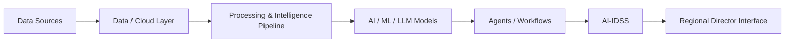
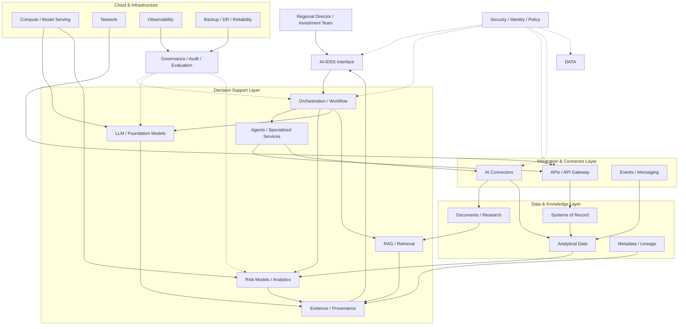
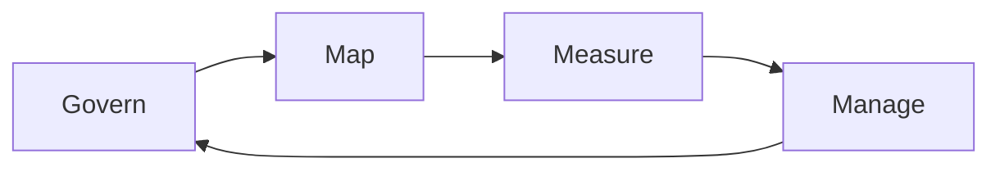
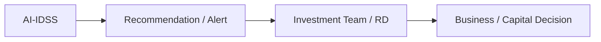
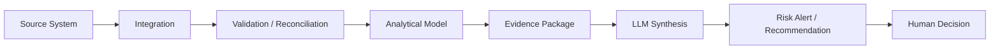

# 26. AI-IDSS Reference Architecture

> **Advisor question:** How do we assemble data, models, retrieval, agents, integration, security, identity, and human decision boundaries into one enterprise system whose outputs can be trusted, challenged, audited, and operated?

::: tip FOUNDATION
An **AI-IDSS (AI Investment Decision Support System)** is not an LLM application with a dashboard attached. It is a socio-technical decision-support system in which authoritative data, analytical methods, AI models, retrieval, orchestration, security, integration, evidence, and human judgment must work together.
:::

The reference architecture in this chapter is deliberately **vendor-neutral**. It defines responsibilities and boundaries first; technologies are selected afterward.

NIST AI RMF 1.0 treats AI systems as socio-technical and emphasizes characteristics including validity/reliability, safety, security/resilience, accountability/transparency, explainability/interpretability, privacy, and fairness, with trade-offs determined by context.

## 26.1 What the Reference Architecture Is — and Is Not

The reference architecture is a reasoning framework for the advisor.

It is:

- a decomposition of the AI-IDSS into architectural responsibilities;
- a map of trust and authority boundaries;
- a basis for evaluating alternatives;
- a checklist for technical due diligence;
- a way to locate failure modes;
- a reference for explaining architecture to the RD.

It is not:

- a mandatory product stack;
- a mandatory cloud provider;
- a claim that every deployment needs every component;
- a prescription to use microservices;
- a prescription to use RAG, agents, vector databases, or a particular LLM;
- a replacement for detailed solution architecture.

## 26.2 The Architecture Spine

The core information and decision flow is:



This is the conceptual spine, not necessarily a literal runtime sequence. Some workflows bypass components, repeat them, or execute them in parallel.

## 26.3 The Full Enterprise Reference Architecture



The diagram contains logical boundaries. A physical deployment may combine or separate these components.

## 26.4 Architectural Layers

| Layer | Primary responsibility | Advisor question |
|---|---|---|
| Decision interface | Present evidence, alerts, recommendations | What does the RD actually need to decide? |
| Orchestration | Coordinate workflows and controls | Who decides which component runs next? |
| Agents/services | Perform bounded reasoning/tasks | What authority does each component have? |
| Models | Predict, classify, summarize, reason | What exactly does the model contribute? |
| Retrieval | Obtain relevant authorized context | Why is this evidence relevant and authorized? |
| Evidence | Preserve provenance and supporting material | Can the recommendation be traced? |
| Integration | Connect systems and capabilities | Did authority and meaning survive the boundary? |
| Data | Store/process authoritative and derived data | Which source is authoritative? |
| Platform | Provide compute/network/reliability | Can the workload operate at required quality and cost? |
| Security/identity | Enforce trust and authority | Who can do what, against which resource? |
| Governance/evaluation | Manage risk, testing, audit, lifecycle | How do we know the system remains acceptable? |

## 26.5 Systems of Record vs AI-Derived Artifacts

A fundamental boundary is:

> **AI should not silently become the system of record.**

Examples:

- ERP remains authoritative for designated financial transactions.
- Approved market-data sources remain authoritative for their supplied market observations.
- Document repositories remain authoritative for controlled source documents.
- A risk model output is an analytical artifact.
- An LLM summary is a derived artifact.
- An AI recommendation is a decision-support artifact.

This does not prevent an AI system from writing back to enterprise systems when explicitly designed and authorized. It means that authority must be deliberate rather than accidental.

## 26.6 Data Sources

Potential AI-IDSS inputs include:

- portfolio-company ERP systems;
- financial statements;
- investment memos;
- approved research databases;
- market data;
- selected enterprise documents;
- operational metrics;
- external intelligence;
- approved communications data.

Each source should have explicit:

- ownership;
- authority level;
- freshness expectation;
- access policy;
- quality controls;
- lineage/provenance;
- retention policy.

More sources do not automatically create better decisions.

## 26.7 Data and Cloud Layer

The data/cloud layer provides controlled storage and processing for both source and derived data.

It may include:

```text
Operational systems
      ↓
Integration / ingestion
      ↓
Validation / reconciliation
      ↓
Analytical / knowledge stores
      ↓
Data products / semantic models
      ↓
AI and analytical consumers
```

The architecture should distinguish:

- authoritative source data;
- analytical copies;
- derived features;
- embeddings;
- cached retrieval results;
- model outputs;
- audit records.

These artifacts may have different security, retention, and deletion requirements.

## 26.8 Processing and Intelligence Pipeline

The processing layer converts raw inputs into usable analytical evidence.

Typical stages:

1. ingest;
2. validate;
3. reconcile;
4. normalize;
5. enrich;
6. calculate features/metrics;
7. detect anomalies;
8. apply analytical models;
9. package evidence;
10. expose results to AI workflows.

This layer is important because an LLM should not be expected to perform every deterministic transformation merely because it can express the result in natural language.

::: warning ARCHITECTURE WARNING
If the organization needs a deterministic calculation, implement and validate the calculation as a deterministic component where practical. Do not delegate arithmetic, authorization, reconciliation, or critical business rules to free-form generation merely for architectural convenience.
:::

## 26.9 Analytical and Risk Models

The analytical layer may contain:

- deterministic rules;
- statistical models;
- machine-learning classifiers;
- forecasting models;
- scoring models;
- anomaly detection;
- scenario analysis;
- optimization models.

Each output should have defined semantics.

For example:

> “Probability of material deterioration: 68%”

requires an answer to:

- What model generated 68%?
- What is the target event?
- Over what time horizon?
- How was the probability calibrated?
- What data was used?
- What was the validation methodology?
- What uncertainty remains?

The LLM should not manufacture these semantics after the fact.

## 26.10 LLM Layer

The LLM can perform tasks such as:

- synthesis;
- question answering over authorized evidence;
- explanation;
- summarization;
- structured extraction;
- workflow planning within constraints;
- comparison of evidence;
- natural-language interface.

The LLM should not automatically own:

- source-of-truth status;
- authorization policy;
- identity decisions;
- financial transaction authority;
- deterministic accounting calculations;
- audit truth;
- final capital-allocation authority.

The appropriate boundary depends on the use case and evidence.

## 26.11 RAG Layer

RAG provides controlled access to relevant knowledge when the model needs information outside its intrinsic model parameters.

A defensible pipeline is:


The retrieval result should not be considered trustworthy solely because it was retrieved. Source authority, access control, freshness, and provenance remain relevant.

## 26.12 Agent and Workflow Layer

Agents are useful when the system must perform bounded multi-step work.

Example:

```text
Risk Alert Workflow
  ↓
Determine required evidence
  ↓
Retrieve authorized financial data
  ↓
Retrieve debt profile
  ↓
Retrieve approved market/research evidence
  ↓
Run risk model
  ↓
Check evidence completeness
  ↓
Ask LLM to synthesize
  ↓
Produce alert
```

The architecture should prefer explicit workflows where the sequence is known and deterministic, and bounded agentic behavior where flexibility adds value.

## 26.13 Orchestration Layer

Orchestration coordinates:

- workflow state;
- model calls;
- retrieval;
- connectors;
- tools;
- retries;
- timeouts;
- approvals;
- policy checks;
- evaluation;
- audit context.

Orchestration is therefore a major control plane.

A common architectural error is to put too much logic inside prompts and too little logic inside explicit orchestration.

## 26.14 Integration and Connector Layer

The integration layer connects AI-IDSS to enterprise systems through controlled interfaces.

The path should be explicit:

```text
AI workflow
    ↓
Policy / authorization
    ↓
Connector / API
    ↓
Enterprise service
    ↓
System of record
```

This allows the organization to control authority without giving the model arbitrary network or database access.

## 26.15 Security and Identity Plane

Security is cross-cutting rather than a single component.

The architecture should enforce:

- human identity;
- workload identity;
- service identity;
- agent identity where required;
- authentication;
- authorization;
- data classification;
- encryption;
- secrets management;
- network controls;
- policy enforcement;
- audit.

The model itself should not be treated as the final authorization boundary.

## 26.16 Governance and Evaluation Plane

Governance and evaluation should span the lifecycle:



NIST AI RMF uses Govern, Map, Measure, and Manage as its four functions. It also emphasizes documented roles, human oversight, third-party component risk, testing before deployment and during operation, and production monitoring.

For AI-IDSS, this means architecture review does not end when production deployment begins.

## 26.17 Observability and Audit

The system should be observable at the level required to reconstruct important decisions.

A useful trace may include:

```text
Request
  ↓
User identity
  ↓
Policy decision
  ↓
Workflow version
  ↓
Data sources queried
  ↓
Connector calls
  ↓
Risk-model version
  ↓
Retrieved evidence
  ↓
LLM/model version
  ↓
Generated recommendation
  ↓
Human action / disposition
```

Not every raw payload needs permanent retention. Auditability should be designed against actual regulatory, security, operational, privacy, and decision-reconstruction requirements.

## 26.18 Reliability Architecture

AI-IDSS reliability must include more than server uptime.

Consider:

- source-system failure;
- stale data;
- missing evidence;
- model/provider outage;
- retrieval failure;
- connector failure;
- workflow failure;
- tool failure;
- corrupted data;
- incorrect model version;
- evaluation failure;
- human escalation failure.

A critical rule is:

> **The system should know when it does not have enough trustworthy evidence to produce a consequential recommendation.**

## 26.19 Degraded Modes

Possible degraded modes include:

| Failure | Possible response |
|---|---|
| LLM unavailable | Show analytical/rule-based results without synthesis |
| Market data stale | Mark alert as stale or suppress affected conclusion |
| RAG unavailable | Do not fabricate evidence; provide limited deterministic output |
| Risk model unavailable | Do not generate its probability |
| Connector unavailable | Show incomplete-evidence state |
| Audit service unavailable | Block consequential workflow if audit is mandatory |
| Identity service unavailable | Deny access rather than silently broaden authority |

Degradation must preserve semantic meaning. A fallback that changes what the output means without telling the user is not a safe fallback.

## 26.20 Decision Boundary: AI vs Human

For an initial AI-IDSS deployment, a useful boundary is:



The AI can generate evidence-based recommendations. The accountable human decides what business or capital action follows.

This is an architecture recommendation for the investment decision-support context, not a universal requirement for all AI systems.

NIST's Generative AI Profile notes that GAI contexts may warrant additional human review, tracking, documentation, and management oversight depending on risks and context.

## 26.21 Trust Boundaries

The architecture should identify at least these boundaries:

```text
External data
   │
   ├── External provider boundary
   │
Enterprise data boundary
   │
   ├── Portfolio-company isolation boundary
   │
AI processing boundary
   │
   ├── Model/provider boundary
   │
Agent/tool boundary
   │
   ├── Enterprise action boundary
   │
Human decision boundary
```

Each boundary needs explicit assumptions and controls.

## 26.22 Portfolio Isolation

Because the use case involves multiple portfolio companies, isolation is a first-class concern.

The architecture should prevent accidental cross-company access through:

- tenant/resource identifiers;
- authorization policies;
- connector scope;
- retrieval filters;
- database permissions;
- separate encryption/key boundaries where justified;
- test cases for cross-tenant leakage;
- audit trails.

A model instruction such as “do not reveal Company A data to Company B” should not be the only control enforcing this rule.

## 26.23 Evidence Chain

A consequential AI-IDSS output should ideally be traceable through an evidence chain:



This does not imply that every output must expose every internal implementation detail to the user. It means the organization should be able to reconstruct the basis of important outputs when required.

## 26.24 AI-IDSS Reference Request Flow

Example request:

> “Should RD initiate an independent review of Portfolio Company A?”

Possible runtime flow:

```text
1. Authenticate RD
2. Determine portfolio scope
3. Load decision policy
4. Identify required evidence
5. Retrieve authorized financial data
6. Validate/reconcile financial data
7. Retrieve debt/refinancing information
8. Retrieve approved market/research evidence
9. Run relevant analytical models
10. Evaluate evidence completeness
11. Retrieve supporting documents where needed
12. Ask LLM to synthesize findings
13. Attach evidence/provenance
14. Apply output policy
15. Present alert and recommendation
16. Record audit trail
17. RD decides action
```

The LLM is one component in the flow, not the entire flow.

## 26.25 Reference Technology Mapping

Only after the architecture is defined should technologies be mapped.

| Capability | Possible technology class | Selection question |
|---|---|---|
| Data ingestion | ETL/ELT/CDC/streaming | What freshness and reliability are required? |
| Analytical storage | Warehouse/lake/lakehouse | What workload and governance are required? |
| Retrieval | Search/vector/hybrid retrieval | What retrieval quality is required? |
| Model | Managed/self-hosted/foundation/specialized | What quality, privacy, cost, latency, and control are required? |
| Orchestration | Workflow engine/application/service | How deterministic is the workflow? |
| Agent tools | APIs/connectors/tool protocol | What authority is required? |
| Identity | Enterprise IAM/workload identity | How is authority enforced? |
| Observability | Logs/metrics/traces/audit | What must be reconstructed? |
| Infrastructure | Cloud/on-prem/hybrid | What constraints and failure domains apply? |

This prevents technology selection from becoming the architecture itself.

## 26.26 Common Architectural Anti-Patterns

### Anti-pattern 1 — LLM-Centric Architecture

Everything is routed through the LLM.

**Problem:** deterministic tasks, policy enforcement, and system integration become unnecessarily probabilistic.

### Anti-pattern 2 — Dashboard as the System

The architecture starts from the RD dashboard rather than the evidence chain.

**Problem:** presentation hides unresolved data, model, and authority problems.

### Anti-pattern 3 — One Giant Agent

One agent can query everything and call every tool.

**Problem:** excessive authority, difficult testing, unclear failure boundaries.

### Anti-pattern 4 — AI as System of Record

AI-generated values silently overwrite authoritative enterprise data.

**Problem:** source authority becomes ambiguous.

### Anti-pattern 5 — Evidence-Free Probability

The UI displays “68%” without defined model semantics or evidence.

**Problem:** numerical precision creates false confidence.

### Anti-pattern 6 — Security Added Later

Identity and authorization are attached after the AI workflow is built.

**Problem:** authority boundaries become difficult to retrofit.

### Anti-pattern 7 — Vendor Stack as Architecture

A vendor's product diagram is accepted as the enterprise architecture.

**Problem:** architectural decisions become implicit product commitments.

## 26.27 Advisor Architecture Review Questions

When reviewing a proposed AI-IDSS, ask:

### Decision
1. What exact decision does the system support?
2. What is the human decision boundary?
3. What would make the system recommendation unacceptable?

### Data
4. Which systems are authoritative?
5. What data is copied or transformed?
6. How is freshness measured?
7. How is portfolio isolation enforced?

### Models
8. Which component produces each analytical conclusion?
9. What does every probability mean?
10. How are models evaluated and versioned?

### LLM/RAG
11. What does the LLM actually contribute?
12. Why is RAG required?
13. How is retrieval authorized?
14. How are unsupported claims detected?

### Agents/connectors
15. What tools can agents invoke?
16. What authority does each tool have?
17. Which operations can change state?
18. How are retries and side effects controlled?

### Security
19. Where are authentication and authorization enforced?
20. Where are secrets stored?
21. What happens if the model is manipulated?

### Reliability
22. What happens when each major dependency fails?
23. Which outputs must be suppressed when evidence is incomplete?
24. What is the recovery strategy?

### Governance
25. What is monitored in production?
26. Who can approve changes?
27. How are incidents and model failures investigated?

### Economics
28. What is the cost per useful decision-support result?
29. What are the major cost drivers?
30. What assumptions make the TCO estimate credible?

### Strategic reversibility
31. Which components create vendor dependency?
32. Can the model/provider be replaced?
33. Can the data architecture survive a model change?
34. Can the connector layer survive an application/vendor change?

## 26.28 Architecture Decision Summary for the RD

The advisor's executive summary should reduce a complex architecture to a few defensible statements:

```text
Decision:
    Approve / Reject / Approve with conditions

Architecture:
    <one-paragraph architecture>

Why:
    <technical rationale>

Critical controls:
    <identity, data, security, reliability, evidence>

Key risks:
    <top 3–5 technical risks>

Dependencies:
    <critical external/vendor/system dependencies>

Reversibility:
    <what can/cannot be replaced>

Evidence:
    <what supports the recommendation>

Uncertainty:
    <what remains unknown>

What would change our mind:
    <specific evidence>
```

## 26.29 Evidence Discipline

The architecture itself contains several different kinds of claims:

- **Fact:** NIST AI RMF 1.0 is a voluntary framework for managing AI risks and describes trustworthiness characteristics and lifecycle-oriented risk management.
- **Fact:** NIST's current AI RMF resources state that AI RMF 1.0 is being revised; the existing framework should therefore be cited with its version rather than treated as permanently final.
- **Fact:** NIST's AI RMF Core calls for documented human oversight, mapping of risks in third-party components, pre-deployment and ongoing testing, and production monitoring.
- **Industry/technical evidence:** NIST monitoring material indicates that post-deployment monitoring is important while practices and terminology remain relatively nascent and fragmented.
- **Architecture recommendation:** AI-IDSS should keep authoritative data separate from AI-derived artifacts.
- **Architecture recommendation:** consequential actions should remain within explicit authority boundaries.
- **Inference:** the credibility of an AI-IDSS recommendation depends on the integrity of the chain from source evidence through processing, models, synthesis, and human decision.
- **Assumption:** the initial AI-IDSS is intended primarily for investment decision support rather than autonomous capital allocation.

The detailed source identities, versions, URLs, evidence boundaries, and confidence assessments are maintained in the chapter evidence review. Confidence should not be used to convert recommendations or inferences into facts.

## 26.30 What Would Change Our Mind?

The reference architecture should evolve if evidence shows that a different decomposition materially improves:

- decision quality;
- security;
- evidence integrity;
- reliability;
- scalability;
- operating cost;
- interoperability;
- reversibility;
- or human decision effectiveness.

For example, we should reconsider the amount of agentic orchestration if deterministic workflows consistently outperform agents for the target workload with lower operational risk. We should reconsider a centralized data architecture if domain-owned data products demonstrably provide better quality, governance, and interoperability. We should reconsider the human decision boundary if the organization establishes a different risk policy with adequate controls and evidence.

## 26.31 Field Rule

> **Architect the AI-IDSS as a decision-support system, not as an LLM application.**

The architecture must preserve a defensible chain:

**Authority → Data → Evidence → Analysis → AI synthesis → Recommendation → Human decision**

The advisor's job is to ensure that every important transition in that chain has an explicit owner, control boundary, failure mode, evidence basis, and reason for existing.
