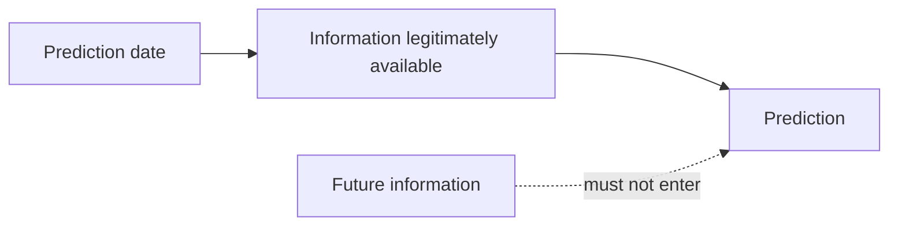
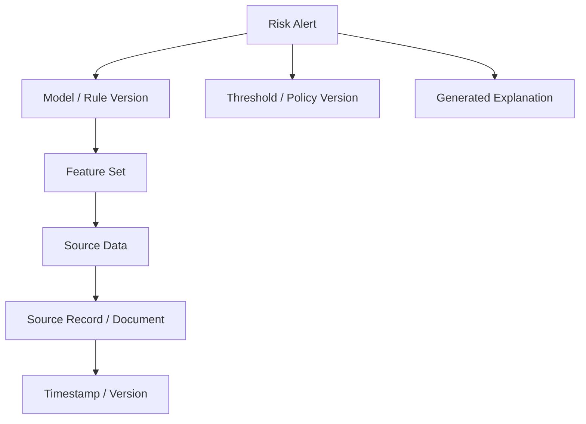
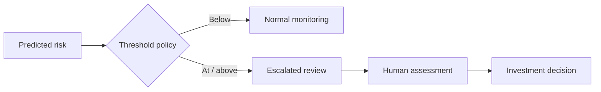
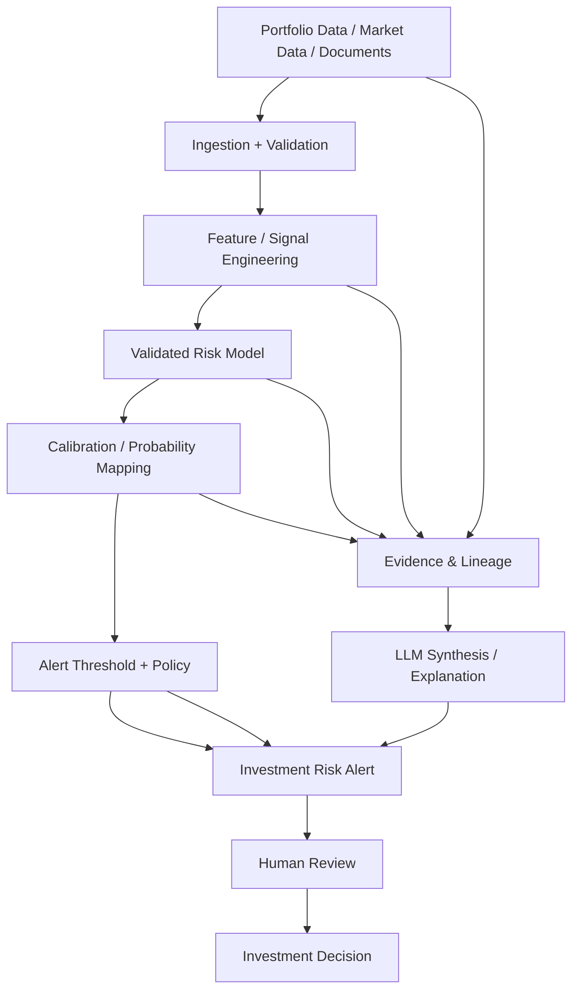

# 27. Investment Risk Alert

> **Advisor question:** When an AI-IDSS says **“Probability of material deterioration: 68%”**, what exactly does that number mean, where did it come from, and what evidence would justify trusting it enough to trigger an investment action?

::: tip FOUNDATION
A risk alert is only as defensible as its **event definition, data, model, calibration, evidence chain, evaluation, and decision policy**. A percentage displayed in a dashboard is not automatically a probability in the statistical sense.
:::

This chapter turns the recurring AI-IDSS example—**“Portfolio Company A — Probability of material deterioration: 68%”**—into an architecture and review discipline.

The central rule is:

> **Never allow a numeric risk score to acquire more authority than the method that produced it.**

NIST AI RMF emphasizes measurement, performance assessment, uncertainty, testing before deployment and regular testing during operation. It therefore supports treating risk outputs as measurable system behavior rather than as self-authenticating conclusions. citeturn0search6turn0search7

## 27.1 The First Question: What Does 68% Mean?

Before discussing the model, ask the simplest question:

> **68% probability of what event, over what horizon, for what population, under what information set?**

A technically meaningful definition could be:

> **P(material deterioration within the next 12 months | information available as of 30 September 2026) = 0.68**

That statement contains several required dimensions:

| Dimension | Required question |
|---|---|
| Event | What counts as “material deterioration”? |
| Horizon | Next 30 days, quarter, 12 months, or another period? |
| Population | Which portfolio companies or comparable entities? |
| Information cutoff | What information was available when the prediction was generated? |
| Prediction target | Binary event, time-to-event, severity, or another outcome? |
| Method | Rule, statistical model, ML model, ensemble, or something else? |
| Calibration | Do predicted probabilities correspond to observed frequencies? |
| Version | Which model, features, code, and policy version produced it? |

If these cannot be answered, **68% should be treated as an unexplained score, not an established probability**.

## 27.2 Define the Event Before Building the Model

“Material deterioration” is a business concept that must be operationalized.

Possible definitions might include:

- EBITDA decline beyond a specified threshold;
- covenant breach;
- liquidity falling below a defined threshold;
- material downgrade in an independently defined risk rating;
- refinancing failure;
- significant impairment;
- combination of predefined indicators.

These are examples, not universal definitions. The organization must select and document the target according to its investment context.

The definition should specify:

### Advisor warning

If the target changes after seeing model results, historical performance metrics can become misleading. The target-definition process should therefore be governed independently from the desire to obtain a favorable model result.

## 27.3 Four Different Things Can Produce “68%”

The architecture review must distinguish at least four cases.

| Source | Meaning of 68% | Main technical concern |
|---|---|---|
| Deterministic rule | A score or rule mapped to a percentage | Percentage may have no probabilistic interpretation |
| Statistical model | Estimated probability under a defined model | Calibration, assumptions, drift, validation |
| ML prediction model | Model-estimated probability | Generalization, calibration, leakage, shift |
| LLM judgment | Model-generated confidence-like statement | Confidence is not automatically calibrated probability |

A fifth case is often appropriate:

| Source | Meaning |
|---|---|
| Ensemble / hybrid | Combination of statistical, ML, rules, expert inputs, and/or LLM synthesis |

The architecture must expose which case applies.

## 27.4 A Rule Is Not Automatically a Probability

Suppose the system says:

> Revenue decline > 10% + margin decline > 300 bps + refinancing within 12 months → 68% risk.

That 68% may simply be a policy score unless it was derived from a validated probabilistic relationship between those conditions and observed outcomes.

The advisor should ask:

- Where did 68% originate?
- Was it estimated from historical outcomes?
- What population was used?
- Was the mapping calibrated?
- Has it been validated out of sample?
- Does it remain valid after the business environment changes?

## 27.5 LLM Confidence Is Not a Statistical Probability

An LLM may produce language such as:

> “I am 68% confident that the company is likely to deteriorate.”

This should **not** be silently represented as:

> P(deterioration) = 0.68

The two statements have different semantics and require different validation.

An LLM can be valuable for:

- extracting evidence from documents;
- synthesizing multiple signals;
- identifying potential drivers;
- generating hypotheses;
- explaining model outputs;
- organizing analyst review.

A separate validated predictive model may be better suited to producing a probability when the business decision genuinely requires one.

## 27.6 Probability Calibration

A predictive model can discriminate between higher- and lower-risk cases while still producing poorly calibrated probabilities.

Conceptually, a model is calibrated when cases assigned approximately 0.68 probability experience the target event at approximately that frequency, within the relevant population and evaluation conditions.

Calibration should therefore be assessed separately from discrimination.

| Property | Question |
|---|---|
| Discrimination | Can the model rank higher-risk cases above lower-risk cases? |
| Calibration | Do predicted probabilities correspond to observed event frequencies? |
| Stability | Does performance remain acceptable across time and relevant segments? |
| Utility | Does using the prediction improve the intended decision? |

Recent empirical work continues to demonstrate that models with different discrimination/performance characteristics can have materially different probability calibration, reinforcing the need to evaluate calibration explicitly when probabilities drive decisions. citeturn0search0turn0search18

### Useful measures

Depending on the use case, evaluation may include:

- calibration plots;
- calibration intercept and slope;
- Brier score;
- expected calibration error or related measures;
- discrimination metrics such as ROC-AUC or PR-AUC;
- sensitivity/specificity at decision thresholds;
- decision-utility or cost-sensitive measures.

No single metric is sufficient for every use case.

## 27.7 Data Leakage Is an Architecture Problem

A model can appear excellent if it receives information that would not actually have been available at prediction time.

Example:

The system therefore needs a temporal information boundary.

Ask:

- Was the feature available at prediction time?
- Did a later financial statement enter the historical feature set?
- Did an analyst's later judgment leak into the training target?
- Did post-event restructuring information enter the input data?
- Were document versions timestamped?

For an investment system, **time-aware lineage is part of model validity**, not merely data engineering hygiene.

## 27.8 Feature and Evidence Lineage

For every material risk prediction, the system should be able to reconstruct the evidence path.

The lineage should distinguish:

- authoritative source data;
- derived analytical features;
- retrieved documents;
- model-derived scores;
- LLM-generated summaries;
- human-entered judgments.

### Architecture warning

An LLM explanation is not automatically evidence. The evidence should be traceable to source records or validated analytical outputs.

## 27.9 Prediction vs Recommendation

The system must keep these concepts separate.

| Layer | Example |
|---|---|
| Observation | Revenue declined 8% YoY |
| Analytical signal | Net leverage increased from 4.1x to 5.0x |
| Prediction | Estimated probability of deterioration = 68% |
| Interpretation | Main drivers are margin compression and refinancing risk |
| Recommendation | Initiate independent portfolio review |
| Decision | RD / investment committee determines action |

A recommendation should not be presented as if it were itself a prediction.

## 27.10 Thresholds Are Decision Policies

Suppose the organization chooses:

> If predicted deterioration risk ≥ 60%, trigger a portfolio review.

The 60% threshold is **not a property of the model**. It is a decision policy.

It should be justified against:

- cost of false positives;
- cost of false negatives;
- review capacity;
- urgency;
- reversibility of intervention;
- investment mandate;
- risk appetite.

This separation prevents the model from silently becoming the decision maker.

## 27.11 False Positives and False Negatives

A risk alert system must explicitly consider both errors.

| Outcome | Meaning |
|---|---|
| True positive | Alerted and deterioration occurred |
| False positive | Alerted but deterioration did not occur |
| True negative | No alert and deterioration did not occur |
| False negative | No alert but deterioration occurred |

The appropriate balance depends on business consequences.

For a highly consequential investment risk, it may be rational to tolerate more false positives to reduce false negatives—but that is a **business and governance decision**, not an automatic property of AI.

## 27.12 Uncertainty Must Be Visible

“68%” can create false precision.

The system should consider displaying additional context where appropriate:

- prediction horizon;
- calibration information;
- confidence or uncertainty interval where statistically meaningful;
- data freshness;
- model version;
- missing-data status;
- major assumptions;
- evidence quality;
- comparison with prior prediction;
- out-of-distribution or drift indicators.

Do not manufacture an uncertainty interval merely to make the interface look scientific. The uncertainty representation must correspond to the underlying method.

## 27.13 Risk Alert Architecture

The LLM is deliberately not placed as the sole source of the probability. It may synthesize evidence and explain a validated analytical result, while the predictive layer remains separately identifiable.

## 27.14 Model and Alert Versioning

A risk alert should be reproducible enough to answer:

> “Why did the system produce this alert on that date?”

Record, as appropriate:

- model identifier/version;
- feature definition version;
- source-data snapshot or references;
- prompt/version if an LLM contributes;
- retrieval configuration if relevant;
- calibration version;
- threshold/policy version;
- software release;
- timestamp;
- actor/service identity.

This creates an auditable **decision-support artifact**, not merely a screenshot of a dashboard.

## 27.15 Monitoring After Deployment

A model can degrade without a software deployment.

Monitor at least the dimensions relevant to the use case:

| Dimension | Example |
|---|---|
| Data drift | Revenue distribution changes materially |
| Concept drift | Historical relationships stop holding |
| Calibration drift | 70% predictions increasingly occur at 50% observed frequency |
| Missingness | Key financial fields become unavailable |
| Coverage | Model is applied to entities outside validated population |
| Alert rate | Alerts suddenly double without corresponding business change |
| Outcome performance | Realized prediction quality deteriorates |
| Operational health | Pipeline latency/failures increase |

NIST's AI RMF measurement guidance explicitly calls for testing before deployment and regularly during operation, including performance assessment and measures of uncertainty. citeturn0search6

## 27.16 Evaluation Design

The evaluation dataset should reflect how the system will actually be used.

At minimum, consider:

1. temporal holdout;
2. out-of-sample evaluation;
3. relevant portfolio/company segments;
4. class imbalance;
5. missing data;
6. changing market conditions;
7. false-positive and false-negative costs;
8. calibration;
9. decision utility;
10. operational failure modes.

For a material investment decision, a single aggregate accuracy number is inadequate evidence.

## 27.17 What If There Is Not Enough Historical Data?

This is a critical architecture decision.

If historical labels are insufficient, alternatives may include:

- deterministic early-warning rules;
- expert-defined indicators;
- statistical models with explicit limitations;
- external benchmark data where legally and semantically appropriate;
- scenario analysis;
- human analyst review;
- staged data collection before claiming calibrated probabilities.

Do **not** solve a lack of evidence by asking an LLM to invent a probability.

The honest output may be:

> **Insufficient evidence to estimate a calibrated probability. Risk indicators are elevated; human review recommended.**

That is often a better architecture than false precision.

## 27.18 AI-IDSS Alert Output Contract

A defensible alert can use a structure such as:

| Field | Example |
|---|---|
| Alert | Investment Risk Alert |
| Entity | Portfolio Company A |
| Event | Material deterioration |
| Horizon | Next 12 months |
| Probability | 68% |
| Model | RiskModel v3.2 |
| Calibration | Validated on defined evaluation period |
| Key drivers | Margin compression; refinancing risk; demand weakness |
| Evidence | Linked source records / analytical features |
| Data freshness | Timestamp shown |
| Policy | Escalation threshold 60% |
| Action | Initiate independent portfolio review |
| Decision owner | Human investment authority |

This output contract makes it difficult for a naked number to masquerade as a complete investment conclusion.

## 27.19 Anti-Patterns

### Anti-pattern 1 — LLM-generated probability

> “The LLM said 68%, therefore the company has 68% risk.”

**Problem:** semantic confidence is treated as calibrated probability.

### Anti-pattern 2 — Score disguised as probability

> “Risk score 68/100” becomes “68% probability.”

**Problem:** ordinal/heuristic score is silently reinterpreted.

### Anti-pattern 3 — Accuracy-only validation

> “The model is 90% accurate.”

**Problem:** accuracy can hide class imbalance, calibration problems, and asymmetric business costs.

### Anti-pattern 4 — Threshold without policy rationale

> “60% sounds like a good alert threshold.”

**Problem:** threshold has no documented relationship to decision cost or risk appetite.

### Anti-pattern 5 — Evidence after the conclusion

> Generate alert first, then ask the LLM to find supporting documents.

**Problem:** encourages post-hoc rationalization and weakens the evidence chain.

### Anti-pattern 6 — No time boundary

> Historical features include information that became known after the prediction date.

**Problem:** leakage produces optimistic evaluation.

### Anti-pattern 7 — Human rubber stamp

> “Human approval” exists only as a button after the AI recommendation.

**Problem:** formal approval does not necessarily create meaningful independent judgment.

## 27.20 Advisor Challenge Questions

### Definition

1. What exactly is the predicted event?
2. What makes the event “material”?
3. What is the prediction horizon?
4. What population was used to define the target?

### Probability

5. Why is 68% a probability rather than a score?
6. How was it estimated?
7. How was it calibrated?
8. What is the evaluation population?
9. What happens in the 60–80% probability range?

### Data

10. What information was available at prediction time?
11. How is temporal leakage prevented?
12. Can every material feature be traced to source data?
13. How fresh is the data?

### Model

14. What model/version produced the result?
15. What baseline was it compared against?
16. What is the out-of-sample performance?
17. How does performance vary by portfolio segment?
18. What happens when the input distribution changes?

### Decision

19. Why is the alert threshold 60%?
20. What is the cost of a false positive?
21. What is the cost of a false negative?
22. Who owns the decision after the alert?
23. Can the human decision maker inspect the underlying evidence?

### Operations

24. How is calibration monitored after deployment?
25. What causes the model to be revalidated or retired?
26. Can the exact alert be reconstructed later?
27. What happens when data is missing or stale?
28. What happens when the model is unavailable?

## 27.21 Advisor Checklist

Before accepting an investment risk alert architecture, verify:

- [ ] Event definition is explicit.
- [ ] Prediction horizon is explicit.
- [ ] “Probability” has a defensible statistical meaning—or is explicitly labeled as a score.
- [ ] Prediction-time information boundary is enforced.
- [ ] Data and feature lineage are available.
- [ ] Model/version is recorded.
- [ ] Out-of-sample evaluation exists.
- [ ] Calibration is evaluated when probability interpretation matters.
- [ ] False-positive/false-negative costs are considered.
- [ ] Alert threshold is a documented decision policy.
- [ ] Evidence is linked to the alert.
- [ ] LLM-generated explanation is distinguishable from authoritative evidence.
- [ ] Human decision authority is explicit.
- [ ] Post-deployment monitoring exists.
- [ ] Failure and insufficient-evidence states are explicit.
- [ ] The alert can be reconstructed and audited.

## 27.22 Executive Recommendation Pattern

For the RD, the recommendation should be concise:

> **The 68% figure should not be accepted as an investment probability until the event definition, prediction horizon, model methodology, temporal data boundary, calibration evidence, and decision threshold are documented and validated. The AI-IDSS should separate the predictive model from LLM-based evidence synthesis and keep final investment action under human authority.**

If the evidence is insufficient:

> **Do not manufacture a probability. Present the observed risk indicators, evidence, uncertainty, and recommended human review instead.**

## 27.23 Evidence Discipline

This chapter distinguishes:

| Claim type | Treatment |
|---|---|
| NIST measurement/testing guidance | **Fact / authoritative guidance** |
| Calibration as a property of probabilistic prediction | **Established technical concept** |
| Brier score/calibration curves as possible evaluation tools | **Technical method; applicability is context-dependent** |
| LLM confidence ≠ calibrated probability | **Architecture/evaluation conclusion; must be validated for the specific system** |
| 60% alert threshold | **Example policy assumption, not a universal standard** |
| Human decision boundary | **Architecture recommendation for this AI-IDSS context** |

NIST AI RMF 1.0 is voluntary and is currently being revised; chapter references should therefore remain version-aware. citeturn0search2turn0search4

## 27.24 Falsifiability

The architecture should state what evidence could change the recommendation.

Examples:

- If an LLM-based probability mechanism demonstrates reliable calibration on a representative, independently evaluated investment-risk dataset, reconsider whether a separate predictive model is necessary.
- If historical data is too sparse to establish calibration, do not claim calibrated probability until sufficient evidence exists.
- If a simpler rule-based model performs equally well and is better auditable, reconsider model complexity.
- If the cost of false negatives materially exceeds false positives, reconsider the alert threshold.
- If post-deployment monitoring shows systematic calibration drift, trigger recalibration or model review.

## 27.25 Field Rule

> **A risk alert is not “68%” until the organization can explain 68%—what event, what horizon, what data, what model, what calibration, what uncertainty, what evidence, what threshold, and what decision follows.**

The advisor's job is not to make the number look sophisticated. It is to ensure the number is **technically meaningful, operationally reproducible, evidence-linked, appropriately uncertain, and subordinate to the human decision authority**.

## Sources

- NIST, *Artificial Intelligence Risk Management Framework (AI RMF 1.0)* — https://doi.org/10.6028/NIST.AI.100-1
- NIST, *AI Risk Management Framework* — https://www.nist.gov/itl/ai-risk-management-framework
- NIST, *AI RMF Core — Measure* — https://airc.nist.gov/airmf-resources/airmf/5-sec-core/
- NIST, *Artificial Intelligence Risk Management Framework: Generative Artificial Intelligence Profile* — https://doi.org/10.6028/NIST.AI.600-1
- Zhang & Li, *Discrimination stability and calibration of cardiovascular risk prediction models in the Framingham baseline cohort*, Scientific Reports (2026) — https://www.nature.com/articles/s41598-026-54869-3
- Deliberato et al., *Developing well-calibrated illness severity scores for decision support in the critically ill*, npj Digital Medicine (2019) — https://www.nature.com/articles/s41746-019-0153-6
