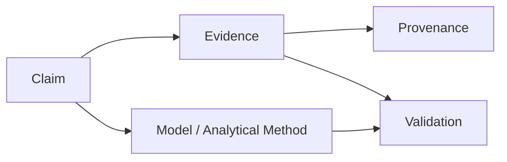
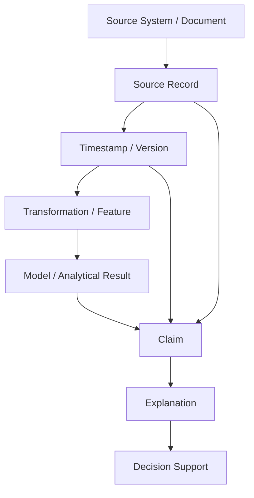
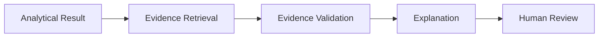
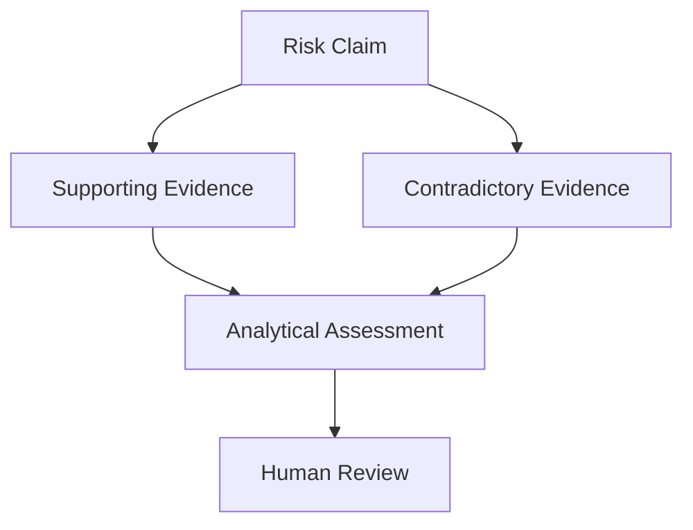
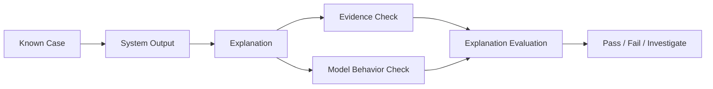
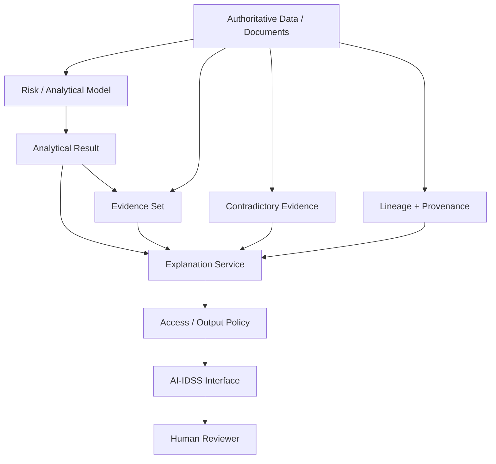

# 28. Explainability & Evidence

> **Advisor question:** When an AI-IDSS says *“Portfolio Company A is at elevated risk because margin compression and refinancing pressure are the primary drivers,”* what is actually an explanation, what is evidence, and how do we know the explanation did not merely rationalize the answer after the fact?

::: tip FOUNDATION
**An explanation is not automatically evidence. Evidence is not automatically causal. Provenance is not automatically accuracy.**

A defensible AI-IDSS must keep these concepts separate and connect them through an auditable evidence chain.
:::

NIST distinguishes transparency, explainability, and interpretability. Its AI RMF also calls for AI models to be explained, validated, documented, and their outputs interpreted in context. NIST's current AI RMF 1.0 is being revised, so this chapter treats the framework as versioned guidance rather than a permanent specification. citeturn0search2turn0search3

## 28.1 Why Explainability Matters to the Advisor

The advisor is not trying to make every model mathematically transparent.

The practical question is:

> **Can the organization understand enough about the system's behavior, evidence, limitations, and decision path to use the output appropriately and challenge it when necessary?**

For an AI-IDSS, explainability supports at least:

- challenge by the RD or investment team;
- debugging and incident investigation;
- model validation;
- audit and governance;
- detection of unsupported conclusions;
- identification of missing or contradictory evidence;
- appropriate human oversight;
- post-deployment monitoring.

NIST specifically notes that explainable systems can support debugging, monitoring, documentation, audit, and governance. citeturn0search2turn0search7

## 28.2 Four Concepts That Must Not Be Collapsed

| Concept | Core question | Example |
|---|---|---|
| Transparency | What happened in the system? | Model v3.2 produced alert A at 09:32 |
| Explainability | How did the system operate or produce the output? | Features X/Y/Z contributed to the prediction |
| Interpretability | What does the output mean in context? | 68% means estimated probability over 12 months |
| Evidence | What observations support the relevant claim? | Audited financial statement, covenant record, market data |

A fifth concept is essential:

| Concept | Core question |
|---|---|
| Provenance | Where did the information or artifact come from, and what transformations occurred? |

These concepts interact, but none substitutes for the others.

## 28.3 Explanation Is Not Evidence

Suppose the AI says:

> “The primary reason for the risk alert is weakening demand.”

That sentence is an **explanation claim**.

It becomes evidence-supported only when the system can point to relevant underlying observations, for example:

- order volume declined;
- customer churn increased;
- management guidance changed;
- external market indicators deteriorated.

The architecture should therefore represent:

The LLM may formulate the explanation, but it should not be allowed to manufacture the evidence.

## 28.4 The Evidence Chain

A useful AI-IDSS evidence chain is:

Each step answers a different question:

| Layer | Question |
|---|---|
| Source | Where did the information originate? |
| Record | What exact observation was used? |
| Time/version | What was known at the time? |
| Transformation | How was the observation changed or aggregated? |
| Model | How did the analytical method use it? |
| Claim | What conclusion is being asserted? |
| Explanation | How is that conclusion communicated? |
| Decision support | What action or review does the output inform? |

This is more defensible than storing only the final LLM response.

## 28.5 Source Authority Must Be Explicit

Not every source has equal authority.

For example:

| Source | Typical role |
|---|---|
| ERP / accounting system | Operational financial record |
| Approved financial statement | Authoritative financial evidence within its scope |
| Market-data provider | External market observation |
| Investment memo | Internal analyst interpretation |
| Email | Potential evidence, but context and authority vary |
| LLM output | Derived artifact, not automatically authoritative evidence |
| Web search result | External information requiring source validation |

The exact hierarchy depends on organizational policy and use case.

### Architecture warning

**Retrieval ranking is not evidence authority.** A document retrieved first by a search system is not necessarily the most authoritative source.

## 28.6 Evidence Quality Dimensions

An evidence object should be evaluated along dimensions relevant to the decision:

- authority;
- provenance;
- freshness;
- completeness;
- consistency;
- independence;
- relevance;
- temporal validity;
- scope;
- access/authorization status.

A highly authoritative document may still be stale. A fresh document may still be unaudited. A relevant document may refer to a different entity.

Therefore:

> **Evidence quality is multidimensional.**

Do not reduce it to a single generic “confidence” score unless the methodology is explicitly defined and validated.

## 28.7 Provenance Is Not Accuracy

Provenance answers where an artifact came from and what happened to it.

It does not prove that the original information was correct.

Example:

> Source: CFO forecast, version 7, retrieved at 10:00.

This gives useful provenance. It does not prove that the forecast was accurate.

The architecture should therefore distinguish:

**provenance → traceability**

from

**validation → evidence quality / correctness assessment**.

This distinction is consistent with the broader evidence discipline used throughout the book.

## 28.8 Lineage Is Not Explainability

Data lineage can show:

> Revenue table → normalized revenue → YoY growth feature → risk model.

That is valuable, but it does not by itself explain why the model assigned a particular probability.

Conversely, an explanation such as:

> “Revenue deterioration was a major contributor.”

does not establish the complete lineage of the revenue data.

For the AI-IDSS:

> **Lineage answers where the information came from. Explainability answers how the system's behavior can be understood.**

## 28.9 Model Explanation vs Output Explanation

These are different requirements.

### Model-level explanation

Answers:

- What type of model is this?
- What inputs does it use?
- What assumptions does it make?
- What population was it validated on?
- What are known limitations?

### Instance-level explanation

Answers:

- Why did this company receive this output?
- Which factors materially contributed?
- What evidence supports those factors?
- What information was missing?

A model can be well documented while an individual alert remains poorly explained, and vice versa.

## 28.10 Intrinsic vs Post-hoc Explanation

Two broad approaches are useful.

| Approach | Description | Advisor consideration |
|---|---|---|
| Intrinsic | Model structure is itself relatively understandable | Often easier to inspect, but may trade off predictive flexibility |
| Post-hoc | Explanation is generated after the model output | Can be useful, but explanation fidelity must be tested |

NIST's AI RMF Playbook recommends considering inherently explainable approaches where appropriate and testing explanation methods for properties including fidelity, consistency, robustness, and interpretability. citeturn0search7

This is a decision trade-off, not a rule that all AI systems should use interpretable models.

## 28.11 The Post-hoc Rationalization Problem

A particularly important risk in generative AI is:

> **The system produces an answer first and then generates a plausible explanation for it.**

A fluent explanation can therefore increase perceived trust without proving that the stated reasoning actually caused the result.

NIST's Generative AI Profile explicitly warns that GAI systems can produce confabulated logic or citations that purport to justify or explain an answer, potentially misleading users. citeturn0search15

Architecture response:

Prefer **evidence-linked explanation** over free-form post-hoc justification.

## 28.12 Evidence Before Explanation

A strong sequence is:

1. establish the analytical result;
2. identify the evidence used by the result;
3. retrieve relevant source records;
4. validate source authority and freshness;
5. generate an explanation constrained by those artifacts;
6. expose citations/provenance;
7. allow the human to inspect the underlying evidence.

This does not eliminate model error. It reduces the architecture's ability to silently convert an unsupported narrative into apparent evidence.

## 28.13 Contradictory Evidence

A trustworthy system should not only find supporting evidence.

It should also detect relevant contradictory evidence where feasible.

Example:

> Risk model: deterioration probability 68%.
>
> Supporting evidence: margin compression and refinancing pressure.
>
> Contradictory evidence: recent contracted revenue growth and completed refinancing.

The correct response is not necessarily to average the evidence. The system should expose the conflict and allow the relevant analytical method or human reviewer to assess it.

A useful architecture is:

## 28.14 Citation Is Not Enough

An AI interface may display citations and still be misleading.

Ask:

- Does the cited source actually support the claim?
- Is the citation attached to the correct statement?
- Is the source current enough?
- Does the source apply to the relevant entity and period?
- Is the citation primary or secondary?
- Did the model infer something stronger than the source says?

Therefore:

> **Citation presence is not citation validity.**

For high-consequence use, citation correctness should itself be evaluated.

## 28.15 Explanation Contract for AI-IDSS

A practical output contract can require:

| Field | Purpose |
|---|---|
| Conclusion | What the system is asserting |
| Method | Which analytical/model layer produced it |
| Probability/score | Numeric output with defined semantics |
| Main drivers | Material factors identified by the model |
| Supporting evidence | Source-linked observations |
| Contradictory evidence | Relevant evidence against the conclusion |
| Data freshness | When supporting data was current |
| Limitations | Known gaps or model constraints |
| Model version | Reproducibility |
| Policy | Threshold or decision rule applied |
| Human owner | Who must assess or authorize action |

This turns “Explain why” into a structured architecture requirement rather than a prompt-writing exercise.

## 28.16 Explanation Quality Tests

Explanation quality should be evaluated separately from model performance.

Useful dimensions include:

| Dimension | Question |
|---|---|
| Fidelity | Does the explanation accurately reflect the relevant model behavior? |
| Completeness | Are important drivers or limitations omitted? |
| Consistency | Do similar cases receive materially consistent explanations? |
| Robustness | Does a small irrelevant change produce an unstable explanation? |
| Evidence support | Can important claims be traced to evidence? |
| Understandability | Can the intended user interpret it correctly? |
| Actionability | Does it help the user decide what to investigate next? |
| Attack resistance | Can inputs manipulate the explanation without changing the underlying evidence? |

No single explanation metric is sufficient for every model or use case.

## 28.17 Explanation Evaluation Is a System Test

Do not evaluate explanations only by asking analysts whether they “look good.”

Test them against controlled cases:

Useful test cases include:

- correct prediction with strong evidence;
- correct prediction with weak evidence;
- incorrect prediction with plausible evidence;
- contradictory evidence;
- missing critical data;
- stale data;
- adversarial documents;
- changed model version;
- changed retrieval results.

## 28.18 Explanation Security

Explanations themselves can become an attack surface.

Potential issues include:

- prompt injection in retrieved documents influencing explanations;
- sensitive information leaking through “why” details;
- revealing internal policy or system prompts;
- exposing data from another portfolio/company;
- manipulated source documents creating persuasive narratives;
- excessive detail allowing users to game risk thresholds.

Therefore explanation output must remain inside the same identity, authorization, data-protection, and threat-model boundaries established in Chapters 19–22.

## 28.19 Human Review Boundary

The purpose of explainability is not to make humans blindly approve AI output.

A useful human review process should enable the reviewer to ask:

1. What is the claim?
2. What evidence supports it?
3. What evidence contradicts it?
4. What method generated it?
5. What assumptions are embedded?
6. What information is missing?
7. What would change the conclusion?
8. Is the conclusion appropriate for the decision at hand?

A human who can only click **Approve / Reject** without inspecting evidence is not necessarily exercising meaningful oversight.

## 28.20 AI-IDSS Explainability Architecture

The important boundary is that the explanation service is **downstream of evidence and analytical results**, not the authoritative source of them.

## 28.21 What the Advisor Should Reject

Reject or challenge designs where:

- the only explanation is an LLM narrative;
- citations are present but never validated;
- the model cannot identify its input data or version;
- explanations are generated independently of the evidence used;
- contradictory evidence is systematically hidden;
- provenance is treated as proof of correctness;
- a risk score is explained using generic business language with no model linkage;
- sensitive evidence is exposed merely because it helps explain the result;
- “human approval” is used as a substitute for meaningful review;
- explanation quality is never tested.

## 28.22 Advisor Challenge Questions

### Claim

1. What exactly is the system claiming?
2. Is the claim observational, predictive, causal, or advisory?
3. What is the confidence/probability semantics?

### Evidence

4. What evidence supports the claim?
5. What evidence contradicts it?
6. Can each material evidence item be traced to its source?
7. What is the source authority?
8. Was the information available at prediction time?

### Explanation

9. Is this an explanation of model behavior or merely a plausible narrative?
10. Was the explanation generated before or after the result?
11. Has explanation fidelity been evaluated?
12. Can a small irrelevant input change produce an unstable explanation?

### Governance

13. Which model/version produced the result?
14. Which policy and threshold were applied?
15. Who owns the human decision?
16. What information is deliberately withheld for security/privacy reasons?

### Failure

17. What happens when evidence is missing?
18. What happens when sources contradict each other?
19. What happens when the model is outside its validated population?
20. How is explanation quality monitored after deployment?

## 28.23 Advisor Checklist

Before approving an AI-IDSS explanation layer, verify:

- [ ] claim semantics are explicit;
- [ ] evidence is distinguished from explanation;
- [ ] provenance is recorded;
- [ ] source authority is represented;
- [ ] model/version is identifiable;
- [ ] prediction-time information boundary is preserved;
- [ ] supporting evidence is traceable;
- [ ] contradictory evidence is considered where relevant;
- [ ] citation correctness is tested;
- [ ] explanation fidelity is evaluated;
- [ ] explanation security is covered;
- [ ] access controls apply to evidence and explanations;
- [ ] limitations are visible;
- [ ] human review can inspect underlying evidence;
- [ ] audit artifacts are retained according to policy.

## 28.24 Evidence Discipline

The following classifications should be maintained:

| Statement | Classification |
|---|---|
| NIST defines explainability and interpretability as distinct but related characteristics | **Fact / Framework** |
| An explanation can be generated post-hoc | **Technical concept** |
| Post-hoc explanation is always faithful to model behavior | **Unsupported universal claim — reject** |
| Evidence-linked explanations are preferable for consequential AI-IDSS use | **Architecture recommendation** |
| Every AI-IDSS must expose feature importance | **Unsupported universal claim — reject** |
| A citation proves the cited claim | **False universal claim — reject** |

NIST's current guidance explicitly recommends testing explanation methods for fidelity, consistency, robustness, and interpretability rather than assuming explanations are inherently reliable. citeturn0search7

## 28.25 Falsifiability

A strong explainability architecture should make itself testable.

Examples:

- **Claim:** explanations accurately represent model behavior.
  - Test: compare explanation against controlled perturbations and known model behavior.
- **Claim:** evidence supports the alert.
  - Test: independent reviewer verifies sampled evidence-to-claim mappings.
- **Claim:** explanations remain stable.
  - Test: run semantically equivalent cases and measure material explanation changes.
- **Claim:** citations are valid.
  - Test: evaluate whether cited sources actually entail or materially support the associated claim.
- **Claim:** humans understand the output.
  - Test: conduct structured user evaluation with representative reviewers.

If the claim cannot be tested, it should not be presented as established evidence.

## 28.26 Field Rule

> **Do not ask only, “Can the AI explain itself?”**
>
> Ask:
>
> **“Can we independently reconstruct the claim, trace its evidence, understand the method that produced it, inspect contradictory information, and determine what would make us change our mind?”**

That is the standard an AI-IDSS should meet before its explanation is allowed to influence a consequential investment decision.

## Sources

- NIST, *Artificial Intelligence Risk Management Framework 1.0* — https://doi.org/10.6028/NIST.AI.100-1
- NIST, *AI RMF Core / Explainable and Interpretable* — https://airc.nist.gov/airmf-resources/airmf/3-sec-characteristics/
- NIST, *AI RMF Core* — https://airc.nist.gov/airmf-resources/airmf/5-sec-core/
- NIST, *AI RMF Playbook — Measure 2.9* — https://airc.nist.gov/airmf-resources/playbook/measure/
- NIST, *AI RMF Generative AI Profile (AI 600-1)* — https://doi.org/10.6028/NIST.AI.600-1

> **Version note:** NIST states that AI RMF 1.0 is being revised. Re-check the current framework and related guidance during final book-wide audit and whenever this chapter is materially reused.
