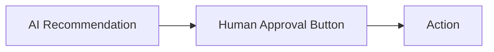
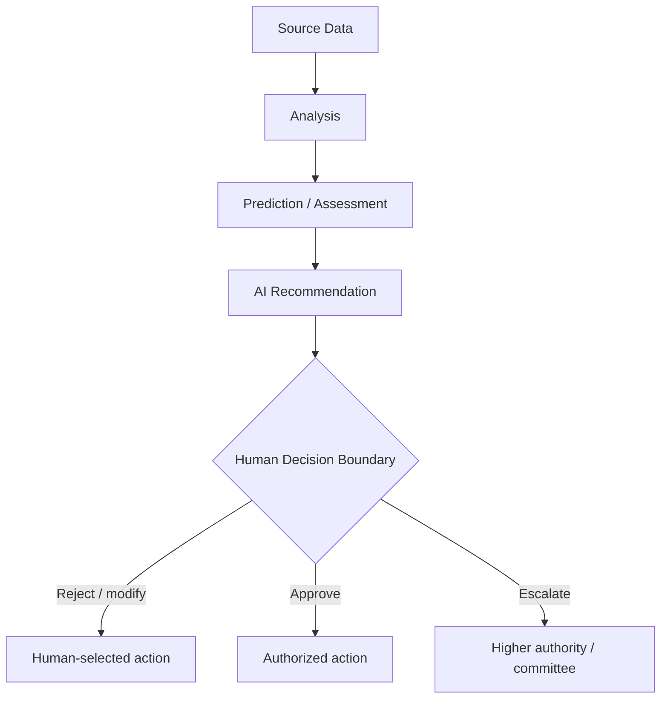
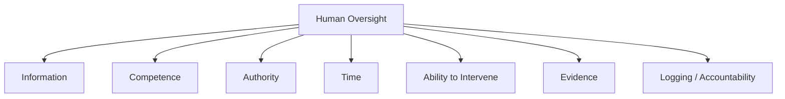
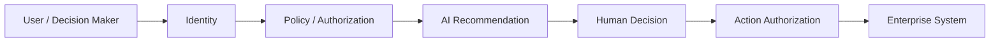
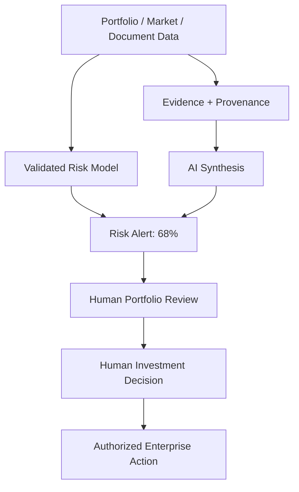
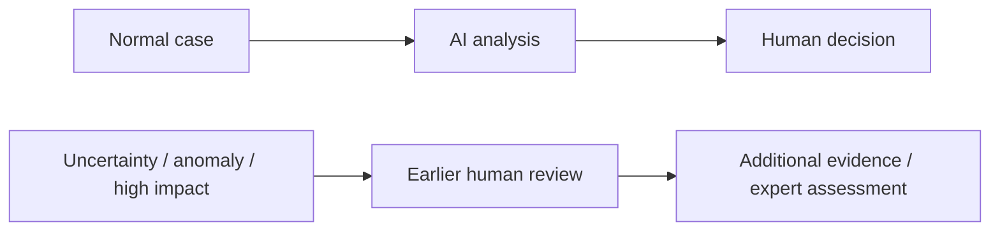
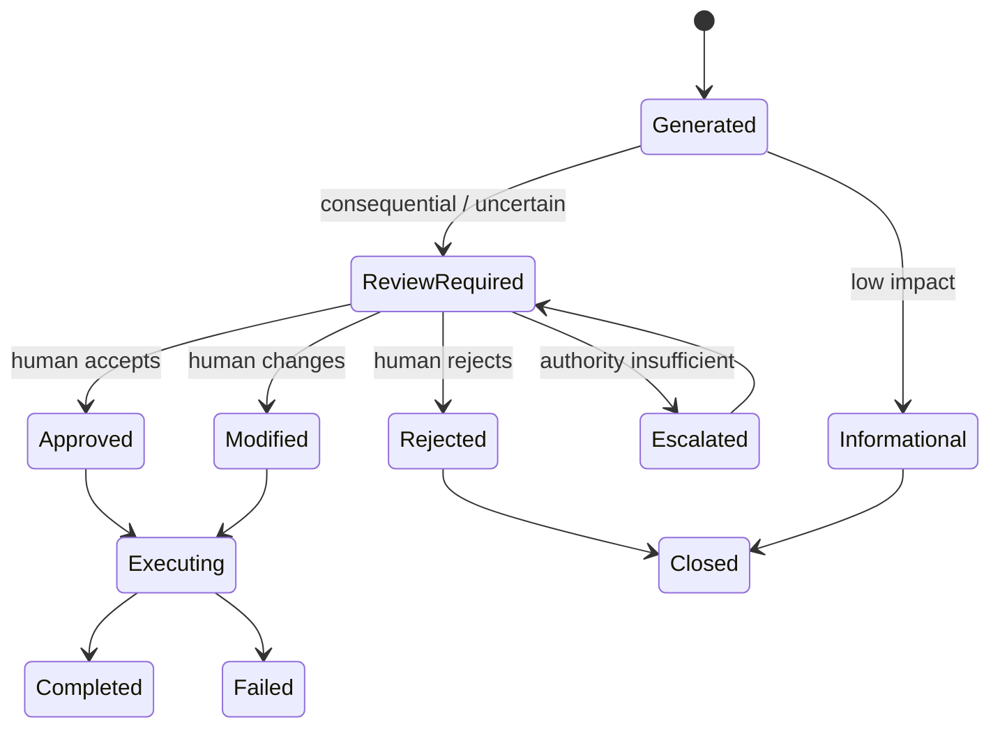
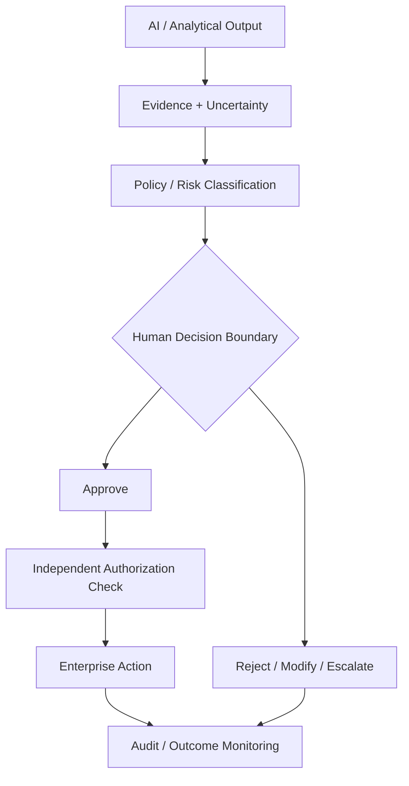

# 29. Human Decision Boundary

> **Advisor question:** At what point must the AI stop, what must a human independently decide, and how do we know that the human role is real rather than a ceremonial approval step?

::: tip FOUNDATION
**Human-in-the-loop is not a control merely because a human is present.** A defensible human decision boundary specifies authority, information, timing, competence, intervention rights, escalation conditions, and accountability.
:::

The purpose of this chapter is to define the boundary between **AI-generated analysis/recommendation** and **human-authorized decision** in an AI-IDSS.

The central rule is:

> **AI may inform, prioritize, analyze, simulate, and recommend; the organization must explicitly define which decisions AI is authorized to make, which require human judgment, and what evidence makes that boundary defensible.**

NIST AI RMF 1.0 explicitly recognizes a spectrum of human-AI configurations, from fully manual to autonomous, and emphasizes defining and differentiating human roles and responsibilities. It also notes that human-AI interaction can produce different outcomes depending on context. The AI RMF 1.0 is currently being revised, so this chapter treats it as the current framework baseline rather than a permanent specification.

## 29.1 Why “Human-in-the-Loop” Is Too Vague

Consider this workflow:



It looks controlled. It may not be.

The advisor should ask:

- Does the human have enough information to challenge the recommendation?
- Does the human have authority to reject it?
- Is there enough time to review it?
- Is the human trained for the task?
- Can the human inspect evidence and uncertainty?
- Is disagreement recorded?
- Does the system make rejection operationally difficult?
- Is the human accountable for the decision, or merely absorbing responsibility for an automated process?

A nominal approval step can become a **rubber stamp**.

NIST specifically calls for defined and differentiated human roles and responsibilities, documented oversight processes, and evaluation of oversight practices. Research also warns that merely requiring human oversight does not guarantee effective oversight.

## 29.2 The Decision Boundary

The decision boundary is the explicit point at which responsibility and authority move from computational processing to human judgment.



The boundary should answer six questions:

| Question | Required definition |
|---|---|
| What? | Which decision or action is being transferred to a human? |
| Who? | Which role has decision authority? |
| When? | At what point must human review occur? |
| With what? | What evidence, uncertainty, alternatives, and constraints are presented? |
| Can they? | Can the human actually reject, modify, defer, or escalate? |
| What happens? | What system behavior follows each decision? |

## 29.3 Not Every AI Function Needs the Same Boundary

A common architectural mistake is to treat all AI outputs as equally consequential.

A useful classification is:

| AI function | Typical boundary | Example |
|---|---|---|
| Low-impact assistance | Human may review opportunistically | Drafting meeting notes |
| Analytical support | Human validates material findings | Summarizing portfolio performance |
| Risk alert | Human investigates before action | 68% deterioration alert |
| Decision recommendation | Human explicitly accepts/rejects | Recommend portfolio review |
| Consequential action | Human authorization before execution | Change investment exposure |
| Autonomous operational action | Explicitly approved within bounded policy | Routine data refresh |

These are architectural examples, not universal regulatory classifications. The organization must determine the boundary from context, consequences, reversibility, risk tolerance, and authority.

## 29.4 Decision Authority Is Different From Model Ownership

Three roles should not be silently collapsed:

| Role | Responsibility |
|---|---|
| Model owner | Performance, lifecycle, validation, monitoring |
| System operator | Operational execution and incident response |
| Decision authority | Human authority to accept, reject, modify, or escalate a consequential recommendation |

A CTO, Head of AI, data scientist, portfolio manager, and Regional Director may have different responsibilities.

For an AI-IDSS, the architecture should not infer decision authority from technical access rights.

> **The person who can operate the system is not necessarily the person authorized to make the business decision.**

## 29.5 Human Oversight Must Be Designed as a Capability

Human oversight requires more than a UI control.



If one of these is missing, the oversight mechanism may be materially weakened.

### Information
The reviewer needs enough context to understand what the AI did and what it did not do.

### Competence
The reviewer needs sufficient domain and system understanding to challenge the output.

### Authority
The reviewer must have actual authority to reject or alter the recommendation.

### Time
The review must happen before the decision becomes irreversible or operationally committed.

### Intervention
The system must provide a practical mechanism to stop, modify, defer, or escalate.

### Evidence
The reviewer needs access to underlying evidence, not merely an AI-generated explanation.

### Accountability
The decision and rationale should be recorded at an appropriate level.

## 29.6 AI Should Not Define Its Own Authority

An LLM should not be the component that determines whether it is authorized to execute a consequential action.

For example:

```text
LLM: "This transaction appears safe, so I will execute it."
```

is not an adequate authorization architecture.

Instead:



Authorization must be enforced by deterministic system controls outside the model. The human decision boundary therefore complements, rather than replaces, identity and authorization architecture from Chapters 19–25.

## 29.7 Recommendation Is Not Authorization

The following are distinct:

| Layer | Example |
|---|---|
| Evidence | Revenue decline, refinancing maturity, customer concentration |
| Analysis | Risk model estimates elevated deterioration risk |
| Recommendation | Initiate independent portfolio review |
| Human decision | RD approves initiation of review |
| Authorization | System permits creation of the authorized workflow |
| Execution | Workflow executes |

A recommendation should never implicitly acquire execution authority merely because an agent generated it.

## 29.8 Meaningful Override

A meaningful human override requires both **permission and practical ability**.

Ask:

1. Can the human reject the recommendation?
2. Can the human modify the proposed action?
3. Can the human request more evidence?
4. Can the human defer the decision?
5. Can the human escalate?
6. Does the system continue automatically if the human does nothing?
7. Is the default behavior safe for the defined context?

The seventh question is particularly important.

If “no response” automatically triggers the AI recommendation, the nominal human boundary may be weaker than it appears.

## 29.9 Human Override Should Be Measured

Do not assume that a human approval mechanism works.

Measure relevant signals such as:

- acceptance rate;
- rejection rate;
- modification rate;
- escalation rate;
- time to review;
- frequency of overrides by scenario;
- reasons for overrides;
- outcome after override;
- outcome after acceptance;
- cases where the reviewer lacked sufficient evidence;
- cases where the system prevented meaningful intervention.

NIST AI RMF 1.0 specifically identifies the frequency and rationale of human overrides as potentially useful information for evaluating human-AI configurations.

> **If 99.9% of AI recommendations are always approved, do not automatically conclude that the AI is excellent. The review process may instead be ineffective.**

The 99.9% figure is illustrative, not an empirical claim.

## 29.10 Automation Bias and Over-Trust

Humans can over-rely on automated recommendations. This creates a paradox:

> The better the AI appears to perform, the easier it may become for users to stop challenging it.

Research on automation bias and human-AI collaboration identifies over-reliance as a significant concern in high-stakes settings. The practical architecture implication is that human oversight should be designed around **calibrated trust**, not maximum trust.

Useful controls may include:

- displaying uncertainty;
- exposing contradictory evidence;
- separating evidence from recommendation;
- requiring explicit reasoning for high-impact overrides;
- periodic blind or independent review;
- monitoring acceptance/override patterns;
- training reviewers on known failure modes.

These are design recommendations, not guarantees against automation bias.

## 29.11 The Human Should Not Become the “Moral Crumple Zone”

A human can be formally responsible while having little practical control over the system.

The concept of a **moral crumple zone**, introduced by Madeleine Clare Elish, describes situations where responsibility can be misattributed to a nearby human operator even when control is distributed across a complex automated system.

For an enterprise AI architecture, this means:

> Do not place a human at the end of an automated chain merely so the organization can say “a human approved it.”

Instead, responsibility, authority, system capability, and intervention rights should be aligned.

## 29.12 Human Decision Boundary for the AI-IDSS

For the investment-risk example:



The architecture deliberately places the human decision boundary **after analytical synthesis but before consequential investment action**.

This is an architecture recommendation for the reference AI-IDSS, not a claim that every investment workflow must use exactly this boundary.

## 29.13 When Should the Boundary Move Earlier?

Move human review earlier when:

- data quality is uncertain;
- the model is outside validated scope;
- uncertainty is unusually high;
- evidence is contradictory;
- the action is difficult to reverse;
- consequences are material;
- model monitoring detects degradation;
- the system encounters an unfamiliar entity or scenario;
- authorization context is ambiguous;
- security controls are degraded.



## 29.14 When Can Automation Expand?

Automation can potentially expand when evidence demonstrates that:

- the task is well-defined;
- consequences are bounded;
- the model is validated for the relevant population;
- performance is monitored;
- failure modes are understood;
- authorization is explicit;
- actions are reversible or recoverable where appropriate;
- human escalation remains available;
- operational evidence supports the configuration.

The key principle is:

> **Automation should be earned through evidence, not assumed because the model appears capable.**

## 29.15 Decision Boundary as a State Machine

A robust AI-IDSS can model decision states explicitly:



This is preferable to representing the entire workflow as a single Boolean field such as `approved=true`.

## 29.16 Fail-Safe vs Fail-Open Behavior

The system should define what happens when human review cannot occur.

Examples:

| Condition | Possible policy |
|---|---|
| Reviewer unavailable | Hold action |
| Evidence unavailable | Downgrade to informational status |
| Model out of scope | Require expert review |
| Authorization service unavailable | Deny consequential action |
| Monitoring degraded | Restrict automation |
| Human deadline expires | Escalate rather than silently execute |

The correct behavior is context-dependent.

The advisor should reject undocumented defaults for consequential workflows.

## 29.17 Human Review Is Also a System Dependency

Human review introduces operational constraints:

- reviewer capacity;
- queue size;
- response time;
- fatigue;
- expertise availability;
- shift coverage;
- escalation paths.

Therefore:

> **A human decision boundary is also a capacity and reliability problem.**

If an AI system generates 10,000 alerts per day but the responsible team can review only 100, the nominal human-in-the-loop design is not operationally credible.

The architecture must therefore connect Chapter 17 scalability and Chapter 18 reliability with human review capacity.

## 29.18 Evidence Required to Change the Boundary

A proposed change from:

> AI recommends → human decides

to:

> AI decides automatically

should require evidence.

A useful decision package includes:

| Evidence | Question |
|---|---|
| Performance | Does the system perform reliably on the intended population? |
| Calibration | Are probabilistic outputs meaningful? |
| Robustness | What happens under abnormal inputs? |
| Coverage | Where does performance degrade? |
| Monitoring | Can degradation be detected? |
| Recovery | Can failures be reversed or contained? |
| Authorization | Is action authority independently enforced? |
| Human factors | Does the proposed configuration improve rather than weaken outcomes? |
| Operational capacity | Can exceptions be handled? |
| Auditability | Can decisions be reconstructed? |

## 29.19 Advisor Challenge Questions

### Authority

1. Who has final decision authority?
2. Is that authority represented explicitly in the system?
3. Can the human reject the AI recommendation?
4. Can the human modify it?
5. Can the human escalate it?

### Information

6. What evidence is shown before approval?
7. Can contradictory evidence be inspected?
8. Is uncertainty visible?
9. Is data freshness visible?
10. Can the reviewer reconstruct the AI output?

### Timing

11. Does human review occur before consequential action?
12. What happens if the reviewer does not respond?
13. What happens when the reviewer is unavailable?

### Human factors

14. What training does the reviewer receive?
15. How is automation bias assessed?
16. Are reviewers sufficiently independent to challenge the recommendation?
17. Is workload small enough for meaningful review?

### Architecture

18. Which component actually enforces authorization?
19. Can an LLM or agent bypass the decision boundary?
20. Are read and state-changing tools separated?
21. Are high-impact actions explicitly gated?
22. Is the human boundary represented as a state transition rather than a UI button?

### Evidence

23. What evidence justifies the current human-AI configuration?
24. What evidence would justify more automation?
25. What evidence would force us to move the boundary earlier?

## 29.20 Anti-Patterns

### Anti-pattern 1 — Human approval button

Human approval exists only as a final UI click.

**Problem:** formal oversight without meaningful control.

### Anti-pattern 2 — Silent default execution

No human response causes automatic execution.

**Problem:** the real system is effectively autonomous.

### Anti-pattern 3 — Human without authority

A reviewer can comment but cannot reject or modify the action.

**Problem:** review is advisory theatre.

### Anti-pattern 4 — Human without evidence

Reviewer sees only “AI recommends: approve.”

**Problem:** insufficient basis for independent judgment.

### Anti-pattern 5 — Human overload

The system generates more decisions than reviewers can realistically inspect.

**Problem:** oversight degrades into sampling or rubber stamping.

### Anti-pattern 6 — Responsibility without control

The organization assigns final accountability to a human who cannot realistically understand or intervene in the system.

**Problem:** risk is transferred to the operator without corresponding authority.

### Anti-pattern 7 — AI-defined authorization

The model decides whether its own proposed action is permitted.

**Problem:** probabilistic generation becomes an authorization boundary.

## 29.21 Reference Control Pattern

For consequential AI-IDSS decisions:



This separates:

**analysis → evidence → policy → human judgment → authorization → execution → monitoring**.

That separation is the architectural objective.

## 29.22 Field Rule

The advisor should be able to answer this sentence for every consequential AI workflow:

> **“AI is allowed to do X; it must stop before Y; role Z has authority to decide; the reviewer receives A/B/C evidence; the system enforces D; and if the boundary cannot be satisfied, the workflow does E.”**

If this sentence cannot be completed, the human decision boundary is probably underspecified.

## 29.23 Evidence Discipline

The following distinctions should remain explicit:

| Statement | Classification |
|---|---|
| NIST AI RMF defines human-AI configurations and calls for differentiated roles | Fact / framework evidence |
| Human oversight can be ineffective if poorly designed | Evidence-supported inference |
| Human approval should occur before consequential investment action in this reference architecture | Architecture recommendation |
| Every AI system must have a human-in-the-loop | Unsupported universal claim — reject |
| More human oversight always improves safety | Unsupported universal claim — reject |
| Human review eliminates automation bias | Unsupported universal claim — reject |
| 60% risk should trigger human review | Illustrative policy assumption |

## 29.24 Falsifiability

The architecture recommendation should be revisited if evidence shows that:

- a different human-AI configuration produces better outcomes under equivalent risk;
- human review consistently fails to detect relevant AI errors;
- automation can be demonstrated to operate within defined risk tolerance with reliable monitoring and recovery;
- the cost of human review materially exceeds its measured benefit;
- new evidence changes the organization's legal, regulatory, or fiduciary obligations;
- the decision context changes.

The objective is not to preserve human involvement for its own sake.

> **The objective is to establish the safest, most accountable, technically defensible allocation of authority between humans and machines for the actual decision context.**

## 29.25 Advisor Checklist

Before approving an AI-IDSS workflow, verify:

- [ ] Decision authority is explicitly defined.
- [ ] AI authority is explicitly bounded.
- [ ] Human role is more than ceremonial approval.
- [ ] Reviewer has sufficient evidence.
- [ ] Reviewer can challenge and reject.
- [ ] Reviewer can modify or escalate where required.
- [ ] Authorization is enforced outside the model.
- [ ] Consequential actions have explicit gates.
- [ ] Failure-to-review behavior is defined.
- [ ] Reviewer capacity is realistic.
- [ ] Automation-bias risks are considered.
- [ ] Overrides and outcomes are logged.
- [ ] Human-AI configuration is evaluated periodically.
- [ ] The evidence supporting the boundary is documented.
- [ ] Conditions for expanding or shrinking automation are defined.

## 29.26 Executive Recommendation Summary

For the reference AI-IDSS:

1. **AI should primarily provide analysis, evidence synthesis, prediction, prioritization, and recommendations.**
2. **Consequential investment decisions should remain explicitly assigned to authorized human decision makers unless a different configuration is justified by evidence and governance.**
3. **Human oversight must be operationally meaningful: authority, evidence, competence, timing, intervention, and accountability must all exist.**
4. **Authorization must remain outside the probabilistic model or LLM.**
5. **Human-AI configuration should be measured and periodically re-evaluated rather than assumed to work.**
6. **Automation should expand only when evidence demonstrates that the resulting configuration remains within defined risk tolerance.**

This creates a clear architectural boundary:

> **AI can increase the quality and speed of decision preparation; it does not automatically acquire the authority to make the decision.**
