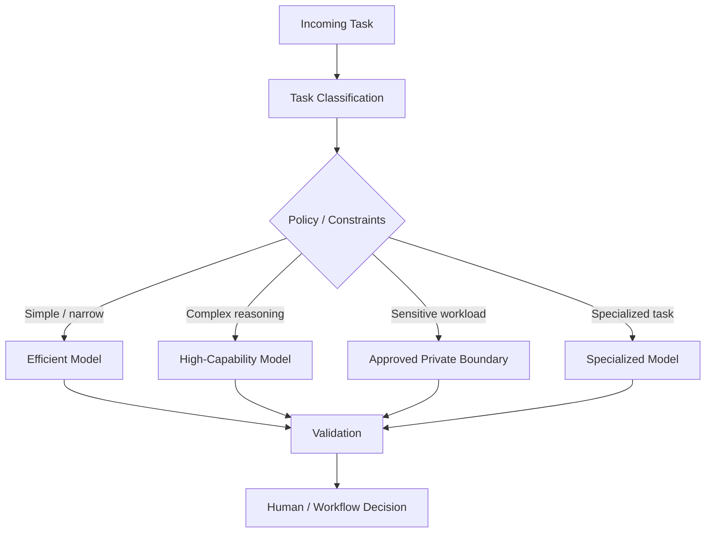

# Chapter 30 — Model Selection

> **Advisor question:** Which model should we choose, and what evidence justifies the choice **now**?

## FOUNDATION

Model selection is an **architecture and sourcing decision**, not a permanent benchmark contest.

The correct question is not:

> Which model is the best?

It is:

> Which model, endpoint, or model portfolio is sufficiently capable for the defined workload while satisfying the required quality, risk, latency, reliability, data-boundary, operational, cost, and dependency constraints?

A useful decision frame is:

**Capability × Workload × Risk × Latency × Cost × Data Boundary × Reliability × Dependency × Business Value**

The final term matters. A technically superior model is not necessarily the economically superior system.

**ARCHITECTURE WARNING**

> **A model comparison is a dated observation, not a permanent ranking.**

Frontier-model capability is advancing quickly enough that some benchmarks can become saturated or less discriminating within months. Stanford's 2026 AI Index reports that difficult evaluations can saturate rapidly and that leading models have converged on several broad capability measures. It also notes that competitive pressure is increasingly shifting toward cost, reliability, and domain-specific performance. urlStanford AI Index 2026 — Technical Performancehttps://hai.stanford.edu/ai-index/2026-ai-index-report/technical-performance

Therefore this chapter deliberately separates **durable selection principles** from **time-sensitive model comparisons**.

---

## 30.1 Start With the Task, Not the Model

Before comparing models, define the workload.

| Question | Example |
|---|---|
| What task? | extract covenant terms |
| Input | PDF + structured financial data |
| Output | validated JSON |
| Required quality | ≥ 98% field-level accuracy on critical fields |
| Context | up to 100 pages / document |
| Latency | p95 < 8 seconds |
| Volume | 50,000 documents/month |
| Data class | confidential investment information |
| Failure impact | analyst rework / potential investment error |
| Human review | required for critical exceptions |
| Availability | business-hours decision support |
| Deployment boundary | approved enterprise AI boundary |

If the workload is undefined, model selection is premature.

---

## 30.2 Choose the Technology Class Before the Model

A common architectural error is assuming every AI problem requires a general-purpose LLM.

First compare the solution classes:

| Problem | Candidate technology |
|---|---|
| Deterministic policy | Rules / decision engine |
| Exact lookup | Database / search |
| Ranking | Information retrieval / learning-to-rank |
| Numeric prediction | Statistical / ML model |
| Classification | Classical ML / neural model / LLM |
| Document extraction | Parser / OCR / ML / LLM |
| Semantic retrieval | Embedding + search |
| Summarization | LLM / specialized model |
| Complex language synthesis | LLM |
| Image understanding | Vision / multimodal model |
| Speech recognition | ASR model |
| Workflow coordination | Orchestrator + tools; model only where reasoning/language is required |

**Advisor rule:** If a narrower technology satisfies the requirement with lower risk and complexity, do not introduce a more general model merely because it is fashionable.

---

## 30.3 Decompose the Required Capability

“Reasoning capability” is too vague for architecture review.

Break the workload into measurable capabilities:

- instruction following
- extraction
- classification
- summarization
- retrieval/use of supplied context
- multi-step reasoning
- numerical reasoning
- coding
- structured output
- tool calling
- long-context processing
- multilingual understanding
- multimodal understanding
- domain terminology
- refusal/safety behavior
- consistency
- calibration, where probabilistic outputs are required

A model can be strong in one dimension and weak in another. Public evaluation frameworks therefore use multiple dimensions rather than a single universal score. urlArtificial Analysis — Intelligence Benchmarking Methodologyhttps://artificialanalysis.ai/methodology/intelligence-benchmarking

---

## 30.4 Benchmark Freshness Is a First-Class Attribute

For any external benchmark used in a decision, record at least:

- benchmark name and version;
- model name and exact version/variant;
- provider;
- evaluation date;
- benchmark publication/update date;
- inference configuration where disclosed;
- tools available;
- context conditions;
- metric definition;
- test-set status;
- source and methodology.

A benchmark result without a date and model identifier is weak evidence for a rapidly changing market.

### Validity window

Do not define a universal number of days for benchmark validity. Instead classify evidence as:

- **Current:** still representative of the present model/service landscape for the decision.
- **Aging:** useful background evidence, but should not drive a current ranking without revalidation.
- **Historical:** useful for understanding technology trajectory, not for current procurement ranking.

This avoids the false precision of declaring that every benchmark expires after a fixed number of months.

---

## 30.5 Public Benchmark ≠ Production Performance

A benchmark measures performance under a defined evaluation condition. It does not automatically establish production performance.

NIST distinguishes benchmark accuracy from generalized accuracy and emphasizes that evaluation results depend on the measurement target and assumptions about how test items represent the intended population. urlNIST AI 800-3 — Expanding the AI Evaluation Toolbox with Statistical Modelshttps://www.nist.gov/publications/expanding-ai-evaluation-toolbox-statistical-models

Ask:

1. What task does the benchmark measure?
2. Is that task representative of ours?
3. Is the dataset similar to production data?
4. Is the prompt/scaffolding comparable?
5. Are tools available in both evaluations?
6. Is context length comparable?
7. Are inference parameters comparable?
8. Is the metric aligned with business impact?
9. What uncertainty surrounds the result?
10. Could contamination or benchmark exposure affect the result?

A benchmark leaderboard is evidence. It is not a deployment decision.

---

## 30.6 Current Model Comparisons: Use a Snapshot, Not a Ranking

When a decision genuinely requires current model comparison, use a **dated snapshot**.

For example:

```text
Evaluation date: 2026-09-XX
Workload: enterprise financial-document analysis
Candidates: [exact model identifiers]
Quality: [task-specific metric]
Latency: [p50/p95]
Cost: [defined workload cost]
Reliability: [failure metric]
Security/data boundary: [verified service condition]
Business outcome: [defined useful-result metric]
```

Do not write:

> Model A is the best model.

Prefer:

> On the specified workload and evaluation date, Model A produced the strongest measured result among the tested candidates under the stated conditions.

This distinction is essential because model rankings can change quickly.

Artificial Analysis is useful as one independent comparative source because it benchmarks both proprietary and open-weight models and measures not only intelligence but also price and end-to-end inference performance. Its methodology explicitly defines cost per task and customer-experienced latency. urlArtificial Analysis — Benchmarking Methodologyhttps://artificialanalysis.ai/methodology

It remains a benchmark source, not a substitute for organizational evaluation.

---

## 30.7 Free vs Paid Access Is Not the Same as Model Quality

“Free versus paid” is frequently used as a proxy for model comparison, but the categories are architecturally ambiguous.

A free consumer tier, paid consumer subscription, developer API, enterprise service, dedicated deployment, and self-hosted model can expose materially different:

- model availability;
- rate limits;
- context/tool capabilities;
- data-handling terms;
- administrative controls;
- support;
- reliability commitments;
- auditability;
- integration options;
- cost structure.

Therefore do not conclude:

> Paid = better model.

The correct comparison is:

> **Which service tier and deployment arrangement provides the required capability, controls, reliability, economics, and contractual protections for this workload?**

For enterprise architecture, consumer free/paid plans should normally be treated as **access products**, not as the architecture decision itself.

Current plan features and prices are volatile and should be verified from the provider at the time of procurement rather than embedded as timeless book facts.

---

## 30.8 Capability vs Performance vs Business Value

A model comparison should distinguish at least four levels:

```text
Model Capability
       ↓
Task Performance
       ↓
System Performance
       ↓
Business / Decision Value
```

### Model capability

What the model can demonstrate under controlled evaluation conditions.

### Task performance

How well it performs the organization's defined task.

### System performance

How the complete architecture performs after retrieval, tools, orchestration, security controls, validation, and human workflow are included.

### Business / decision value

Whether the system improves the intended outcome sufficiently to justify its total cost and risk.

A higher benchmark score does not establish a higher business value.

Stanford's 2026 economic evidence illustrates this distinction: productivity gains are strongest in structured, measurable work, while evidence for broader economic effects remains more mixed. urlStanford AI Index 2026 — Economyhttps://hai.stanford.edu/ai-index/2026-ai-index-report/economy

---

## 30.9 Model Selection Matrix

A practical enterprise matrix should include both technical and economic dimensions:

| Dimension | Type | Example |
|---|---|---|
| Task quality | Hard/weighted | critical-field accuracy |
| Reliability | Hard/weighted | critical failure rate |
| Security/data boundary | Hard | approved boundary |
| Latency | Hard/weighted | p95 |
| Cost per useful result | Weighted | $ / accepted result |
| Deployment fit | Hard/weighted | API/private/self-hosted |
| Tool/integration support | Hard/weighted | required interfaces |
| Vendor/exit risk | Weighted | reversibility |
| Business value | Weighted | measurable workflow improvement |
| Evidence confidence | Gate | strength of supporting evidence |

Do not allow a weighted score to hide a hard constraint.

Illustrative scores are assumptions, not evidence.

---

## 30.10 Hard Constraints vs Preferences

### Hard constraints

Failure means the candidate is rejected or escalated.

Examples:

- prohibited data boundary;
- unacceptable jurisdiction;
- missing required deployment mode;
- unsupported identity integration;
- insufficient output reliability;
- unacceptable latency;
- inability to satisfy required audit controls;
- unacceptable failure mode.

### Preferences

These influence ranking but do not automatically reject a candidate:

- lower price;
- larger context window;
- better developer ergonomics;
- broader modality support;
- easier migration;
- higher general benchmark score.

---

## 30.11 Build a Task-Specific Evaluation Set

For consequential workloads, create an evaluation set from the actual task.

Include where relevant:

- representative normal cases;
- difficult cases;
- edge cases;
- ambiguous cases;
- adversarial cases;
- outdated/incorrect inputs;
- contradictory evidence;
- missing information;
- authorization-sensitive cases;
- multilingual cases;
- production-format inputs;
- cases where the correct answer is “insufficient evidence.”

Record:

- dataset version;
- provenance;
- inclusion/exclusion criteria;
- labels or reference answers;
- evaluator methodology;
- model version;
- prompt version;
- tool configuration;
- inference parameters;
- evaluation date.

---

## 30.12 Evaluate the Whole System, Not Only the Base Model

For enterprise AI, the effective system is often:

**Model + prompt + context + retrieval + tools + orchestration + policies + post-processing + human workflow**

A strong base model can produce an unacceptable system if retrieval, authorization, tool access, or output validation is weak.

For AI-IDSS, system evaluation should include:

- evidence retrieval;
- source authority;
- contradiction handling;
- authorization;
- recommendation quality;
- human interaction;
- degraded behavior;
- auditability.

---

## 30.13 Capability Is Not Reliability

Evaluate:

- run-to-run consistency;
- structured-output validity;
- refusal behavior;
- tool-call correctness;
- citation correctness;
- unsupported-claim rate;
- failure severity;
- sensitivity to prompt variation;
- long-context degradation;
- recovery behavior.

For high-impact tasks, evaluate the **distribution and severity of failures**, not merely the mean score.

---

## 30.14 Latency, Throughput, and Service Behavior

Measure under the target workload:

- time to first token, where relevant;
- time to complete response;
- p50/p95/p99 latency;
- throughput;
- concurrency;
- queueing delay;
- rate-limit behavior;
- tool latency;
- retrieval latency;
- end-to-end latency;
- provider degradation behavior.

A provider's isolated model-speed demonstration is not equivalent to production end-to-end latency.

---

## 30.15 Cost: Measure Cost per Useful Outcome

Model price is not system cost.

A useful measure is:

```text
Cost per Useful Result
=
Total System Cost
───────────────────
Accepted Useful Results
```

Include where material:

- inference;
- input/output tokens;
- reasoning tokens where billed;
- embeddings;
- retrieval;
- storage;
- compute;
- network;
- orchestration;
- evaluation;
- observability;
- human review;
- retries;
- failed calls;
- engineering and operations;
- vendor commitments.

A cheaper model that produces more corrections may be more expensive at system level.

---

## 30.16 Data Boundary Is a Model-Selection Criterion

For each candidate, document:

- processing location;
- retention;
- whether inputs/outputs may be used for provider improvement or training under applicable terms;
- subprocessors;
- geographic processing/storage;
- encryption controls;
- tenant isolation;
- deletion behavior;
- logging/telemetry;
- administrative access;
- contractual commitments;
- incident notification.

Do not reduce this to “cloud vs on-premise.”

The relevant question is:

> What data crosses which trust boundary, under whose control, for how long, and with what enforceable protections?

---

## 30.17 Deployment Model and Operational Responsibility

Candidate deployment patterns include:

- third-party API;
- enterprise-managed model platform;
- dedicated/private managed deployment;
- self-hosted open-weight model;
- on-premises deployment;
- hybrid model strategy;
- multiple providers.

A self-hosted model may increase deployment control while also increasing responsibility for compute, capacity, serving, patching, security, upgrades, evaluation, availability, incident response, and lifecycle management.

**Self-hosted is not synonymous with safer, cheaper, or independent.** Those are propositions to test.

---

## 30.18 Model Versioning and Change Risk

Treat a model version as a dependency.

Record:

- provider;
- model family;
- exact version/identifier;
- release date;
- deprecation date, if known;
- serving configuration;
- prompt and tool configuration;
- evaluation version;
- known limitations;
- provider change policy.

A stable API contract does not necessarily mean stable model behavior.

Ask:

> What exactly is immutable about the model identifier, and what can change behind it?

If the answer is unclear, reproducibility is uncertain.

---

## 30.19 Model Routing and Model Portfolios

A single model does not have to serve every task.

A model portfolio may use:



Routing can improve economics and resilience, but introduces:

- classifier errors;
- policy errors;
- routing drift;
- inconsistent behavior;
- evaluation complexity;
- multiple dependencies.

Use model diversity only when its measured benefit justifies the additional architecture.

---

## 30.20 Context Window Is Not Automatically Useful Capacity

A larger advertised context window does not establish that the model will use all information effectively.

Test:

- relevant-information recall;
- distractor sensitivity;
- instruction placement;
- long-document extraction;
- contradiction handling;
- latency;
- cost;
- degradation as context grows.

The useful question is not:

> How many tokens can it accept?

It is:

> How much relevant context can it use reliably for our task at acceptable cost and latency?

---

## 30.21 Model Documentation and Due Diligence

Request evidence from the provider or model owner where available:

- model documentation;
- intended use;
- limitations;
- evaluation methodology;
- benchmark results;
- safety evaluations;
- known failure modes;
- training-data information where disclosed;
- versioning policy;
- service-level commitments;
- data-handling terms;
- security documentation;
- incident process;
- deprecation policy.

Missing documentation does not prove that a model is unsafe. It does increase uncertainty.

---

## 30.22 Evidence Hierarchy for Current Model Selection

For a current decision, prefer evidence that is both **relevant and fresh**.

A practical hierarchy is:

1. controlled evaluation on the target workload;
2. production evidence on the target workload;
3. independent evaluation using comparable tasks;
4. current reproducible public benchmarks;
5. provider benchmark results with methodology disclosed;
6. vendor marketing claims;
7. anecdotal reports.

This is an advisor recommendation, not a universal scientific ranking.

Freshness cannot rescue irrelevant evidence, and relevance cannot make stale model-specific rankings current.

---

## 30.23 Comparative Evidence Record

Every serious model comparison should produce a compact evidence record:

| Field | Required |
|---|---|
| Decision | What are we deciding? |
| Workload | What exactly will the model do? |
| Candidates | Exact model/version/provider |
| Evaluation date | When was evidence collected? |
| Quality | Task-specific results |
| Reliability | Failure/severity results |
| Latency | p50/p95/p99 where relevant |
| Cost | Cost for the defined workload |
| Data boundary | Verified processing/retention conditions |
| Business value | Measured or explicitly estimated |
| Evidence source | Primary/independent/organizational |
| Uncertainty | Known limitations |
| Expiry trigger | What would make this comparison stale? |

This record should travel with the architecture decision record.

---

## 30.24 What Would Change Our Mind?

The advisor should revise a model recommendation if:

- a newer model materially changes the capability/cost frontier;
- the current benchmark becomes saturated or unreliable;
- task-specific evaluation contradicts the public benchmark;
- a cheaper model reaches all decision-critical thresholds;
- a more capable model creates meaningful business value that justifies its incremental cost;
- provider terms materially change the data or risk boundary;
- reliability differs materially under production workload;
- an alternative architecture reduces dependency without unacceptable cost or complexity.

---

## 30.25 Technical Challenge Questions

1. What exact workload are we selecting for?
2. Which capability actually differentiates the candidates?
3. What is the evaluation date?
4. What exact model/version was tested?
5. Is the benchmark still current enough to inform this decision?
6. Does the benchmark resemble our workload?
7. What happens on our own representative evaluation set?
8. What is the cost per useful result?
9. What is the end-to-end latency?
10. What are the critical failure modes?
11. Are the data-boundary claims contractual and technically verified?
12. What happens if the provider changes the model?
13. What happens if the provider is unavailable?
14. What happens if a cheaper model becomes sufficient?
15. What evidence would justify self-hosting?
16. What evidence would justify using a third-party model?
17. What evidence would justify using multiple models?
18. Where does the business value actually come from?
19. Which assumption could reverse the recommendation?
20. When will this comparison need to be revalidated?

---

## 30.26 Evidence Discipline

**Fact:** Frontier-model performance and the model landscape can change rapidly; Stanford's 2026 AI Index documents rapid benchmark saturation and convergence among leading models. urlStanford AI Index 2026 — Technical Performancehttps://hai.stanford.edu/ai-index/2026-ai-index-report/technical-performance

**Technical evidence:** Current independent benchmark methodology can compare proprietary and open-weight models across capability, price, and customer-experienced performance, but remains an evaluation instrument with scope and methodological limitations. urlArtificial Analysis — Benchmarking Methodologyhttps://artificialanalysis.ai/methodology

**Inference:** A current model ranking should be treated as a dated measurement rather than a durable architectural truth.

**Recommendation:** Use current public benchmarks for candidate discovery and comparative context, but use workload-specific evaluation for consequential architecture decisions.

**Assumption:** The model landscape will continue to change faster than the book can be updated. This assumption is therefore a reason to document evaluation dates and expiry triggers rather than a reason to omit comparative evidence.

---

## 30.27 Field Rule

> **Do not ask which model is best. Ask which model is sufficiently capable, economically justified, operationally controllable, and evidenced for this workload at this point in time.**

And remember:

> **Benchmark capability is evidence. Task performance is stronger evidence. System performance is stronger still. Business value is the decision outcome.**
