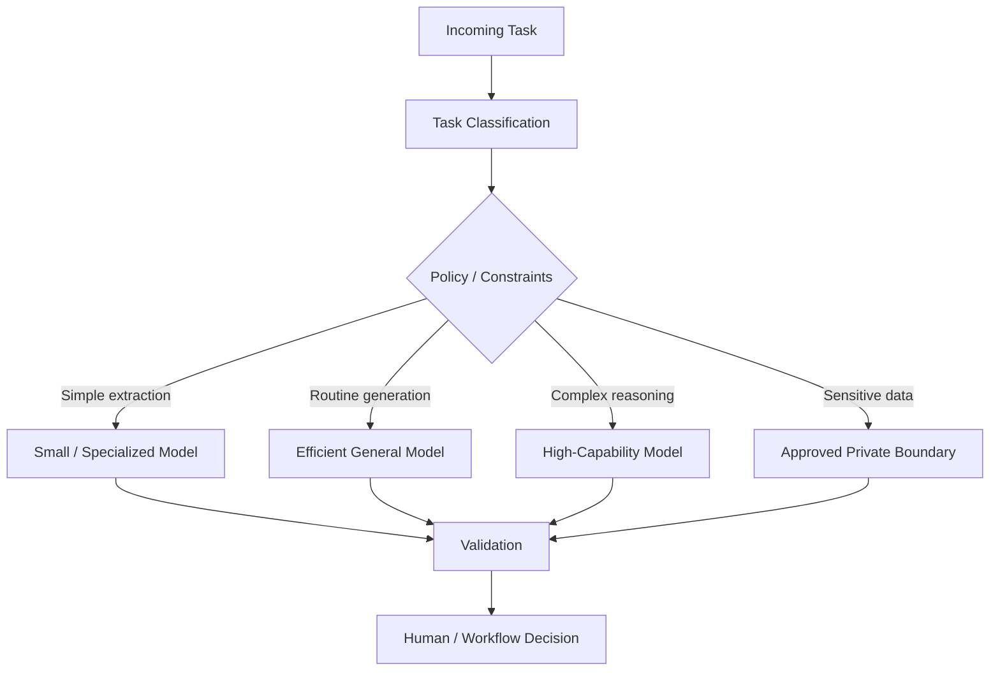
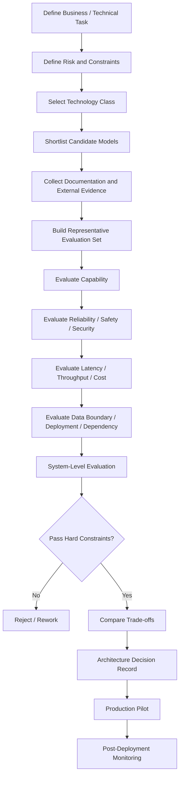

# Chapter 30 — Model Selection

> **Advisor question:** Which model should we choose, and what evidence justifies the choice?

## FOUNDATION

Model selection is an **architecture decision**, not a benchmark contest.

The correct question is not:

> Which model is the best?

It is:

> Which model, or combination of models, is sufficiently capable for the defined workload while satisfying the required risk, latency, reliability, data-boundary, operational, cost, and dependency constraints?

A useful decision frame is:

**Capability × Workload × Risk × Latency × Cost × Data Boundary × Reliability × Vendor Dependency**

A model with the highest public benchmark score can still be the wrong enterprise choice. NIST explicitly treats AI trustworthiness as multi-dimensional and emphasizes that accuracy must be evaluated using realistic test sets representative of expected use; tradeoffs between characteristics are expected. urlNIST AI RMF 1.0https://www.nist.gov/publications/artificial-intelligence-risk-management-framework-ai-rmf-10

---

## 30.1 Start With the Task, Not the Model

Before comparing models, define the workload.

| Question | Example |
|---|---|
| What task? | extract covenant terms |
| Input | PDF + structured financial data |
| Output | validated JSON |
| Required quality | ≥ 98% field-level accuracy on critical fields |
| Context | up to 100 pages / document |
| Latency | p95 < 8 seconds |
| Volume | 50,000 documents/month |
| Data class | confidential investment information |
| Failure impact | analyst rework / potential investment error |
| Human review | required for critical exceptions |
| Availability | business-hours decision support |
| Deployment boundary | approved enterprise AI boundary |

If the workload is undefined, model selection is premature.

---

## 30.2 Choose the Technology Class Before the Model

A common architectural error is assuming every AI problem requires an LLM.

First compare the solution classes:

| Problem | Candidate technology |
|---|---|
| Deterministic policy | Rules / decision engine |
| Exact lookup | Database / search |
| Ranking | Information retrieval / learning-to-rank |
| Numeric prediction | Statistical / ML model |
| Classification | Classical ML / neural model / LLM |
| Document extraction | Parser / OCR / ML / LLM |
| Semantic retrieval | Embedding + search |
| Summarization | LLM / specialized model |
| Complex language synthesis | LLM |
| Image understanding | Vision model / multimodal model |
| Speech recognition | ASR model |
| Workflow coordination | Orchestrator + tools; model only where reasoning/language is needed |

**Advisor rule:** If a deterministic or narrower technology satisfies the requirement with lower risk and complexity, do not introduce a more general model merely because it is fashionable.

This is a recommendation, not a universal law. Evidence from the actual workload should determine the choice.

---

## 30.3 Decompose the Required Capability

“Reasoning capability” is too vague for architecture review.

Break the task into measurable capabilities:

- instruction following
- extraction
- classification
- summarization
- retrieval/use of supplied context
- multi-step reasoning
- numerical reasoning
- coding
- structured output
- tool calling
- long-context processing
- multilingual understanding
- multimodal understanding
- domain terminology
- refusal/safety behavior
- consistency
- calibration, where probabilistic outputs are required

A model may be strong in one dimension and weak in another.

HELM's research demonstrates the value of multi-metric evaluation rather than relying on a single score; its framework evaluates dimensions such as accuracy, calibration, robustness, fairness, bias, toxicity, and efficiency. urlHELM — Holistic Evaluation of Language Modelshttps://arxiv.org/abs/2211.09110

---

## 30.4 Model Selection Matrix

A practical enterprise matrix should look like this:

| Dimension | Weight | Model A | Model B | Model C |
|---|---:|---:|---:|---:|
| Task quality | 25% | 4 | 5 | 4 |
| Reliability / consistency | 15% | 5 | 4 | 4 |
| Security / data boundary | 15% | 5 | 3 | 4 |
| Latency | 10% | 4 | 3 | 5 |
| Cost / useful result | 10% | 4 | 2 | 5 |
| Deployment fit | 10% | 5 | 3 | 4 |
| Integration / tool support | 5% | 4 | 5 | 3 |
| Vendor / exit risk | 10% | 5 | 2 | 4 |
| **Weighted result** | **100%** | **4.55** | **3.45** | **4.15** |

**Important:** The numbers above are illustrative assumptions, not evidence.

Weights must come from the workload and risk profile. A regulated high-impact workflow may rationally assign more weight to security, reliability, auditability, and deployment control than to raw capability.

Do not allow a weighted score to hide a hard constraint.

---

## 30.5 Hard Constraints vs Preferences

Separate requirements into two categories.

### Hard constraints

Failure means the candidate is rejected.

Examples:

- prohibited data boundary
- unacceptable jurisdiction
- missing required deployment mode
- unsupported identity integration
- insufficient output reliability
- latency above a contractual threshold
- inability to satisfy required audit controls
- unacceptable failure mode

### Preferences

These influence ranking but do not automatically reject a candidate.

Examples:

- lower price
- larger context window
- better developer ergonomics
- broader modality support
- easier migration

This prevents a model from winning because it scores highly overall while violating a critical architectural constraint.

---

## 30.6 Public Benchmark ≠ Production Performance

A benchmark measures performance under a defined evaluation condition. It does not automatically establish production performance.

NIST AI 800-3 distinguishes **benchmark accuracy** from **generalized accuracy** and emphasizes that evaluation results depend on the measurement target and assumptions about how test items represent the intended population. urlNIST AI 800-3 — Expanding the AI Evaluation Toolbox with Statistical Modelshttps://www.nist.gov/publications/expanding-ai-evaluation-toolbox-statistical-models

Therefore ask:

1. What task does the benchmark measure?
2. Is that task representative of ours?
3. Is the dataset similar to production data?
4. Is the prompt/scaffolding comparable?
5. Are tools available in both evaluations?
6. Is context length comparable?
7. Are sampling parameters comparable?
8. Is the metric aligned with business impact?
9. What uncertainty surrounds the result?
10. Could the benchmark have been contaminated or exposed to the model?

A benchmark leaderboard is evidence. It is not a deployment decision.

---

## 30.7 Build a Task-Specific Evaluation Set

For consequential enterprise workloads, create an evaluation set from the actual task.

A useful evaluation set should contain:

- representative normal cases
- difficult cases
- edge cases
- ambiguous cases
- adversarial cases
- outdated/incorrect inputs
- contradictory evidence
- missing information
- authorization-sensitive cases
- multilingual cases where relevant
- production-format inputs
- expected outputs or evaluation criteria

Keep evaluation data separated from tuning where practical.

Record:

- dataset version
- provenance
- inclusion criteria
- exclusion criteria
- labels / ground truth
- evaluator methodology
- model version
- prompt version
- tool configuration
- sampling parameters
- evaluation date

NIST emphasizes that accuracy measurements should use clearly defined and realistic test sets and document the test methodology. urlNIST AI RMF Core — Measure 2.5 and related characteristicshttps://airc.nist.gov/airmf-resources/airmf/3-sec-characteristics/

---

## 30.8 Evaluate the Whole System, Not Only the Base Model

For enterprise AI, the effective system is often:

**Model + prompt + context + retrieval + tools + orchestration + policies + post-processing + human workflow**

A model that performs poorly without retrieval may perform well with authoritative enterprise context. Conversely, a strong base model can produce an unacceptable system if retrieval, authorization, tool access, or output validation is weak.

Therefore maintain at least two evaluation layers:

1. **Model evaluation** — intrinsic capability under controlled conditions.
2. **System evaluation** — actual application architecture under realistic workload conditions.

For AI-IDSS, system evaluation should include evidence retrieval, source authority, contradiction handling, authorization, recommendation quality, human interaction, and degraded behavior.

---

## 30.9 Capability Is Not Reliability

A model can produce an excellent answer on average and still be operationally unsuitable.

Evaluate:

- run-to-run consistency
- structured-output validity
- refusal behavior
- tool-call correctness
- citation correctness
- hallucination/confabulation rate
- failure severity
- sensitivity to prompt variation
- sensitivity to context variation
- long-context degradation
- recovery behavior

For high-impact tasks, evaluate the **distribution of failures**, not merely the mean score.

A 95% average success rate can mean very different things if the remaining 5% consists of harmless formatting errors versus dangerous false recommendations.

---

## 30.10 Latency and Throughput

Model choice must be tested under the target workload.

Measure at least:

- time to first token, when relevant
- time to complete response
- p50 latency
- p95 latency
- p99 latency
- throughput
- concurrency
- queueing delay
- rate-limit behavior
- tool latency
- retrieval latency
- end-to-end latency

Do not compare model latency using isolated vendor demonstrations if production includes retrieval, tool calls, orchestration, network hops, and post-processing.

See Chapter 17 for the broader scalability and performance framework.

---

## 30.11 Cost: Measure Cost per Useful Outcome

Model price is not the same as system cost.

A better measure is:

> **Cost per accepted / useful result**

Conceptually:

```text
Total Cost of System
────────────────────
Number of Accepted Useful Results
```

Total cost may include:

- inference
- input/output tokens
- embeddings
- retrieval
- storage
- compute
- network
- orchestration
- evaluation
- observability
- human review
- retries
- failed calls
- engineering and operations
- vendor minimum commitments

A cheaper model that requires substantially more retries or human correction may be more expensive at system level.

---

## 30.12 Data Boundary Is a Model-Selection Criterion

For each candidate, document:

- where input data is processed
- whether data is retained
- retention duration
- whether prompts/outputs are used for provider improvement or training under the applicable service terms
- subprocessors
- geographic processing/storage
- encryption controls
- tenant isolation
- deletion behavior
- logging/telemetry
- administrative access
- contractual commitments
- incident notification

Do not reduce this to “cloud vs on-premise.”

The relevant architecture question is:

> What data crosses which trust boundary, under whose control, for how long, and with what enforceable protections?

See Chapters 19–21.

---

## 30.13 Deployment Model

Candidate models may be consumed through different deployment patterns:

- third-party API
- enterprise-managed model platform
- self-hosted open-weight model
- dedicated/private managed deployment
- on-premises deployment
- hybrid model strategy
- multiple providers

Selection must account for the operational burden introduced by the deployment model.

A self-hosted model may improve control over a data boundary while increasing responsibilities for:

- compute
- capacity planning
- patching
- model serving
- security
- upgrades
- evaluation
- availability
- incident response
- model lifecycle

“Self-hosted” is therefore not synonymous with “safer” or “cheaper.” Those are hypotheses to test.

---

## 30.14 Model Versioning and Change Risk

Treat a model version as a dependency.

Record:

- provider
- model family
- exact version / identifier
- release date
- deprecation date, if known
- serving configuration
- system prompt
- tool definitions
- evaluation version
- known limitations
- change-management policy

A provider changing the model behind a stable API can change application behavior even if the API contract remains unchanged.

Therefore ask vendors:

> What exactly is immutable about the model identifier, and what can change behind that identifier?

If the answer is unclear, model reproducibility is uncertain.

---

## 30.15 Model Routing

A single model does not have to serve every task.

A routing architecture may use:



Routing can optimize cost and latency, but introduces additional complexity:

- classifier errors
- policy errors
- routing drift
- inconsistent behavior
- evaluation complexity
- observability requirements
- multiple vendor dependencies

Do not introduce routing unless its benefit is demonstrated.

---

## 30.16 Fallback Models

Fallback is not automatically safe.

A fallback model may differ in:

- capability
- context handling
- safety behavior
- tool support
- output format
- refusal behavior
- factual reliability
- latency

Therefore define whether fallback is:

1. semantically equivalent,
2. lower-capability but acceptable,
3. read-only / degraded mode, or
4. unavailable for the task.

For consequential workflows, a fallback must not silently change the meaning of the decision-support output.

---

## 30.17 Structured Output and Tool Use

For enterprise workflows, model capability should include interface behavior, not just language quality.

Evaluate:

- schema adherence
- malformed-output rate
- enum correctness
- missing-field rate
- tool selection
- tool argument correctness
- tool-call sequencing
- recovery from tool errors
- refusal when authorization is absent

A model that writes beautiful prose but cannot reliably produce the required machine-readable contract may be the wrong model for the architecture.

---

## 30.18 Context Window Is Not Automatically Useful Capacity

A larger advertised context window does not establish that the model will use all provided information effectively.

Test:

- retrieval precision
- relevant information recall
- performance as context grows
- distractor sensitivity
- instruction placement
- long-document extraction
- contradiction handling
- latency/cost impact

The useful question is not:

> How many tokens can it accept?

It is:

> How much relevant context can it use reliably for our task at acceptable cost and latency?

---

## 30.19 Model Documentation and Due Diligence

Request evidence from the provider or model owner where available:

- model documentation
- intended use
- limitations
- evaluation methodology
- benchmark results
- safety evaluations
- known failure modes
- training-data information where disclosed
- versioning policy
- service-level commitments
- data handling terms
- security documentation
- incident process
- deprecation policy

Do not assume that missing documentation means the model is unsafe. But do treat lack of evidence as uncertainty that may affect the decision.

---

## 30.20 Benchmark Interpretation Rules

When someone says:

> “Model A is 5% better than Model B.”

Ask:

- Better on what metric?
- On which dataset?
- With what prompt?
- Under what inference configuration?
- Is the difference statistically or practically meaningful?
- Is it within measurement uncertainty?
- Does the task resemble production?
- Does the result generalize?
- Does the difference survive our own evaluation?

NIST's 2026 evaluation work specifically warns that benchmark analyses can rely on implicit assumptions, conflate performance concepts, or quantify uncertainty incorrectly. urlNIST AI 800-3https://www.nist.gov/publications/expanding-ai-evaluation-toolbox-statistical-models

---

## 30.21 Model Selection Evidence Hierarchy

Prefer evidence in roughly this order for the specific decision:

1. production evidence on the target workload
2. controlled evaluation using representative organizational data
3. independent evaluation with comparable tasks
4. reproducible public benchmarks
5. vendor benchmark results with methodology disclosed
6. vendor marketing claims
7. anecdotal user reports

This is an advisor recommendation, not a universal scientific hierarchy.

Evidence quality depends on how well the evaluation answers the actual decision question.

---

## 30.22 Selection Process

Use this sequence:



The output is not merely “Model X.”

The output should be:

> **Model X for workload Y, under constraints Z, because evidence E demonstrates acceptable capability, reliability, risk, cost, and operational fit.**

---

## 30.23 AI-IDSS Model Selection

For the AI-IDSS architecture, do not ask for one universal model.

Different stages may have different requirements:

| AI-IDSS function | Potential model requirement |
|---|---|
| Document extraction | structured output, high extraction accuracy |
| Evidence classification | consistency, precision/recall |
| Retrieval assistance | query understanding, semantic robustness |
| Evidence synthesis | context use, citation discipline |
| Scenario analysis | reasoning capability + explicit uncertainty |
| Investment-risk signal | calibrated statistical/ML model where probability is required |
| Executive summary | language quality + factual grounding |
| Tool orchestration | reliable tool selection and arguments |
| Natural-language interface | interaction quality + authorization-aware architecture |

**Critical distinction:** the LLM should not automatically become the model for every analytical task.

For example, a calibrated deterioration probability may be better produced by a statistical or ML model, while an LLM explains the evidence and summarizes the result. See Chapter 27.

---

## 30.24 Anti-Patterns

### Anti-pattern 1 — “Pick the benchmark winner”

Why it fails: benchmark performance may not represent the workload.

### Anti-pattern 2 — “Use the largest model”

Why it fails: capability may exceed requirements while cost, latency, and operational burden increase.

### Anti-pattern 3 — “Use the cheapest model”

Why it fails: lower inference cost can be offset by lower quality, retries, human review, or business errors.

### Anti-pattern 4 — “Use one model everywhere”

Why it fails: different workloads have different capability and risk requirements.

### Anti-pattern 5 — “Use an LLM because the task contains language”

Why it fails: search, rules, statistical models, or specialized models may be more appropriate.

### Anti-pattern 6 — “The context window is huge, so RAG is unnecessary”

Why it fails: context capacity does not establish retrieval quality, authorization, freshness, or reliable use of all information.

### Anti-pattern 7 — “Open-weight means no vendor dependency”

Why it fails: dependency can move to hardware, serving software, model maintainers, specialized infrastructure, or operational expertise.

### Anti-pattern 8 — “Private deployment means zero risk”

Why it fails: it changes the threat and control boundary; it does not eliminate security, model, data, or operational risks.

### Anti-pattern 9 — “A benchmark difference of 2% means Model A is better”

Why it fails: measurement uncertainty and task relevance may make the difference immaterial.

### Anti-pattern 10 — “Model choice is permanent”

Why it fails: model capabilities, pricing, deployment options, threats, and vendor terms change.

---

## 30.25 Advisor Challenge Questions

### To Head of AI

1. What exact workload are we optimizing?
2. What are the hard rejection criteria?
3. Which model capabilities are actually required?
4. Which capabilities are merely desirable?
5. What is our representative evaluation set?
6. What evidence supports the selected model?
7. Which failures matter most?
8. What happens when the model is unavailable?
9. What happens when model behavior changes after an upgrade?
10. What is our exit or replacement strategy?

### To CTO

1. What deployment boundary is acceptable?
2. What operational capability do we have to run the model?
3. What are the latency and availability requirements?
4. What are the total system costs at target volume?
5. What vendor dependency are we accepting?
6. Can the architecture support model replacement without redesigning the application?

### To Vendor

1. What exact model/version is being evaluated?
2. What changes without customer action?
3. How is customer data handled?
4. What is retained and for how long?
5. What subprocessors are involved?
6. What evaluation methodology produced your benchmark numbers?
7. Which production workloads are represented?
8. What known failure modes exist?
9. What are the rate limits and capacity guarantees?
10. What is the deprecation and migration policy?

---

## 30.26 Selection Checklist

### Workload

- [ ] Task explicitly defined
- [ ] Inputs defined
- [ ] Outputs defined
- [ ] Error tolerance defined
- [ ] Failure impact defined
- [ ] Volume/concurrency defined

### Capability

- [ ] Required capabilities decomposed
- [ ] Technology class challenged
- [ ] Domain fit evaluated
- [ ] Structured output tested where relevant
- [ ] Tool use tested where relevant

### Evaluation

- [ ] Representative evaluation set exists
- [ ] Ground truth/evaluation criteria documented
- [ ] Benchmark evidence separated from production evidence
- [ ] Uncertainty considered
- [ ] Failure severity measured
- [ ] System-level evaluation completed

### Architecture

- [ ] Data boundary approved
- [ ] Deployment model evaluated
- [ ] Identity/security controls compatible
- [ ] Latency/throughput acceptable
- [ ] Availability/fallback behavior defined
- [ ] Version/change policy understood

### Economics

- [ ] Inference cost calculated
- [ ] Total system cost calculated
- [ ] Human-review cost considered
- [ ] Retry/failure cost considered
- [ ] Capacity assumptions documented

### Dependency

- [ ] Vendor dependency identified
- [ ] Exit strategy documented
- [ ] Model replacement path evaluated
- [ ] Portability assumptions tested

---

## 30.27 Evidence Discipline

### Claim
Model selection should be based on workload-specific evidence rather than a single universal benchmark.

### Evidence
NIST AI RMF emphasizes valid/reliable AI, realistic test sets, documented methodology, and context-specific tradeoffs. NIST AI 800-3 further distinguishes benchmark accuracy from generalized accuracy and addresses uncertainty in benchmark evaluation. urlNIST AI RMFhttps://www.nist.gov/itl/ai-risk-management-framework urlNIST AI 800-3https://www.nist.gov/publications/expanding-ai-evaluation-toolbox-statistical-models

### Industry / research evidence
HELM demonstrates multidimensional model evaluation rather than relying solely on one score. urlStanford CRFM HELMhttps://crfm.stanford.edu/helm/latest/

### Recommendation
For consequential enterprise workloads, combine public evidence with controlled, representative, system-level evaluation.

### Assumption
The organization can construct or obtain a sufficiently representative evaluation set.

### Uncertainty
No finite evaluation set proves future production behavior. Generalization from evaluation to production remains an empirical question.

---

## 30.28 Falsifiability

The model-selection recommendation should be revisable.

Record what evidence would change the decision.

Examples:

- Model B exceeds Model A on the target workload by a material margin.
- Model A's failure rate exceeds the approved threshold.
- Provider changes data-retention terms.
- Model A's latency becomes unacceptable at target concurrency.
- Model B achieves equivalent quality at materially lower total cost.
- A new deployment option materially changes the data-boundary constraint.
- A critical model failure mode is discovered.

A strong architecture decision is not:

> “We selected Model A.”

It is:

> “We selected Model A because the current evidence and constraints favor it, and we know what evidence would cause us to revisit the decision.”

---

## 30.29 Executive Recommendation

For enterprise AI, model selection should be treated as a **controlled architecture decision** rather than a product comparison exercise.

The advisor should require the proposing team to demonstrate:

1. a clearly defined workload,
2. explicit hard constraints,
3. appropriate technology-class selection,
4. representative evaluation evidence,
5. model and system-level performance,
6. reliability and failure analysis,
7. security and data-boundary fit,
8. latency and capacity fit,
9. total economic impact,
10. vendor/dependency implications, and
11. a credible replacement and re-evaluation path.

The recommended model is therefore not necessarily the strongest model, the cheapest model, or the most popular model.

It is the model whose **demonstrated fitness for the intended workload** best satisfies the organization's technical, operational, security, economic, and strategic constraints.

---

## 30.30 Field Rule

> **Never ask “Which model is best?” without first asking “Best for which workload, under which constraints, measured by which evidence?”**

---

## Evidence / primary references

- NIST AI Risk Management Framework 1.0: https://www.nist.gov/publications/artificial-intelligence-risk-management-framework-ai-rmf-10
- NIST AI RMF: https://www.nist.gov/itl/ai-risk-management-framework
- NIST AI RMF Core: https://airc.nist.gov/airmf-resources/airmf/5-sec-core/
- NIST AI RMF trustworthiness characteristics: https://airc.nist.gov/airmf-resources/airmf/3-sec-characteristics/
- NIST AI 800-3, *Expanding the AI Evaluation Toolbox with Statistical Models*: https://www.nist.gov/publications/expanding-ai-evaluation-toolbox-statistical-models
- NIST AI Measurement and Evaluation: https://www.nist.gov/ai-measurement-and-evaluation
- Stanford CRFM, HELM: https://crfm.stanford.edu/helm/latest/
- Liang et al., *Holistic Evaluation of Language Models*: https://arxiv.org/abs/2211.09110

> **Version note:** NIST AI RMF 1.0 is currently being revised. This chapter uses AI RMF 1.0 as a referenced framework while treating current NIST pages and newer evaluation guidance as version-aware evidence.