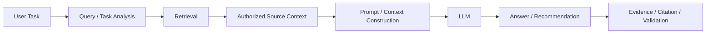
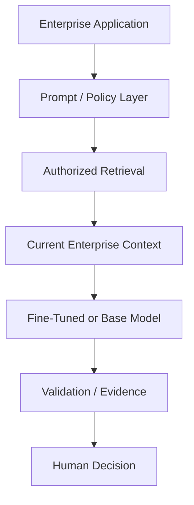
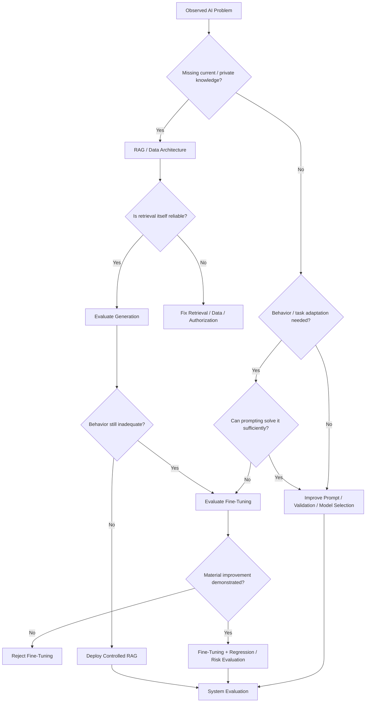

# Chapter 32 — Fine-Tuning vs RAG vs Prompting

> **Advisor question:** What should be changed to improve an AI system: its instructions, its knowledge access, its model behavior, or some combination—and what evidence justifies that choice?

## FOUNDATION

Prompting, retrieval-augmented generation (RAG), and fine-tuning solve different architectural problems. They should not be treated as interchangeable techniques or as a maturity ladder in which fine-tuning is automatically the most advanced option.

A useful distinction is:

| Technique | Primarily changes | Typical purpose |
|---|---|---|
| Prompting | Runtime instructions and task framing | Specify behavior, constraints, format, workflow context |
| RAG | Information available at inference time | Ground answers in external, current, permission-controlled knowledge |
| Fine-tuning | Model parameters / learned behavior | Adapt behavior, style, task patterns, or other capabilities supported by the training objective |
| Combination | More than one of the above | Separate knowledge, behavior, and application concerns |

The architectural question is therefore not:

> Should we use RAG or fine-tuning?

It is:

> **What problem are we trying to change, where should that change live, and what evaluation evidence demonstrates that the chosen mechanism improves the target outcome without creating unacceptable new risks or operational burden?**

NIST's Generative AI Profile explicitly distinguishes and documents approaches including fine-tuning and retrieval-augmented generation as part of model/system documentation and evaluation. NIST's broader AI RMF treats trustworthy AI as a system-level concern spanning design, development, deployment, use, and evaluation. urlNIST AI RMF — Generative AI Profilehttps://www.nist.gov/publications/artificial-intelligence-risk-management-framework-generative-artificial-intelligence

---

## 32.1 The First Diagnostic: Knowledge or Behavior?

The most useful first question is:

> **Is the problem primarily missing knowledge, or undesirable behavior?**

Examples of a **knowledge problem**:

- the model does not know this quarter's portfolio financials;
- the model needs the latest investment memo;
- the model must use an updated covenant definition;
- the model needs access to a document the foundation model did not train on;
- different users are authorized to see different source material.

These cases generally point toward **retrieval and controlled context**, not automatically toward fine-tuning.

Examples of a **behavior/task problem**:

- the model repeatedly fails to follow a specialized output convention;
- a classification task requires a stable domain-specific mapping;
- the desired response style or transformation pattern is difficult to achieve reliably through prompting alone;
- a large set of high-quality examples demonstrates a repeatable task behavior that should be learned.

These cases may justify **fine-tuning**, provided evaluation demonstrates a material benefit.

This distinction is an architectural heuristic, not a universal rule. Some problems involve both knowledge and behavior.

---

## 32.2 Prompting: Change the Instructions First

Prompting changes what the model is asked to do at inference time without changing the model's learned parameters.

Prompting can provide:

- role and task definition;
- output schemas;
- constraints;
- examples;
- reasoning context where appropriate;
- retrieved evidence;
- tool instructions;
- refusal conditions;
- workflow state.

For enterprise systems, prompting should be treated as application configuration and code, not as an informal conversation trick.

Version at least:

- system instructions;
- developer/application instructions;
- templates;
- few-shot examples;
- tool definitions;
- output schema;
- model identifier;
- retrieval configuration;
- evaluation dataset.

### When prompting is a strong first choice

Use prompting first when:

- the desired behavior can be expressed clearly;
- the task is changing rapidly;
- the required examples are few;
- the problem is primarily instruction following;
- you need rapid experimentation;
- the model already has sufficient capability;
- no persistent learned behavior is required.

### Limitation

Prompting cannot reliably manufacture a capability that the underlying model does not possess. Adding more instructions can also increase context size and complexity without necessarily improving behavior.

**Advisor rule:** Before proposing fine-tuning, demonstrate that the required behavior cannot be achieved sufficiently well with a controlled prompt and application architecture.

---

## 32.3 RAG: Supply External Knowledge at Inference Time

RAG connects the model to external information rather than requiring the information to be encoded into model parameters.

A simplified architecture is:



RAG is particularly useful when knowledge is:

- private;
- frequently changing;
- large;
- document-based;
- permission-sensitive;
- required to be traceable to source evidence.

For AI-IDSS, these properties are often central. Portfolio-company information, investment memos, financial statements, research, and market information should normally remain connected to their authoritative sources rather than being treated as static model memory.

### RAG does not automatically solve factuality

RAG quality depends on the complete pipeline:

**source quality → ingestion → parsing → chunking/indexing → retrieval → authorization → context construction → generation → validation**

A model can still produce an incorrect answer from correct documents if retrieval is incomplete, context is ambiguous, or generation is not properly constrained.

Therefore:

> RAG is a grounding architecture, not a guarantee of truth.

---

## 32.4 Fine-Tuning: Change Learned Behavior

Fine-tuning updates model parameters using additional training data under a defined training objective.

The relevant architectural question is not simply whether fine-tuning is possible. It is whether changing the model's learned behavior is the most effective way to solve the observed problem.

Potential uses can include:

- specialized task behavior;
- domain-specific classification or transformation patterns;
- consistent response style;
- structured-output behavior;
- adaptation to a specialized interaction pattern;
- improving performance on a sufficiently represented task.

The exact benefit depends on the model, training method, dataset, objective, evaluation methodology, and workload.

### Fine-tuning is not a database

A critical distinction:

> **Fine-tuning should not be treated as a replacement for an authoritative enterprise data store.**

If a portfolio company's EBITDA changes next month, retraining a model merely to make the new number available is architecturally different from retrieving the current financial record at inference time.

Fine-tuning may influence behavior. It does not create the same governance, freshness, authorization, lineage, and source-of-record properties as an enterprise data architecture.

NIST's GenAI Profile explicitly calls for documentation of data provenance, data quality, model architecture, optimization objectives, fine-tuning or RAG approaches, and evaluation data. urlNIST AI 600-1 — Generative AI Profilehttps://nvlpubs.nist.gov/nistpubs/ai/NIST.AI.600-1.pdf

---

## 32.5 The Three Techniques Solve Different Failure Modes

A practical diagnostic matrix:

| Observed problem | First candidate | Why |
|---|---|---|
| Model lacks current enterprise facts | RAG / data integration | Facts belong in controlled source systems |
| Model lacks access to authorized documents | RAG + authorization | Access must be enforced at retrieval/data layer |
| Output format is inconsistent | Prompting / structured output / validation | Often an application-control problem |
| Model does not follow a stable specialized task | Fine-tuning may be evaluated | Learned behavior may be appropriate |
| Knowledge changes frequently | RAG | Updating source data is operationally simpler than retraining |
| Need traceable source evidence | RAG + provenance/citations | Evidence can be linked to source records |
| Need specialized response style | Prompting first; fine-tuning if justified | Start with the lowest-complexity mechanism |
| Retrieval is poor | Fix retrieval architecture first | Fine-tuning the generator may hide the real defect |
| Model lacks fundamental capability | Model selection first | Fine-tuning cannot be assumed to create arbitrary capability |
| Multiple problems coexist | Combination | Separate knowledge, behavior, and control concerns |

These are architecture heuristics. The evaluation set should determine whether the proposed intervention actually works.

---

## 32.6 Do Not Fine-Tune to Store Proprietary Knowledge by Default

A common proposal is:

> “Our data is proprietary, so we should fine-tune the model on it.”

That reasoning is incomplete.

Ask first:

1. Does the information change frequently?
2. Must users receive the latest version?
3. Must access depend on user or portfolio-company permissions?
4. Must an answer cite the source record?
5. Must the source remain authoritative?
6. Must information be deleted or corrected selectively?
7. Can the desired behavior be achieved through retrieval and prompting?

If several answers are yes, the architecture often points toward **RAG/data architecture rather than treating model weights as the knowledge repository**.

This is a recommendation, not a universal prohibition on training with proprietary data. Training can be appropriate for some workloads when data governance, rights, security, evaluation, and lifecycle requirements are satisfied.

---

## 32.7 Do Not Assume RAG Solves Everything

The opposite error is:

> “We have RAG, therefore we do not need fine-tuning.”

RAG cannot automatically solve a behavioral problem.

Examples:

- the model consistently misclassifies a specialized document type;
- the model cannot reliably produce the required structured transformation;
- the model ignores a stable task convention despite adequate context;
- retrieval is correct but generation behavior remains systematically poor.

The architecture may then require:

**better prompting → better validation → better model selection → fine-tuning evaluation**, in that order where appropriate.

Do not fine-tune merely because the model makes mistakes. First identify whether the error originates in:

**data → retrieval → prompt/context → model capability → tool use → validation → human workflow.**

---

## 32.8 Fine-Tuning Does Not Remove the Need for RAG

Fine-tuning and RAG can be complementary.

A system may use:



For example, a model could be adapted to a specialized investment-analysis response format while still retrieving current financial data and investment documents at runtime.

This separation can be architecturally useful:

- **weights** represent learned behavior;
- **retrieval** provides current external knowledge;
- **application policy** enforces permissions and workflow rules;
- **source systems** remain authoritative.

The boundaries should remain explicit.

---

## 32.9 Training Data Requirements

Fine-tuning introduces a different data lifecycle from RAG.

Evaluate:

- dataset size;
- representativeness;
- label quality;
- consistency;
- duplication;
- sensitive information;
- intellectual-property rights;
- provenance;
- train/validation/test separation;
- leakage;
- class balance where relevant;
- edge cases;
- failure examples;
- update frequency.

A small but high-quality dataset can be more useful than a large, noisy dataset, but the relationship is workload-dependent and must be demonstrated experimentally.

Do not present a generic dataset-size threshold as an architecture law.

---

## 32.10 RAG Data Requirements

RAG has its own data lifecycle.

Evaluate:

- source authority;
- ingestion coverage;
- parsing quality;
- document versioning;
- metadata quality;
- access-control metadata;
- chunking strategy;
- embedding/retrieval configuration;
- hybrid retrieval where useful;
- reranking where useful;
- freshness requirements;
- deletion propagation;
- citation/provenance;
- retrieval evaluation.

A RAG system should not merely ask:

> “Did retrieval return something?”

It should ask:

> “Did retrieval return the right authorized evidence for this decision?”

---

## 32.11 Security and Governance Differences

The three approaches create different control surfaces.

| Dimension | Prompting | RAG | Fine-tuning |
|---|---|---|---|
| Primary artifact | Instructions/configuration | Knowledge index/context pipeline | Model artifact |
| Main update mechanism | Prompt/config deployment | Source/index update | Training run |
| Fresh knowledge | No, by itself | Strong fit | Requires retraining/update |
| Access control | Application layer | Retrieval/data layer + application | More difficult to express as per-user knowledge access |
| Source citation | Not inherent | Natural architectural fit | Not inherent |
| Data deletion | Change/remove prompt content | Remove/update source/index | May require model lifecycle action |
| Evaluation | Prompt/system behavior | Retrieval + generation | Training + model/system behavior |
| Operational burden | Usually lower | Moderate to high | Higher lifecycle burden |

The table is a comparative architecture heuristic, not a universal cost or security ranking.

Security controls must remain outside the model where deterministic enforcement is required. The model should not be the sole mechanism deciding whether a user is authorized to retrieve a document.

---

## 32.12 Evaluation Must Compare Interventions

Never ask only:

> “Did fine-tuning improve the model?”

Ask:

> “Did fine-tuning improve the target system outcome more than the alternatives, for an acceptable increase in cost and risk?”

A useful experiment may compare:

- baseline model + baseline prompt;
- improved prompt;
- prompt + RAG;
- fine-tuned model;
- fine-tuned model + RAG;
- alternative base model;
- alternative retrieval configuration.

Measure the same target metrics across candidates.

For AI-IDSS, evaluation may include:

- evidence retrieval recall/precision;
- factual consistency;
- source attribution;
- numerical correctness;
- recommendation quality;
- false-alert rate;
- missed-risk rate;
- calibration where probabilities are presented;
- latency;
- cost per useful result;
- human correction rate;
- security/control failures.

Research comparing RAG and fine-tuning has found that relative performance depends on the task and experimental setup rather than establishing a universal winner. Such studies are useful evidence, but they do not substitute for evaluation on the organization's workload. urlExample comparative study of fine-tuning, RAG and soft promptinghttps://arxiv.org/abs/2311.05903

---

## 32.13 Change Management

The update mechanism matters architecturally.

### Prompt change

Typically changes application behavior without changing model weights.

Questions:

- Was the prompt version recorded?
- Was regression testing performed?
- Did output behavior change unexpectedly?

### RAG data change

Can change answers without changing the model.

Questions:

- Which source changed?
- Was the new version indexed?
- Were permissions preserved?
- Can the answer be traced to the source version?

### Fine-tuning change

Creates a new model artifact or model version.

Questions:

- Which training data was used?
- Which base model was used?
- What training configuration changed?
- Did performance improve across important slices?
- Did safety, security, or general capability regress?
- Can the previous model be restored?

A mature architecture makes these change paths observable and reversible where feasible.

---

## 32.14 Portability and Vendor Dependency

Each mechanism creates different dependency patterns.

Prompting can be relatively portable but may depend on model-specific behavior, tool APIs, structured-output features, or context semantics.

RAG can be portable at the conceptual architecture level, but implementations may depend on:

- embedding models;
- vector/search engines;
- rerankers;
- orchestration frameworks;
- provider-specific retrieval APIs.

Fine-tuning may increase dependency on:

- a particular model family;
- training interface;
- checkpoint format;
- serving stack;
- hardware requirements;
- model-specific evaluation behavior.

Therefore include exit strategy in the architecture decision:

> Can the organization migrate the application, knowledge layer, and learned model behavior independently—or are they becoming one tightly coupled proprietary artifact?

---

## 32.15 Cost and Operational Complexity

Do not compare only inference prices.

### Prompting costs may include

- additional context tokens;
- longer prompts;
- evaluation and experimentation;
- application maintenance.

### RAG costs may include

- ingestion;
- parsing;
- embeddings;
- indexing;
- search infrastructure;
- storage;
- retrieval latency;
- reranking;
- access-control enforcement;
- evaluation;
- synchronization.

### Fine-tuning costs may include

- dataset preparation;
- training;
- experimentation;
- evaluation;
- model storage;
- serving;
- version management;
- retraining;
- rollback;
- governance.

The right comparison is therefore:

> **Total cost and operational burden per useful, acceptable result.**

---

## 32.16 Decision Tree for the Advisor

Use this as a first-pass diagnostic, not an automatic decision engine.



---

## 32.17 AI-IDSS Recommended Separation of Concerns

For an AI-IDSS, a defensible default architecture is:

```text
Authoritative Enterprise / External Sources
                │
                ▼
        Data + Integration Layer
                │
                ▼
      Retrieval / Evidence Layer
                │
                ▼
      Prompt / Policy / Context
                │
                ▼
          AI Model Layer
       ┌────────┴─────────┐
       │                  │
   Base Model       Fine-Tuned Model
       │                  │
       └────────┬─────────┘
                ▼
       Validation / Evidence
                │
                ▼
          AI-IDSS Output
                │
                ▼
      Human Decision Boundary
```

The model should not become the system of record. Current facts should remain connected to authoritative sources, while learned behavior should be treated as a versioned model artifact.

This separation improves the advisor's ability to answer:

- Where did this fact come from?
- Which model produced the conclusion?
- Which prompt and retrieval configuration were used?
- Which evidence was available at the time?
- Which authorization policy applied?
- Can the result be reproduced or investigated?

---

## 32.18 Common Architectural Mistakes

### Mistake 1 — “Our data is proprietary, therefore fine-tune.”

**Correction:** First determine whether the requirement is current knowledge, controlled access, or learned behavior.

### Mistake 2 — “RAG means the model knows our data.”

**Correction:** RAG provides runtime context; it does not transfer ownership or authority over the source data to the model.

### Mistake 3 — “Fine-tuning makes the model an expert.”

**Correction:** Expertise claims require task-specific evidence. Fine-tuning changes model behavior under a training objective; it does not guarantee broad domain competence.

### Mistake 4 — “Prompting is too simple for enterprise use.”

**Correction:** Controlled prompting is part of application architecture. Simplicity is an advantage when it satisfies the requirement.

### Mistake 5 — “We can fix poor retrieval by fine-tuning the generator.”

**Correction:** Diagnose the pipeline first. A retrieval defect should normally be fixed at retrieval/data layers rather than hidden inside the generator.

### Mistake 6 — “Fine-tuning is permanent knowledge.”

**Correction:** Model behavior is versioned, not an authoritative database. Data correction and deletion requirements must be designed explicitly.

### Mistake 7 — “RAG is always cheaper.”

**Correction:** Retrieval has infrastructure, evaluation, latency, security, and maintenance costs. Compare total system economics.

### Mistake 8 — “Fine-tuning is always cheaper at scale.”

**Correction:** Any such claim depends on workload, training frequency, serving architecture, model size, and alternative RAG/prompt costs.

### Mistake 9 — “One technique must win.”

**Correction:** Hybrid architectures are legitimate when they separate different problems cleanly.

### Mistake 10 — “The model decides which data it is allowed to see.”

**Correction:** Authorization must be enforced by the surrounding system, not delegated solely to probabilistic model behavior.

---

## 32.19 Technical Challenge Questions

When Head of AI proposes fine-tuning:

1. What observed failure are we trying to correct?
2. Is the failure knowledge, retrieval, instruction following, model capability, or workflow design?
3. Why is fine-tuning preferable to prompting for this failure?
4. Why is fine-tuning preferable to RAG?
5. What training data supports the decision?
6. How was leakage prevented?
7. How will proprietary data rights and retention be governed?
8. How will model regressions be detected?
9. How will the model be updated when source facts change?
10. What is the rollback mechanism?
11. What new vendor or infrastructure dependency is introduced?
12. What evidence shows material improvement?

When Head of AI proposes RAG:

1. What are the authoritative sources?
2. How is retrieval evaluated?
3. Is authorization enforced before context reaches the model?
4. How are document versions handled?
5. How quickly do source changes propagate?
6. How are deleted or revoked documents removed from retrieval?
7. How are citations/provenance maintained?
8. What happens when retrieval returns no adequate evidence?
9. What happens when sources contradict each other?
10. What evidence shows RAG improves the target outcome?

When a team proposes “just improve the prompt”:

1. What failure is the prompt expected to fix?
2. Is the behavior stable across representative cases?
3. Does the prompt increase context and inference cost materially?
4. Is the behavior model-specific?
5. How is prompt regression tested?
6. Does the prompt attempt to enforce a policy that should instead be enforced by software?

---

## 32.20 Architecture Review Checklist

Before approving a prompting/RAG/fine-tuning decision, verify:

### Problem definition

- [ ] Failure mode is explicitly identified.
- [ ] Knowledge vs behavior distinction has been considered.
- [ ] Business and technical consequences are documented.

### Prompting

- [ ] Prompt/version is controlled.
- [ ] Output requirements are explicit.
- [ ] Regression evaluation exists.

### RAG

- [ ] Sources are authoritative or their authority is explicitly qualified.
- [ ] Retrieval quality is measured.
- [ ] Authorization is enforced outside the model.
- [ ] Freshness and deletion behavior are defined.
- [ ] Provenance/citations are available where required.

### Fine-tuning

- [ ] Training objective is explicit.
- [ ] Training data provenance is documented.
- [ ] Evaluation data is separated appropriately.
- [ ] Leakage has been considered.
- [ ] Regression and safety evaluation are defined.
- [ ] Versioning and rollback exist.
- [ ] Retraining/update triggers are defined.

### Architecture

- [ ] Source systems remain authoritative.
- [ ] Model weights are not treated as the system of record.
- [ ] Security boundaries are explicit.
- [ ] Vendor dependencies are documented.
- [ ] Cost includes operational and human-review components.
- [ ] The decision is reversible enough for the risk level.

### Evidence

- [ ] Baseline exists.
- [ ] Alternatives were evaluated.
- [ ] Evaluation uses representative workload data.
- [ ] Important failure slices were examined.
- [ ] Evidence is strong enough for the decision consequence.

---

## 32.21 Evidence Discipline

For this decision, distinguish:

**Fact** — documented behavior or requirement supported by an authoritative source.

**Technical Evidence** — measured evaluation, system documentation, or reproducible experiment.

**Research Evidence** — published experimental or analytical work relevant to the technique.

**Inference** — conclusion drawn from evidence and architecture context.

**Recommendation** — advisor judgment about the preferred architecture.

**Assumption** — proposition introduced for scenario analysis and not yet established as fact.

**Uncertainty** — evidence insufficient to determine the answer confidently.

Do not write:

> “RAG is better than fine-tuning.”

Write instead:

> “For this workload, RAG is the current recommendation because the dominant requirement is current, permission-controlled enterprise knowledge. Fine-tuning remains a candidate if controlled evaluation demonstrates a material behavioral gap that prompting and system architecture cannot close.”

That is a defensible architecture recommendation because it exposes the reasoning and the condition that could change it.

---

## 32.22 What Would Change Our Mind?

A technical advisor should explicitly define reversal conditions.

The recommendation to prefer RAG over fine-tuning could change if evidence shows that:

- retrieval cannot achieve required recall/precision under acceptable cost or latency;
- a stable behavioral requirement cannot be achieved with prompting and available model capabilities;
- fine-tuning produces a material and repeatable improvement on representative workloads;
- the fine-tuned architecture can satisfy security, governance, lifecycle, and rollback requirements;
- the economics favor the learned model behavior over repeated retrieval/context costs;
- operational evidence demonstrates acceptable regression and maintenance characteristics.

Conversely, a fine-tuning recommendation should be reconsidered if:

- improvements disappear on independent or production-like evaluation;
- the model becomes less robust outside the training distribution;
- training data governance becomes unacceptable;
- update frequency makes retraining operationally impractical;
- RAG or prompting achieves equivalent outcomes with lower complexity.

---

## 32.23 Field Rule

> **Change the smallest architectural layer that can reliably solve the observed problem.**

Use:

- **Prompting** when the problem is instruction, framing, or controlled task behavior.
- **RAG** when the problem is access to current, external, private, or permission-controlled knowledge.
- **Fine-tuning** when evaluation demonstrates that learned behavioral adaptation is required and justified.
- **Combination architectures** when the problem genuinely contains separate knowledge and behavior requirements.

And always remember:

> **Knowledge should remain governed as data. Behavior should remain governed as a model artifact. Authority should remain governed by software and organizational controls.**

That separation is especially important for an AI-IDSS, where the system's credibility depends not only on what the model says, but on whether the organization can establish where the evidence came from, why the system behaved as it did, and which controls remained in force when the recommendation was produced.
