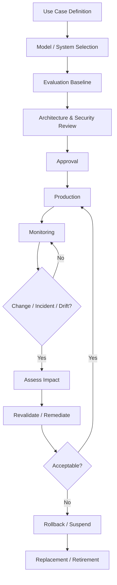

# Chapter 33 — Model Lifecycle

> **Advisor question:** How do we control an AI model from introduction to retirement so that changes, risks, dependencies, and evidence remain manageable throughout its useful life?

## FOUNDATION

An AI model is not a one-time procurement decision. It is a lifecycle dependency.

A production model can change through new training, provider updates, serving configuration, surrounding prompts, retrieval sources, tools, data distributions, or operational conditions. Therefore model governance cannot stop at deployment approval.

NIST AI RMF explicitly calls for AI-system inventories, ongoing monitoring, maintenance, change management, incident response, and safe decommissioning. urlNIST AI RMF Corehttps://airc.nist.gov/airmf-resources/airmf/5-sec-core/

A practical lifecycle is:

**Discover → Assess → Select → Validate → Approve → Deploy → Monitor → Change → Revalidate → Retire**

The exact stages may vary by organization and risk level. The architectural principle is more important than the label:

> **No production model should become an unmanaged dependency.**

---

## 33.1 Model Lifecycle Is Broader Than Training

“Model lifecycle” can refer to the lifecycle of:

- a foundation model;
- a fine-tuned model;
- a predictive ML model;
- an embedding model;
- a reranker;
- a classifier;
- a model exposed through a third-party API.

For an enterprise AI application, the lifecycle should include both the model and the surrounding system configuration.

A useful representation is:

```text
Model Artifact
     +
Model Version / Provider
     +
Prompt / Configuration
     +
Retrieval Configuration
     +
Tool Configuration
     +
Evaluation Evidence
     +
Operational Controls
     +
Dependencies
     =
Deployable AI System Version
```

This is an architectural recommendation. The organization may implement the records differently.

---

## 33.2 Establish a Model Inventory

Before an organization can govern model change, it needs to know what models exist and where they are used.

A model inventory should identify, as appropriate:

- model name and identifier;
- provider or owner;
- model family;
- exact version where available;
- use case;
- business owner;
- technical owner;
- risk classification;
- deployment environment;
- data classes processed;
- downstream systems;
- dependencies;
- evaluation status;
- approval status;
- service or contract dependency;
- retirement status.

NIST AI RMF explicitly includes mechanisms for inventorying AI systems and allocating resources according to organizational risk priorities. urlNIST AI RMF Corehttps://airc.nist.gov/airmf-resources/airmf/5-sec-core/

**Advisor challenge:** If nobody can identify which production applications depend on a model, the organization does not have adequate lifecycle control over that dependency.

---

## 33.3 Define the Intended Use

A model should have a defined intended use before production approval.

Document:

- task;
- users;
- inputs;
- outputs;
- decision context;
- prohibited uses;
- human oversight;
- acceptable failure modes;
- required performance;
- relevant constraints.

This matters because model quality is contextual.

A model can be adequate for document summarization and inadequate for financial risk classification. A model approved for analyst assistance should not silently become an autonomous action engine.

NIST AI RMF treats AI risk as context-dependent and emphasizes considering trustworthiness throughout design, development, deployment, use, and evaluation. urlNIST AI RMF 1.0https://www.nist.gov/publications/artificial-intelligence-risk-management-framework-ai-rmf-10

---

## 33.4 Baseline the Model Before Production

Before deployment, establish a baseline against which future changes can be compared.

Record, where relevant:

- evaluation dataset version;
- metrics;
- confidence intervals or uncertainty information where appropriate;
- important error categories;
- performance by critical slices;
- latency;
- throughput;
- cost;
- security findings;
- known limitations;
- model version;
- prompt and system configuration;
- retrieval/tool configuration.

Without a baseline, later statements such as “the new version is better” are difficult to substantiate.

See Chapter 31 for the broader evaluation framework.

---

## 33.5 Promotion Through Environments

A useful deployment path is:


The environments are not merely technical copies.

They should provide progressively stronger evidence that the candidate is suitable for its intended operating conditions.

For consequential AI-IDSS capabilities, production exposure should not automatically follow from passing a developer test.

---

## 33.6 Approval Is a Lifecycle Gate

Production approval should answer at least:

1. What is the intended use?
2. What evidence supports the required quality?
3. What are the material failure modes?
4. What controls mitigate them?
5. What data crosses which boundaries?
6. Who owns the system?
7. How will it be monitored?
8. What changes require reapproval?
9. How can it be rolled back?
10. How will it eventually be retired?

Approval should therefore be treated as a decision with conditions, not merely a one-time checkbox.

---

## 33.7 Production Deployment

Deployment creates an operational dependency.

Capture at minimum:

- immutable or traceable release identifier;
- deployment configuration;
- dependencies;
- secrets and identities used by the service;
- resource requirements;
- health checks;
- rollback mechanism;
- monitoring configuration;
- alert thresholds;
- owner and escalation path.

For third-party model APIs, the deployment artifact may include a provider model identifier and the application's configuration rather than a locally hosted model binary.

The lifecycle principle remains the same: the production dependency must be identifiable and controllable.

---

## 33.8 Post-Deployment Monitoring

Pre-deployment evaluation is necessary but not sufficient.

NIST's 2026 report on deployed AI monitoring identifies post-deployment monitoring as important for validating real-world behavior, detecting unforeseen outputs, and identifying unexpected consequences. It also notes that monitoring practices and terminology remain an evolving field. citeturn0search0turn0search1

NIST AI RMF specifically calls for post-deployment monitoring, user feedback, appeal and override mechanisms, incident response, recovery, and change management. citeturn0search3

A practical monitoring model includes:

- **Functionality** — does the system still perform the intended task?
- **Quality** — is output quality degrading?
- **Operational** — latency, errors, capacity, availability.
- **Security** — attacks, unusual access, policy violations.
- **Data** — distribution changes, freshness, missingness, anomalies.
- **Human interaction** — overrides, corrections, complaints, escalation.
- **Business impact** — meaningful changes in downstream outcomes.

Not every model needs every signal. Monitoring should be proportionate to risk and use.

---

## 33.9 Model Drift and System Drift

“Drift” should not be treated as a single phenomenon.

Potential changes include:

- input distribution changes;
- concept or relationship changes;
- source-data changes;
- retrieval-quality degradation;
- user-behavior changes;
- model-provider changes;
- prompt/configuration changes;
- tool/API changes;
- changes in the operating environment.

A model can remain technically unchanged while the system becomes less reliable because its inputs or surrounding dependencies changed.

**Advisor rule:** Monitor the conditions that determine the validity of the output, not only the model artifact itself.

---

## 33.10 Model Provider Changes

Third-party model services create a special lifecycle problem.

A provider may change:

- model implementation;
- safety behavior;
- latency;
- context behavior;
- pricing;
- rate limits;
- supported features;
- availability;
- deprecation status;
- data-handling terms.

An unchanged API contract does not necessarily imply unchanged application behavior.

Therefore maintain provider-change detection and revalidation procedures appropriate to the risk.

See Chapter 30 for model selection and Chapter 36 for vendor dependency and exit strategy.

---

## 33.11 Change Classification

Not every change needs the same approval path.

A practical classification is:

| Change | Example | Typical treatment |
|---|---|---|
| Low-impact configuration | formatting prompt change | regression evaluation |
| Retrieval change | index/retriever modification | retrieval + system evaluation |
| Model patch/version | provider model update | targeted revalidation |
| Fine-tuned model | new trained artifact | full model/system evaluation |
| Tool permission change | new write capability | security + authorization review |
| Data-source change | new authoritative source | data/integration review |
| Architecture change | new provider or serving path | architecture review |
| Intended-use change | analyst assistant → autonomous action | new risk/approval assessment |

This table is an advisory pattern, not a universal regulatory classification.

The key is to define **which changes invalidate prior evidence**.

---

## 33.12 Revalidation After Change

A changed model should not automatically inherit the evidence of its predecessor.

Revalidation should be proportional to the change and risk.

Possible levels:

**Targeted regression**
- affected capabilities;
- known failure modes;
- security-sensitive behaviors.

**Broad regression**
- core evaluation suite;
- critical slices;
- latency/cost;
- operational behavior.

**Full requalification**
- major model change;
- changed intended use;
- major architecture change;
- materially changed risk boundary.

NIST AI RMF calls for ongoing measurement and management rather than treating evaluation as a one-time event. urlNIST AI RMF Playbook — Measure and Managehttps://airc.nist.gov/airmf-resources/playbook/measure/

---

## 33.13 Rollback and Safe Degradation

A lifecycle is incomplete if the organization cannot safely reverse a bad change.

Define:

- previous known-good version;
- rollback trigger;
- rollback procedure;
- data compatibility requirements;
- dependency compatibility;
- ownership during rollback;
- communication procedure.

For AI-IDSS, degraded operation may be preferable to silently producing lower-quality recommendations.

Examples:

- switch to a validated previous model;
- disable an affected capability;
- fall back to read-only evidence retrieval;
- require human review;
- temporarily suspend recommendations.

Fallback behavior must be evaluated rather than assumed safe.

---

## 33.14 Incident Response

AI incidents can include:

- systematic hallucination or incorrect output;
- sensitive-data disclosure;
- unauthorized retrieval;
- unsafe tool execution;
- model/provider outage;
- unexpected model behavior after change;
- data poisoning;
- severe degradation;
- misleading recommendations.

Incident response should establish:

**detect → contain → assess → communicate → recover → investigate → learn → revalidate**

For consequential systems, preserve enough evidence to reconstruct the incident while respecting privacy, security, and retention requirements.

NIST AI RMF includes incident/error communication, response, recovery, and change management as part of post-deployment risk management. citeturn0search3

---

## 33.15 Model Retirement

Retirement is an architectural lifecycle stage, not simply deleting an endpoint.

Before retirement, determine:

- dependent applications;
- dependent data pipelines;
- downstream reports;
- active users;
- replacement model/system;
- migration plan;
- contractual obligations;
- security implications;
- retention requirements;
- audit requirements;
- preserved artifacts;
- rollback window.

NIST AI RMF explicitly calls for safe decommissioning and phasing out of AI systems, with attention to dependencies, legal/regulatory requirements, continuity, and preservation of relevant artifacts. citeturn0search5turn0search6

Do not equate retirement with immediate destruction of every artifact. What should be retained, for how long, and under what controls is a separate governance decision.

---

## 33.16 Model Lineage

A production result should be attributable to the relevant system state where the use case requires it.

For important AI-IDSS outputs, consider recording:

- model/version;
- prompt/configuration version;
- retrieval/index version where relevant;
- source-document identifiers;
- tool versions;
- evaluation/release identifier;
- timestamp;
- user or service identity;
- relevant policy version.

The exact retention design depends on legal, privacy, security, operational, and audit requirements.

The objective is not to retain everything forever. It is to preserve sufficient evidence to understand important outputs and changes.

---

## 33.17 Lifecycle Ownership

Separate responsibilities explicitly.

| Responsibility | Typical owner |
|---|---|
| Business purpose | Business owner |
| Technical architecture | Architecture / technology owner |
| Model development | ML/AI team or provider |
| Data quality | Data owner/steward |
| Security controls | Security function |
| Production operation | Platform / engineering |
| Evaluation | Independent or designated evaluation function |
| Risk acceptance | Authorized governance role |
| Retirement decision | Accountable business + technology owners |

The exact organizational structure varies.

The architectural requirement is that accountability cannot disappear between teams.

NIST AI RMF emphasizes documented roles, responsibilities, and communication lines for AI risk management. citeturn0search3

---

## 33.18 AI-IDSS Lifecycle

For the AI-IDSS, the lifecycle can be represented as:



The RD should never need to ask:

> “Is this the same AI system we approved six months ago?”

without being able to obtain a technically defensible answer.

---

## 33.19 Common Lifecycle Anti-Patterns

### Anti-pattern 1 — Approve once, forget

A model is evaluated once and assumed safe indefinitely.

**Challenge:** What evidence shows that production conditions remain comparable?

### Anti-pattern 2 — Provider abstraction hides model change

The application calls a stable API and assumes behavior is stable.

**Challenge:** What happens when the provider changes the underlying model?

### Anti-pattern 3 — No model inventory

Teams cannot identify production dependencies.

**Challenge:** How can the organization manage risk or retirement if it does not know where the model is used?

### Anti-pattern 4 — Monitoring only infrastructure

CPU, memory, and uptime are monitored while output quality is ignored.

**Challenge:** How do we know the system remains fit for purpose?

### Anti-pattern 5 — No rollback

A new model is deployed without a known-good previous version.

**Challenge:** What is the recovery path if quality deteriorates immediately?

### Anti-pattern 6 — Retirement by deletion

The endpoint is deleted without checking dependencies, evidence, contracts, or retention.

**Challenge:** What downstream systems or investigations still depend on the artifacts?

---

## 33.20 Technical Challenge Questions

When reviewing an AI lifecycle, ask:

1. Where is the authoritative model inventory?
2. What exact model/version is in production?
3. What evidence approved it?
4. What intended use was approved?
5. Which changes trigger revalidation?
6. Which changes trigger full reapproval?
7. How are provider changes detected?
8. What production quality signals are monitored?
9. How are drift and degradation detected?
10. What is the rollback path?
11. What happens when monitoring detects a critical failure?
12. Who can suspend the system?
13. What artifacts are retained for important outputs?
14. What dependencies must be migrated before retirement?
15. What is the exit path if the provider changes terms or capability?

---

## 33.21 Architecture Review Checklist

Before approving a production model, verify:

- [ ] Intended use is documented
- [ ] Model identity/version is recorded
- [ ] Owner and accountability are defined
- [ ] Evaluation baseline exists
- [ ] Critical failure modes are known
- [ ] Data boundaries are documented
- [ ] Security controls are validated
- [ ] Production monitoring is defined
- [ ] Change classes are defined
- [ ] Revalidation criteria are defined
- [ ] Rollback is tested or otherwise demonstrated
- [ ] Incident response is defined
- [ ] Provider dependencies are understood
- [ ] Retirement/decommissioning path exists
- [ ] Important artifacts have appropriate retention rules

---

## 33.22 Evidence Discipline

Classify lifecycle claims carefully.

**Fact**

NIST AI RMF explicitly addresses inventory, monitoring, change management, incident response, and safe decommissioning. citeturn0search3turn0search31

**Technical Evidence**

NIST's 2026 AI 800-4 report documents current challenges in post-deployment AI monitoring and notes that practices and terminology remain immature and fragmented. citeturn0search0

**Theory / Framework**

ISO/IEC 23894:2023 provides guidance for integrating AI risk management into AI-related activities and functions across organizations that develop, deploy, or use AI systems. citeturn0search2

**Recommendation**

The lifecycle gates, change classifications, and rollback requirements in this chapter are architecture recommendations for enterprise AI systems.

**Uncertainty**

There is no single universally accepted operational monitoring cadence or lifecycle process for every AI system. NIST's current monitoring work explicitly identifies open questions around what to monitor, when to monitor, and how monitoring should be tailored to risk. citeturn0search1

---

## 33.23 What Would Change Our Mind?

The advisor should revise a lifecycle recommendation if evidence demonstrates that:

- a simpler lifecycle provides equivalent risk control;
- a provider offers stronger version immutability than assumed;
- continuous monitoring adds no meaningful decision value for a demonstrably low-risk use case;
- a different change-control mechanism provides better evidence at lower cost;
- the organization's regulatory or contractual obligations require a different retention/decommissioning model.

The purpose of lifecycle governance is not bureaucracy. It is to preserve evidence, control change, and maintain the ability to intervene when the system no longer behaves as intended.

---

## 33.24 Field Rule

> **Treat every production AI model as a living technical dependency: identify it, baseline it, monitor it, control its changes, preserve a recovery path, and retire it deliberately.**

For AI-IDSS specifically:

> **A recommendation is only as defensible as the lifecycle evidence behind the system that produced it.**
