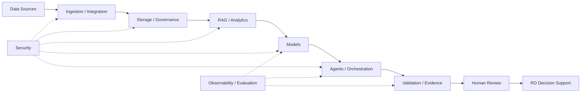

# Chapter 34 — AI Total Cost of Ownership

> **Advisor question:** What will this architecture actually cost over its useful life, and what evidence shows that the economics remain acceptable as workload, scale, and technology change?

## FOUNDATION

AI cost is not the same as an API price, GPU-hour, or cloud invoice.

**Total Cost of Ownership (TCO)** is a lifecycle view of the costs required to acquire, build, operate, maintain, govern, change, and eventually retire a technology capability. FinOps defines TCO as a comprehensive assessment of IT costs across enterprise boundaries over time, including acquisition, management, support, communications, labor, downtime opportunity cost, training, and productivity losses. urlFinOps terminology — Total Cost of Ownershiphttps://framework.finops.org/assets/terminology/

For AI, this matters because cost is distributed across model inference, data, infrastructure, engineering, security, evaluation, human review, vendor commitments, and operational support.

A useful architecture principle is:

> **Do not optimize the cheapest component. Optimize the lowest sustainable cost of producing the required useful outcome.**

---

## 34.1 Price Is Not TCO

Suppose two architectures have:

- different model prices;
- different retrieval infrastructure;
- different engineering requirements;
- different human-review rates;
- different availability characteristics;
- different migration costs.

The architecture with the lowest model price may still have the highest lifecycle cost.

For comparison, separate at least:

**CAPEX / one-time cost**
- hardware acquisition;
- implementation;
- migration;
- initial data preparation;
- integration;
- training.

**OPEX / recurring cost**
- inference;
- compute;
- storage;
- network;
- licenses;
- support;
- operations;
- monitoring;
- security;
- evaluation;
- human review.

**Lifecycle / change cost**
- upgrades;
- retraining;
- revalidation;
- model migration;
- provider changes;
- architecture changes;
- incident response;
- retirement.

---

## 34.2 AI TCO Boundary

Define the boundary before calculating anything.

A practical AI system boundary may include:

```text
User / Application
        |
        v
AI Application & Orchestration
        |
   +----+----+
   |         |
   v         v
RAG/Data   Model Service
   |         |
   +----+----+
        |
        v
Cloud / Compute / Network

Cross-cutting:
Security · IAM · Evaluation · Observability · Governance · Support
```

The boundary should include shared services when they materially support the workload.

Do not compare a managed AI API against self-hosting while counting only the provider invoice for the former and only GPU electricity for the latter.

**Advisor rule:** Equalize the accounting boundary before comparing architectures.

---

## 34.3 Direct, Shared, and Hidden Costs

Classify costs as:

| Category | Example |
|---|---|
| Direct | model API charges for the workload |
| Shared | enterprise identity, network, platform, security |
| Labor | engineering, SRE, data engineering, ML engineering |
| Governance | evaluation, audit, risk review |
| Failure | retries, incidents, remediation |
| Opportunity | capacity consumed by one architecture instead of another |
| Transition | migration, training, integration, replacement |

Some costs cannot be allocated precisely. That does not make them irrelevant.

Document the allocation method and its uncertainty.

---

## 34.4 AI Cost Drivers

Typical drivers include:

- request volume;
- input tokens;
- output tokens;
- context length;
- model size;
- inference concurrency;
- GPU/CPU utilization;
- retrieval volume;
- embeddings;
- reranking;
- storage;
- data transfer;
- tool calls;
- retries;
- evaluation frequency;
- human review;
- availability requirements;
- data retention;
- engineering effort.

FinOps identifies AI as a distinct cost-management scope because AI spending can cross cloud, data-center, SaaS, model vendors, and other technology categories and can be difficult to forecast. citeturn0search0turn0search26

---

## 34.5 Build a Cost Model From the Workload

Start with workload assumptions, not vendor pricing.

Example assumptions:

| Driver | Illustrative assumption |
|---|---:|
| Requests / month | 100,000 |
| Average input tokens | 8,000 |
| Average output tokens | 1,500 |
| Retrieval calls / request | 2 |
| Human review rate | 15% |
| Availability target | business hours |
| Evaluation runs / month | 4 |

These numbers are **Assumptions**, not facts.

The model should make each assumption visible so it can be replaced by measured production data later.

---

## 34.6 A Simple TCO Formula

A practical conceptual model is:

```text
TCO
=
Initial Build
+ Infrastructure
+ Model / API
+ Data Platform
+ Integration
+ Security & Governance
+ Operations
+ Human Review
+ Change / Upgrade
+ Failure / Incident
+ Retirement / Migration
```

For a defined period:

```text
TCO(T)
= CAPEX
+ Σ OPEX_t
+ Σ ChangeCost_t
+ ExpectedFailureCost
+ TransitionCost
```

This is an analytical model, not an accounting standard. The organization should align the final treatment with its finance/accounting policies.

---

## 34.7 Cost Per Useful Outcome

Raw infrastructure cost is often too far from the decision.

FinOps recommends unit economics that connect technology spending to measurable business or workload outcomes; for AI, examples include cost per API call and cost per useful business outcome. citeturn0search1turn0search6

For AI-IDSS, useful units might include:

- cost per validated risk alert;
- cost per investment memo reviewed;
- cost per document successfully extracted;
- cost per accepted analyst recommendation-support package;
- cost per portfolio company monitored.

A useful conceptual metric is:

```text
Cost per Useful Result
=
Total AI System Cost
─────────────────────
Accepted Useful Results
```

The denominator must be defined carefully. A generated answer is not necessarily a useful result.

---

## 34.8 Cost Per Useful Result vs Cost Per Token

Token cost is a resource-efficiency metric.

It is useful, but incomplete.

Consider two systems:

- System A: $0.01 per request, 70% accepted;
- System B: $0.02 per request, 95% accepted.

Illustratively:

```text
A: $0.01 / 0.70 = $0.0143 per accepted result
B: $0.02 / 0.95 = $0.0211 per accepted result
```

Here A remains cheaper under this simplified metric.

But if rejected outputs require expensive human correction, the result can reverse.

Therefore include downstream cost, not only acceptance rate.

---

## 34.9 Human Review Is Part of AI Economics

Human-in-the-loop is not economically free.

Include:

- reviewer time;
- review frequency;
- escalation time;
- correction effort;
- training;
- management overhead.

For AI-IDSS, however, removing human review merely to lower unit cost can increase decision risk.

The correct question is:

> What level of human involvement produces the required risk-adjusted outcome at acceptable lifecycle cost?

This is an architectural trade-off, not a mandate to minimize human labor.

---

## 34.10 Failure Cost

AI systems can generate cost without producing useful output.

Examples:

- failed inference;
- retry storms;
- irrelevant retrieval;
- hallucinated analysis requiring correction;
- incorrect tool execution;
- provider outage;
- model regression;
- data-quality incident;
- security incident.

Therefore estimate:

```text
Expected Failure Cost
≈
Probability of Failure
×
Cost per Failure
```

For consequential systems, a simple expected-value calculation may be insufficient because rare failures can have asymmetric consequences. Record the limitations of the economic model.

---

## 34.11 Reliability Has an Economic Cost

Higher reliability can require:

- redundancy;
- additional capacity;
- multi-region deployment;
- backups;
- failover;
- operational staff;
- testing.

These costs may be justified when downtime or incorrect behavior is expensive.

Conversely, excessive availability architecture for a low-impact workload may be economically irrational.

**Advisor rule:** Specify the economic consequence of failure before specifying the reliability architecture.

---

## 34.12 RAG TCO

RAG adds costs beyond model inference:

- document ingestion;
- parsing/OCR;
- chunking;
- embeddings;
- vector or hybrid search;
- metadata management;
- index updates;
- storage;
- retrieval calls;
- reranking;
- access-control enforcement;
- evaluation;
- synchronization.

Do not conclude that RAG is expensive or cheap in general.

Compare its lifecycle cost against the alternatives for the actual knowledge workload.

---

## 34.13 Fine-Tuning TCO

Fine-tuning can introduce:

- dataset preparation;
- training compute;
- experimentation;
- evaluation;
- model storage;
- serving infrastructure;
- version management;
- retraining;
- rollback;
- governance.

If the underlying knowledge changes frequently, repeated retraining may materially affect lifecycle economics.

This connects directly to Chapter 32: the cheapest intervention depends on whether the problem is knowledge, behavior, retrieval, or model capability.

---

## 34.14 Self-Hosted vs Managed TCO

A common comparison is:

> Managed API vs self-hosted model.

The correct comparison is not:

```text
API invoice vs GPU invoice
```

It is closer to:

```text
Managed
= API + integration + governance + support + related infrastructure

Self-hosted
= hardware/cloud compute + serving + engineering + operations
  + security + upgrades + capacity + redundancy + support
```

Self-hosting can be economically attractive at some utilization levels and workload profiles. Managed services can be attractive when utilization is variable or operational simplicity has significant value.

Neither is universally cheaper.

---

## 34.15 Utilization and Break-Even

For infrastructure-heavy architectures, utilization is often an important economic variable.

Illustratively:

```text
Effective Cost per Useful Unit
≈
Fixed Cost + Variable Cost
───────────────────────────
Useful Work Produced
```

A self-hosted accelerator with low utilization may have poor economics despite a low marginal inference cost.

At sufficiently high and predictable utilization, fixed infrastructure can become more competitive.

The break-even point must be calculated from actual assumptions rather than inferred from hardware price alone.

---

## 34.16 Forecasting AI Cost

AI cost forecasts are uncertain because workload, model behavior, pricing, and architecture can change.

FinOps notes that AI forecasting can be harder because of volatile usage, heterogeneous pricing, token-based billing, and rapidly evolving tools. citeturn0search0

Use scenarios rather than one false-precision number:

| Scenario | Volume | Context | Model | Result |
|---|---:|---:|---|---|
| Low | 50k | Short | Efficient | $X |
| Base | 100k | Medium | Standard | $Y |
| High | 250k | Long | High-capability | $Z |

**X/Y/Z are outputs of the organization's model, not universal benchmarks.**

Expose sensitivity to the variables that matter most.

---

## 34.17 Sensitivity Analysis

A TCO model should answer:

> Which assumptions can change the decision?

Test sensitivity to:

- request volume;
- token volume;
- model price;
- model mix;
- utilization;
- human-review rate;
- failure rate;
- retrieval volume;
- storage growth;
- engineering staffing;
- provider discount;
- availability requirements.

If a recommendation changes when one uncertain assumption moves slightly, the recommendation should explicitly disclose that sensitivity.

---

## 34.18 Vendor Pricing and Contract Risk

Do not treat published list price as the complete economic picture.

Review:

- committed-use discounts;
- minimum commitments;
- reserved capacity;
- tier pricing;
- rate limits;
- egress charges;
- storage charges;
- support plans;
- contractual price protections;
- price-change provisions;
- termination costs;
- migration costs.

For current vendor pricing, use current primary pricing and contractual documents rather than relying on static numbers in an architecture book.

---

## 34.19 Cost Allocation and Accountability

Shared AI infrastructure creates an attribution problem.

FinOps recommends explicit allocation strategies using accounts, tags, labels, hierarchies, and documented treatment of shared costs. citeturn0search4

For an enterprise AI platform, allocate where practical by:

- application;
- use case;
- business unit;
- portfolio company;
- environment;
- model;
- provider;
- workload.

The goal is not perfect accounting precision. It is sufficient visibility to make architecture and investment decisions responsibly.

---

## 34.20 TCO and Architecture Decisions

TCO should influence architecture early, not after implementation.

Use it when deciding:

- managed vs self-hosted;
- cloud vs on-prem;
- one model vs multi-model;
- RAG architecture;
- model routing;
- caching;
- batch vs synchronous processing;
- storage strategy;
- retention period;
- redundancy;
- build vs buy;
- vendor selection.

FinOps explicitly positions unit economics as useful in build-vs-buy, architecture, workload-placement, migration, sourcing, and related decisions. citeturn0search1

---

## 34.21 TCO for AI-IDSS

For the AI-IDSS, a practical cost chain is:



The economic objective is not “minimum AI spend.”

It is:

> **Produce sufficiently reliable decision support at an economically justified lifecycle cost.**

---

## 34.22 Common TCO Anti-Patterns

### Anti-pattern 1 — Compare API price only

**Problem:** ignores engineering, data, operations, and human cost.

### Anti-pattern 2 — Compare GPU price only

**Problem:** ignores utilization, serving, staffing, power, redundancy, and lifecycle replacement.

### Anti-pattern 3 — Ignore human review

**Problem:** creates false economics.

### Anti-pattern 4 — Ignore failed outputs

**Problem:** assumes every inference creates value.

### Anti-pattern 5 — False precision

**Problem:** produces a $1,237,482 forecast from uncertain assumptions.

### Anti-pattern 6 — Optimize tokens instead of outcomes

**Problem:** a lower token bill may produce more correction work.

### Anti-pattern 7 — Ignore transition cost

**Problem:** makes migration or vendor switching appear free.

### Anti-pattern 8 — Treat cost as an afterthought

**Problem:** architecture decisions have already locked in expensive dependencies.

---

## 34.23 Technical Challenge Questions

When reviewing AI economics, ask:

1. What is the accounting boundary?
2. What is CAPEX versus OPEX?
3. Which shared costs have been allocated?
4. What are the workload drivers?
5. Which assumptions are measured and which are estimates?
6. What is the cost per useful outcome?
7. What is the human-review cost?
8. What is the expected failure cost?
9. How does utilization affect the result?
10. What happens under 2× or 5× workload?
11. What happens if model pricing changes?
12. What happens if the model must be replaced?
13. What is the cost of security and governance?
14. What costs are excluded, and why?
15. Which assumption could reverse the recommendation?

---

## 34.24 Evidence Discipline

Every TCO model should distinguish:

- **Fact** — actual invoice, contract, measured workload, or authoritative pricing;
- **Assumption** — expected volume, staffing, utilization, growth;
- **Estimate** — calculated value based on assumptions;
- **Scenario** — deliberately constructed future case;
- **Sensitivity** — effect of changing an assumption;
- **Recommendation** — advisor conclusion based on the model.

Never present an estimated TCO as a known fact.

A cost model is only as defensible as:

**scope + assumptions + source data + formulas + uncertainty.**

---

## 34.25 What Would Change Our Mind?

An advisor should state in advance what evidence could reverse the recommendation.

Examples:

- production volume is materially higher than forecast;
- model quality changes human-review rates;
- provider pricing changes;
- self-hosted utilization is substantially higher than assumed;
- engineering staffing is already available;
- security requirements make one architecture unacceptable;
- a new model materially reduces inference cost at equivalent quality;
- migration cost is higher than estimated.

This converts TCO from a static spreadsheet into a decision model.

---

## 34.26 Field Rule

> **Do not ask, “Which AI architecture is cheapest?” Ask, “Which architecture produces the required outcome at the lowest defensible lifecycle cost, under the security, reliability, quality, and strategic constraints that actually matter?”**

For AI-IDSS:

> **The right architecture is not the one with the lowest model bill. It is the one that can sustainably produce trustworthy decision support at an economically justified total cost.**
