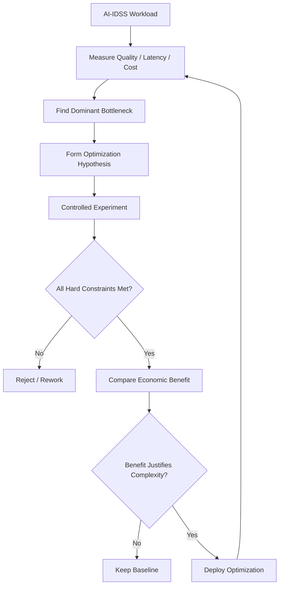

# Chapter 35 — Cost / Performance Optimization

> **Advisor question:** How do we improve AI system efficiency without degrading the quality, reliability, security, or decision value that the system is required to provide?

## FOUNDATION

Cost optimization and performance optimization are not separate engineering exercises. They are competing and sometimes complementary constraints on the same workload.

A useful objective is:

> **Meet the required service and decision-quality objectives at the lowest justified total resource cost.**

That is different from:

> Make the system as cheap as possible.

A cheaper system that produces materially worse results, higher failure rates, unacceptable latency, or additional human rework may not be more efficient.

AWS Well-Architected guidance explicitly recommends evaluating cost, reliability, security, and performance together and testing architectural trade-offs rather than assuming that every performance improvement is beneficial. urlAWS Well-Architected — Evaluate Trade-offshttps://docs.aws.amazon.com/wellarchitected/latest/framework/perf_architecture_evaluate_trade_offs.html

For AI workloads, this becomes especially important because model inference, retrieval, data movement, specialized compute, orchestration, and human review can all contribute to the effective cost of a useful result.

---

## 35.1 Start With the Workload

Optimization without workload definition is guesswork.

Define:

- requests per day/month;
- concurrency;
- input and output size;
- latency objective;
- throughput objective;
- availability requirement;
- quality threshold;
- data freshness requirement;
- peak-to-average ratio;
- workload variability;
- geographic distribution;
- human-review rate;
- acceptable failure rate.

For AI-IDSS, also define the decision workload:

- number of portfolio companies;
- number of alerts evaluated;
- documents processed;
- frequency of risk assessment;
- number of analysts/RD users;
- expected review volume;
- consequences of missed or false alerts.

**Advisor rule:** Never optimize a component before understanding the workload it serves.

---

## 35.2 Define the Objective Function

Optimization requires an explicit objective.

A simplified conceptual formulation is:

```text
Minimize:
    Total System Cost

Subject to:
    Quality >= required threshold
    p95 latency <= target
    Availability >= target
    Security controls >= required baseline
    Data freshness <= allowed age
    Capacity >= required workload
```

This is an architectural framing, not a claim that every organization must solve a formal mathematical optimization problem.

The constraints matter because reducing one metric may violate another.

Examples:

- lower model size may reduce cost but reduce quality;
- aggressive caching may reduce latency but introduce stale data;
- batching may improve utilization but increase latency;
- smaller retrieval context may reduce token cost but remove evidence;
- aggressive autoscaling may improve responsiveness but increase infrastructure cost;
- fewer human reviews may reduce operating cost but increase decision risk.

---

## 35.3 Optimize the End-to-End System

Do not optimize the most expensive component in isolation.

A typical AI request may traverse:

```text
User
  ↓
API / Gateway
  ↓
Orchestration
  ↓
Retrieval
  ↓
Data / Search
  ↓
Model Inference
  ↓
Tool Calls
  ↓
Validation
  ↓
Human Review
  ↓
Decision
```

The dominant cost or latency may move as one component is optimized.

For example, reducing model inference time may have little effect if retrieval or downstream tools dominate end-to-end latency.

**Advisor question:** Where is the actual bottleneck in the complete request path?

---

## 35.4 Cost Per Useful Result

Unit economics is usually more informative than raw infrastructure cost.

A useful conceptual metric is:

```text
Total AI System Cost
─────────────────────
Accepted Useful Results
```

The denominator should be defined carefully.

An output may be technically generated but still not be useful because it is:

- incorrect;
- unsupported by evidence;
- rejected by validation;
- unusable by the analyst;
- duplicated;
- too slow;
- unsafe;
- requiring substantial manual correction.

FinOps identifies unit economics and time-to-business-value as useful ways to connect AI spending with business outcomes. citeturn0search14turn0search15

This supports a broader advisor principle:

> **Optimize the economics of useful outcomes, not merely the price of infrastructure.**

---

## 35.5 Find the Dominant Cost Drivers

Break cost into components before optimizing.

Typical categories include:

| Layer | Potential cost drivers |
|---|---|
| Model | input/output tokens, inference calls, model tier |
| Retrieval | embeddings, search, reranking |
| Data | storage, processing, replication |
| Compute | CPU, GPU, accelerator utilization |
| Network | transfer and egress |
| Orchestration | workflow execution, queues, middleware |
| Observability | logs, traces, metrics, retention |
| Security | scanning, DLP, security services |
| Human | review, correction, escalation |
| Engineering | development, evaluation, operations |
| Vendor | subscriptions, minimum commitments, support |

The distribution is workload-specific.

Do not assume model inference is always the largest cost.

---

## 35.6 Right-Size Compute

Right-sizing means matching resources to the actual workload rather than provisioning for an imagined worst case without an economic justification.

Measure:

- utilization;
- throughput;
- latency;
- queue depth;
- memory pressure;
- accelerator utilization;
- idle capacity;
- peak demand;
- scaling behavior.

A system with permanently idle high-end accelerators may be technically fast but economically inefficient.

Conversely, aggressive under-provisioning can increase queueing, latency, failures, and operational cost.

AWS guidance recommends factoring cost into architecture decisions and using right-sizing and elasticity to improve resource utilization. citeturn0search5turn0search10

---

## 35.7 Utilization Matters More Than Hardware Prestige

For accelerator-backed AI systems, compare useful work against provisioned capacity.

Conceptually:

```text
Effective Utilization
=
Useful Work Performed
──────────────────────
Provisioned Capacity
```

The exact metric depends on the workload.

For inference, useful measurements can include:

- requests served;
- tokens processed;
- successful inferences;
- useful results;
- accelerator-seconds per useful result.

Do not compare hardware only by theoretical compute specifications.

The relevant question is:

> Which configuration delivers the required workload most efficiently under production conditions?

---

## 35.8 Model Selection as an Optimization Lever

Chapter 30 established that model selection is an architecture decision.

It is also a cost/performance lever.

Possible strategies include:

- smaller model for simple tasks;
- larger model for complex tasks;
- specialized model for narrow workloads;
- model routing;
- asynchronous processing for non-urgent tasks;
- fallback to a validated lower-cost model where semantics remain acceptable.

But routing adds complexity and can create classification errors.

Therefore:

> **Use model diversity only when measured savings or quality improvements justify the additional architecture.**

AWS ML guidance explicitly includes comparing custom and pre-trained models, selecting appropriate compute size, optimizing inference, and deploying multiple models where useful. citeturn0search7

---

## 35.9 Reduce Unnecessary Model Work

One of the simplest optimization strategies is not making unnecessary model calls.

Possible techniques:

- deterministic preprocessing;
- validation before inference;
- deduplication;
- caching safe results;
- request aggregation;
- filtering irrelevant documents;
- retrieval before expensive generation;
- smaller context;
- asynchronous processing;
- avoiding repeated tool calls.

The key qualification is **safe**.

Do not cache or reuse an answer when:

- the underlying data has changed;
- authorization differs;
- the answer is user-specific;
- the task is time-sensitive;
- the model output is stochastic in a way that matters;
- evidence freshness is required.

Optimization must preserve semantics.

---

## 35.10 Prompt and Context Optimization

Prompt/context size can influence both cost and latency for token-based inference.

Possible approaches:

- remove redundant instructions;
- compress repetitive context;
- retrieve only relevant evidence;
- summarize appropriate historical material;
- use structured context;
- avoid repeatedly sending unchanged large payloads where the architecture supports safer alternatives.

But shorter context is not automatically better.

For AI-IDSS, removing a document may reduce token cost while also removing the evidence needed to justify a risk alert.

Therefore evaluate:

```text
Context Reduction
       ↓
Token Cost ↓
       ↓
Did decision quality change?
```

If quality deteriorates, the optimization is not necessarily valid.

---

## 35.11 Retrieval Optimization

RAG systems can often be optimized before changing the generation model.

Measure:

- retrieval recall;
- precision;
- ranking quality;
- context size;
- duplicate content;
- retrieval latency;
- reranking cost;
- index size;
- update frequency.

Potential optimizations include:

- metadata filtering;
- better chunking;
- hybrid retrieval;
- reranking only when useful;
- query rewriting where justified;
- removing obsolete documents;
- better source partitioning.

Do not optimize retrieval solely for speed if it reduces evidence quality below the decision requirement.

---

## 35.12 Caching

Caching can improve both performance and cost, but cached data has a validity period.

Potential cache targets:

- embeddings;
- retrieval results;
- deterministic transformations;
- repeated model requests where semantics permit;
- static reference data;
- intermediate computation.

For each cache define:

- what is cached;
- key structure;
- TTL or invalidation condition;
- authorization scope;
- source version;
- acceptable staleness;
- invalidation mechanism.

AWS explicitly identifies caching as a performance improvement that can introduce correctness trade-offs if invalidation is not handled appropriately. citeturn0search0

For AI-IDSS, authorization must be part of cache design. A cache must not allow one user's authorized context to become another user's accessible context.

---

## 35.13 Batching and Asynchronous Processing

Batching can improve resource utilization when the workload permits it.

Good candidates may include:

- overnight portfolio analysis;
- document classification;
- embedding generation;
- periodic risk recalculation;
- back-office enrichment.

Poor candidates may include:

- interactive RD questions requiring immediate response;
- urgent risk alerts;
- actions whose value depends on low latency.

Separate workloads by latency requirement instead of forcing every workload through the same serving architecture.

---

## 35.14 Autoscaling

Autoscaling can align resource capacity with workload variation.

Evaluate:

- scale-up trigger;
- scale-down trigger;
- warm-up time;
- minimum capacity;
- maximum capacity;
- queue behavior;
- cold-start impact;
- cost during idle periods;
- provider quota constraints.

Autoscaling is not free.

A system with slow model startup may need warm capacity, which increases idle cost. A system with aggressive scaling may create unstable capacity behavior.

Measure the complete workload rather than assuming autoscaling always lowers cost.

---

## 35.15 Latency Optimization

Break latency into components:

```text
End-to-End Latency
=
Network
+ Queue
+ Retrieval
+ Tool Calls
+ Model Time
+ Validation
+ Human Interaction
```

The equation is conceptual; actual systems may have parallel paths.

Measure p50, p95, and p99 where appropriate.

Then optimize the dominant contributor.

A 50% reduction in model latency is not meaningful if the model accounts for only 10% of total latency.

---

## 35.16 Throughput Optimization

Throughput improvements can come from:

- batching;
- concurrency;
- parallel retrieval/tool calls;
- larger or better-utilized compute;
- asynchronous queues;
- workload partitioning;
- model routing;
- caching.

But increased throughput may increase:

- queueing;
- concurrency pressure;
- downstream load;
- provider rate-limit consumption;
- cost;
- failure blast radius.

Therefore throughput should be optimized against the complete system capacity.

---

## 35.17 Reliability–Cost Trade-Off

Reliability often requires redundancy and capacity headroom.

Reducing infrastructure cost too aggressively can reduce:

- availability;
- failover capability;
- recovery speed;
- capacity under peak load.

Conversely, excessive redundancy can create unjustified cost.

The correct question is:

> What level of resilience does the workload actually require, and what is the economic cost of achieving it?

For an AI-IDSS used for important investment decisions, the cost of an outage or degraded service should be considered alongside infrastructure savings.

---

## 35.18 Quality–Cost Trade-Off

A lower-cost model is not necessarily a cost optimization if it increases:

- false alerts;
- missed alerts;
- human corrections;
- repeated queries;
- manual investigation;
- downstream errors.

A useful conceptual model is:

```text
Effective Cost
=
Technology Cost
+
Failure Cost
+
Human Correction Cost
+
Operational Cost
```

The terms are not universally measurable with precision. The purpose is to ensure that visible infrastructure cost does not obscure material downstream cost.

---

## 35.19 Security–Cost Trade-Off

Security controls also consume resources.

Examples:

- encryption and key management;
- private networking;
- DLP inspection;
- audit logging;
- security monitoring;
- access-control enforcement;
- isolated environments.

The objective is not to eliminate these costs. It is to select controls proportionate to the risk and required architecture.

Never remove a required security control merely because it increases infrastructure cost.

Instead ask whether the same security objective can be achieved more efficiently.

---

## 35.20 Experiment Before Optimizing at Scale

Optimization should be evidence-driven.

A useful experiment has:

1. baseline;
2. hypothesis;
3. controlled change;
4. representative workload;
5. success metrics;
6. cost metrics;
7. quality metrics;
8. regression checks;
9. decision threshold.

For example:

> **Hypothesis:** reducing retrieved context by 30% will reduce inference cost without materially reducing risk-alert quality.

Measure:

- token usage;
- latency;
- retrieval quality;
- evidence coverage;
- false-alert rate;
- missed-risk rate;
- human correction rate.

If the quality constraint fails, reject the optimization regardless of token savings.

AWS recommends using experiments and proof-of-concepts to evaluate cost/performance trade-offs under workload requirements. citeturn0search0

---

## 35.21 Pareto Thinking

There may be no single architecture that is best on every dimension.

Consider candidate configurations:

| Option | Quality | Latency | Cost | Complexity |
|---|---:|---:|---:|---:|
| A | High | High | High | Low |
| B | High | Medium | Medium | Medium |
| C | Medium | Low | Low | Medium |
| D | High | Low | High | High |

An option is potentially dominated when another option provides equal or better outcomes across relevant dimensions at lower cost/complexity.

The objective is not necessarily to minimize every metric. It is to identify a configuration that satisfies hard constraints and offers an acceptable trade-off.

---

## 35.22 Cost Attribution

AI costs should be attributable enough to support decisions.

Useful dimensions can include:

- application;
- business unit;
- use case;
- model;
- environment;
- portfolio company;
- workload type;
- team;
- provider;
- project.

FinOps guidance highlights the difficulty of attributing AI costs across shared storage, compute, data transfer, and specialized infrastructure and recommends improving visibility and attribution to reconcile actual spending with business-case assumptions. citeturn0search15

Perfect attribution is not always economically justified.

**Advisor rule:** Attribution should be sufficiently accurate to support the decisions it is intended to inform.

---

## 35.23 Optimization by Lifecycle Stage

Optimization opportunities differ by stage.

| Stage | Typical optimization focus |
|---|---|
| Experimentation | avoid unnecessary large-scale infrastructure |
| Evaluation | representative workload without excessive spend |
| Training/fine-tuning | efficient compute and experiment management |
| Deployment | right-sizing and serving efficiency |
| Production | utilization, routing, caching, throughput |
| Scaling | elasticity and capacity planning |
| Maintenance | remove waste and obsolete resources |
| Retirement | eliminate unused infrastructure and contracts |

AWS's ML Lens treats cost optimization as a lifecycle activity rather than a one-time production exercise. citeturn0search7

---

## 35.24 AI-IDSS Optimization Pattern

A practical optimization loop is:



Cross-cutting constraints:

**Quality · Evidence · Security · Reliability · Latency · Cost · Human Oversight**

For AI-IDSS, optimization must never silently weaken the evidentiary basis of a recommendation.

---

## 35.25 Common Optimization Anti-Patterns

### Anti-pattern 1 — Cheapest model wins

**Problem:** ignores quality and downstream correction cost.

### Anti-pattern 2 — Biggest GPU is fastest, therefore best

**Problem:** ignores utilization and workload economics.

### Anti-pattern 3 — Cache everything

**Problem:** can introduce stale or cross-user data.

### Anti-pattern 4 — Reduce context aggressively

**Problem:** may remove evidence required for a defensible answer.

### Anti-pattern 5 — Optimize before measuring

**Problem:** effort may target a non-dominant bottleneck.

### Anti-pattern 6 — Optimize one component

**Problem:** end-to-end performance may not improve.

### Anti-pattern 7 — Remove redundancy to save money

**Problem:** can violate availability or recovery requirements.

### Anti-pattern 8 — Add model routing everywhere

**Problem:** routing complexity can exceed demonstrated savings.

### Anti-pattern 9 — Count generated answers as useful results

**Problem:** ignores rejected, incorrect, or manually corrected outputs.

---

## 35.26 Technical Challenge Questions

Ask:

1. What is the actual workload?
2. What is the dominant cost driver?
3. What is the dominant latency contributor?
4. What quality threshold must not be violated?
5. What security controls are non-negotiable?
6. What evidence supports the proposed optimization?
7. What happens to error rates after optimization?
8. Does caching introduce unacceptable staleness or authorization risk?
9. Does smaller context reduce evidence coverage?
10. Does model routing justify its complexity?
11. What happens at peak load?
12. What happens when a provider rate limit is reached?
13. What is the incremental cost of redundancy?
14. What human effort is created or removed?
15. What would make us reverse the optimization?

---

## 35.27 Architecture Review Checklist

- [ ] Workload is defined
- [ ] Quality threshold is explicit
- [ ] Latency objective is explicit
- [ ] Cost baseline exists
- [ ] Dominant cost drivers are identified
- [ ] Dominant performance bottlenecks are measured
- [ ] End-to-end rather than component metrics are considered
- [ ] Model alternatives have been evaluated
- [ ] Retrieval/context costs are included
- [ ] Human review cost is considered
- [ ] Security constraints remain intact
- [ ] Reliability requirements remain intact
- [ ] Optimization was tested with representative workload
- [ ] Regression testing was performed
- [ ] Cost attribution is adequate for the decision
- [ ] Complexity introduced by the optimization is documented
- [ ] Rollback is possible

---

## 35.28 Evidence Discipline

### Fact

Established guidance supports treating cost, performance, reliability, security, and workload requirements as interacting architectural concerns and evaluating trade-offs through measurement and experimentation. citeturn0search0turn0search5

### Industry Evidence

AWS's ML Lens explicitly includes resource optimization, cost reduction, model/inference optimization, and lifecycle cost optimization. citeturn0search3turn0search7

FinOps guidance emphasizes AI unit economics, cost attribution, and infrastructure-model effects on AI economics. citeturn0search14turn0search15

### Recommendation

For AI-IDSS, optimize for **cost per useful, sufficiently reliable decision-support result**, subject to explicit quality, security, reliability, and latency constraints.

### Assumption

The organization can measure enough of the downstream human and decision process to estimate useful-result economics. If that assumption is false, cost optimization may need to rely more heavily on technical unit metrics and bounded experiments.

### Uncertainty

There is no universal optimal combination of model size, compute, retrieval strategy, caching, batching, and serving architecture. The correct configuration depends on workload characteristics and constraints.

---

## 35.29 What Would Change Our Mind?

We would change an optimization recommendation if:

- production evidence shows material quality degradation;
- human correction cost increases;
- security or authorization controls weaken;
- reliability falls below the required objective;
- latency becomes unacceptable;
- workload characteristics change;
- the expected cost saving does not materialize;
- operational complexity exceeds the demonstrated benefit.

This keeps optimization falsifiable rather than ideological.

---

## 35.30 Field Rule

> **Do not optimize AI for the lowest infrastructure bill. Optimize the complete system for the lowest justified cost of delivering the required quality, evidence, security, reliability, and performance.**

And for the advisor:

> **Every optimization is a trade-off. Make the trade-off explicit, measure it against the workload, and preserve the decision boundary.**
