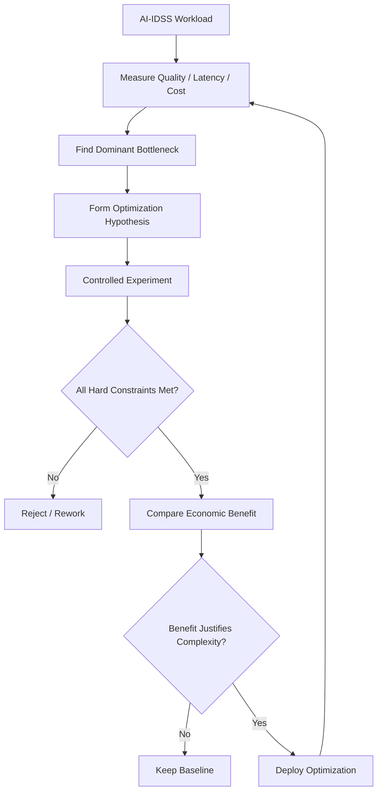

# Chapter 35 — Cost / Performance Optimization

> **Advisor question:** How do we improve AI system efficiency without degrading the quality, reliability, security, or decision value that the system is required to provide?

## FOUNDATION

Cost optimization and performance optimization are not separate engineering exercises. They are constraints on the same workload.

A useful objective is:

> **Meet the required service and decision-quality objectives at the lowest justified total resource cost.**

That is different from:

> Make the system as cheap as possible.

A lower infrastructure bill can be a false economy if it creates more failures, human correction, latency, security exposure, or decision loss.

FinOps now treats AI as a distinct cost-management scope because AI spending combines rapidly changing tools, heterogeneous pricing, specialized infrastructure, and business-value questions. Its current guidance emphasizes **use-case economics**: measuring the total cost of achieving a defined business outcome rather than relying only on tokens or GPU-hours. urlFinOps for AI — Tools & Services Considerationshttps://www.finops.org/wg/finops-for-ai-tools-services-considerations/

The 2026 AI landscape makes this even more important. Stanford's 2026 AI Index reports rapid capability gains and convergence among leading models, while noting that competitive pressure is increasingly shifting toward cost, reliability, and domain-specific performance. It also documents growing concerns about benchmark reliability and real-world generalization. See the Stanford AI Index evidence review for the underlying sources and limitations.

Therefore:

> **Do not optimize a model, GPU, token bill, or latency number in isolation. Optimize the complete system against the workload and the value it must deliver.**

---

## 35.1 Start With the Workload

Optimization without workload definition is guesswork.

Define at least:

- requests per day/month;
- concurrency;
- input and output size;
- latency objective;
- throughput objective;
- availability requirement;
- quality threshold;
- data freshness requirement;
- peak-to-average ratio;
- workload variability;
- geographic distribution;
- human-review rate;
- acceptable failure rate.

For AI-IDSS, also define the decision workload:

- number of portfolio companies;
- documents processed;
- frequency of risk assessment;
- number of alerts evaluated;
- number of users;
- review volume;
- consequences of false or missed alerts.

**Advisor rule:** Never optimize a component before understanding the workload it serves.

---

## 35.2 Define the Objective Function

A simplified architectural formulation is:

```text
Minimize:
    Total System Cost

Subject to:
    Quality >= required threshold
    Latency <= target
    Availability >= target
    Security controls >= required baseline
    Data freshness <= allowed age
    Capacity >= required workload
```

This is a reasoning model, not a requirement to implement formal mathematical optimization.

The constraints matter because improvements can conflict:

- smaller models can reduce cost but reduce quality;
- caching can reduce latency but introduce staleness;
- batching can improve utilization but increase latency;
- shorter context can reduce token usage but remove evidence;
- aggressive autoscaling can reduce idle capacity but increase cold-start risk;
- fewer human reviews can reduce labor cost but increase decision risk.

---

## 35.3 Optimize the End-to-End System

A typical AI request may traverse:

```text
User
  ↓
API / Gateway
  ↓
Orchestration
  ↓
Retrieval
  ↓
Data / Search
  ↓
Model Inference
  ↓
Tool Calls
  ↓
Validation
  ↓
Human Review
  ↓
Decision
```

The dominant cost or latency may move when one component is optimized.

For example, reducing model inference time may have little effect if retrieval, external tools, queueing, or human review dominate end-to-end time.

**Advisor question:** Where is the actual bottleneck in the complete request path?

---

## 35.4 Cost Per Useful Result

Raw infrastructure cost is too far from the decision.

A useful conceptual metric is:

```text
Cost per Useful Result
=
Total AI System Cost
─────────────────────
Accepted Useful Results
```

The denominator must be defined carefully. A generated answer is not automatically a useful result.

A result may be rejected because it is:

- incorrect;
- unsupported by evidence;
- unsafe;
- stale;
- unusable by the analyst;
- duplicated;
- too slow;
- requiring substantial manual correction.

FinOps explicitly recommends use-case economics and examples such as cost per query resolved or document summarized. It also emphasizes that these metrics should be reviewed continuously because changes in models, caching, serving, or retrieval can change the economics. See the FinOps evidence review for the cited guidance.

> **Optimize the economics of useful outcomes, not merely the price of infrastructure.**

---

## 35.5 AI Price-Performance Is a Moving Target

Model economics should not be treated as static.

Current model evaluation systems increasingly compare several dimensions simultaneously: capability, price, latency, speed, token usage, and cost per task. Artificial Analysis, for example, distinguishes model, endpoint, and provider performance and calculates cost per task from actual token consumption rather than token price alone. See the Artificial Analysis evidence review for the methodology and scope.

This creates an important distinction:

| Metric | What it tells us |
|---|---|
| Price per token | Unit resource price |
| Cost per task | Cost under a defined benchmark workload |
| Latency | Responsiveness under a measurement method |
| Throughput | Work processed over time |
| Quality | Task performance |
| Cost per useful result | Economic efficiency of accepted output |
| Business value | Economic effect on the organization |

None is sufficient by itself.

A model with a lower token price can consume more tokens. A faster model can produce lower-quality outputs that require more human correction. A higher-cost model can be economically superior if it materially increases accepted useful results.

**Field rule:** Compare models on the workload that matters, not only on published price or general benchmarks.

---

## 35.6 Find the Dominant Cost Drivers

Break cost into components before optimizing:

| Layer | Potential drivers |
|---|---|
| Model | input/output tokens, reasoning work, inference calls, model tier |
| Retrieval | embeddings, search, reranking, index maintenance |
| Data | storage, processing, replication, synchronization |
| Compute | CPU/GPU utilization, idle capacity, memory |
| Network | transfer and egress |
| Orchestration | workflow execution, queues, middleware, agent calls |
| Observability | logs, traces, metrics, retention |
| Security | inspection, DLP, isolation, key management |
| Human | review, correction, escalation |
| Engineering | development, evaluation, operations |
| Vendor | subscriptions, commitments, support, migration |

The distribution is workload-specific.

Do not assume model inference is always the largest cost.

---

## 35.7 Right-Size Compute

Right-sizing means matching resources to measured workload rather than provisioning from hardware prestige or an imagined worst case.

Measure:

- utilization;
- throughput;
- latency;
- queue depth;
- memory pressure;
- accelerator utilization;
- idle capacity;
- peak demand;
- scaling behavior.

A high-end accelerator running below useful utilization can be less economical than a slower configuration with better utilization.

Conversely, under-provisioning can increase queueing, failures, latency, and downstream cost.

FinOps explicitly identifies infrastructure-model selection and utilization as important variables in AI economics. See the FinOps evidence review for the cited guidance.

> **Compare useful production work per unit of provisioned capacity, not hardware specifications alone.**

---

## 35.8 Model Selection and Routing

Model selection is one of the highest-leverage cost/performance decisions.

Possible strategies include:

- smaller model for simple tasks;
- larger model for complex tasks;
- specialized model for narrow workloads;
- model routing or cascading;
- asynchronous processing for non-urgent tasks;
- validated fallback models.

But routing is not free. It adds classification logic, evaluation burden, observability, failure modes, and operational complexity.

FinOps recommends benchmarking quality against cost for the organization's specific use case rather than relying only on generic benchmarks. See the FinOps evidence review for the relevant guidance.

The current model landscape strengthens this point: Stanford reports that leading model performance is converging and that cost, reliability, and domain-specific performance are increasingly important differentiators. See the Stanford AI Index evidence review.

Therefore:

> **Use model diversity only when measured savings or quality improvements justify the additional architecture.**

---

## 35.9 Reduce Unnecessary Model Work

One of the safest optimization strategies is avoiding work that is not needed.

Potential techniques:

- deterministic preprocessing;
- deduplication;
- validation before expensive inference;
- filtering irrelevant data;
- caching safe results;
- retrieval before expensive generation;
- avoiding repeated tool calls;
- asynchronous processing;
- bounded agent loops.

For agentic systems, cost can multiply because one user interaction may trigger many model calls and tool calls. FinOps specifically recommends tracing and cost attribution at the agent-run level and enforcing budget or iteration controls. See the FinOps evidence review for the relevant guidance.

Optimization must preserve semantics. A shortcut that changes what the system is allowed to conclude is not merely a performance optimization.

---

## 35.10 Prompt and Context Optimization

Reducing context can reduce token usage and sometimes latency.

Possible approaches:

- remove redundant instructions;
- compress repetitive context;
- retrieve only relevant evidence;
- summarize suitable historical material;
- use structured context;
- exploit provider-supported caching where appropriate.

But shorter context is not automatically better.

For AI-IDSS, removing a document can reduce cost while also removing evidence required to justify a risk alert.

Evaluate:

```text
Context Reduction
       ↓
Token / Latency Cost ↓
       ↓
Evidence Coverage?
       ↓
Decision Quality?
```

If evidence coverage or decision quality deteriorates beyond the approved threshold, reject the optimization.

---

## 35.11 Retrieval Optimization

RAG systems should be optimized using both retrieval quality and resource efficiency.

Measure:

- retrieval recall;
- precision;
- ranking quality;
- context size;
- duplicate content;
- retrieval latency;
- reranking cost;
- index size;
- update frequency.

Potential optimizations include:

- metadata filtering;
- improved chunking;
- hybrid retrieval;
- selective reranking;
- query rewriting where justified;
- removal of obsolete material;
- incremental rather than unnecessary full reprocessing.

A cheap retrieval layer that returns poor evidence can be a false economy.

---

## 35.12 Caching

Caching can improve cost and performance but changes freshness semantics.

For each cache define:

- what is cached;
- key structure;
- TTL or invalidation condition;
- authorization scope;
- source version;
- acceptable staleness;
- invalidation mechanism.

For AI systems, cache correctness is not only a performance issue. It can become a data-governance and authorization issue.

Never allow cached content to bypass authorization or freshness requirements.

FinOps identifies prompt caching and other caching layers as meaningful optimization levers, while also stressing the need to evaluate hit rates and maintenance costs rather than assuming every cache pays for itself. See the FinOps evidence review for the relevant guidance.

---

## 35.13 Batching, Queues, and Asynchronous Processing

Batching can improve utilization when latency requirements permit it.

Good candidates may include:

- overnight portfolio analysis;
- document classification;
- embedding generation;
- periodic risk recalculation;
- back-office enrichment.

Poor candidates may include:

- urgent risk alerts;
- interactive RD questions;
- time-sensitive actions.

Separate workloads by service objective instead of forcing all workloads through one serving architecture.

---

## 35.14 Autoscaling and Elasticity

Autoscaling can align capacity with variable demand, but its economics depend on startup time, minimum capacity, quotas, and utilization.

Evaluate:

- scale-up trigger;
- scale-down trigger;
- warm-up time;
- minimum and maximum capacity;
- queue behavior;
- cold-start impact;
- idle cost;
- quota constraints.

A slow-starting GPU service may require warm capacity. A workload with predictable sustained utilization may justify committed capacity. A bursty workload may benefit from more elastic infrastructure.

Do not assume autoscaling automatically reduces cost.

---

## 35.15 Latency and Throughput

Break latency into the actual request path:

```text
End-to-End Latency
=
Network
+ Queue
+ Retrieval
+ Tool Calls
+ Model Time
+ Validation
+ Human Interaction
```

The expression is conceptual; parallel operations may alter the real calculation.

Measure appropriate percentiles such as p50, p95, and p99.

For throughput, measure:

- requests/sec;
- tokens/sec;
- useful results/hour;
- queue depth;
- concurrency;
- accelerator utilization.

A 50% improvement in model latency is not meaningful if the model represents only a small fraction of end-to-end latency.

---

## 35.16 Reliability–Cost Trade-Off

Reliability can require redundancy, capacity headroom, failover, backups, and operational testing.

Reducing these to save money may reduce availability or recovery capability.

Conversely, excessive redundancy can create unjustified cost.

The right question is:

> **What level of resilience does the workload require, and what is the economic consequence of failing to provide it?**

For AI-IDSS, the economic impact of an unavailable or degraded decision-support capability should be considered alongside infrastructure savings.

---

## 35.17 Quality–Cost Trade-Off

A lower-cost model is not necessarily an optimization if it increases:

- false alerts;
- missed alerts;
- human correction;
- repeated queries;
- manual investigation;
- downstream errors.

A useful conceptual model is:

```text
Effective Cost
=
Technology Cost
+ Failure Cost
+ Human Correction Cost
+ Operational Cost
```

The terms are organization-specific estimates, not universal accounting rules.

The purpose is to prevent visible infrastructure savings from hiding material downstream costs.

---

## 35.18 Security–Cost Trade-Off

Security controls consume resources, including:

- encryption and key management;
- private networking;
- DLP inspection;
- audit logging;
- security monitoring;
- authorization enforcement;
- isolated environments.

Do not remove a required security control simply because it increases cost.

Instead ask whether the same security objective can be achieved more efficiently without weakening the control.

---

## 35.19 Experiment Before Optimizing at Scale

Optimization should be evidence-driven.

A useful experiment contains:

1. baseline;
2. hypothesis;
3. controlled change;
4. representative workload;
5. cost metrics;
6. quality metrics;
7. latency/throughput metrics;
8. security/reliability checks;
9. regression testing;
10. decision threshold.

Example:

> **Hypothesis:** reducing retrieved context by 30% will reduce inference cost without materially reducing risk-alert quality.

Measure:

- token usage;
- latency;
- retrieval quality;
- evidence coverage;
- false-alert rate;
- missed-risk rate;
- human correction rate.

If the quality constraint fails, reject the optimization regardless of token savings.

FinOps likewise emphasizes that use-case costs are not static and should be measured continuously as models, serving configurations, caching, and retrieval change. See the FinOps evidence review.

---

## 35.20 Benchmark Cost Is Not Enterprise Cost

External benchmarks can be useful for comparing candidate models, but benchmark economics are not the organization's economics.

Artificial Analysis, for example, calculates cost per benchmark task from measured token consumption and provider pricing. That is useful comparative evidence, but the workload is defined by the benchmark rather than by the organization's production process. See the Artificial Analysis evidence review for the methodology and scope.

The advisor should therefore maintain two layers:

```text
External Evidence
    ↓
Capability / Price / Latency / Cost-per-task
    ↓
Organization-Specific Evaluation
    ↓
Cost per Useful Result
    ↓
Business / Decision Value
```

A model can be attractive on a public price-performance frontier and still be unsuitable because of retrieval quality, integration overhead, security constraints, or poor performance on the organization's task.

---

## 35.21 Beware the Benchmark Optimization Trap

Stanford's 2026 AI Index documents rapid benchmark saturation and growing concerns about benchmark reliability, contamination, gaming, and the gap between benchmark scores and real-world utility. See the Stanford AI Index evidence review.

Therefore:

> **Do not optimize the architecture for a benchmark. Optimize it for the decision requirement, using benchmarks as evidence.**

For AI-IDSS, task-specific evaluation should include representative documents, representative questions, relevant slices, and the actual evidence requirements of the decision workflow.

---

## 35.22 Pareto Thinking

There may be no single architecture that is best on every dimension.

| Option | Quality | Latency | Cost | Complexity |
|---|---:|---:|---:|---:|
| A | High | High | High | Low |
| B | High | Medium | Medium | Medium |
| C | Medium | Low | Low | Medium |
| D | High | Low | High | High |

An option is potentially dominated when another provides equal or better outcomes across relevant dimensions at lower cost and complexity.

The objective is not to minimize every metric. It is to find a configuration that satisfies hard constraints and offers an acceptable trade-off.

---

## 35.23 Cost Attribution

AI costs should be attributable enough to support decisions.

Useful dimensions include:

- application;
- business unit;
- use case;
- model;
- environment;
- portfolio company;
- workload type;
- team;
- provider;
- project.

FinOps recommends unit economics and attribution across technology categories so actual spending can be reconciled with business-case assumptions. See the FinOps evidence review.

Perfect attribution is not always economically justified.

**Advisor rule:** Attribution should be sufficiently accurate to support the decision it is intended to inform.

---

## 35.24 Optimize Across the Lifecycle

Optimization opportunities change as the system matures.

| Stage | Typical focus |
|---|---|
| Experimentation | avoid unnecessary large-scale infrastructure |
| Evaluation | representative workload at controlled cost |
| Fine-tuning | efficient experiments and data preparation |
| Deployment | right-sizing and serving efficiency |
| Production | utilization, routing, caching, throughput |
| Scaling | elasticity and capacity planning |
| Maintenance | remove waste and obsolete resources |
| Model change | re-evaluate quality, cost, latency, and behavior |
| Retirement | remove unused infrastructure and contracts |

This is especially important because model and infrastructure economics can change faster than enterprise architecture cycles.

A cost/performance decision should therefore have an **evidence date** and, where material, an **expiry or revalidation trigger**.

---

## 35.25 AI-IDSS Optimization Loop



Cross-cutting constraints:

**Quality · Evidence · Security · Reliability · Latency · Cost · Human Oversight**

For AI-IDSS, optimization must never silently weaken the evidentiary basis of a recommendation.

---

## 35.26 Common Optimization Anti-Patterns

### Anti-pattern 1 — Cheapest model wins

Ignores quality and downstream correction cost.

### Anti-pattern 2 — Biggest GPU is automatically best

Ignores utilization and workload economics.

### Anti-pattern 3 — Cache everything

Can introduce stale data or authorization leakage.

### Anti-pattern 4 — Reduce context aggressively

May remove evidence required for a defensible answer.

### Anti-pattern 5 — Optimize before measuring

May target a non-dominant bottleneck.

### Anti-pattern 6 — Optimize one component

End-to-end performance may not improve.

### Anti-pattern 7 — Remove redundancy to save money

Can violate reliability requirements.

### Anti-pattern 8 — Add model routing everywhere

Complexity can exceed demonstrated savings.

### Anti-pattern 9 — Optimize against generic benchmarks

Benchmark improvement does not prove production value.

### Anti-pattern 10 — Treat cost-per-token as business efficiency

A lower resource price does not necessarily mean a lower cost per useful outcome.

---

## 35.27 Technical Challenge Questions

Ask:

1. What is the actual workload?
2. What is the dominant cost driver?
3. What is the dominant latency contributor?
4. What quality threshold must not be violated?
5. What security controls are non-negotiable?
6. What evidence supports the proposed optimization?
7. What happens to error rates after optimization?
8. Does caching introduce unacceptable staleness or authorization risk?
9. Does smaller context reduce evidence coverage?
10. Does model routing justify its complexity?
11. What happens at peak load?
12. What happens when a provider rate limit is reached?
13. What is the incremental cost of redundancy?
14. What human effort is created or removed?
15. Is the benchmark representative of the production workload?
16. What evidence date supports the price/performance assumption?
17. When should this optimization be revalidated?
18. What would make us reverse the optimization?

---

## 35.28 Architecture Review Checklist

- [ ] Workload is defined
- [ ] Quality threshold is explicit
- [ ] Latency and throughput objectives are explicit
- [ ] Cost baseline exists
- [ ] Dominant cost drivers are identified
- [ ] Dominant performance bottlenecks are measured
- [ ] End-to-end metrics are considered
- [ ] Model alternatives have been evaluated on representative tasks
- [ ] Benchmark evidence is dated and treated as comparative evidence
- [ ] Retrieval/context costs are included
- [ ] Human review and correction cost are considered
- [ ] Security constraints remain intact
- [ ] Reliability requirements remain intact
- [ ] Optimization was tested with representative workload
- [ ] Regression testing was performed
- [ ] Cost attribution is adequate for the decision
- [ ] Complexity introduced by the optimization is documented
- [ ] Rollback is possible
- [ ] Revalidation trigger is defined where economics or model behavior can change materially

---

## 35.29 Evidence Discipline

### Fact / Technical Evidence

Established FinOps and cloud architecture guidance supports measuring AI costs against workload, utilization, unit economics, and business value rather than treating a single infrastructure metric as sufficient. See the FinOps evidence review.

### Industry Evidence

Current FinOps guidance describes use-case economics, cost attribution, model selection, caching, serving, agent cost controls, and continuous measurement as important parts of AI cost management. See the FinOps evidence review.

### Research / Independent Evidence

Stanford's 2026 AI Index provides independent evidence that model capability is progressing rapidly, top-model performance is converging, and benchmark reliability and real-world utility require caution. See the Stanford AI Index evidence review.

Artificial Analysis provides a current comparative methodology covering model and endpoint quality, price, latency, and cost per task. Its results are useful comparative evidence, not universal proof of enterprise suitability. See the Artificial Analysis evidence review.

### Recommendation

For AI-IDSS, optimize for **cost per useful, sufficiently reliable decision-support result**, subject to explicit quality, evidence, security, reliability, and latency constraints.

### Assumption

The organization can measure or reasonably estimate enough of the downstream workflow to distinguish generated outputs from accepted useful results. If not, use technical unit metrics with explicit uncertainty.

### Uncertainty

There is no universal optimal combination of model, compute, retrieval, caching, batching, routing, and serving architecture. The correct configuration depends on workload and constraints and may change as model economics evolve.

---

## 35.30 What Would Change Our Mind?

We would change an optimization recommendation if:

- production evidence shows material quality degradation;
- human correction cost increases;
- security or authorization controls weaken;
- reliability falls below the required objective;
- latency becomes unacceptable;
- workload characteristics change;
- expected savings do not materialize;
- operational complexity exceeds demonstrated benefit;
- a newer model or infrastructure option materially changes the price-performance frontier;
- the original benchmark or evaluation evidence becomes stale or unreliable.

This keeps optimization falsifiable rather than ideological.

---

## 35.31 Field Rule

> **Do not optimize AI for the lowest infrastructure bill. Optimize the complete system for the lowest justified cost of delivering the required quality, evidence, security, reliability, and performance.**

And for the advisor:

> **Every optimization is a trade-off. Make the trade-off explicit, measure it against the workload, date the evidence, and preserve the decision boundary.**
