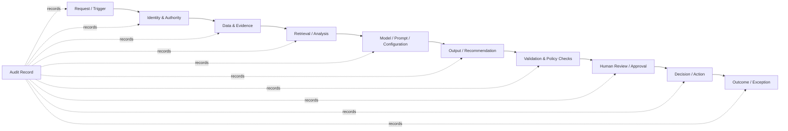
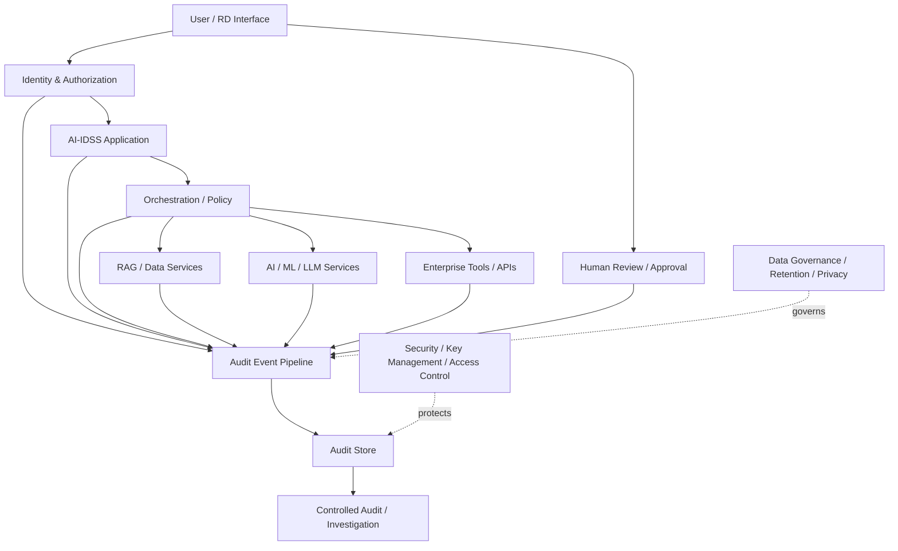

# 41. Auditability

> **Advisor principle:** If a consequential AI-assisted decision cannot be reconstructed from authoritative evidence, system events, and human actions, the architecture is not sufficiently auditable.

## 41.1 Why Auditability Is an Architecture Concern

Auditability is the architectural ability to reconstruct what happened, what the system knew, what it did, what controls were applied, and what humans ultimately decided.

It is not merely a logging feature.

For an AI-enabled decision-support system, auditability crosses:

- identity and access control
- data ingestion and transformation
- retrieval and provenance
- model and prompt configuration
- tool and agent execution
- policy enforcement
- output validation
- human review and override
- system and provider changes
- incidents and exceptions

NIST treats audit and accountability as a distinct control family and describes logging as an enterprise process for generating, transmitting, storing, accessing, and disposing of event records. The implication for architecture is important: auditability must be designed as a system capability rather than added after deployment. [Technical Evidence]

**So what?**

A dashboard showing the final answer is not an audit trail.

---

## 41.2 The Audit Question

For a consequential output, ask:

> **Can an appropriately authorized reviewer reconstruct why this output existed, using evidence available at the time it was produced?**

A useful reconstruction should answer, at an appropriate level of detail:

1. Who or what initiated the request?
2. Under whose authority was it processed?
3. Which data and evidence were available?
4. Which versions of relevant components were used?
5. Which policies and permissions were applied?
6. Which retrieval results or tools were invoked?
7. What output was generated?
8. What validation or control checks occurred?
9. What human reviewed, approved, rejected, or overrode the result?
10. What happened afterward?

Not every system needs to retain every byte involved in these steps. The architectural requirement is **reconstructability proportionate to consequence**, subject to privacy, security, legal, contractual, and cost constraints. [Recommendation]

---

## 41.3 Auditability Is Not the Same as Logging

These concepts are related but distinct.

| Concept | Primary question |
|---|---|
| Logging | What events did the system record? |
| Observability | Can operators understand system behavior and health? |
| Auditability | Can authorized reviewers reconstruct important actions and decisions? |
| Lineage | Where did data move or originate across transformations? |
| Provenance | What is the origin and history of a particular artifact or result? |
| Explainability | Can the behavior or result be meaningfully explained? |
| Reproducibility | Can a result be recreated sufficiently under defined conditions? |

One mechanism can support several objectives, but none of these terms should be treated as interchangeable.

**Architecture warning:** More logs do not automatically create better auditability. NIST SP 800-92 explicitly notes that recording more data is not necessarily better and that logging requirements should reflect what is important and feasible to manage. [Technical Evidence]

---

## 41.4 Auditability vs Explainability

An audit record can show that:

- a particular model version was called,
- particular evidence was retrieved,
- a policy allowed access,
- a particular output was produced,
- and a human approved it.

That does not necessarily explain the model's internal reasoning.

Conversely, a model explanation without evidence of which data, model version, permissions, and human actions were involved may be insufficient for audit reconstruction.

Therefore:

> **Explainability answers a different question from auditability.**

For AI-IDSS, both may matter, but they should be designed separately.

---

## 41.5 Auditability vs Transparency

Transparency is concerned with making relevant information understandable and available to appropriate stakeholders.

Auditability is concerned with reconstructing events and accountability.

A system may be transparent about its architecture while still lacking sufficient records to reconstruct a particular decision event.

Likewise, an internal audit trail may contain highly detailed technical information that should never be exposed directly to every end user.

**Recommendation:** Separate the audiences and purposes of:

- user-facing explanations,
- operational telemetry,
- security records,
- audit records,
- governance documentation.

---

## 41.6 The AI Decision Evidence Chain

For AI-IDSS, auditability should follow the decision chain rather than merely the application stack.



This is a conceptual architecture, not a requirement that every event be stored in one physical audit database.

The key is that the relationships needed for reconstruction must remain available.

---

## 41.7 What an AI-IDSS Audit Record Should Capture

A practical audit event model can include the following categories.

### Request context

- request identifier
- timestamp
- initiating actor or service
- originating application/interface
- correlation or trace identifier
- use-case or workflow identifier

### Identity and authority

- authenticated identity
- tenant or organizational context where relevant
- delegated authority where applicable
- authorization decision or policy reference
- service/workload identity

### Data and evidence

- source identifier
- source version or effective timestamp where available
- retrieval operation
- evidence identifiers
- data-quality or reconciliation status where relevant
- transformation/version references

### AI execution

- model/provider identifier
- model version or deployment identifier
- relevant application configuration version
- prompt/template version where operationally necessary
- retrieval configuration
- tool/workflow version
- evaluation or policy version where relevant

### Controls

- authorization decision
- policy checks
- validation results
- safety/security controls triggered
- exception or fallback state

### Output

- output identifier
- recommendation or classification reference
- confidence/probability value if one is presented
- supporting evidence references
- output status

### Human action

- reviewer identity
- approval/rejection/override
- decision timestamp
- reason or comment where required by the workflow

### Outcome

- downstream action
- exception
- incident reference
- subsequent correction or reversal

The exact fields should be determined from the use case and audit objectives rather than copied mechanically from a generic schema. [Recommendation]

---

## 41.8 The 68% Risk Alert Example

Suppose AI-IDSS produces:

> **Portfolio Company A — Probability of material deterioration: 68%**

An auditable system should not merely retain the string `68%`.

A reviewer should be able to determine, subject to the system's defined audit boundary:

- which risk model or analytical method generated the probability;
- which model version was active;
- which financial and operational data were used;
- what effective dates those data represented;
- which retrieval sources were used for contextual evidence;
- whether any data-quality or reconciliation exception existed;
- which LLM or synthesis component produced the narrative;
- which evidence supported the stated drivers;
- whether a policy or validation check changed the output;
- who reviewed the alert;
- whether the recommendation was accepted, rejected, or overridden.

If the system cannot distinguish a calibrated statistical probability from an LLM-generated judgment, the audit trail is incomplete at the semantic level.

**Architecture warning:** An auditable number is not necessarily a meaningful number. Auditability preserves the history of a claim; it does not establish that the claim was statistically valid.

---

## 41.9 Retrieval and RAG Auditability

RAG systems introduce a distinctive audit requirement: the system may produce an answer using a changing collection of retrieved evidence.

For consequential workflows, the audit boundary may therefore need to preserve references to:

- source document or record identifiers;
- source versions or timestamps where available;
- retrieval query or normalized retrieval representation where appropriate;
- retrieval configuration/version;
- selected passages or evidence identifiers, subject to data-protection constraints;
- access-control decision;
- reranking or filtering stage where relevant;
- final evidence set supplied to the generation step.

The objective is not to store every internal vector operation forever. The objective is to retain enough information to establish **what evidence was actually made available to the generation step**.

This is especially important when source data changes after an AI recommendation has been issued.

---

## 41.10 Agent and Tool Auditability

Agentic systems create another audit boundary because an agent can invoke tools and potentially change external state.

For a tool invocation that matters to the business process, consider recording:

- initiating workflow;
- actor and delegated authority;
- tool identity/version;
- requested operation;
- target resource;
- authorization result;
- relevant input reference;
- execution result or outcome code;
- exception/retry state;
- human approval if required;
- resulting state change reference.

**Key principle:**

> The audit record should make authority and consequence visible, not merely model activity.

A log entry saying `agent called ERP tool` is weaker than an event that establishes which operation was requested, against which resource, under whose authority, and with what result.

---

## 41.11 Identity and Authorization Events

Auditability depends on trustworthy identity context.

For sensitive operations, the system should be able to establish:

```text
Actor
  ↓
Authentication
  ↓
Authority / Delegation
  ↓
Policy Decision
  ↓
Requested Operation
  ↓
Resource
  ↓
Result
```

This supports the broader Zero Trust principle that access decisions should not rely on implicit trust based solely on network location or system placement.

For AI agents, avoid the assumption that an agent automatically inherits every privilege of the human who initiated the request. Delegation should be explicit and auditable where the architecture requires it.

---

## 41.12 Model and Provider Change Audit

AI systems can change without an application code deployment.

Examples include:

- model version changes;
- provider-side model updates;
- embedding-model changes;
- retrieval configuration changes;
- system prompt changes;
- policy changes;
- tool version changes;
- data-source changes;
- routing changes;
- safety configuration changes.

The audit architecture should therefore connect important outputs to the configuration state that produced them.

**Advisor question:**

> If the same request produces a different result six months later, can we determine what changed?

If the answer is no, the system may be operationally observable but not sufficiently auditable.

---

## 41.13 Immutability and Tamper Evidence

Audit records may require stronger integrity controls than ordinary application logs, particularly where records could become evidence in an investigation or control process.

Potential architectural controls include:

- restricted write permissions;
- separation between application operators and audit administrators;
- append-oriented storage;
- integrity protection;
- time synchronization;
- cryptographic integrity mechanisms where justified;
- independent or separate audit storage;
- controlled deletion;
- access monitoring.

There is no universal requirement that every log be immutable or stored on a blockchain.

**Architecture warning:**

> “Immutable” is not a synonym for “auditable.”

An immutable record with poor identity context, missing correlation, ambiguous semantics, or incomplete event coverage can still be inadequate.

---

## 41.14 Retention: Preserve What Matters, Not Everything

Retention creates a three-way tension:

**Audit value ↔ privacy/security risk ↔ storage/operational cost**

Longer retention can improve historical investigation, but it can also increase exposure and cost. Shorter retention reduces those burdens but may eliminate evidence needed later.

Retention should therefore be derived from:

- audit objective;
- consequence of the decision;
- incident-investigation needs;
- applicable legal/regulatory obligations;
- contractual requirements;
- privacy requirements;
- security classification;
- operational cost;
- reproducibility requirements.

Do not invent a universal retention period in an architecture review.

Instead ask:

> **What future question would we be unable to answer if this record were deleted?**

Then determine whether retaining it is justified.

---

## 41.15 Sensitive Data in Audit Records

Auditability can create a secondary data-exposure surface.

A system may be secure in normal operation but inadvertently replicate sensitive information into logs through:

- prompts;
- model outputs;
- tool payloads;
- retrieved documents;
- error messages;
- stack traces;
- debug traces;
- request bodies.

NIST log-management guidance emphasizes that logging must be managed as an enterprise process and that recording more information is not inherently better. [Technical Evidence]

**Recommendation:** Prefer references, identifiers, classifications, hashes, or controlled excerpts where these can satisfy the audit objective without duplicating unnecessary sensitive content.

However, do not assume that hashing automatically solves the problem. A hash may prove equality or integrity but may not preserve the information required for reconstruction.

---

## 41.16 Auditability and Privacy

Audit architecture should apply data-minimization reasoning.

Ask:

- What must be recorded?
- What can be referenced instead of copied?
- Who can access audit records?
- Can audit data be separated by sensitivity?
- How are audit records themselves audited?
- How is deletion handled when retention expires?
- What happens when an audit record contains personal or confidential information?

Auditability is not an exemption from data governance.

---

## 41.17 Auditability and Reproducibility

These concepts overlap but are not identical.

**Auditability:** reconstruct what happened and establish accountability.

**Reproducibility:** recreate a result under sufficiently similar conditions.

A production AI system may be auditable without being perfectly reproducible because:

- an external model provider changed;
- stochastic generation was used;
- source data changed;
- external services changed;
- the original model artifact is unavailable;
- the environment cannot be recreated exactly.

Therefore, an architecture should explicitly distinguish:

1. what must be reconstructable;
2. what should be reproducible;
3. what cannot realistically be reproduced;
4. what evidence must be retained to explain that limitation.

---

## 41.18 Auditability Architecture for AI-IDSS

A practical conceptual architecture is:



The audit pipeline should not become a hidden bypass around normal security controls.

Audit readers require their own authorization.

---

## 41.19 Event Correlation

Distributed AI systems often produce many events for one logical request.

A useful correlation strategy can connect:

```text
Decision ID
   ├── Request ID
   ├── Trace ID
   ├── Data Access Events
   ├── Retrieval Events
   ├── Model Calls
   ├── Tool Calls
   ├── Policy Decisions
   ├── Validation Results
   ├── Human Review
   └── Outcome / Incident
```

Without correlation, individual logs may exist while the end-to-end audit trail remains fragmented.

**Advisor question:**

> Can an investigator start from the final recommendation and navigate backward to the evidence and forward to the human decision?

---

## 41.20 Audit Testing

Auditability should itself be tested.

A practical test can simulate an investigation:

**Scenario:** Six months after an investment-risk alert, an independent reviewer challenges the alert.

Ask the team to reconstruct it using only authorized production evidence.

Test whether they can establish:

- initiating actor;
- data state;
- evidence retrieved;
- model/configuration state;
- policy decisions;
- output;
- validation;
- human action;
- subsequent outcome.

Record the gaps.

This converts auditability from a design assertion into an observable capability.

---

## 41.21 Common Auditability Anti-Patterns

### Anti-pattern 1 — “We have logs, therefore we are auditable.”

**Problem:** Logs may be fragmented, incomplete, or semantically ambiguous.

**Challenge:** Demonstrate an end-to-end reconstruction.

### Anti-pattern 2 — Logging the full prompt and output indiscriminately

**Problem:** Sensitive information can be duplicated into a broad-access logging system.

**Challenge:** Define the minimum information necessary for the audit objective.

### Anti-pattern 3 — Storing only the final answer

**Problem:** The evidence chain disappears.

**Challenge:** Preserve references to the material inputs, configuration, and controls that shaped the result.

### Anti-pattern 4 — Ignoring model version changes

**Problem:** The same application version may behave differently after a model/provider change.

**Challenge:** Treat important model/configuration changes as auditable events.

### Anti-pattern 5 — Treating immutable storage as sufficient

**Problem:** Integrity does not compensate for missing semantics or context.

**Challenge:** Test reconstruction, not merely tamper resistance.

### Anti-pattern 6 — Audit records bypass normal authorization

**Problem:** The audit system becomes a high-value data-exfiltration path.

**Challenge:** Apply explicit access control to audit data.

### Anti-pattern 7 — Retaining everything forever

**Problem:** Cost, privacy, and security exposure increase without necessarily improving auditability.

**Challenge:** Tie retention to explicit audit objectives and obligations.

### Anti-pattern 8 — Assuming auditability proves correctness

**Problem:** A perfectly reconstructed bad decision is still a bad decision.

**Challenge:** Keep auditability, evaluation, validation, and correctness as separate assurance dimensions.

---

## 41.22 Technical Challenge Questions

When reviewing an AI architecture, ask:

### Audit scope

- What decisions or actions require reconstruction?
- What is the minimum evidence needed to reconstruct them?
- Which events are explicitly out of scope, and why?

### Identity

- Can every consequential action be attributed to an authenticated actor or service?
- Can delegated authority be reconstructed?
- Can an agent's effective authority be established?

### Data

- Can we determine which source records were used?
- Can we distinguish source state from transformed or cached state?
- Can we identify data-quality exceptions relevant to the output?

### AI execution

- Can we identify the model/provider and relevant version?
- Can we reconstruct important prompt/configuration state?
- Can we determine which retrieval evidence was supplied?

### Controls

- Can we establish which policy and authorization decisions occurred?
- Are validation failures and fallbacks recorded?
- Are exceptions distinguishable from normal operation?

### Human decision

- Can we determine who approved, rejected, or overrode the recommendation?
- Is the human action linked to the specific AI output?

### Retention

- Why is each audit record retained?
- What is the deletion basis?
- What sensitive data is duplicated into the audit system?

### Investigation

- Can an independent reviewer reconstruct a representative historical event without engineering assistance?
- Has this capability actually been tested?

---

## 41.23 Auditability Review Checklist

Before approving an AI-enabled system, verify:

- [ ] Audit objectives are explicitly defined.
- [ ] Consequential events have identifiable audit records.
- [ ] Actor and authority context is available.
- [ ] Data/evidence references are reconstructable where required.
- [ ] Model and relevant configuration versions are identifiable.
- [ ] Retrieval evidence can be reconstructed where required.
- [ ] Tool and agent actions are attributable.
- [ ] Policy and authorization decisions are auditable.
- [ ] Human approvals and overrides are linked to outputs.
- [ ] Exceptions and failures are recorded.
- [ ] Audit records have controlled access.
- [ ] Sensitive data in logs is minimized appropriately.
- [ ] Retention and deletion are justified.
- [ ] Audit storage has appropriate integrity protections.
- [ ] Cross-system correlation is available.
- [ ] Historical reconstruction has been tested.
- [ ] Auditability limitations are documented.

---

## 41.24 Evidence Discipline

The following distinctions should remain explicit.

### Fact

NIST SP 800-53 Rev. 5 includes an Audit and Accountability family with controls addressing audit and accountability policy, event selection, content, storage, review, and related protections. The current NIST control catalog identifies Revision 5.1 as the current version. [Technical Evidence]

### Fact

NIST SP 800-92 provides enterprise guidance for computer security log management and describes logging as a process involving generation, transmission, storage, access, and disposal of log data. [Technical Evidence]

### Fact

NIST's AI RMF Playbook recommends monitoring, documentation, incident response, recovery, and related governance practices, but it is voluntary and explicitly not a universal checklist. The AI RMF 1.0 is being revised as of 2026. [Technical Evidence]

### Fact

ISO/IEC 42001:2023 specifies requirements for establishing, implementing, maintaining, and continually improving an AI Management System. It provides management-system context rather than a universal AI audit-log schema. [Technical Evidence]

### Recommendation

For consequential AI-IDSS outputs, auditability should be designed around reconstruction of the decision evidence chain rather than around generic application logging.

### Recommendation

Audit records should be protected as sensitive infrastructure because they can concentrate identity, data-access, model, and decision information in one location.

### Uncertainty

There is no single universally applicable AI audit-event schema or universal retention period that can be prescribed for every enterprise AI system. Requirements depend on use case, consequence, governance obligations, privacy/security constraints, and operational design.

---

## 41.25 What Would Change Our Mind?

The advisor should remain willing to change the architecture when evidence shows that the proposed audit boundary is excessive or insufficient.

### Evidence that could justify less audit data

- The decision is demonstrably low consequence.
- Stronger source-system records provide equivalent reconstruction.
- Sensitive-data exposure from detailed logs materially exceeds the audit benefit.
- Controlled references can provide the required evidence without copying payloads.

### Evidence that would justify more audit data

- Historical investigations repeatedly fail because critical context is missing.
- Model/provider changes cannot be correlated to output changes.
- Human overrides cannot be linked reliably to AI recommendations.
- Regulatory, contractual, or internal control requirements require stronger evidence.
- Incident investigations demonstrate that existing records are insufficient.

### Falsifiability test

> **If a competent independent reviewer cannot reconstruct a representative consequential AI decision from the retained evidence, the audit architecture is not meeting its stated objective.**

---

## 41.26 Field Rule

> **Auditability is not “logging everything.” It is preserving enough trustworthy evidence to reconstruct the consequential path from authority and inputs to AI processing, controls, human action, and outcome.**

For the advisor, the practical question is simple:

> **If the RD asks six months later, “Why did the system tell me this?”, can we answer with evidence rather than screenshots and memory?**

If not, the architecture is not yet ready for consequential reliance.
