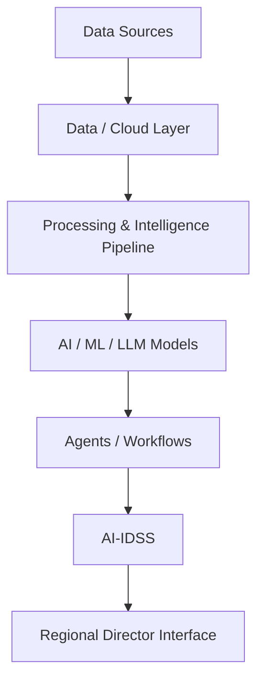

# AI Technology & Architecture Advisor

## A Technical Advisory Field Manual

> **How can this be done correctly from a technology and architecture perspective?**

This handbook is for an independent technical advisor supporting executive decision-making on AI and enterprise technology.

It is not an AI strategy plan, product manual, or implementation guide. Its purpose is to develop the judgment required to assess proposals, challenge assumptions, compare architectures, communicate second opinions and dissenting views, and provide defensible technical recommendations.

### The architecture spine

Cross-cutting concerns:

**Security · Identity · Governance · Audit · Evaluation · Observability · Cost · Reliability · Interoperability**

### Current chapters

- [0. Reasoning & Evidence Standard](./chapters/00-reasoning-evidence)
- [1. Role Charter](./chapters/01-role-charter)
- [2. Relationship With the Regional Director](./chapters/02-relationship-with-rd)
- [3. Relationship With CTO, Head of AI & Vendors](./chapters/03-relationships)
- [4. Advisor Operating Principles](./chapters/04-operating-principles)
- [5. Advisory Communication & Influence](./chapters/05-advisory-communication)
- [6. How to Evaluate a Technology Proposal](./chapters/06-evaluating-proposals)
- [7. Architecture Decision Framework](./chapters/07-architecture-decisions)
- [8. AI Architecture Fundamentals](./chapters/08-ai-architecture-fundamentals)
- [9. Enterprise LLM Architecture](./chapters/09-enterprise-llm-architecture)

### Evidence audits

- [Evidence Audit — Chapters 0–7](./chapters/00-07-evidence-audit)
- [Evidence Review — Chapters 8–9](./chapters/08-09-evidence-review)
